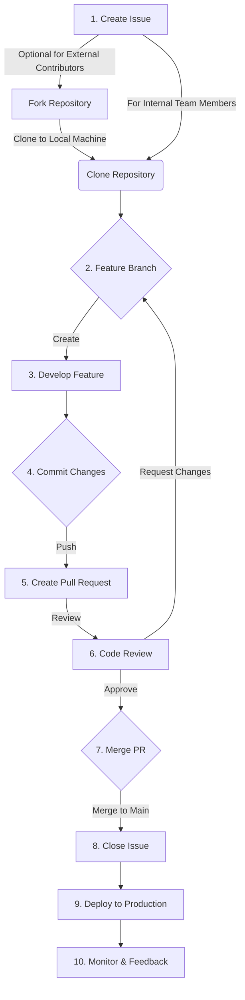

<!-- SPDX-License-Identifier: Apache-2.0 -->

# Contribution Guide

- [Contribution Guide](#contribution-guide)
  - [1. Introduction](#1-introduction)
    - [1.1 Overview of the Project](#11-overview-of-the-project)
    - [1.2 Importance of Contributions](#12-importance-of-contributions)
    - [1.3 Scope of the Guide](#13-scope-of-the-guide)
  - [2. Code of Conduct](#2-code-of-conduct)
    - [2.1 Adherence to Linux Foundation's Code of Conduct](#21-adherence-to-linux-foundations-code-of-conduct)
  - [3. Types of Contributors](#3-types-of-contributors)
    - [3.1 Required Skills and Knowledge](#31-required-skills-and-knowledge)
      - [Development and developer tools](#development-and-developer-tools)
      - [Third party Open Source Software components](#third-party-open-source-software-components)
      - [DevOps](#devops)
      - [Documentation](#documentation)
    - [3.2 Setting Up the Development Environment](#32-setting-up-the-development-environment)
      - [Requirements](#requirements)
      - [Microprocessor setup instructions](#microprocessor-setup-instructions)
        - [A. Preparation](#a-preparation)
        - [B. Setting Up a Microservice Processor to Work On](#b-setting-up-a-microservice-processor-to-work-on)
        - [Additional Configuration (if needed):](#additional-configuration-if-needed)
      - [Troubleshooting:](#troubleshooting)
      - [Conclusion:](#conclusion)
  - [4. How to Contribute](#4-how-to-contribute)
    - [4.1 Understanding the Project Structure](#41-understanding-the-project-structure)
    - [4.2 Finding Something to Work On](#42-finding-something-to-work-on)
    - [4.3 Contribution Process Overview](#43-contribution-process-overview)
  - [5. Making and Submitting Contributions](#5-making-and-submitting-contributions)
    - [5.1 Forking and Cloning the Repository](#51-forking-and-cloning-the-repository)
    - [5.2 Making Changes](#52-making-changes)
      - [5.2.1 Definition of done](#521-definition-of-done)
    - [5.3 Committing Your Changes](#53-committing-your-changes)
    - [5.4 Submitting a Pull Request](#54-submitting-a-pull-request)
    - [5.5 Code Review Process](#55-code-review-process)
  - [6. Community and Communication](#6-community-and-communication)
    - [6.1 Communication Channels](#61-communication-channels)
    - [6.2 Regular Meetings or Calls](#62-regular-meetings-or-calls)
  - [7. Documentation Contributions](#7-documentation-contributions)
    - [7.1 Contributing to Documentation](#71-contributing-to-documentation)
    - [7.2 Documentation Style Guide](#72-documentation-style-guide)
  - [8. Reporting Bugs and Requesting Features](#8-reporting-bugs-and-requesting-features)
    - [8.1 How to Report Bugs](#81-how-to-report-bugs)
    - [8.2 Suggesting Enhancements](#82-suggesting-enhancements)
  - [9. Legal Compliance](#9-legal-compliance)
    - [9.1 Licensing Information](#91-licensing-information)
    - [9.2 Contributor License Agreement (CLA)](#92-contributor-license-agreement-cla)
  - [10. Acknowledgements](#10-acknowledgements)
    - [10.1 Recognizing Contributors](#101-recognizing-contributors)
    - [10.2 Community Contributors](#102-community-contributors)
  - [11. Getting Help](#11-getting-help)
    - [11.1 Resources for Help](#111-resources-for-help)
    - [11.2 Contact Information](#112-contact-information)
  - [12. Appendix](#12-appendix)
    - [12.1. Additional Resources](#121-additional-resources)
    - [12.2 Glossary](#122-glossary)


## 1. Introduction

Hello and welcome! If you are reading this, we hope it's because you'd like to help. 

### 1.1 Overview of the Project

Tazama is an open source software (OSS) real-time <<-insert your use case here->> monitoring solution. In its initial incarnation Tazama is focused on transaction monitoring for the detection of Fraud and Money Laundering behavior. That's right: an **Open Source** transaction monitoring solution.

We built an open source product so that it can be used to promote trust in digital payments systems and encourage previously under-serviced communities to participate in digital payments ecosystems without worrying about the safety of their money. The product was envisaged by the [Level One Project](https://www.leveloneproject.org), an initiative of the Bill & Melinda Gates Foundation.

While Tazama has strong applications in the financial services industry, it can also be used in other ways. The system could ingest any kind of data in real-time and model behavior over time based on rules and scenarios specific to that data. Tazama could have applications in Healthcare Monitoring, Cybersecurity, Supply Chain Management, Smart City Applications, Retail and Customer Behavior Analysis, Transportation and Logistics, Environmental Monitoring, Telecommunications, IoT Devices and Smart Environments. (We asked ChatGPT.)

We are privileged, and very excited, to have recently joined The Linux Foundation as one of their many excellent Projects.

### 1.2 Importance of Contributions

We believe that through the collective expertise and efforts of our community and the broad, collaborative approach inherent in open source software development, we can change the world in ways that we would never be able to by ourselves.

Our product is young; barely out of infancy. We need the help of our fledgling community, people like you, to help Tazama grow. While we do need help with some specific things, any help offered is welcome, and we hope to be able to afford everyone in our community an opportunity to be involved in a way that also meets their personal aspirations.

Some of those specific areas where we would particularly appreciate help:

 - The development of new features.
 - Hunting and squashing bugs in our code, our processes and our documentation.
 - Improving tests and testing.
 - Translation and localization.
 - Implementing Tazama for yourself or others.
 - Creating tutorials and how-to guides.
 - Give a "thumbs up" on issues that are relevant to you.
 - Sponsorship.

### 1.3 Scope of the Guide
This contribution guide will take you through the steps to contribute to the Tazama Project and to help your contributions be successfully integrated into the Product.

We'll cover our code of conduct for healthy community participation, and then walk you through everything you need to be able to contribute in the way you would like.

## 2. Code of Conduct
### 2.1 Adherence to Linux Foundation's Code of Conduct
Our Project subscribes to the Linux Foundation's Code of Conduct as represented in the Linux Kernel Code of Conduct. The Linux Kernel Code of Conduct is itself derived from the Contributor Covenant v1.4. Our Code of Conduct is based on v2.1, the most recent version at the time of writing.

In an effort to keep the contribution guide focused and lean, our Code of Conduct is hosted on its own separate page: [Tazama Code of Conduct](Tazama-Code-of-Conduct.md).

References:
[Linux Kernel Code of Conduct](https://docs.kernel.org/process/code-of-conduct.html)
[Contributor Covenant](https://www.contributor-covenant.org/)

[Top](#contribution-guide)

## 3. Types of Contributors

Our contribution guide addresses different kinds of contributors. It is not intended to be an exhaustive or exclusive list, but the classification of contributors helps us to support each contributor according to their specific needs. 

 - You are an ***Individual Contributor*** if you are exploring and using our product in an individual, unaffiliated capacity and you want to contribute to the product for its, or your, own sake.
 - You are a ***System Integrator*** if you want to implement the product for your customers, either as a standalone product or as part of your adjacent products, and you'd like to contribute to the product because you are introducing new features that would benefit the product or other users as well.
 - You are a ***Commercial End User*** if you want to implement the product for yourself directly or in partnership with a System Integrator and you are implementing new features that you think would benefit the product or other users as well.
 - You are a ***Big Tech Organization*** or ***Charitable Organization*** who wants to contribute to the product in pursuit of [Digital Public Goods](https://digitalpublicgoods.net/) objectives.

For the most part, because we are an open source software product, we expect that contributors would want to contribute `code` and this guide would be focused on helping you to do that.

### 3.1 Required Skills and Knowledge

Some experience in the following technologies would make contribution to the Project a little easier.

#### Development and developer tools

 - [GitHub](https://github.com/): Our code is hosted in our own GitHub repository and understanding the basics of GitHub and git processes will help you access, update and submit code to the Project. We also use GitHub issues to document and track user stories.
 - [GitHub Actions](https://github.com/features/actions) to automate some Continuous Integration (CI) processes in support of developer tasks
 - [Typescript](https://www.typescriptlang.org/): Our code is mostly written in TypeScript, a strictly typed implementation of JavaScript, which transpiles into JavaScript code for execution via [Node.js](https://nodejs.org/en).
 - [Jest.js](https://jestjs.io/): Unit tests for our TypeScript code is written in Jest as part of the development process. We aim for test-driven development and complete test coverage.
 - [Postman](https://www.postman.com/): Integration, end-to-end and some unit testing is currently performed via Postman which uses extensive [JavaScript](https://www.javascript.com/) scripts to automate the tests.
 - [Docker](https://www.docker.com/): Our software runs in Docker containers and containerization of the product and its components is an integral part of the development, testing and deployment processes.
 - [Prettier](https://prettier.io/) and [ESLint](https://eslint.org/): Promote and enforce consistent coding practices for the delivery of quality code.
 - [Visual Studio Code](https://code.visualstudio.com/): Though there are many tools available, most of us use VS Code to write our code.

#### Third party Open Source Software components

The Product is composed out of a wide variety of other Open Source Software components, ranging from industry veterans to young-and-upcoming contenders. Experience in any of the components we use would be very helpful in standing a bit more firmly on the shoulders of giants:

 - [ArangoDB](https://www.arangodb.com) for multi-modal key-value and graph data storage
 - [Elastic](https://www.elastic.co/elastic-stack) (specifically Elastic, Logstash and Kibana (ELK)) for system logging, observability and reporting
 - [Jupyter Notebooks](https://jupyter.org/) to support data analytics, business intelligence and data science tasks
 - [NATS](https://nats.io/) for pub/sub inter-services communication
 - [OpenAPI](https://www.openapis.org/) - a.k.a. Swagger - to describe our HTTP APIs
 - [Protocol Buffers](https://protobuf.dev/) for inter-services data serialization
 - [Redis](https://redis.io/) for high-speed in-memory data caching

#### DevOps

From a DevOps perspective, we make use of the following tools:

 - [Helm](https://helm.sh/) to define the build and deployment of our system
 - [Jenkins](https://www.jenkins.io/) to automate our build, test and deployment processes
 - [Kubernetes](https://kubernetes.io/) for the automated deployment of containers and to scale and manage our containerized system components
 - [Newman](https://learning.postman.com/docs/collections/using-newman-cli/command-line-integration-with-newman/) to automatically execute Postman tests as part of the automated build, test and deployment process
 - [YAML](https://yaml.org/) to provide scripting to guide automated deployment processes

#### Documentation

 - [Markdown](https://www.markdownguide.org/) for documentation hosted in GitHub
 - [Mermaid.js](http://mermaid.js.org/#/) for markdown-embedded diagrams in GitHub
 - [Atlassian Confluence](https://www.atlassian.com/software/confluence) is (currently) hosting our project documentation at <https://frmscoe.atlassian.net/wiki/spaces/FRMS/overview>
 - [PlantUML](https://plantuml.com/) for embedded diagrams in Confluence
 - [Drawio](https://www.drawio.com/) for embedded diagrams in GitHub

[Top](#contribution-guide)

### 3.2 Setting Up the Development Environment

(with thanks to @cshezi)

#### Requirements

Before you begin working on an existing or new Tazama microservice processor, ensure that the following requirements are met on your system:

 - **Node.js and npm**:
    - Install Node.js and npm by visiting the official [Node.js website](https://nodejs.org).
    - Follow the installation instructions for your operating system.

 - **Git**:
    - Install Git by visiting the official [Git website](https://git-scm.com/).
    - Follow the installation instructions for your operating system.
    - You can also use [GitHub Desktop](https://desktop.github.com/) or [GitHub CLI](https://cli.github.com/), though this guide is written specifically for Git.

 - **Code Editor**:
    - Install a code editor of your preference (e.g. [Visual Studio Code](https://code.visualstudio.com/), [Eclipse](https://www.eclipse.org/), [Sublime Text](https://www.sublimetext.com/), [Vim](https://www.vim.org/)/[Neovim](https://neovim.io/) (RIP [Atom](https://github.blog/2022-06-08-sunsetting-atom/))).

 - **Docker**:
    - Docker is useful if you do not have access to a persistent development environment that hosts the core system microservices that you need to test your integrations. With Docker, you can deploy containerized microservices on your local machine. Follow the instructions on the official Docker website to [install Docker Desktop on Windows](https://docs.docker.com/desktop/install/windows-install/). Remember that Docker Desktop on Windows also requires Linux on Windows that you can [install with WSL](https://docs.docker.com/desktop/install/windows-install/)

  - **Postman / Newman**
    - Install the Postman application by visiting the official [Postman website](https://www.postman.com/downloads/) - we use Postman collections to test our microservices, but also to set up our ArangoDB collections and data. 
    - (Optional) If you prefer a command-line alternative to the Postman application, you can also use Newman or the Postman CLI tool. Instructions for installing both are also on the official [Postman website](https://www.postman.com/downloads/).

[Top](#contribution-guide)

#### Microprocessor setup instructions
Follow these step-by-step instructions to get your local machine ready to work on a Tazama microservice processor. First we are going to set up the core services that all microservice processors rely on, and then we'll set up a specific microservice and get that ready for you to work on.

##### A. Preparation
<u>**Step 1**: *Setting up GitHub Token Locally*</u>
 - Generate a GitHub Personal Access Token to access the GitHub API:
   - Visit the GitHub Tokens page while logged into your GitHub account (Click your profile picture in the top right corner, then `Settings`, then `Developer settings`, then `Personal access tokens`, then `Tokens (classic)`)
   - Click on the `Generate new token` button and select `Generate new token (classic)`.
   - Provide a name for your token and select the scopes or permissions required. For this case, you will need at least the `read:packages` scope.
   - Scroll down and click on the `Generate token` button at the bottom.
   - Copy the generated token immediately (this token won't be visible again).

 - Set the Environment Variable on your local machine:
   - Open your terminal or command prompt.
   - Substitute `your-github-token` below with the token you copied.
   - On Unix/Linux/Mac:
      ```
      export GH_TOKEN=your-github-token
      ```
   - On Windows (Command Prompt - Run as Administrator):
      ```
      setx GH_TOKEN your-github-token /m
      ```
   - On Windows (PowerShell):
      ```
      $env:GH_TOKEN="your-github-token"
      ```

<u>**Step 2**: *Set up core services*</u>

 - **Set up a Docker network**:
   - Before you start creating Docker containers to host all the service containers, you will need to create a bridge network so that the containers will be able to talk to each other. To set up a bridge, open a Windows Command Prompt and execute the following command:

      ```
      docker network create --driver bridge tazama-net 
      ```
      This command will create a local user-defined bridge network called `tazama-net` that we can use to network our containers together.


 - **ArangoDB**:
   - Follow the installation instructions for ArangoDB from the official [ArangoDB website](https://docs.arangodb.com/stable/operations/installation/). We recommend that you install the official ArangoDB Docker image for `v3.11.7` via [Docker Hub](https://hub.docker.com/_/arangodb/).
     - Start the Docker Desktop in Windows
     - In a Windows Command Prompt:
      ```
      docker pull arangodb:3.11.7
      ```
   - Start the ArangoDB server in a Docker container:

      In a Windows Command Prompt:
      ```
      docker run -p 8529:8529 --network=tazama-net -e ARANGO_NO_AUTH=1 --name arangodb-instance -d arangodb:3.11.7
      ```
      **Note**: This command will start an ArangoDB instance that does not require any user authentication - this is useful for testing, but should never be used in a production setting. See [here](https://docs.arangodb.com/stable/deploy/single-instance/manual-start/#authentication) for alternative options.
   - The ArangoDB web interface can now be accessed at <http://localhost:8529>.
   - Set up ArangoDB with a Postman collection from the [Tazama Postman repository](https://github.com/frmscoe/postman)
    - The specific collection you need for the database configuration is <https://github.com/frmscoe/postman/blob/main/ArangoDB%20Setup.json> - we will only need the contents of the `/1-ArangoDB-setup` and `/3-ArangoDB-Default-Configuration` folders in this collection for now.
    - You will also need the environment file for interacting with a local instance of ArangoDB via Postman/Newman: <https://github.com/frmscoe/postman/blob/main/environments/Tazama-LOCAL.postman_environment.json>
     - You can import these files (or the entire Postman repository) into your installed Postman application to run, or you can run the collection with Newman.

       Both methods assume that you have cloned the Postman repository onto your local machine. You can do that with the following command from the folder where you want the repository to be located:
       ```
       git clone https://github.com/frmscoe/postman
       ```
     - The Newman method is a little more straightforward to configure your instance of ArangoDB in Docker - you can do so with the following commands in a Windows Command Prompt:
        ```
        newman run collection-file --folder "1-ArangoDB-setup" -e environment-file --timeout-request 10200
        ```
        to execute the contents of the `1-ArangoDB-setup` folder, and
        ```
        newman run collection-file --folder "3-ArangoDB-Default-Configuration" -e environment-file --timeout-request 10200
        ```
        to execute the contents of the `3-ArangoDB-Default-Configuration` folder.
        
         - Replace `collection-file` with the full location path and filename of the `ArangoDB Setup.json` file in your cloned Postman repository
         - Replace `environment-file` with the full location path and filename of the `environments/Tazama-LOCAL.postman_environment.json` file in your cloned Postman repository
         - If the path contains spaces, wrap the string in double-quotes.

 - **NATS**:
   - Follow the installation instructions for NATS from the official [NATS website](https://nats.io/download/). We recommend that you install the official NATS Docker image for the `latest` version via [Docker Hub](https://hub.docker.com/_/nats).
     - Start the Docker Desktop in Windows
     - In a Windows Command Prompt:
      ```
      docker pull nats
      ```
   - Start the NATS server in a Docker container:
     - In a Windows Command Prompt:
      ```
      docker run -p 4222:4222 -p 8222:8222 -p 6222:6222 --network=tazama-net --name nats-server -dti nats:latest
      ```

 - **redis**:
   - Follow the installation instructions for redis from the official [redis website](https://redis.io/docs/install/install-redis/). We recommend that you install the official redis Docker image for the `latest` version via [Docker Hub](https://hub.docker.com/_/redis).
     - Start the Docker Desktop in Windows
     - In a Windows Command Prompt:
      ```
      docker pull redis/redis-stack-server
      ```
   - Start the redis server in a Docker container:
     - In a Windows Command Prompt:
      ```
      docker run -p 6379:6379 --network=tazama-net --name redis-stack-server -d redis/redis-stack-server:latest
      ```

 - **Tazama NATS REST Proxy**:
    
    Tazama is composed out of a number of different processors that are chained together using a pub/sub framework facilitated by NATS. Only the front-most processor, the TMS API, is accessible directly via a traditional API: the remaining (down-stream) processors are only accessible via their respective NATS subscription subjects.
    
    The Tazama NATS REST Proxy provides an API that enabled access directly into the down-stream processors to assist in the development and testing process.

    If interaction with Tazama is expected to be solely through the TMS API, the proxy will not be required.

   - Install the Tazama NATS REST Proxy Docker image for the `latest` version via the GitHub Container Registry:
     - Start the Docker Desktop in Windows
     - In a Windows Command Prompt:
      ```
      docker pull ghcr.io/frmscoe/nats-utilities:latest
      ```
   - Start the redis server in a Docker container:
     - In a Windows Command Prompt:
      ```
      docker run -p 3000:3000 --network=tazama-net -e NODE_ENV=dev -e SERVER_URL=nats-server:4222 -d --name nats-utilities ghcr.io/frmscoe/nats-utilities:latest
      ```
[Top](#contribution-guide)

##### B. Setting Up a Microservice Processor to Work On

Let's pick an easy microservice processor to use as an example. Tazama is designed to run a number of rule processors to evaluate incoming transactions. By default, the sample rule processor, `Rule 901`, is configured in this development environment through the ArangoDB Postman scripts above. All the rule processors run inside the `Rule Executer` wrapper function, which is itself configured to contain `Rule 901` by default. To run `Rule 901`, we need to run the `Rule Executer`.

Follow the steps below to get the `Rule Executer` on your operating table:

1. Clone the GitHub Repository

    - Open a Windows Command Prompt and navigate to the folder where you want to store your code.
    - The following `git` command will clone Rule 901's code to your local machine:

        ```
        git clone https://github.com/frmscoe/rule-executer
        ```
        As you can probably guess, this command will also let you clone any of the repositories in the `frmscoe` that you have access to by specifying their specific URL after the `git clone` command.

2. Navigate to the Repository Folder

    Using the Windows `cd` or `chgdir` command, navigate to the newly cloned repository folder:
    ```
    cd rule-executer
    ```

3. Install Dependencies

    Using `npm`, you can install all the dependencies for the processor as specified in the `package.json` file in the repository folder:
    ```
    npm install
    ```

4. Configure Environment Variables:

    Each microservice processor's configuration is specified as environment variables that are located in a dot env (`.env`) file. Your cloned repository does not have one yet: we'll have to create it from the `.env.template` file that is already in your folder. You can copy this file with from your Windows Command Prompt:
    ```
    copy .env.template .env
    ```
    The default settings in the `.env` will be fine if you followed the installation guidelines above without changes, so you won't have to update the `.env` file just yet.

    Don't over-write or make changes in the `.env.template` file or these changes might be unintentionally merged with the source code when your code is committed.

5. Build the Node.js Application

    Use the following `npm` command to build the application which will add a folder called lib or build to the repository folder. 
      ```
      npm run build
      ```
    This new build folder won't be included in a future code commit - it has been excluded via the `.gitignore` file.

6. Open the Folder in VS Code

    To start development you can open VS Code in the repository folder with the following command in a Windows Command Prompt from the repository folder:
    ```
    code .
    ```

7. Start the Node.js Application

    In your Windows Command Prompt, you can run the microservice processor with the following command:
    ```
    npm run start
    ```
    This command starts the Rule Executer application, with Rule 901 inside it, from the built code. Once the processor is up and running, you can start sending requests to the processor via the NATS REST Proxy.
    
    The `npm run start` command will keep on running until you exit the application by pressing `ctrl-c`.

8. Sending messages to the microservice processor via the NATS REST Proxy

    Let's try to send a test message to our locally running CRSP via the NATS REST Proxy using a pre-fabricated Postman test. If you previously cloned the Postman repository, the `Rule-901-Quick-Check.postman_collection.json` test will be located in the Postman repository folder.
    
    Because the application is running in our previous Windows Command Prompt, we'll need to open a new one and then, using the following Newman command in the new Command Prompt, we can execute the test on our running processor:

    ```
    newman run collection-file -e environment-file --timeout-request 10200
    ```
    
      - Replace `collection-file` with the full location path and filename of the `Rule-901-Quick-Check.postman_collection.json` file in your cloned Postman repository
      - Replace `environment-file` with the full location path and filename of the `environments/Tazama-LOCAL.postman_environment.json` file in your cloned Postman repository
      - If the path contains spaces, wrap the string in double-quotes.

9. Run the Built-In Jest Tests

    If you want to execute the accompanying Jest tests for the processor, you can also perform this task via `npm`. In your Windows Command Prompt, execute the following command from the repository folder:
    ```
    npm run test
    ```
[Top](#contribution-guide)

##### Additional Configuration (if needed):

Different microservice processors may need to be set up in slightly different ways. Refer to the project documentation or processor README for any additional configuration instructions.

Check for specific database setup, API keys, or other dependencies.

#### Troubleshooting:
 - If you encounter issues during the setup process, refer to the project's issue tracker on GitHub or the documentation for troubleshooting steps.
 - Ensure that your system meets the specified requirements
 - If a shell command fails at first, try running your shell in administrator mode.

#### Conclusion:
You have successfully set up a Tazama microservice processor on your local machine. If you encounter any difficulties or have questions, refer to the project's documentation or seek help from the project's community on GitHub or Slack. Happy coding!

[Top](#contribution-guide)

## 4. How to Contribute
### 4.1 Understanding the Project Structure

Read the [Product Overview](/README.md) for a detailed overview of the system.

The Project organization on GitHub contains both PUBLIC and PRIVATE repositories. Core components of the system are in public repositories that are accessible to anyone:

 - The Transaction Monitoring Service (TMS) API
 - The Channel Router and Setup Processor (CRSP)
 - The Rule Executor (the rule processor wrapper function)
 - Rule 901, a sample rule
 - The Typology Processor
 - The Transaction Aggregation and Decisioning Processor (TADProc)

... and various library and supporting repositories and tools.

All of our pre-fabricated rule processors, along with their unit tests and default configurations, are hosted in private repositories. That is not to say that they are not also open source software, but we are hosting them in private repositories because they might allow fraudsters and money launderers to reverse engineer the way the system detects fraud and money laundering "out of the box". Any member of our GitHub organization can access the private repositories to implement and work on the rule processors or their tests.

### 4.2 Finding Something to Work On
Guide on how to pick issues or features to work on.

### 4.3 Contribution Process Overview



1. Fork the repository you want to work on

[Top](#contribution-guide)

## 5. Making and Submitting Contributions
### 5.1 Forking and Cloning the Repository
Instructions on forking and cloning the repository.

### 5.2 Making Changes
Best practices for making changes.

#### 5.2.1 Definition of done

**Code Complete** - Source code changes are done for all the features in the “to do” list.” Source code has been commented appropriately. [Developer]

**Architecture** – All new code conforms to the agreed architecture (*unless agreed otherwise as part of refactoring existing legacy code). [PR Approver]

**Unit testing** - Unit test cases have been created, executed and are working successfully. Follow  [coverage guidelines](/Technical/unit-test-coverage.md). Will create spike where we find some Rule Engine that’s difficult to unit test. [Developer]

**GitHub CI/CD** - Ensure that all GitHub workflows have completed successfully during PR checks, and that the Newman benchmark results have been presented on the PR as a comment. If you notice any spikes in the benchmark, please report the spike or reevaluate the implemented code, if you are using a Fork to contribute please follow: [contribution guidelines](/Technical/contribution-guidelines.md) [Developer] + [PR Approver]

**Automated Builds** – All code is included in automated builds and any updates to the build scripts have been completed and tested and checked in. Jenkins / CircleCI - Poly vs Mono repo [DevOps]

**Developer Documentation Ready** – There is sufficient and suitable development documentation in place - Sequence Diagram / Swagger in Confluence (NOT GitHub - security reasons) eventually. [Developer]

**Code Documentation** – Electronic documentation has been auto-generated (where available) and has been checked for correctness. Also have sufficient code comments. [Developer] + [PR Approver]

**\*Release Notes / Version Control** - TODO Aaron - figure out what greater ML does - check this

**Code Refactoring** - Source code has been refactored to make it comprehensive, maintainable and amenable to change (*unless agreed otherwise as part of refactoring existing legacy code). [Developer]

**Code Check-in** - Source code is checked in to source code control repository and PR process is followed [Developer]

**Code & Peer reviews** (pull requests) – These have been carried out and all improvements implemented and tests completed. [Developer] to follow-up and ensure code gets merged in reasonable time [PR Approver]

**\*Logging** - Configurable log levels - able to switch on verbose logging for debugging purposes? Error logging - where to? [Developer]

**All acceptance criteria are met and Testing complete** [Developer]

 - **Automated testing** - All existing automated tests have been run successfully

 - **Regression testing** – Suitable level of Regression testing has been carried out successfully

**Closure** - PR is closed, Automated tests ran, Pipeline built successfully, Automated deployments ran, THEN All finished user stories/tasks are marked complete/resolved. [Developer]

### 5.3 Committing Your Changes

When committing changes to your development branch you would be required to submit a commit message to describe the change. Depending on the mechanism that you are using to commit your changes, you may have access to a commit message as well as an extended description of your changes, but it is expected that you should complete at least the commit message.

Tazama aims to comply with the [Conventional Commits](https://www.conventionalcommits.org/en/v1.0.0/) specification for adding human and machine-readable meaning to commit messages.

A commit message must be a short description of the change, prefaced with a commit type:

```
type: short description
```

The commit message could also, optionally, include a scope:

```
type(scope): short description
```

If the change is a breaking change, the type should be following by an exclamation:

```
type!: short description
```

Recommended commit types are based on the [Angular convention](https://github.com/angular/angular/blob/22b96b9/CONTRIBUTING.md#type), summarized for ease of reference:

 - **build**: Changes that affect the build system or external dependencies
 - **ci**: Changes to our CI configuration files and scripts
 - **docs**: Documentation only changes
 - **feat**: A new feature
 - **fix**: A bug fix
 - **perf**: A code change that improves performance
 - **refactor**: A code change that neither fixes a bug nor adds a feature
 - **style**: Changes that do not affect the meaning of the code (white-space, formatting, missing semicolons, etc.)
 - **test**: Adding missing tests or correcting existing tests

Scope keywords are tailored to Tazama's specific requirements. Tazama's source code is spread across a number of repositories and as such even small changes often affect a number of separate repositories simultaneously. This complicates source control a bit, since a number of changes across different repositories may all be related to a single requirement. For the sake of proper governance, the requirement would be logged as an issue in each of the affected repositories to outline the acceptance criteria for the change in *that* repository and also to provide an anchor for the eventual Pull Request to implement the change in that repository. From this perspective, the scope is generally either confined to a single repository that represents a single Tazama processor, or a cluster of repositories representing a number of Tazama processors.

 - If your change is limited to a single repository, the scope should be the name of the repository, e.g. `typology-processor` or `rule-executer`.
 - If your change impacts multiple repositories, the scope should be `multi-repo`.

### 5.4 Submitting a Pull Request
Steps to create and submit a pull request.

### 5.5 Code Review Process
What to expect during the code review.

[Top](#contribution-guide)

## 6. Community and Communication
### 6.1 Communication Channels
Information on communication channels like mailing lists and chat.

### 6.2 Regular Meetings or Calls
Information about regular community calls or meetings.

## 7. Documentation Contributions
### 7.1 Contributing to Documentation
Guidelines for contributing to project documentation.

### 7.2 Documentation Style Guide
Style and formatting guidelines.

## 8. Reporting Bugs and Requesting Features
### 8.1 How to Report Bugs
Process for reporting bugs.

### 8.2 Suggesting Enhancements
How to propose new features or enhancements.

## 9. Legal Compliance
### 9.1 Licensing Information
Information about the project's license(s).

### 9.2 Contributor License Agreement (CLA)
Information about and how to sign the CLA.

## 10. Acknowledgements
### 10.1 Recognizing Contributors
How the project acknowledges contributions.

### 10.2 Community Contributors
List notable contributors (optional).

## 11. Getting Help
### 11.1 Resources for Help
Where to find help.

### 11.2 Contact Information
How to contact the core team for assistance.

## 12. Appendix
### 12.1. Additional Resources

<https://opensource.guide/>

[Top](#contribution-guide)

### 12.2 Glossary

| Term | Definition |
|---|---|
| Author | The person/s or organization that created the project (For Tazama, that's [LexTego](www.lextego.com) and [Sybrin](www.sybrin.com))
| Owner | The person/s who has administrative ownership over the organization or repository (not always the same as the original author ([The Tazama Project](www.tazama.org), a member of the Linux Foundation))
| Maintainers | Contributors who are responsible for driving the vision and managing the organizational aspects of the project (They may also be authors or owners of the project.)
| Contributors | Everyone who has contributed something back to the project
| Community Members | People who use the project. They might be active in conversations or express their opinion on the project’s direction

