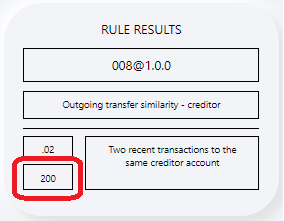
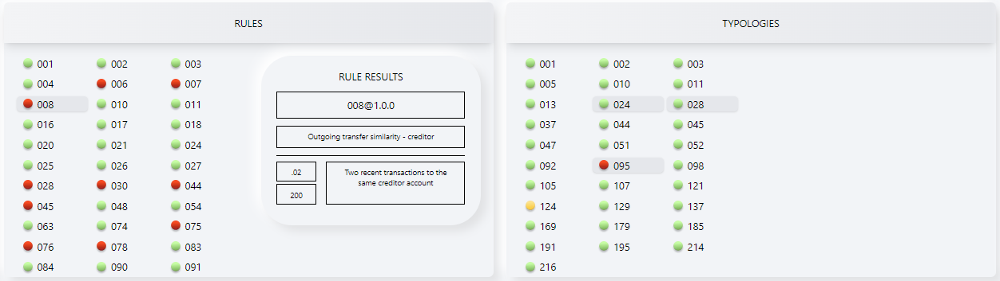
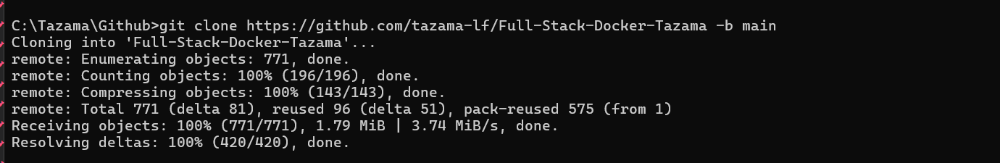
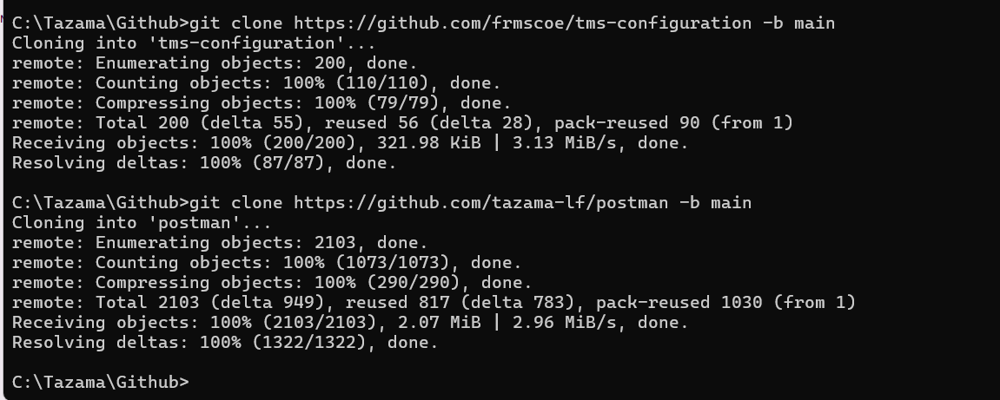
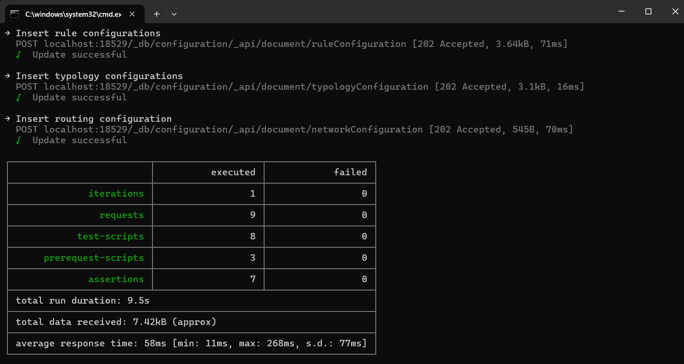
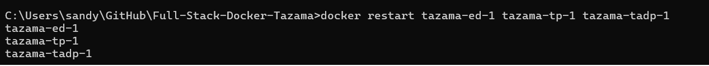
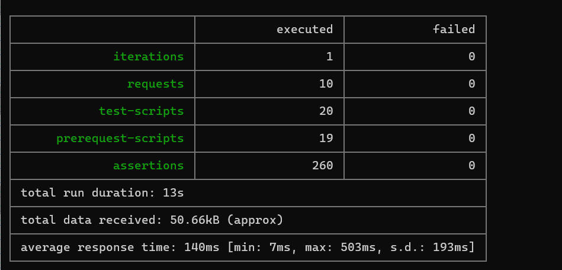
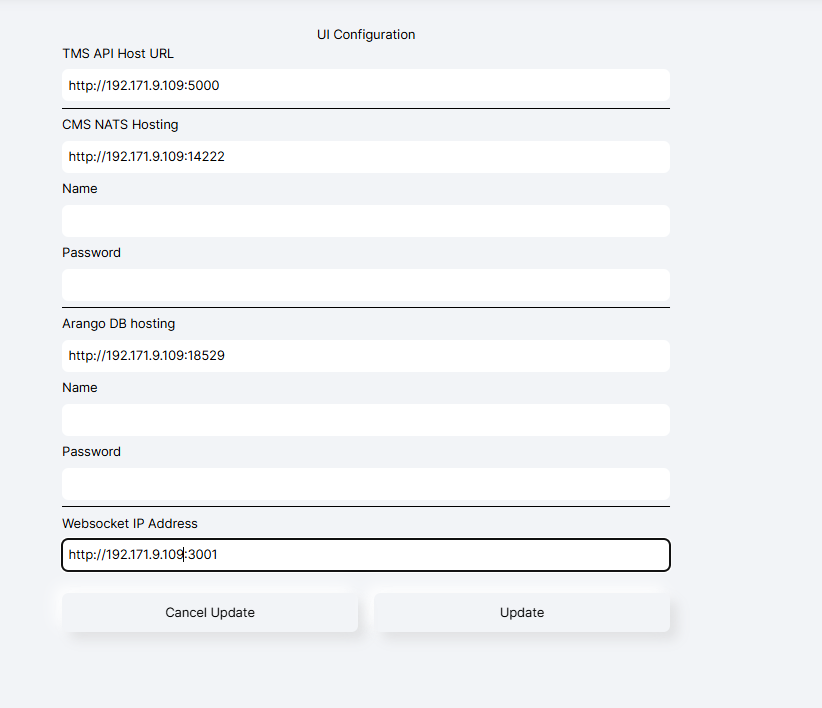

<!-- SPDX-License-Identifier: Apache-2.0 -->

###### Top

## Tazama Demo UI Guide <!-- omit in toc -->

#### Table of Contents <!-- omit in toc -->

- [Introduction](#introduction)
- [Landing page](#landing-page)
- [Create debtors and creditors](#create-debtors-and-creditors)
- [Transpose debtors and creditors](#transpose-debtors-and-creditors)
- [Create and send transactions](#create-and-send-transactions)
- [Evaluation result dashboard overview](#evaluation-result-dashboard-overview)
    - [Event Director (ED) Panel Overview](#event-director-ed-panel-overview)
    - [Rules Panel Overview](#rules-panel-overview)
    - [Typology Panel Overview](#typology-panel-overview)
    - [TADPROC Panel Overview](#tadproc-panel-overview)
- [Evaluation result dashboard analysis](#evaluation-result-dashboard-analysis)
    - [Rule Panel Analysis](#rule-panel-analysis)
    - [Typology Panel Analysis](#typology-panel-analysis)
- [UI Configuration](#ui-configuration)
- [Demo deployment instructions](#demo-deployment-instructions)
- [Demo UI installation steps for a full service deployment](#demo-ui-installation-steps-for-a-full-service-deployment)
- [Test the end-to-end deployment of the demo UI configuration](#test-the-end-to-end-deployment-of-the-demo-ui-configuration)
- [Configure the demo UI setup](#configure-the-demo-ui-setup)

## Introduction

The purpose of this guide is to explain how to use the Tazama Demo User Interface (UI).

The Tazama system is provided as a software engine and as such is generally implemented as a back-end service that taps into transaction flows. As such, demonstrating the software features and capabilities with a visually appealing narrative is challenging. To date, demonstrations have relied on API-simulations via Postman, or simply slideshows. This demo app has been created to be able to demonstrate the system's capabilities.
 
The basic narrative of the demo is to set up a number of light-weight identities and then simulate transactions from a debtor to a creditor via a mocked up mobile device interface. The user interface then reports the outcomes of the various system processes for rule and typology evaluation, and then allow the narrator to highlight interesting elements of the evaluation outcomes, such as the result of a specific rule, the composition of a typology and the outcome of the typology scoring, and whether a transaction is blocked or whether an investigation alert was raised.

For more information on the Tazama system, see the [Product Overview](https://github.com/tazama-lf/docs)

#### Display Format <!-- omit in toc -->
The Tazama Demo UI is desgined to be browser-based and presented in a single-page 'dashboard' in full HD (1080p) or greater resolution with an aspect ratio of 16:9.

## Landing page

The demo opens on the following page

<br>

 

The UI is instantiated with a pre-fabricated debtor and creditor and associated accounts. When an entity is created, one associated account is also created. The UI has space for 4 debtor entities and 4 creditor entities and 4 accounts each.

The system configuration is read from an environment file when the UI starts up so that the layout of rules and typologies are built dynamically to match the system's current configuration.

## Create debtors and creditors

 Click on this icon in the demo UI to replace a pre-fabricated entity with a new randomized entity, and to create up to 4 debtors and creditors.

<br>

Click on plus icon to create a new account, creating up to 4 accounts per entity with randomized information.

 

<br>

To delete an entity (debtor or creditor), hover over the entity or it's accounts and click on the dustbin icon that appears on the right.

 

<br>

To edit an entity (debtor or creditor) or an account, click on the edit icon 

  

<br>

On the entity pop-up modal it is possible to edit the Full name, Birth Date, City of Birth, Country of Birth and Mobile number.

<br>

  

Note: The mobile number format is validated according to the ISO20022 standard https://www.iso20022.org/standardsrepository/type/PhoneNumber

<br>

It is also possible to edit the Account Name on the account pop-up modal.


## Transpose debtors and creditors

It is possible to copy an entity from a debtor to a creditor role, or vice versa. This could be useful if the user wants to illustrate a number of transactions where the debtor's or the creditor's role in the transactions is reversed. For example, for some transactions, the debtor has to first receive a number of transactions before making a payment that is then indicative of anomalous behaviours.

In the first scenario below, Alice is the debtor and Electra is the creditor.


<br>

By clicking on Alice (anywhere on the debtor entity or account icons) and dragging the debtor across to the creditors panel, the debitor Alice becomes a creditor, or vice versa.


<br>

[Top](#top)

## Create and send transactions

The user can compose a transaction between selected debtor and creditor accounts by clicking on the `new transaction` button and submitting the transaction for evaluation by clicking on the `send` button. The transaction is submitted to the Tazama TMS API and the evaluation process is being triggered. The flow of the transaction is tracked visually on the UI dashboard.

<br>


Each click on the `new transaction` button replaces the transaction details with a new randomized transaction.

<br>
Click on the `edit` icon to change the transaction details manually.

<br>


<br>

The Amount, Description and Latitude & Longitude can be edited and saved.

<br>


<br>

When the `SEND` button is clicked, the UI composes and posts the pacs.008 message to the Tazama TMS API, waits for a success (200 OK) response from the API, and then composes and posts the pacs.002 message to the Tazama TMS API, after which the UI renders the evaluation results from every processor involved in the evaluation.

<br>


[Top](#top)

## Evaluation result dashboard overview
The images used in the examples below are from a scenario where two transactions are performed, with the same debtor and creditor, soon after each other.

#### Event Director (ED) Panel Overview


<br>
- When the UI receives a 200 OK response from the Tazama TMS API after the submission of the pacs.008 message, the ED light is set to orange
- When the UI receives a 200 OK response from the Tazama TMS API after the submission of the pacs.002 message, the ED light is set to green
- If either the pacs.008 or pacs.002 messages renders a response other than 200 OK, the ED light is set to red


<br>
In this case, the UI is attempting to send the exact same transaction that has just been sent.  Click on `New Transaction` to generate a new transaction.

[Top](#top)

#### Rules Panel Overview


<br>
Each rule processor will publish its results onto its own NATS subject to which the UI will be subscribed. When the rule result is published by the rule processor, the UI reads and interprets the rule result and updates the rule processor's corresponding light on the dashboard.  

The colour of the light is determined by whether or not the specific rule result reference defined by the subRuleRef value in the rule result is assigned a weighting by the typology processor for ANY typology.
- If the ruleResult is assigned a weighting greater than 0, the rule light is set to red
- If the ruleResult is assigned a 0 weighting, the rule light is set to green
  
[Top](#top)

#### Typology Panel Overview


<br>
The typology processor publishes a typology result for each completed typology onto the TADProc's NATS subscription subject to which the UI is subscribed. When the typology result is published by the typology processor, the UI reads and interprets the typology result and updates the typology's corresponding light on the dashboard. 

- If the typology result value is less than alert threshold value, the typology light is set to green
-  If the typology result value is greater than or equal to the alert threshold value, but less than the interdiction threshold value (if it exists), the typology light is set to orange
- If the typology result value is greater than or equal to the interdiction threshold value (if it exists), the typology light is set to red
  
[Top](#top)

#### TADPROC Panel Overview


<br>
The Transaction Aggregation and Decisioning Processor (TADPROC) publishes a completed evaluation result onto the TADROC's publishing/CMS subscription subject on NATS to which the UI is subscribed. When the evaluation result is published by the TADProc, the UI reads and interprets the evaluation result and updates the TADProc light on the dashboard. 
- If the report status is `ALRT` (alert), the TADProc light is set to red
- If the report status is `NALT` (not alert), the TADProc light is set to green


<br>
If the report status is `ALRT`, a `stop` sign is displayed between the debtor and credit mobile devices indicated that the transaction should be interdicted.


[Top](#top)

## Evaluation result dashboard analysis

#### Rule Panel Analysis
The user can hover over a specific rule light or number to temporarily display a summary of the rule result. In the example, below the cursor is hovering over rule 008, as can be seen by the light grey highlight, and the rule result panel for rule 008 pops up on the right of the list of rules.


In this case, rule 008 light is red and shows the rule result weighting of 200, while any of the green rule lights show a rule result of zero. In addition to displaying the rule weighting, the rule description, subruleref (.02) and its description is also displayed in the rule result modal.


While hovering over a specific rule light to temporarily display a summary of the rule result, the typologies in which the rule result is consumed are also simultaneously temporarily highlighted.  In the example below, while hovering over rule 008, typologies 024, 026 and 095 are highlighted in light grey.


If the user hovers over a rule light, the information is displayed temporarily, but not persisted. In other words, when the user hovers somewhere else that is not a rule light, the previous selected state is restored. If the user clicks on the rule light or description the selected state is displayed persistently. In the example below, after clicking on rule 008, typologies 024, 026 and 095 are highlighted in a darker shade of grey.


Once a state is persisted by clicking on a rule, hovering over other rules, highlights the typologies that depend on the second rule result, in a lighter shade of grey.  In this case, hovering over rule 030 (after clicking on rule 008), highlights typologies 037, 047, 105, 044, 045, 214 in a lighter shade of grey.


[Top](#top)

#### Typology Panel Analysis

The user can hover over a specific typology light to temporarily display a summary of the typology result. In the example, below the cursor is hovering over typology 095, as can be seen by the light grey highlight, and the typology result modal for typology 095 pops up on the right of the list of typologies.

<br>


In this case, typology 095 light is red, and the typology result panel shows the typology result of 800, an alert threshold of 500 and an interdiction threshold of 600.
<br>


While hovering over a specific typology light to temporarily display a summary of the typology result, the rules which contribute to the typology result are simultaneously highlighted.
In the example below, while hovering over typology 095, rules 006, 007, 008, 024, 026, 074 and 075 are highlighted in light grey.
<br>


If the user hovers over a rule light, the information is displayed temporarily, but not persisted. In other words, when the user hovers somewhere else that is not a rule light, the previous selected state is restored. If the user clicks on the rule light or description the selected state is displayed persistently. In the example below, after clicking on typology 095, rules 006, 007, 008, 024, 026, 074 and 075 are highlighted in a darker shade of grey.
<br>


Once a state is persisted by clicking on a typology, hovering over other typologies, highlights the rules that contribute to the second typology result, in a lighter shade of grey.  In this case, hovering over typology 024 (after clicking on typology 095), highlights rules 002, 016, 017, 021, 025, 027, 054, 063, 084, 090 091 in a lighter shade of grey.
<br>


[Top](#top)

## UI Configuration

Click on the `settings` icon to update the UI configuration variables 


The `reset` button restores the settings back to the variables defined in the demo.env file. The settings can be manually edited and saved by clicking on the `update` button.


[Top](#top)

## Demo deployment instructions

The demo UI can be deployed as an optional addon for a public deployment in which case it will include Rule-901 and Typology-999. Follow the guide in the [Full-Stack-Docker-Tazama repository](https://github.com/tazama-lf/Full-Stack-Docker-Tazama)

The demo UI can also be deployed with the full service deployment, but the configuration is not currently compatible with the demo UI and the following additional steps are required to run the Tazama demo UI.

## Demo UI installation steps for a full service deployment

#### 1. Clone the Full-Stack-Docker-Tazama Repository to Your Local Machine <!-- omit in toc -->

In a Windows Command Prompt, navigate to the folder where you want to store a copy of the source code. For example, the source code root folder path I have been using to compile this guide is C:\Tazama\GitHub. Once in your source code root folder, clone (copy) the repository with the following command:

```
git clone https://github.com/tazama-lf/Full-Stack-Docker-Tazama -b main
```

**Output:**



#### 2. Deploy the Core Services via script <!-- omit in toc -->

First, start the Docker Desktop for Windows application.

With Docker Desktop running: from your Windows Command Prompt and from inside the `Full-Stack-Docker-Tazama` folder, execute the following command and follow the prompts:

**Windows**  
Command Prompt: `start.bat` 
Powershell: `.\start.bat`

**Unix (Linux/MacOS)** <!-- omit in toc -->
Any terminal: `./start.sh`

> [!IMPORTANT]  
> Ensure the script has the correct permissions to run. You may need to run `chmod +x start.sh` beforehand.

**Output:**


Select `2` from the start.bat docker deployment menu option


For option 2 (Full service DockerHub deployment) the output will be as follows:


[Top](#introduction)

#### 3. Configure Tazama for the demo UI <!-- omit in toc -->

Tazama is configured by loading the network map, rules and typology configurations required to evaluate a transaction via the ArangoDB API. The configuration information is hidden in a private repository and if you are a member of the Tazama `frmscoe` Organization on GitHub, you'll be able to clone this repository onto your local machine with the following command:

Change the current folder back to your root source code folder:
```
cd ..
```

Clone the `tms-configuration` repository:

```
git clone https://github.com/frmscoe/tms-configuration -b main
```

In addition to cloning the configuration repository, we also need to clone the Tazama `Postman` repository so that we can utilize the Postman environment file that is hosted there:

```
git clone https://github.com/tazama-lf/postman -b main
```

**Output:**



Once these two repositories are cloned, we can perform the following Newman command to load the specific DEMO UI configuration into the ArangoDB databases and collections:

```
newman run collection-file -e environment-file --timeout-request 10200
```

 - The `collection-file` is the full path to the location on your local machine where the `tms-configuration\demo\full-service-config-sans-EFRuP.postman_collection.json` file is located.
 - The `environment-file` is the full path to the location on your local machine where the `postman\environments\Tazama-Docker-Compose-LOCAL.postman_environment.json` file is located.
 - If the path contains spaces, wrap the string in double-quotes.

**Output:**



[Top](#introduction)

#### 4. Restart core processors <!-- omit in toc -->

Now that the demo configuration has been loaded we need to restart our core processors. The main reason the configuration needs to preceed the deployment of the processors is that the processors read the network map at startup to set up the NATS pub/sub routes for the evaluation flow.  

Navigate back to the `full-stack-docker-tazama` folder:
```
cd Full-Stack-Docker-Tazama
```

Execute the following command to restart the core processors:

```
docker restart tazama-ed-1 tazama-tp-1 tazama-tadp-1
```

**Output:**



[Top](#introduction)

## Test the end-to-end deployment of the demo UI configuration

You should be able to submit a test transaction to the Transaction Monitoring Service API and then be able to see the result of a complete end-to-end evaluation in the database. We can run the following Postman test via Newman to see if our deployment was successful:

```
newman run collection-file -e environment-file --timeout-request 10200 --delay-request 500
```

 - The `collection-file` is the full path to the location on your local machine where the `tms-configuration\demo\demo-tms-config-test.postman_collection.json` file is located.
 - The `environment-file` is the full path to the location on your local machine where the `postman\environments\Tazama-Docker-Compose-LOCAL.postman_environment.json` file is located.
 - If the path contains spaces, wrap the string in double-quotes.
 - We add the `--delay-request` option to delay each individual test by 500 milliseconds to give them evaluation time to complete before we look for the result in the database.

**Output:**




## Configure the demo UI setup

Change the default UI configuration settings from 'localhost' to your ip address.  You can confirm your ip address by using the command `ipconfig` from the command line.


**Output:**



Select the `update` button for the changes to take effect

 


 


