<!-- SPDX-License-Identifier: Apache-2.0 -->

###### Top

## Tazama Demo UI Guide <!-- omit in toc -->

#### Table of Contents <!-- omit in toc -->

- [1. Introduction](#1-introduction)
- [2. Demo deployment instructions](#2-demo-deployment-instructions)
- [3. Access the demo UI](#3-access-the-demo-ui)
- [4. Configure the demo UI](#4-configure-the-demo-ui)
- [5. Using the demo](#5-using-the-demo)
    - [Create debtors and creditors](#create-debtors-and-creditors)
    - [Transpose debtors and creditors](#transpose-debtors-and-creditors)
    - [Create and send transactions](#create-and-send-transactions)
    - [Event flow](#event-flow)
      - [Create conditions](#create-conditions)
      - [View conditions](#view-conditions)
      - [Expire conditions](#expire-conditions)
  - [Evaluation result dashboard overview](#evaluation-result-dashboard-overview)
    - [Event Director (ED) Panel Overview](#event-director-ed-panel-overview)
    - [Rules Panel Overview](#rules-panel-overview)
    - [Typology Panel Overview](#typology-panel-overview)
    - [TADPROC Panel Overview](#tadproc-panel-overview)
  - [Evaluation result dashboard analysis](#evaluation-result-dashboard-analysis)
    - [Rule Panel Analysis](#rule-panel-analysis)
    - [Typology Panel Analysis](#typology-panel-analysis)
  - [Clear all](#clear-all)
- [6. Troubleshooting](#6-troubleshooting)

## 1. Introduction

The purpose of this guide is to explain how to use the Tazama Demo User Interface (UI).

The Tazama system is provided as a software engine and as such is generally implemented as a back-end service that taps into transaction flows. As such, demonstrating the software features and capabilities with a visually appealing narrative is challenging. To date, demonstrations have relied on API-simulations via Postman, or simply slideshows. This demo app has been created to be able to demonstrate the system's capabilities.
 
The basic narrative of the demo is to set up a number of light-weight identities and then simulate transactions from a debtor to a creditor via a mocked up mobile device interface. The user interface then reports the outcomes of the various system processes for rule and typology evaluation, and then allow the narrator to highlight interesting elements of the evaluation outcomes, such as the result of a specific rule, the composition of a typology and the outcome of the typology scoring, and whether a transaction is blocked or whether an investigation alert was raised.

The latest version of the demo available is v2.1.0

For more information on the Tazama system, see the [Product Overview](https://github.com/tazama-lf/docs)

#### Display Format <!-- omit in toc -->
The Tazama Demo UI is desgined to be browser-based and presented in a single-page 'dashboard' in full HD (1080p) or greater resolution with an aspect ratio of 16:9.


## 2. Demo deployment instructions

The demo UI can be deployed as an optional addon for a public deployment in which case it will include Rule-901 and Typology-999. The demo UI is deployed by default with the full service deployment option. Follow the guide in the [Full-Stack-Docker-Tazama repository](https://github.com/tazama-lf/Full-Stack-Docker-Tazama) 


## 3. Access the demo UI 

The Demo UI can be accessed via browser via localhost

```
localhost:3001
```
Please be patient as the demo can take a minute or two to load.

The demo UI opens on the following page

<br>

 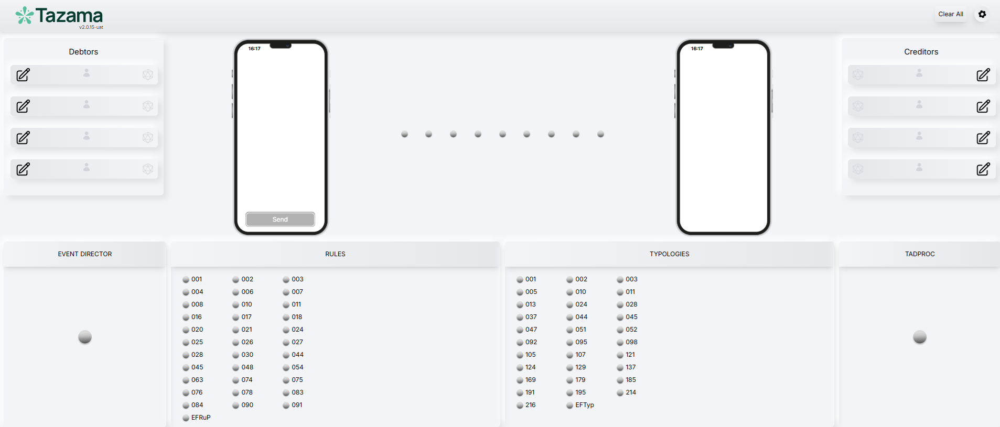


## 4. Configure the demo UI

Click on the `settings` icon to update the UI configuration variables 
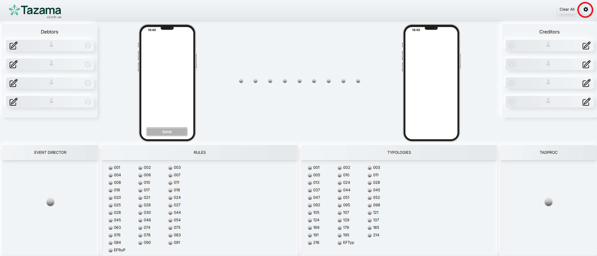

The `reset` button restores the settings back to the variables defined in the ui.env file. 
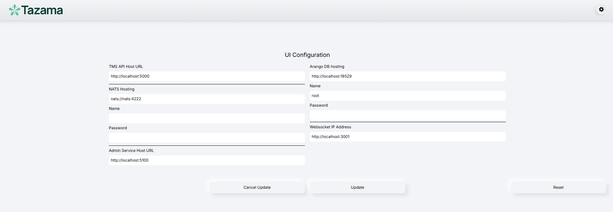

The settings can be manually edited and saved by clicking on the `update` button.
If the demo UI is running at a different location to localhost, change the URL and default UI configuration settings from 'localhost' to the ip address where the demo UI is running.  You can confirm the ip address by using the command `ipconfig` from the command line.

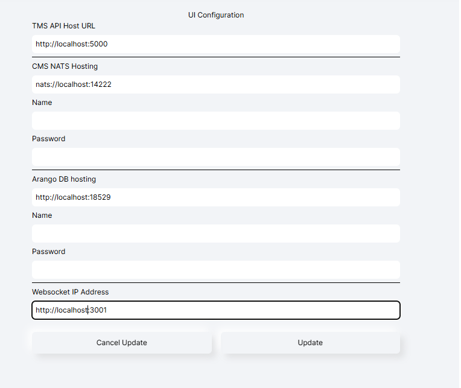

**change nats://nats:4222 RE_DO image**

Select the `update` button for the changes to take effect


## 5. Using the demo

The demo UI opens on the following page

<br>

 
<br>
The UI is instantiated with a pre-fabricated debtor and creditor and associated accounts. When an entity is created, one associated account is also created. The UI has space for 4 debtor entities and 4 creditor entities and 4 accounts each.

The system configuration is read from an environment file when the UI starts up so that the layout of rules and typologies are built dynamically to match the system's current configuration.

#### Create debtors and creditors
<br>

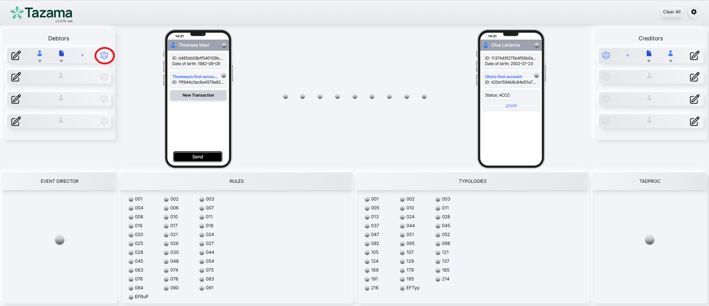 Click on this icon in the demo UI to replace a pre-fabricated entity with a new randomized entity, and to create up to 4 debtors and creditors.

<br>

Click on plus icon to create a new account, creating up to 4 accounts per entity with randomized information.
<br>

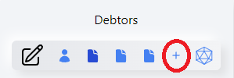 

<br>

To delete an entity (debtor or creditor), hover over the entity or it's accounts and click on the dustbin icon that appears on the right.
<br>

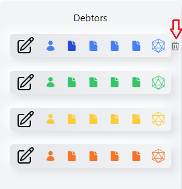 

<br>

To edit an entity (debtor or creditor) or an account, click on the edit icon 

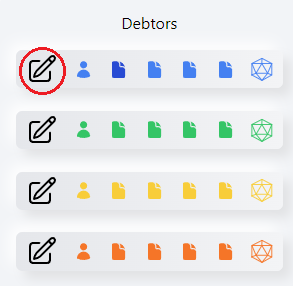  

<br>

On the entity pop-up modal it is possible to edit the Full name, Birth Date, City of Birth, Country of Birth and Mobile number.

<br>

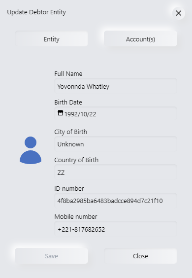  

Note: The mobile number format is validated according to the ISO20022 standard https://www.iso20022.org/standardsrepository/type/PhoneNumber

<br>

It is also possible to edit the Account Name on the account pop-up modal.

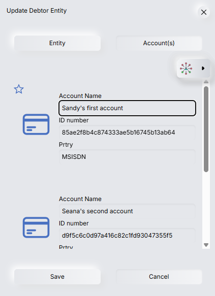

<br>

#### Transpose debtors and creditors

It is possible to copy an entity from a debtor to a creditor role, or vice versa. This could be useful if the user wants to illustrate a number of transactions where the debtor's or the creditor's role in the transactions is reversed. For example, for some transactions, the debtor has to first receive a number of transactions before making a payment that is then indicative of anomalous behaviours.

In the first scenario below, Alice is the debtor and Electra is the creditor.
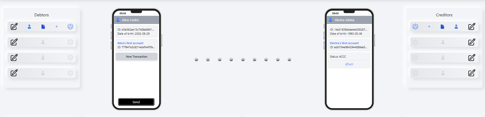

<br>

By clicking on Alice (anywhere on the debtor entity or account icons) and dragging the debtor across to the creditors panel, the debitor Alice becomes a creditor, or vice versa.
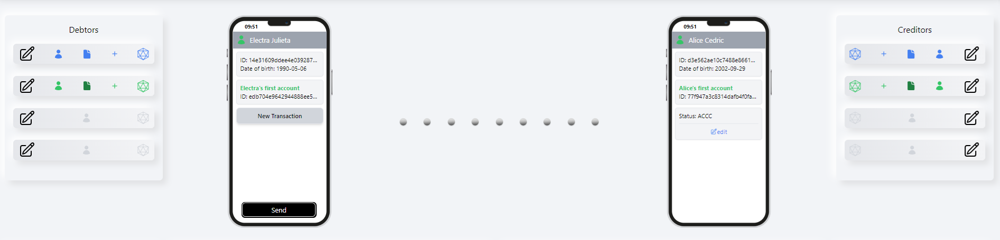

<br>

[Top](#top)

#### Create and send transactions

The user can compose a transaction between selected debtor and creditor accounts by clicking on the `new transaction` button and submitting the transaction for evaluation by clicking on the `send` button. The transaction is submitted to the Tazama TMS API and the evaluation process is being triggered. The flow of the transaction is tracked visually on the UI dashboard.

<br>

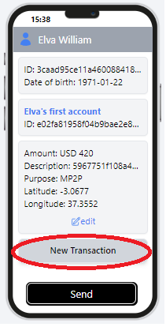
Each click on the `new transaction` button replaces the transaction details with a new randomized transaction.

<br>
Click on the `edit` icon to change the transaction details manually.

<br>

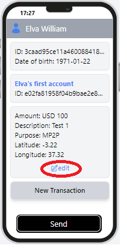

<br>

The Amount, Description and Latitude & Longitude can be edited and saved.

<br>

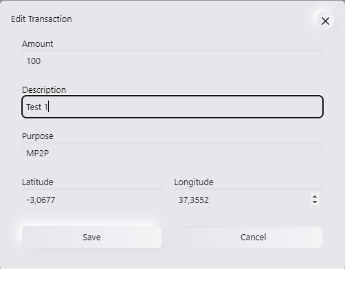

<br>

When the `SEND` button is clicked, the UI composes and posts the pacs.008 message to the Tazama TMS API, waits for a success (200 OK) response from the API, and then composes and posts the pacs.002 message to the Tazama TMS API, after which the UI renders the evaluation results from every processor involved in the evaluation.

<br>

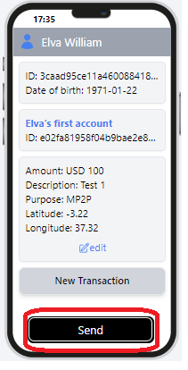
<br>

Go straight to the [Evaluation result dashboard overview](#evaluation-result-dashboard-overview) or read on for an overview of event flow and conditions first.

[Top](#top)

#### Event flow 

For more information on the event flow functionality and how conditions work, see the [Event Flow Overview](../Product/event-flow-rule-processor.md)

The blue light below the entity or account icon in the debtor and creditor panel indicate whether conditions exist for the entity or account.
<br>

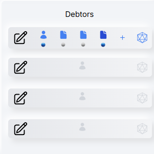
<br>
The lights next to the entity name and account name also indicate whether there is an existing condition for the entity or account.  If the light is blue, conditions exist and if the light is grey no conditions exist.
<br>

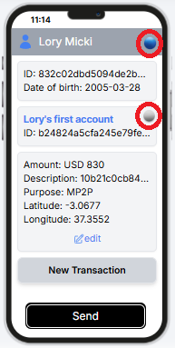
<br>

##### Create conditions

Clicking on a grey condition light in the entity mobile panel, will open the panel for creating a new condition for the entity or account selected.

<br>

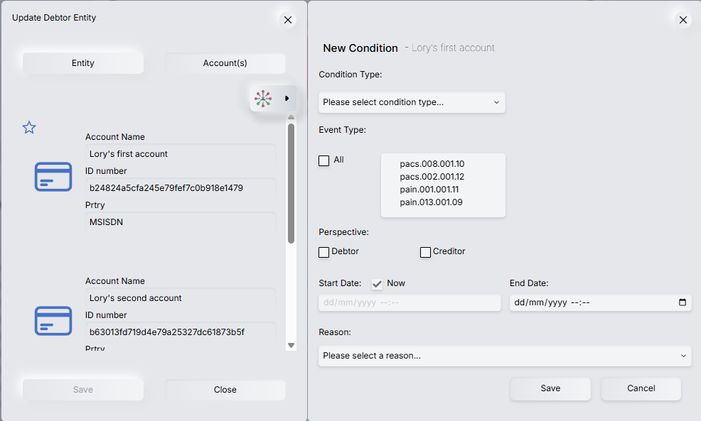

<br>

Select the condition type, event type, perspective, start date, end date and reason and click save.

The end date is only mandatory for the condition type `override`.

Once a new condition is successfully saved, the conditions that exist for the account or entity will be displayed.

##### View conditions

Clicking on a blue condition light in the entity mobile panel, will open the panel for viewing conditions for the entity or account selected.

<br>

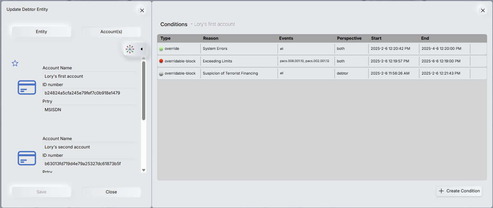

<br>

The light indicator next to the type of condition, will be
 - Green for an override
 - Red for an active condition
 - Grey for a condition that has expired and is no longer applicable

Close the panel by selecting one of the highlighted buttons

<br>

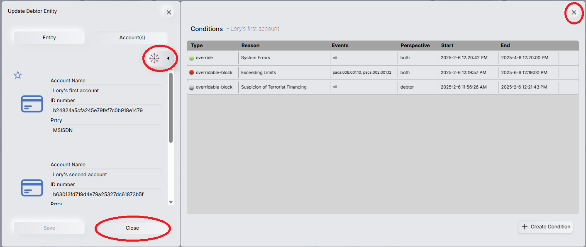

<br>

The `close` button will close the condition panel as well as the update entity panel, while the other two buttons will close the condition panel only.


Close the panel by selecting one of the highlighted buttons below

Click the hightlighted button below on the Update Debtor/ Creditor Entity panel to view the conditions for the account or entity selected.

<br>

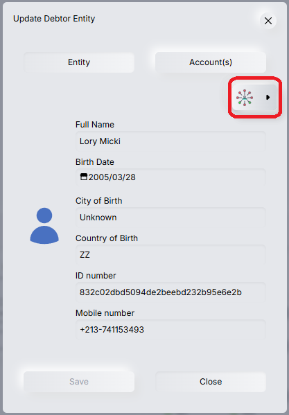

<br>

##### Expire conditions

From the conditions view, a condition can be expired immediately by selecting the `x` next to the condition.

<br>

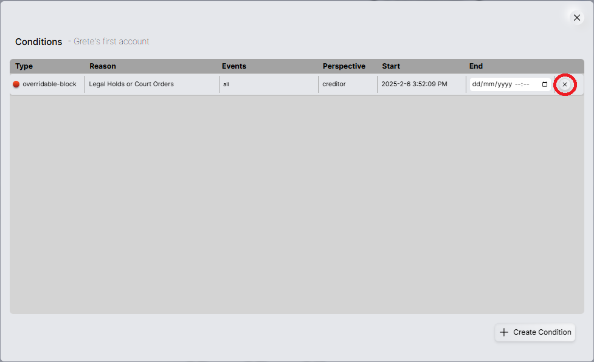

<br>

Click on the save button to confirm expiring the condition now.

<br>

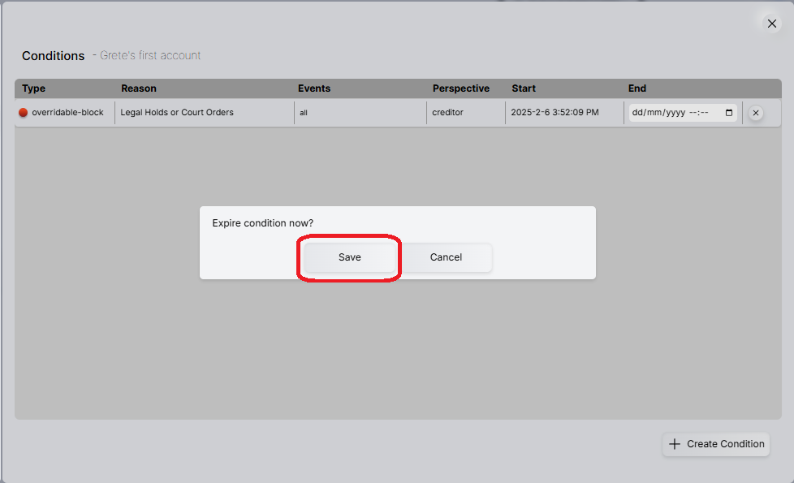

<br>

The end date on a condition can also be future dated by manually typing the date and time or using the date and picker, and then selecting the `x` next to the end date.
<br>

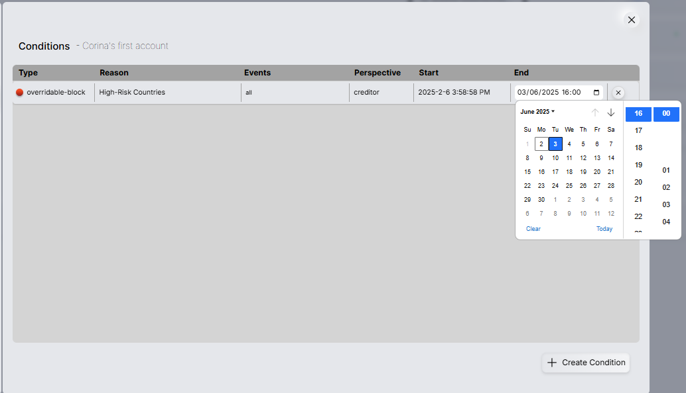

<br>


[Top](#top)

### Evaluation result dashboard overview
The images used in the examples below are from a scenario where two transactions are performed, with the same debtor and creditor, soon after each other.

#### Event Director (ED) Panel Overview

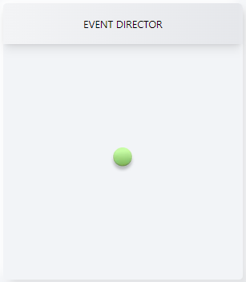
<br>
- When the UI receives a 200 OK response from the Tazama TMS API after the submission of the pacs.008 message, the ED light is set to orange
- When the UI receives a 200 OK response from the Tazama TMS API after the submission of the pacs.002 message, the ED light is set to green
- If either the pacs.008 or pacs.002 messages renders a response other than 200 OK, the ED light is set to red

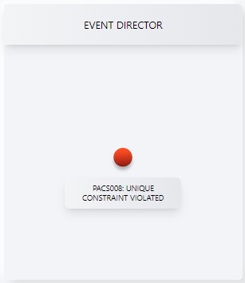
<br>
In this case, the UI is attempting to send the exact same transaction that has just been sent.  Click on `New Transaction` to generate a new transaction.

[Top](#top)

#### Rules Panel Overview

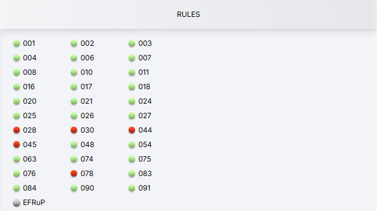
<br>
Each rule processor will publish its results onto its own NATS subject to which the UI will be subscribed. When the rule result is published by the rule processor, the UI reads and interprets the rule result and updates the rule processor's corresponding light on the dashboard.  

The colour of the light is determined by whether or not the specific rule result reference defined by the subRuleRef value in the rule result is assigned a weighting by the typology processor for ANY typology.
- If the ruleResult is assigned a weighting greater than 0, the rule light is set to red
- If the ruleResult is assigned a 0 weighting, the rule light is set to green

The exception to this is the EFRuP rule
- If the subruleref is `block`, the EFRuP rule light is set to red
- If the subruleref is `override`, the EFRuP rule light is set to green
- If the subruleref is `none`, the EFRuP rule light is set to grey.  The light will also be grey if there are no conditions for the entity or account

 For more information on Event Flow (EFRuP), see the [Event Flow Overview](../Product/event-flow-rule-processor.md)
  
[Top](#top)

#### Typology Panel Overview

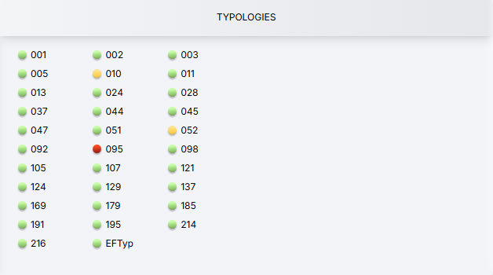
<br>
The typology processor publishes a typology result for each completed typology onto the TADProc's NATS subscription subject to which the UI is subscribed. When the typology result is published by the typology processor, the UI reads and interprets the typology result and updates the typology's corresponding light on the dashboard. 

- If the typology result value is less than alert threshold value, the typology light is set to green
-  If the typology result value is greater than or equal to the alert threshold value, but less than the interdiction threshold value (if it exists), the typology light is set to orange
- If the typology result value is greater than or equal to the interdiction threshold value (if it exists), the typology light is set to red

[Top](#top)

#### TADPROC Panel Overview

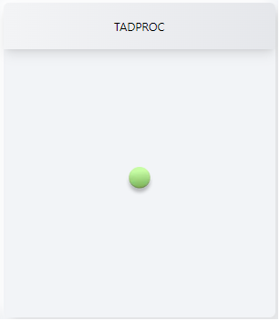
<br>
The Transaction Aggregation and Decisioning Processor (TADPROC) publishes a completed evaluation result onto the TADROC's publishing/CMS subscription subject on NATS to which the UI is subscribed. When the evaluation result is published by the TADProc, the UI reads and interprets the evaluation result and updates the TADProc light on the dashboard. 
- If the report status is `ALRT` (alert), the TADProc light is set to red
- If the report status is `NALT` (not alert), the TADProc light is set to green

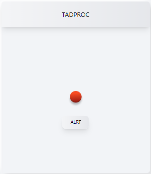
<br>
If the interdiction is overridden, the TADProc light will flash green and red and the text `interdiction overridden` will be displayed below the TADProc light.
<br>
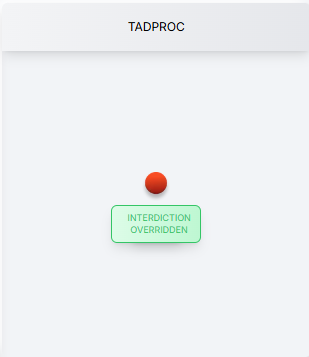

If the transaction is blocked, the TADProc light will be amber (if the report status is not alert) or red (if the report status is alert) and the text `blocked` will be displayed below the TADProc light.
<br>

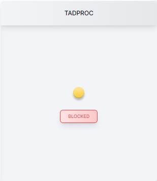

A `stop` sign is displayed between the debtor and credit mobile devices indicated that if the transaction should be interdicted or blocked.
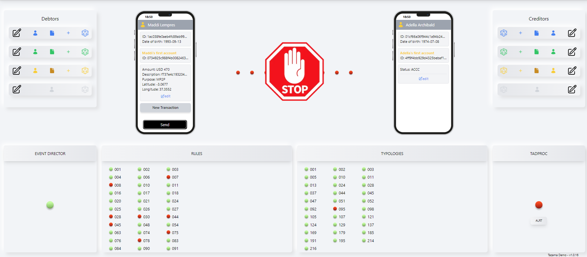

<br>

[Top](#top)

### Evaluation result dashboard analysis

#### Rule Panel Analysis
The user can hover over a specific rule light or number to temporarily display a summary of the rule result. In the example, below the cursor is hovering over rule 008, as can be seen by the light grey highlight, and the rule result panel for rule 008 pops up on the right of the list of rules.
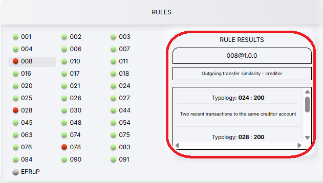

In this case, rule 008 light is red and shows the rule result weighting of 200 for typology 024. Scrolling up or down will show the rule result weighting for any other typology impacted by rule 008. Any of the green rule lights show a rule result of zero.  

While hovering over a specific rule light to temporarily display a summary of the rule result, the typologies in which the rule result is consumed are also simultaneously temporarily highlighted. If the user hovers over a rule light, the information is displayed temporarily, but not persisted. In other words, when the user hovers somewhere else that is not a rule light, the previous selected state is restored. If the user clicks on the rule light or description the selected state is displayed persistently. In the example below, after clicking on rule 008, typologies 024, 026 and 095 are highlighted in a darker shade of grey.
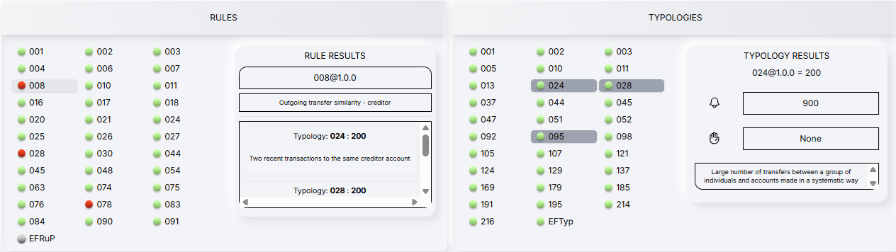

Once a state is persisted by clicking on a rule, hovering over other rules, highlights the typologies that depend on the second rule result, in a lighter shade of grey. In this case, hovering over rule 030 (after clicking on rule 008), highlights typologies 037, 047, 105, 044, 045, 214 in a lighter shade of grey.
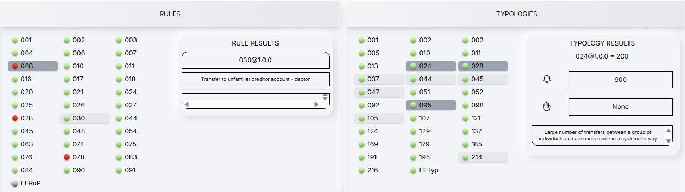

[Top](#top)

#### Typology Panel Analysis

The user can hover over a specific typology light to temporarily display a summary of the typology result. In the example, below the cursor is hovering over typology 095, as can be seen by the light grey highlight, and the typology result modal for typology 095 pops up on the right of the list of typologies.

<br>

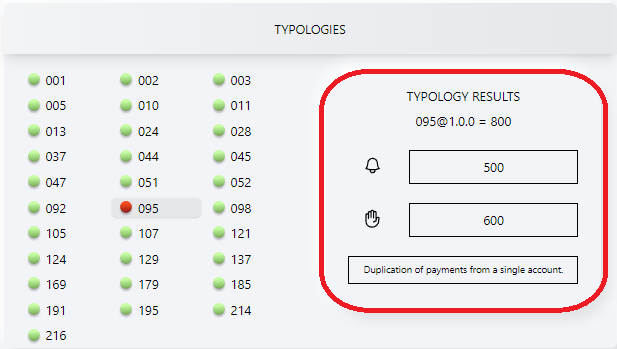

In this case, typology 095 light is red, and the typology result panel shows the typology result of 800, an alert threshold of 500 and an interdiction threshold of 600.
<br>

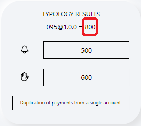

While hovering over a specific typology light to temporarily display a summary of the typology result, the rules which contribute to the typology result are simultaneously highlighted.
In the example below, while hovering over typology 095, rules 006, 007, 008, 024, 026, 074 and 075 are highlighted in light grey.
<br>

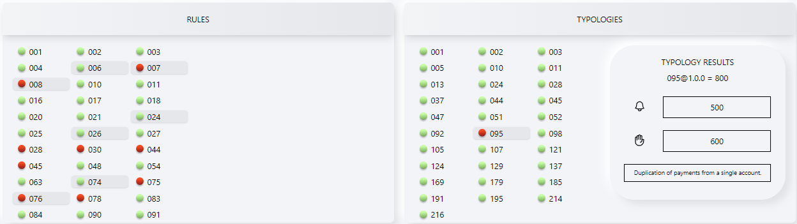

If the user hovers over a rule light, the information is displayed temporarily, but not persisted. In other words, when the user hovers somewhere else that is not a rule light, the previous selected state is restored. If the user clicks on the rule light or description the selected state is displayed persistently. In the example below, after clicking on typology 095, rules 006, 007, 008, 024, 026, 074 and 075 are highlighted in a darker shade of grey.
<br>

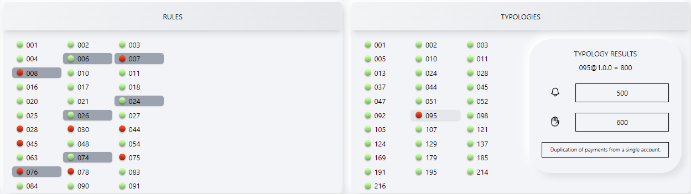

Once a state is persisted by clicking on a typology, hovering over other typologies, highlights the rules that contribute to the second typology result, in a lighter shade of grey.  In this case, hovering over typology 024 (after clicking on typology 095), highlights rules 002, 016, 017, 021, 025, 027, 054, 063, 084, 090 091 in a lighter shade of grey.
<br>

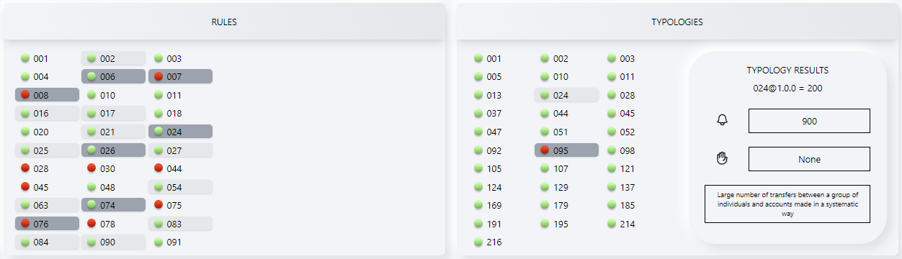

If there is an override condition applicable and the EFRuP rule is configured in teh network map, the ERFuP rule results will show a description of `override` 

<br>

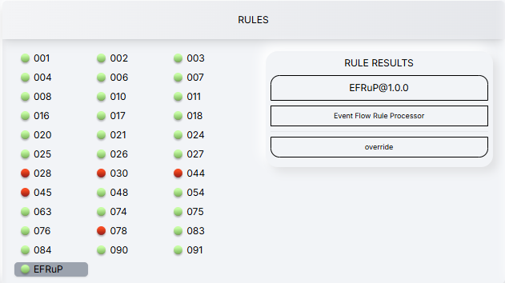

If the interdiction alert for a typology is overridden, the typology score that was overridden (in this case 095) shows an override icon next to the score.

<br>

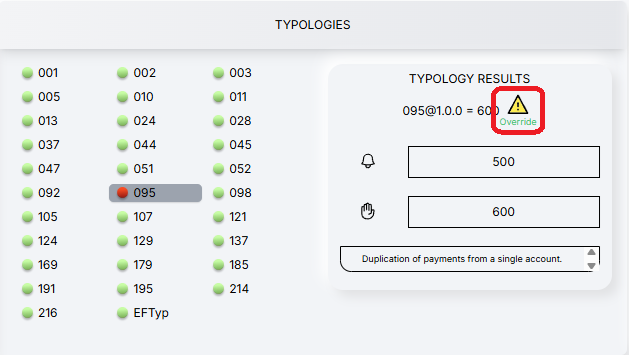

[Top](#top)

### Clear all
The `clear all` button resets the entire demo and allows the user to start a new demo with a fresh screen
<br>

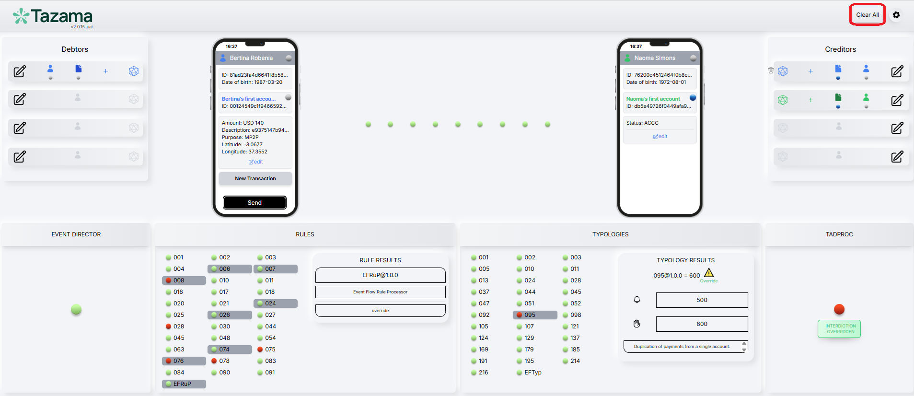

See below for `clear all` result

<br>

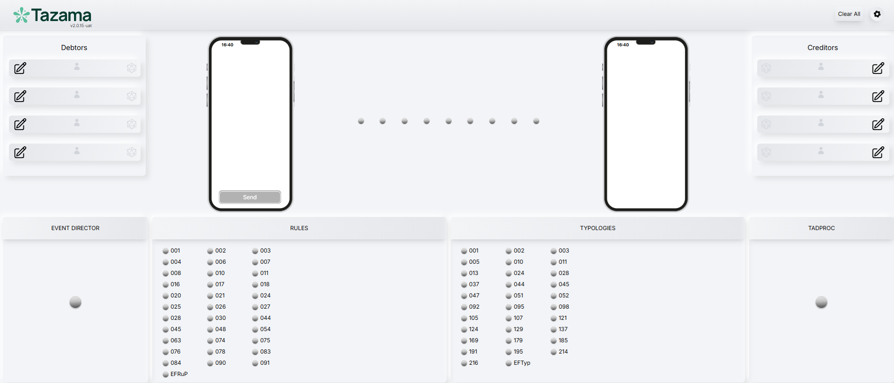

[Top](#top)

## 6. Troubleshooting
#### Broswers to avoid <!-- omit in toc -->


#### Setup dependencies (pre-full stack docker) <!-- omit in toc -->

The following 2 files must be created or updated before the start.bat file is run from full-stack-docker. The demo will not deploy successfully without them. The full instructions are in the guide [Full-Stack-Docker-Tazama repository](https://github.com/tazama-lf/Full-Stack-Docker-Tazama) 

**IMAGE here**

##### ui.env <!-- omit in toc -->

```JSON
# SPDX-License-Identifier: Apache-2.0

NEXT_PUBLIC_URL="http://localhost:3001"
PORT="3001"
NEXT_PUBLIC_TMS_SERVER_URL="http://localhost:5000"
NEXT_PUBLIC_TMS_KEY="no_key_set"
NEXT_PUBLIC_CMS_NATS_HOSTING="nats://nats:4222"
NEXT_PUBLIC_NATS_USERNAME=""
NEXT_PUBLIC_NATS_PASSWORD=""
NEXT_PUBLIC_ARANGO_DB_HOSTING="http://localhost:18529"
NEXT_PUBLIC_ADMIN_SERVICE_HOSTING="http://localhost:5100"
NEXT_PUBLIC_DB_USER="root"
NEXT_PUBLIC_DB_PASSWORD=""
NEXT_PUBLIC_WS_URL="http://localhost:3001"
NEXT_PUBLIC_NATS_SUBSCRIPTIONS="['connection', '>', 'typology-999@1.0.0']"
NEXT_PUBLIC_CONDITION_TYPES="['non-overridable-block', 'overridable-block', 'override']"
NEXT_PUBLIC_EVENT_TYPES="['pacs.008.001.10', 'pacs.002.001.12', 'pain.001.001.11', 'pain.013.001.09']"
NEXT_PUBLIC_CONDITION_REASONS="['Suspicion of Money Laundering', 'Violation of KYC/AML Requirements', 'Suspicion of Terrorist Financing', 'Tax Evasion Concerns', 'Regulatory Reporting Thresholds', 'Unusual Transaction Patterns', 'High-Risk Countries', 'Multiple Failed Login Attempts', 'Fraudulent Activity', 'Phishing or Account Takeover', 'Suspicious Beneficiaries', 'System Errors', 'Exceeding Limits', 'Legal Holds or Court Orders', 'Adverse media reports', 'Dormant or Inactive Accounts', 'Internal Bank Policies']"
```

**IMAGE here**

##### docker-compose.dev.ui.yaml <!-- omit in toc -->

```JSON
services:
  ui:
    image: tazamaorg/demo-ui:v2.1.0
    restart: always
    env_file:
      - env/ui.env
    depends_on:
      - tms
      - arango
      - nats
    ports:
      - "3001:3001"
  tms:
    environment:
      - CORS_POLICY=demo
  admin-service:
      environment:
      - CORS_POLICY=demo
```


[Top](#top)