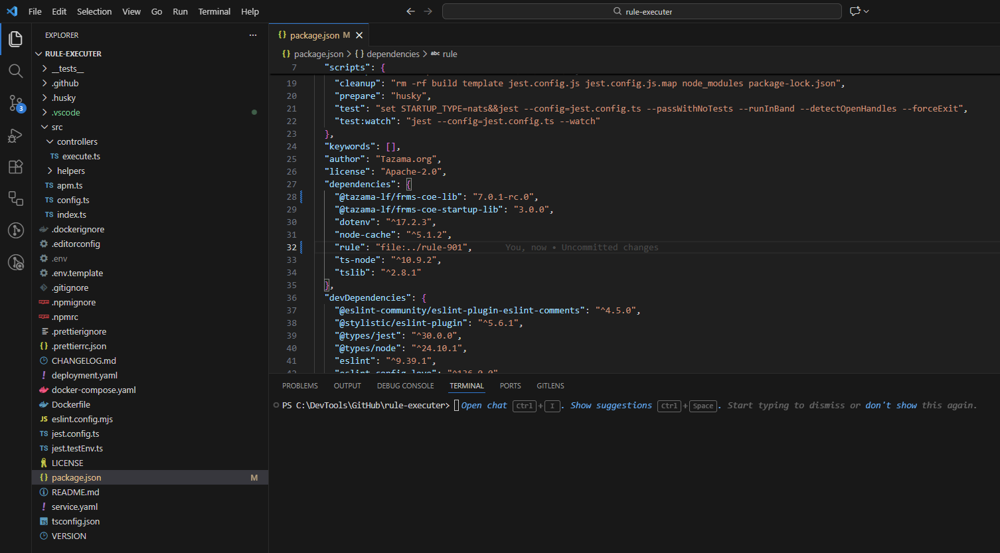

<!-- SPDX-License-Identifier: Apache-2.0 -->

<a id="top"></a>

# Setting up the development environment <!-- omit from toc -->

## Table of Contents <!-- omit from toc -->

- [1. Introduction](#1-introduction)
- [2. Requirements for setting up the Development Environment](#2-requirements-for-setting-up-the-development-environment)
- [3. Development environment setup](#3-development-environment-setup)
- [4. Microprocessor setup instructions](#4-microprocessor-setup-instructions)
  - [4.1. Preparation](#41-preparation)
    - [4.1.1 Step 1: Setting up GitHub Token Locally](#411-step-1-setting-up-github-token-locally)
    - [4.1.2 Step 2: Set up core services](#412-step-2-set-up-core-services)
    - [4.1.3 Step 3: Set up optional services](#413-step-3-set-up-optional-services)
  - [4.2. Setting Up a Tazama Processor to Work On](#42-setting-up-a-tazama-processor-to-work-on)
    - [4.2.1 Setting up the rule module](#421-setting-up-the-rule-module)
    - [4.2.2 Setting up the rule executer](#422-setting-up-the-rule-executer)
- [5. Where to From Here?](#5-where-to-from-here)
  - [5.1. Processor Unit Testing with Jest](#51-processor-unit-testing-with-jest)
  - [5.2. Debugging your Code in VS Code](#52-debugging-your-code-in-vs-code)
  - [5.3. Getting Help](#53-getting-help)
- [6. Further reading](#6-further-reading)

## 1. Introduction

Hello and welcome! If you are reading this, we hope it's because you'd like to help.  This guide is to help set up the development environment.

## 2. Requirements for setting up the Development Environment

Before you begin working on an existing or new Tazama microservice or processor, ensure that the following requirements are met on your system:

 - **Code Editor**:
    - Install a code editor of your preference (e.g. [Visual Studio Code](https://code.visualstudio.com/), [Eclipse](https://www.eclipse.org/), [Sublime Text](https://www.sublimetext.com/), [Vim](https://www.vim.org/)/[Neovim](https://neovim.io/) (RIP [Atom](https://github.blog/2022-06-08-sunsetting-atom/))).
    - For our guide, we're using VS Code. We install VS Code first because both the Node.js implementation and the git implementation have some installation options that rely on an existing installation of VS Code.
    - To keep things simple, our VS Code is deployed with default installation options and no other plugins.

 - **Node.js and npm**:
    - Install Node.js and npm by visiting the official [Node.js website](https://nodejs.org).
    - Follow the installation instructions for your operating system.
    - In our deployment Node.js is mostly installed with default options, but we also selected to automatically install the additional tools such as Chocolatey, Python, VS Code tools, and a bunch of required Windows KB patches.

 - **Git**:
    - Install Git by visiting the official [Git website](https://git-scm.com/).
    - Follow the installation instructions for your operating system.
    - Also install [GitHub Desktop](https://desktop.github.com/) or [GitHub CLI](https://cli.github.com/), though this guide is written specifically for Git.
    - In our deployment, Git is mostly installed with default options, with the following specific exceptions:
      - Select VS Code as the default editor
      - Check-out as-is, commit as-is
      - Use Windows's default console window

  - **Postman / Newman**
    - Install the Postman application by visiting the official [Postman website](https://www.postman.com/downloads/) - we use Postman collections to test our microservices, but also to update the configuration files for the system. 
    - (Optional) If you prefer a command-line alternative to the Postman application, you can also use Newman or the Postman CLI tool. Instructions for installing both are also on the official [Postman website](https://www.postman.com/downloads/).
    - When using Postman, you would need to unfortunately create a Postman account to be able to import the Tazama Postman scripts through any method other than `curl`.
    - In our deployment Postman is installed with default options, and we created an account.

 - **Docker**:
    - Docker is useful if you do not have access to a persistent development environment that hosts the core system microservices that you need to test your integrations. With Docker, you can deploy containerized microservices on your local machine. Follow the instructions on the official Docker website to [install Docker Desktop on Windows](https://docs.docker.com/desktop/install/windows-install/). Remember that Docker Desktop on Windows also requires Linux on Windows that you can [install with WSL](https://docs.docker.com/desktop/install/windows-install/).
    - Follow the instructions in the [tazama-lf/full-stack-docker-tazama](https://github.com/tazama-lf/full-stack-docker-tazama) repository to install the Tazama services on your local machine.
    - In our deployment, we are running Tazama on a separate server.

<div style="text-align: right"><a href="#top">Top</a></div>

## 3. Development environment setup

Tazama is deployed as a number of discrete containers that account for all the outward-facing and interior components that make up the entire system. If you want to work on any individual component, or perhaps a cluster of components that are interdependent, you are likely also going to need to host the rest of Tazama's components somewhere accessible.

To make this a little easier, we provide a Docker Compose deployment of the platform for exploration and development purposes. You can find the instructions and components here: [Tazama Full-Stack Docker deployment](https://github.com/tazama-lf/Full-Stack-Docker-Tazama).

While the deployment from this repository is a lighter weight than a full production deployment, it does still consume quite a bit of system resources and if you are running Tazama will all the containers simultaneously, you might want to consider running this on a separate machine than your primary development machine. This guide will assume that the developer is working on their own (local) computer and that Tazama is running on a separate computer (a server).

The way we envisage the full-stack deployment being used for development purposes is for a developer to spin up at least the foundational infrastructure components that they need in support of the module they want to work on, and then connect the module from their local machine to the infrastructure for integration testing purposes.

## 4. Microprocessor setup instructions
Follow these step-by-step instructions to get your local machine ready to work on a Tazama microservice processor. First we are going to set up the core services that all microservice processors rely on, and then we'll set up a specific microservice and get that ready for you to work on.

### 4.1. Preparation  

#### 4.1.1 Setting up GitHub Token Locally
For more information on GitHub Personal Access Tokens (PATs), follow this link to the related [GitHub documentation page](https://docs.github.com/en/authentication/keeping-your-account-and-data-secure/managing-your-personal-access-tokens#about-personal-access-tokens).

We prefer (and recommend) using a PAT for interacting with Tazama repositories on GitHub. If you have a PAT set up and you have applied the correct permissions, you can interact with GitHub seamlessly without a lot of authentication back-and-forth.

 - Generate a GitHub Personal Access Token to access the GitHub API:
   - Visit the GitHub Tokens page while logged into your GitHub account (Click your profile picture in the top right corner, then `Settings`, then `Developer settings`, then `Personal access tokens`, then `Tokens (classic)`)
   - Click on the `Generate new token` button and select `Generate new token (classic)`.
   - Provide a name for your token and select the scopes or permissions required. For this case, you will need at least the`workflow`,  `write:packages` and `read:org` scope.
   - Scroll down and click on the `Generate token` button at the bottom.
   - Copy the generated token immediately (this token won't be visible again).

 - To set up the GitHub PAT as a persistent environment variable on your local machine, follow the specific instructions for setting environment variables for your operating system:
   - [Microsoft Windows](https://www.youtube.com/watch?v=5BTnfpIq5mI)
   - [Apple MAC OS](https://www.youtube.com/watch?v=dl_jgYr0rxU)
   - [Linux](https://www.youtube.com/watch?v=yM8v5i2Qjgg)

> [!NOTE]
> Make sure the name of your environment variable is `GH_TOKEN` to match the name that the Tazama scripts are looking for.

Note that Tazama currently spans two GitHub organizations:
 - [Tazama-LF](https://github.com/tazama-lf) contains all foundational components and is public.
 - [FRMSCoE](https:github.com/frmscoe) contains private rule repositories.

If you want to view the source code for the rule processors, you would need to request member access to our FRMSCoE organization via our [Tazama-LF Slack](https://slack.tazama.org) channel.

<div style="text-align: right"><a href="#top">Top</a></div>

#### 4.1.2 Set up core services

The core Tazama services are best deployed via the [Tazama Docker Full-Stack Deployment](https://github.com/tazama-lf/full-stack-docker-tazama).

The deployment script (tazama.bat for Windows or tazama.sh for Mac OS/Linux) will guide you through the steps to either deploy the components from GitHub repositories or precompiled DockerHub images.

We recommend that you deploy option 2. Public (DockerHub) deployment if you are just starting out. This deployment will deploy the core services, and two sample rule processors that are hosted in our public GitHub organization.

<div style="text-align: right"><a href="#top">Top</a></div>

#### 4.1.3 Set up optional services

Depending on your specific needs, you could then deploy some additional optional components into your full-stack deployment:
 - Authentication Services via KeyCloak and the Tazama Authentication Services API.
 - Relay Services for downstream integration via NATS, Kafka, RabbitMQ, and REST API.
 - Basic Logging which logs container behaviour to their individual Docker container consoles.
 - The Demo UI which provides a graphical UI for exploring Tazama.

Of particular note, and recommended for development and individual container testing purposes, Is the [Tazama NATS Utilities](https://github.com/tazama-lf/nats-utilities) module:

 - **Tazama NATS Utilities**:
    
    Tazama is composed out of a number of different processors that are chained together using a pub/sub framework facilitated by [NATS](https://nats.io). Only the front-most processors: the Transaction Monitoring Service (TMS) API, Authentication Services API, and Admin Services API, is accessible directly via a traditional REST API: the remaining (down-stream) processors are only accessible via their respective NATS subscription subjects.
    
    The Tazama NATS Utilities provides a REST API proxy that enabled access directly into the down-stream processors to assist in the development and testing process.

    If interaction with Tazama is expected to be solely through one of the various APIs, the NATS Utilities proxy will not be required, but it is often easier to test one of your components in isolation while it is in its deployed state and then you can interact with the processor directly via the NATS Utilities proxy.

<div style="text-align: right"><a href="#top">Top</a></div>

### 4.2. Setting Up a Tazama Processor to Work On  

With your back-end server infrastructure up and running, you can now set up a component on your local machine to work on.

In a customer's environment, we anticipate that the bulk of the customization work in Tazama will be the development or modification of a new or existing Tazama rule processor.

The development of a rule processor is also slightly more on the complex side compared to the other processors, so it's a good place to start as an example of setting up your development environment.

Tazama is designed to run a number of rule processors to evaluate incoming transactions. By default, the sample rule processors, `Rule 901` and `Rule-902`, are deployed by the option 2 full-stack deployment. You can read this [rule processor overview](https://github.com/tazama-lf/docs/blob/dev/Product/rule-processor-overview.md) document for some background on how rule processors are stitched together, but one of the key things to note about a rule processor in particular is that the rule processor consists of two distinct parts:

 - The **rule module** contains the rule-specific code, centered around a database query that interrogates historical data for suspicious behaviours,
 - The **rule executer** is a standard wrapper that manages all the infrastructure overhead for the rule module and centralises a lot of the shared code to make the rule module as light-weight as possible.

When we deploy a rule processor, we bake the rule module code as a published npm package into the rule executer:


The rule modules run inside the `Rule Executer` wrapper function, which is itself configured to contain a specific rule module. While we can work on the rule module separately, if we wanted to run, for example rule `Rule 901`, we need to run the a `Rule Executer` that is set up to contain it.

#### 4.2.1 Setting up the rule module

Follow the steps below to get the `Rule 901` on your operating table.

> [!NOTE]
> The instructions below are provided for the Windows Operating System. If you would like to provide an equivalent set of instructions for your chosen operating system, please contact our team via [Slack](https://slack.tazama.org).

1. Clone the GitHub Rule Module Repository

    Open a Windows Command Prompt and navigate to the folder where you want to store your code.

    The following `git` command will clone Rule 901's code to your local machine:

    ```
    C:\Your-Folder-Here>git clone https://github.com/tazama-lf/rule-901
    ```

    As you can probably guess, this command will also let you clone any of the repositories in the `tazama-lf` GitHub organization that you have access to by specifying their specific URL after the `git clone` command.

2. Navigate to the Repository Folder

    Using the Windows `cd` or `chgdir` command, navigate to the newly cloned repository folder:
    ```
    C:\Your-Folder-Here>cd rule-901
    ```

3. Create a new branch

    > [!NOTE] Very Important!
    > Before you do anything else in your local copy of the repository you should create a new branch. Your own branch, called a "feature branch" will separate your changes from the current release `main` branch and the current active `dev` branch. In Tazama, developers work on their own separate feature branches and then submit their changes via a [pull request](https://docs.github.com/en/pull-requests/collaborating-with-pull-requests/proposing-changes-to-your-work-with-pull-requests/about-pull-requests). 

    Using `git`, you can create a new branch for your repository to contain your changes:
    ```
    C:\Your-Folder-Here\rule-901>git checkout -b "your-branch-name-here"
    ```

    Maybe a couple of notes on branch naming:
     - We usually try to preface the branch with some kind of reference that relates to the organization we are representing. For example, our Tazama staff will create branches called "tazama/my-branch-name-here". We encourage you to create your branch as "your-org/your-branch-name-here".
     - The branch name itself should be short, but descriptive, and related to the change that you want to make. "But," you ask: "how do I know what the change is that I'm going to make this soon after cloning the repository?" This is a good question, and this brings us to one of our guiding principles for contributions, and development contribution in particular: your contribution should be intentional and deliberate. You should already know what you are intending to do when you want to modify Tazama code, and, even more to the point, you should have declared your intention in a well-documented GitHub issue in the same repository that you are modifying. We'll get to that a little later in your journey.
     - Avoid spaces in the naming and rather use dashes or underscores to separate words in your branch name.

4. Make a clean start

    This step isn't always necessary, but it's generally good practice.Using `npm`, you can clean up your local repository to make sure there are no lingering build artefacts:
    ```
    C:\Your-Folder-Here\rule-901>npm run clean
    ```

    `npm` may prompt you to install `rimraf` here. `rimraf` is required to interact with your file-system to clean up the build artefacts. We suggest you say yes.

5. Install Dependencies

    Using `npm`, you can install all the dependencies for the processor as specified in the `package.json` file in the repository folder:
    ```
    C:\Your-Folder-Here\rule-901>npm install
    ```

6. Build the Node.js Application

    Use the following `npm` command to build the application which will add a folder called lib or build to the local repository folder. 
      ```
      C:\Your-Folder-Here\rule-901>npm run build
      ```
    This new build folder won't be included in a future code commit - it has been excluded via the `.gitignore` file.

#### 4.2.1 Setting up the rule executer

We're now about halfway through the process. We've set up the rule module on our local computer, but now we also need to set up the rule executer to bundle the rule module into a rule executer.

We'll breeze through the same steps above, but now for the rule-executer repository.

Go back one step to `Your-Folder`:
```
C:\Your-Folder-Here\rule-901>cd..
```

Clone the repository:
```
C:\Your-Folder-Here>git clone https://github.com/tazama-lf/rule-executer
```

Change to the repository folder:
```
C:\Your-Folder-Here>cd rule-executer
```

Create a new branch to host your changes:
```
C:\Your-Folder-Here\rule-executer>git checkout -b "your-branch-name-here"

```

Clean your build files:
```
C:\Your-Folder-Here\rule-executer>npm run clean
```

Now we depart slightly from the same process above for the rule module. Typically, the rule modules are published to the Tazama GitHub package registry as an [`npm` package](https://docs.npmjs.com/about-packages-and-modules#about-packages). This allows us to then easily import the rule module into the rule executer to create the rule processor. The way we do this is to reference the rule module npm package in our rule-executer's `package.json` file.

In this case, because we do not want to work on the existing published npm package on our local machine for this development process, we want to import the rule module that is currently cloned (and will eventually be modified) on our local computer.

For this reason, we now need to update the dependency in our rule-executer's `package.json` file to point to our local clone of the rule module.

1. Open VS Code

    From within the rule-executer folder, run VS Code with:
      ```
      C:\Your-Folder-Here\rule-executer>code .
      ```

2. Open and update the `package.json` file

    Find the `package.json` file in the file list on the left of the screen and click it to open it.

    Inside the file, find the `"rule"` keyword under the `"dependencies"` keyword.

    Change the value of the "rule" key to read:
      ```json
      "rule": "file:../rule-901",
      ```
    This change will point the rule-executer dependency for the rule module to your local filesystem in a folder on the same level as your rule-executer repository folder.

    Save the `package.json` file.

()

3. Install dependencies

    ```
    C:\Your-Folder-Here\rule-executer>npm install
    ```

    This may take a moment. To confirm that the rule module has been installed, you can run:

    ```
    C:\Your-Folder-Here\rule-executer>npm list rule
    ```

    And you should then see something like:
    ```
    rule-executer@3.0.1-rc.1 C:\Your-Folder-Here\rule-executer
    └── rule@npm:@tazama-lf/rule-901@3.0.1-rc.1 -> .\..\rule-901
    ```

4. Configure Environment Variables

    Each deployable Tazama processor's configuration is specified as environment variables that are located in a dot-env (`.env`) file. Your cloned rule-executer repository does not have one yet: we'll have to create it from the `.env.template` file that is already in your folder.
    
    You can copy this file from your Windows Command Prompt:
    ```
    C:\Your-Folder-Here\rule-executer>copy .env.template .env
    ```

    > [!NOTE]
    > Don't over-write or make changes in the `.env.template` file or these changes might be unintentionally merged with the source code when your code is committed.

    Ideally, you want your rule processor to be able to interact seamlessly with the infrastructure you deployed on your server. With this in mind, you can actually just use the `.env` file from your deployed rule-901 processor on your server, instead of composing one from scratch from the `.env.template`.

    Obviously, there will have to be some changes. The server's instance of the rule processor runs _over there_ and you want your instance of the rule processor to run _over here_.

    Let's shortcut a few steps. We don't want to divert from our task here to walk through the process to clone the server's .env file in excruciating detail, so let's just copy the contents of the deployed `.env` file [here](https://github.com/tazama-lf/Full-Stack-Docker-Tazama/blob/dev/env/rule-901.env), and paste it into your new `.env` file in VS Code.

    In Docker, the services are able to communicate with each other through their container names. For example, the postgres database container can be addressed by other services simply with `postgres`. But because we are trying to connect to the `postgres` container on a completely different computer, and not from within the same Docker network, we need to explicitly talk to the container through the IP address and outward-facing port. The first thing you're going to have to do is find out what the IP address is of your server. We're going to leave that up to you. And if you installed the Tazama full-stack with the default ports, the ports for the services we need here are:

     - PostgreSQL Database: `15432`
     - NATS Server: `14222`

    In VS Code, in the `.env` file in the rule-executer repository, update the following environment variables:

    ```ini
    ...
    RAW_HISTORY_DATABASE_HOST=your-IP-address
    RAW_HISTORY_DATABASE_PORT=15432
    ...
    CONFIGURATION_DATABASE_HOST=your-IP-address
    CONFIGURATION_DATABASE_PORT=15432
    ...
    EVENT_HISTORY_DATABASE_HOST=your-IP-address
    EVENT_HISTORY_DATABASE_PORT=15432
    ...
    SERVER_URL=your-IP-address:14222
    ```

    You may have noticed that we didn't have to create a `.env` file for the rule module, and in fact the rule module doesn't even have a `.env.template` file. This is because the rule module runs inside the rule-executer and is controlled by the configuration of the rule-executer when it combones with the rule module to become the rule processor.

5. Build the rule processor

    ```
    C:\Your-Folder-Here\rule-executer>npm run build
    ```

6. Run the rule processor!

    We don't want two versions of the rule processor running at the same time in two different places, so before you start the rule processor on your local computer, you should stop the rule-901 container on your server. You can do this from Docker Desktop (if it installed) or from the command-line on the server with

    ```
    >docker container stop tazama-rule-901-1
    ```
    
    With the container stopped, and back on your local computer, run the rule processor application in your Windows Command Prompt with the following command:
    ```
    C:\Your-Folder-Here\rule-executer>npm run start
    ```

    This command starts the Rule Executer application, with Rule 901 inside it, from the built code. Once the processor is up and running, you can start sending requests to the processor via the NATS Utilities, or include your locally running rule processor in an end-to-end test. For our testing, we use Postman to send messages to the TMS API or the NATS Utilities API.
    
    The `npm run start` command will keep on running until you exit the application by pressing `ctrl-c`.

7. Sending messages to the rule processor directly via NATS Utilities and Postman

    Let's try to send a test message to our locally running Rule Processor via the NATS Utilities using a pre-fabricated Postman test. If you haven't cloned the [Postman repository](https://github.com/tazama-lf/postman) yet, do so now. Find and import the test collection `2.2. Rule Functionality Testing - Public DockerHub` from the Postman repository folder into Postman.

    You will also need to import the `Tazama-Docker-Compose` Postman environment file from the environments folder in your Postman repository, and modify this file to connect to your server by replacing all the instances of `localhost` with `your-IP-address`.

    The `2.2. Rule Functionality Testing - Public DockerHub` test collection contains two folders: one for testing rule-901, and the other for testing rule-902. Open the rule-901 folder and run the first test, titled `1. Single transaction now -  successful`.

    If everything went as planned, you should see a successful response! Congratulations!

<div style="text-align: right"><a href="#top">Top</a></div>

### 5. Where to From Here?

With your ability to run a locally deployed instance of a processor that is connected to all the supporting infrastructure in a running instance of Tazama, you are now able to make changes to the processor, or even use the rule module as a template to create your own rule processor, and immediately test your processor within Tazama.

There's perhaps a little more to it than that, but these initial setup steps were hopefully enough to get you started.

There were a few additional things that we didn't mention that may be worth mentioning now.

#### 5.1. Processor Unit Testing with Jest

  If you want to execute the accompanying Jest tests for a processor, you can also perform this task via `npm`. In your Windows Command Prompt, execute the following command from the repository folder:

  ```
  C:\Your-Folder-Here\rule-executer>npm run test
  ```

  In Tazama, we require Jest test coverage of 95% to accept contributions to our code repositories, and all your unit tests must pass. Automated unit testing is a vital requirement for us to maintain healthy, clean code.

#### 5.2. Debugging your Code in VS Code

  If you want to be able to use VS Code's debugger to help you track down bugs and issues in your code, you can install the debugger by adding the following `launch.json` file to a `.vscode` folder in the root of your repository folder:

  ```json
  {
    "version": "0.2.0",
    "configurations": [
      {
        "type": "node",
        "request": "launch",
        "name": "Debug Rule Executer",
        "runtimeArgs": ["-r", "ts-node/register", "-r", "dotenv/config"],
        "args": ["${workspaceFolder}/src/index.ts"],
        "cwd": "${workspaceFolder}",
        "sourceMaps": true,
        "restart": true,
        "console": "integratedTerminal",
        "skipFiles": ["<node_internals>/**"]
      }
    ]
  }
  ```

  With this file in the repository, you'll be able to set breakpoints in the code, track variables as they mutate through the code's execution, and step through the code line by line. Just press F5!

#### 5.3. Getting Help 

  The best place to call for help from our Tazama Community is the `#get-help` channel on our [Slack](https://slack.tazama.org). Join us today!

<div style="text-align: right"><a href="#top">Top</a></div>


### Additional Configuration (if needed): <!-- omit from toc -->

Different microservice processors may need to be set up in slightly different ways. Refer to the project documentation or processor README for any additional configuration instructions.

Check for specific database setup, API keys, or other dependencies.

### Troubleshooting: <!-- omit from toc -->
 - If you encounter issues during the setup process, refer to the project's issue tracker on GitHub or the documentation for troubleshooting steps.
 - Ensure that your system meets the specified requirements
 - If a shell command fails at first, try running your shell in administrator mode.

### Conclusion: <!-- omit from toc -->
You have successfully set up a Tazama microservice processor on your local machine. If you encounter any difficulties or have questions, refer to the project's documentation or seek help from the project's community on GitHub or Slack. Happy coding!

<div style="text-align: right"><a href="#top">Top</a></div>

## 6. Further reading

Read the [CONTRIBUTING guide](https://github.com/tazama-lf/.github/blob/main/CONTRIBUTING.md) for more details on the contribution process.

Thank you for contributing to Tazama! Your efforts help make our platform smarter, safer, and more insightful for financial ecosystems everywhere. Need assistance? [Open a Discussion](https://github.com/tazama-lf/tazama-project/discussions) or [raise an Issue](https://github.com/tazama-lf/tazama-project/issues).

<div style="text-align: right"><a href="#top">Top</a></div>