<!-- SPDX-License-Identifier: Apache-2.0 -->

- [Introduction](#introduction)
- [Pre-requisites:](#pre-requisites)
- [Installation steps](#installation-steps)
- [1. Clone the Full-Stack-Docker-Tazama Repository to Your Local Machine](#1-clone-the-full-stack-docker-tazama-repository-to-your-local-machine)
- [2. Update the Full-Stack-Docker-Tazama Configuration Files](#2-update-the-full-stack-docker-tazama-configuration-files)
  - [./.env](#env)
  - [./env/rule\*.env](#envruleenv)
  - [./docker-compose.yaml](#docker-composeyaml)
- [3. Deploy the Core Services](#3-deploy-the-core-services)
- [4. Configure Tazama](#4-configure-tazama)
- [5. Deploy core processors](#5-deploy-core-processors)
- [6. Private Rule Processors](#6-private-rule-processors)
  - [Background](#background)
  - [Clone the Rule Executer Repository](#clone-the-rule-executer-repository)
    - [1. Update the .npmrc file](#1-update-the-npmrc-file)
    - [2. Delete the package-lock.json file](#2-delete-the-package-lockjson-file)
  - [Set Up the Rule Executer for a Specific Rule](#set-up-the-rule-executer-for-a-specific-rule)
    - [1. Copy the rule-executer folder](#1-copy-the-rule-executer-folder)
    - [2. Update the package.json file](#2-update-the-packagejson-file)
    - [3. Update the Dockerfile](#3-update-the-dockerfile)
    - [4. Install software dependencies](#4-install-software-dependencies)
    - [5. Deploy the processor](#5-deploy-the-processor)
    - [6. Repeat steps 1 to 5 for the other rule processors as well](#6-repeat-steps-1-to-5-for-the-other-rule-processors-as-well)
- [Batch process alternative](#batch-process-alternative)
  - [Microsoft Windows batch file](#microsoft-windows-batch-file)
  - [MacOS shell script](#macos-shell-script)
  - [Execution](#execution)
- [Testing the End-to-End Deployment](#testing-the-end-to-end-deployment)

## Introduction

This guide will take you through the steps to deploy Tazama in a Docker container on a single local Windows machine via Docker Compose.

Tazama is composed of a number of third party and custom-built open source components. While all our Tazama components are also open source software, the rules that we have built to detect fraud and money laundering behaviour are hidden from public (and nefarious) view in private repositories on GitHub.

The guide in the [Full-Stack-Docker-Tazama repository](https://github.com/frmscoe/Full-Stack-Docker-Tazama) will show you how to install the system using only the publicly available open source software components. This guide will show you how to install everything, including the hidden, private rules, if you have access to them.

This guide is specific to the Windows 10 operating system.

## Pre-requisites:

Set up your development environment as recommended in the [Tazama Contribution Guide](../Community/Tazama-Contribution-Guide.md#32-setting-up-the-development-environment).

The pre-requisites that are essential to be able to follow this guide to the letter are:

 - Windows 10
 - Docker Desktop for Windows (and WSL)
 - Git
 - Newman
 - A code editor (this guide will assume you are using VS Code)
 - Member access to the Tazama GitHub Organization
 - A GitHub personal access token with `packages:read` permissions
   - Ensure that your GitHub Personal Access Token is added as a Windows Environment Variable called "`GH_TOKEN`".
   - Instructions for creating the GH_TOKEN environment variable can be found in the [Tazama Contribution Guide (A. Preparation)](https://github.com/frmscoe/docs/blob/main/Community/Tazama-Contribution-Guide.md#a-preparation)

     - We will be referencing your GitHub Personal Access Token throughout the installation process as your `GH_TOKEN`. It is not possible to retrieve the token from GitHub after you initially created it, but if the token had been set in Windows as an environment variable, you can retrieve it with the following command from a Windows Command Prompt:

        ```
        set GH_TOKEN
        ```

[Top](#introduction)

## Installation steps

## 1. Clone the Full-Stack-Docker-Tazama Repository to Your Local Machine

In a Windows Command Prompt, navigate to the folder where you want to store a copy of the source code. Then clone the repository with the following command:

```
git clone https://github.com/frmscoe/Full-Stack-Docker-Tazama -b main
```

**Output:**

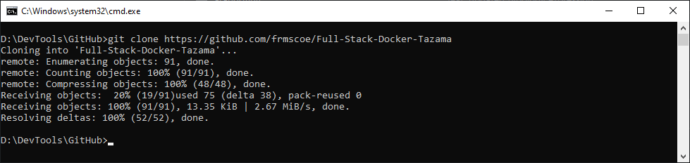

## 2. Update the Full-Stack-Docker-Tazama Configuration Files

### ./.env

First, we want to create the basic environment variables to guide the Docker Compose installation.

Navigate to the Full-Stack-Docker-Tazama folder and launch VS Code:

**Output:**


In VS Code, open the .env file in the Full-Stack-Docker-Tazama folder and update the `.env` file as follows:

 - (Optional) If your GitHub Personal Access Token had not been added as a Windows Environment Variable, you would need to specify the token at the top of the file next to the GH_TOKEN key. If you had specified the GH_TOKEN as an environment variable, you can leave the `${GH_TOKEN}` shell variable in place to retrieve it automatically.
 - (Optional) If you prefer an alternative port for the Transaction Monitoring Service API, you can update the `TMS_PORT` environment variable.

The current unaltered `.env` file will look as follows:

```javascript
# Authentication
GH_TOKEN=${GH_TOKEN}

# Branches
TMS_BRANCH=main
CRSP_BRANCH=main
TP_BRANCH=main
TADP_BRANCH=main
RULE_901_BRANCH=main

# Ports
TMS_PORT=5000

# TLS
NODE_TLS_REJECT_UNAUTHORIZED='0'
```

### ./env/rule*.env

Using the `rule.env` file as a template, we want to create a separate rule.env file for each private rule processor. In VS Code, navigate to the `Full-Stack-Docker-Tazama/env` folder and open the `rule.env` file. In each separate `rule.env` file, update the following environment variables to match the rule number, and then save the file with that rule number in the filename:

```javascript
FUNCTION_NAME="rule-999-rel-1-0-0"
RULE_NAME="999"
```

(You can ignore the `PRODUCER_STREAM` and `CONSUMER_STREAM` environment variables further down.)

Filename: `rule999.env`

Setting up individual `rule.env` files is rather tedious and instead you can copy the `rulexxx.env` files from the following location into the `Full-Stack-Docker-Tazama/env` to save some time:

<https://github.com/frmscoe/docs/blob/main/files/full-stack-docker-tazama/rulexxx.zip>

Download the rulexxx.zip file and then unzip the contents into your local `Full-Stack-Docker-Tazama/env` folder.

### ./docker-compose.yaml

For each private rule processor, we want to create its own set of configuration parameters in the `docker-compose.yaml` file. In VS Code, open the `docker-compose.yaml` file located in the `Full-Stack-Docker-Tazama` folder. Find the `# Rule 901` section in the file. 

For each private rule processor, create a copy of the `# Rule 901` environment variable block and replace the references to rule 901 with the intended rule number, e.g. for a rule 999, three replacements are made as follows:

```yaml
  # Rule 999
  rule-999:
    build:
      context: ..\rule-executer-999
      args:
        - GH_TOKEN
    env_file:
      - env/rule.env
      - .env
    restart: always
    depends_on:
      - redis
      - arango
```

Once again, copy-pasting and string-replacing can be rather tedious, and you are welcome to just download this pre-prepared `docker-compose.yaml` file into your `Full-Stack-Docker-Tazama` folder from:

<https://github.com/frmscoe/docs/blob/main/files/full-stack-docker-tazama/docker-compose.yaml>

[Top](#introduction)

## 3. Deploy the Core Services

Tazama core services provides the foundational infrastructure components for the system and includes the ArangoDB, NATS and redis services: ArangoDB provides the database infrastructure, NATS provides the pub/sub functionality and redis provides for fast in-memory processor data caching.

We deploy these services first and separately so that we can access the database to configure Tazama before continuing with the rest of the installation tasks.

First, start the Docker Desktop for Windows application.

With Docker Desktop running: from your Windows Command Prompt and from inside the `Full-Stack-Docker-Tazama` folder, execute the following command:

```
docker compose up -d arango redis nats
```

**Output:**

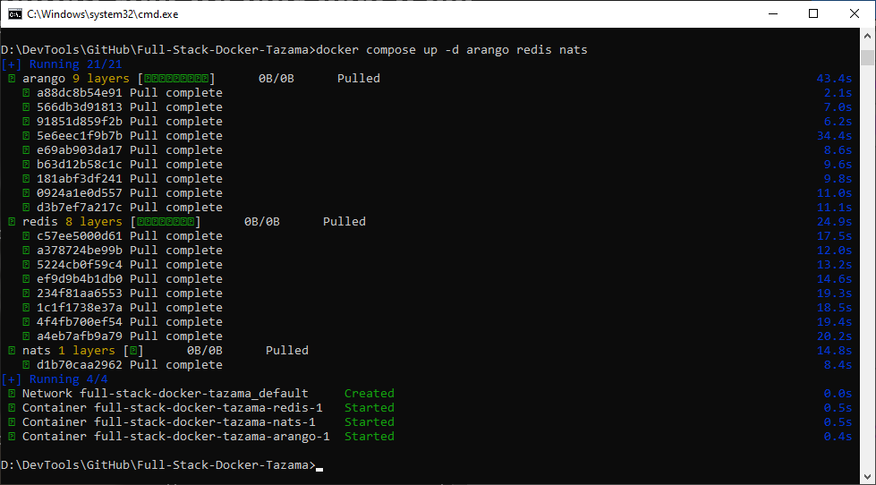

You'll be able to access the web interfaces for the deployed components through their respective TCP/IP ports on your local machine as defined in the `docker-compose.yaml` file.

 - ArangoDB: <http://localhost:18529>
 - NATS: <http://localhost:18222>

If your machine is open to your local area network, you will also be able to access these services from other computers on your network via your local machine's IP address.

[Top](#introduction)

## 4. Configure Tazama

Tazama is configured by loading the network map, rules and typology configurations required to evaluate a transaction via the ArangoDB API. As with the rules themselves, the configuration information is hidden in a private repository. If you are a member of the Tazama Organization on GitHub, you'll be able to clone this repository onto your local machine with the following command:

Change the current folder back to your root source code folder:
```
cd ..
```

Clone the `tms-configuration` repository:

```
git clone https://github.com/frmscoe/tms-configuration -b main
```

In addition to cloning the configuration repository, we also need to clone the Tazama `Postman` repository so that we can utilize the Postman environment file that is hosted there:

```
git clone https://github.com/frmscoe/postman -b main
```

**Output:**

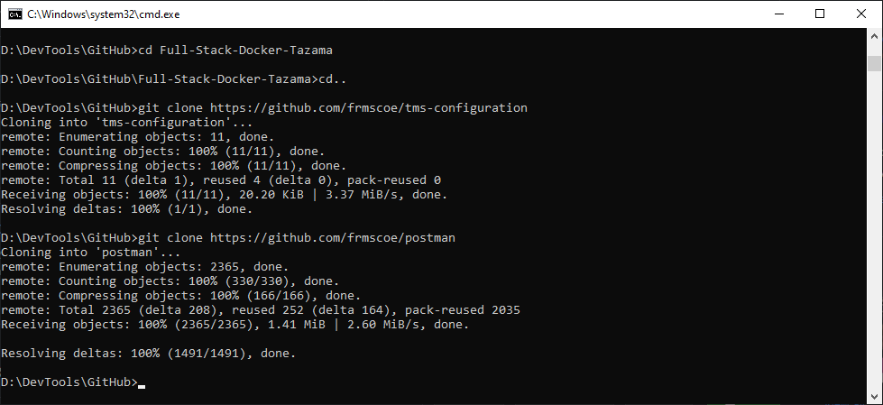

Now that these two repositories are cloned, we can perform the following Newman command to load the configuration into the ArangoDB databases and collections:

```
newman run collection-file -e environment-file --timeout-request 10200
```

 - The `collection-file` is the full path to the location on your local machine where the `tms-configuration\default\tms-config.postman_collection.json` file is located.
 - The `environment-file` is the full path to the location on your local machine where the `postman\environments\Tazama-Docker-Compose-LOCAL.postman_environment.json` file is located.
 - If the path contains spaces, wrap the string in double-quotes.

**Output:**

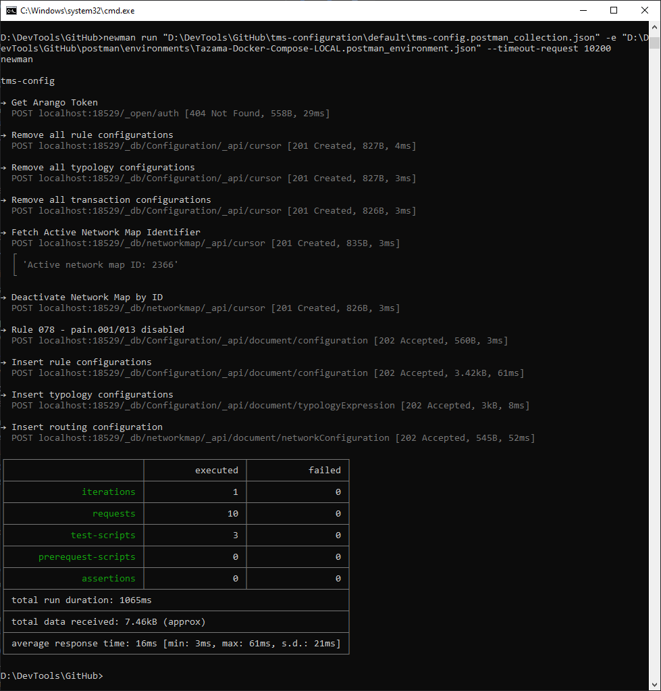

[Top](#introduction)

## 5. Deploy core processors

Now that the system is configured, we can deploy our core processors. The main reason the configuration needs to preceed the deployment of the processors is that the processors read the network map at startup to set up the NATS pub/sub routes for the evaluation flow. If the core processors were deployed first, they would have to be restarted once the configuration was eventually uploaded.

Navigate back to the `full-stack-docker-tazama` folder:
```
cd Full-Stack-Docker-Tazama
```

Execute the following command to deploy the core processors:

```
docker compose up -d tms crsp tp tadp
```

This command will install:

 - The Transaction Monitoring Service API at <https://localhost:5000>, where messages will be sent for evaluation
 - The Event Director that will handle message routing based on the network map
 - The Typology Processor that will summarize rule results into scenarios according to individual typology configurations
 - The Transaction Aggregation and Decisioning Processor that will wrap up the evaluation of a transaction and publish any alerts for breached typologies

You can test that the TMS API was successfully deployed with the following command from the Command Prompt:

```
curl localhost:5000
```

**Output:**

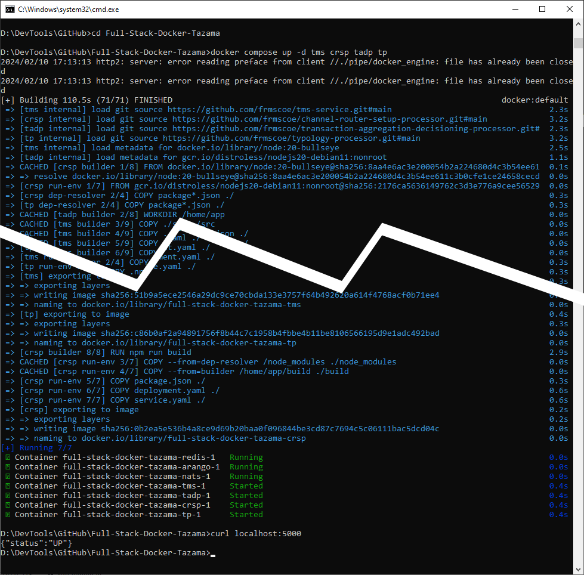

[Top](#introduction)

## 6. Private Rule Processors

Now for the final deployment step.

### Background

Individual rule processors are wrapped in a rule executer shell that handles common functions for all rule processors in a common way. While this makes rule processors easier to maintain by abstracting common code into the rule executer and leaving unique code in the rule processor, it does make the deployment process a little more complicated and onerous. In a production setting we would automate the deployment of the rule processors via Helm charts, but for our Docker Compose deployment, the process is a little more manual.

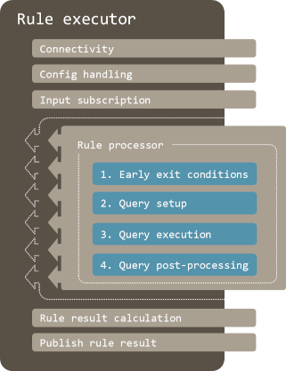

Each rule processor must be wrapped in its own rule-executer. The rule executer source code is centralized in the public `rule-executer` repository, and each rule processor's unique source code is hosted in its own private repository.

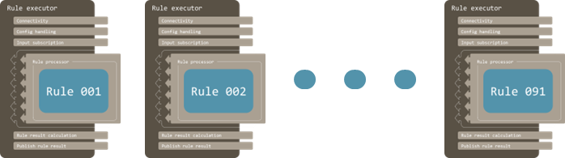

### Clone the Rule Executer Repository

First, we have to clone the rule-executer itself. From your source code folder, in a Command Prompt, execute:

```
git clone https://github.com/frmscoe/rule-executer -b main
```

By default, the rule executer is configured to build rule 901, the public sample rule processor, but we want it to build each private rule processor instead.

First we need to prepare the rule-executer with the following updates:

#### 1. Update the .npmrc file

**NOTE: Only perform this step if you do not have a `GH_TOKEN` environment variable in Windows**

Navigate to the rule-executer folder and start VS Code from there.

**Output:**

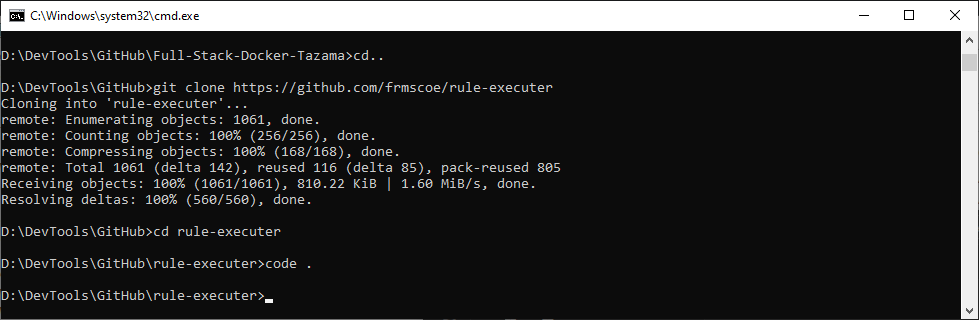

If your GitHub Personal Access Token had not been added as a Windows Environment Variable, you would need to specify the token in the `.npmrc` file. If you had specified the GH_TOKEN as an environment variable, you can leave the `${GH_TOKEN}` shell variable in place to retrieve it automatically.

To update the `GH_TOKEN`: in VS Code, open the `.npmrc` file in the rule-executer root folder and replace the `${GH_TOKEN}` string with your GitHub Personal Access Token.

**Output:**

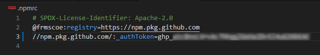

#### 2. Delete the package-lock.json file

In your windows Command Prompt, while in the `rule-executer` root folder, delete the `package-lock.json` file from the `rule-executer` root folder:

```
del package-lock.json
```

### Set Up the Rule Executer for a Specific Rule

Once the rule executer is updated, we can create a rule executer for each of the rule processors. We'll first walk through the process to prepare the rule-executer to deploy a single processor, such as Rule 001, but then we'll show you how you can use a DOS batch file to automate the whole process instead of deploying each rule processor one at a time.

To skip ahead to the batch process, click: [batch process alternative](#batch-process-alternative)

#### 1. Copy the rule-executer folder

Navigate one folder up to your source code folder and copy the entire `rule-executer` folder to a new folder called `rule-executer-001`:

```
xcopy rule-executer rule-executer-001 /E /I /H
```

**Output:**

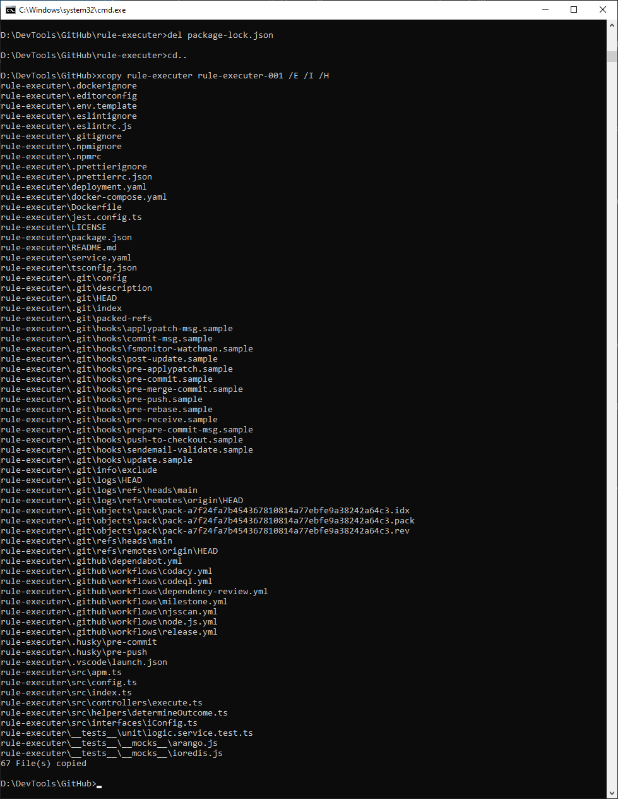

#### 2. Update the package.json file

Navigate to the new `rule-executer-001` folder and start VS Code from there.

In VS Code, open the `package.json` file and update the `dependencies.rule` value from `"npm:@frmscoe/rule-901@latest"` to `"npm:@frmscoe/rule-001@latest"`.

**Output:**

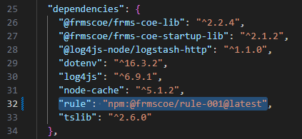

#### 3. Update the Dockerfile

In VS Code, open the `Dockerfile` file and update the `RULE_NAME` environment variable value from `"901"` to `"001"`.

**Output:**

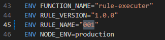

#### 4. Install software dependencies

Back in your Windows Command Prompt, from your `rule-executor-001` folder, execute the following command to install all the software dependencies for the processor:

```
npm install
```

**Output:**

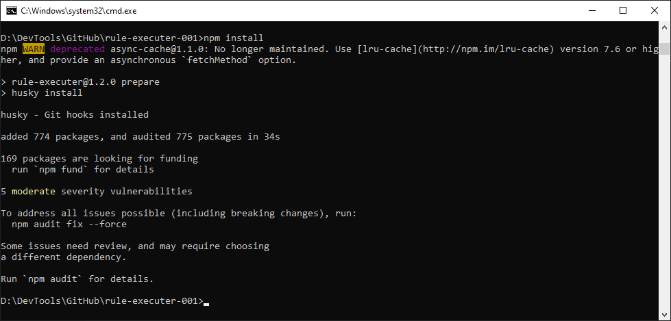

#### 5. Deploy the processor

And, finally, we can deploy the processor into Docker! Navigate back to the `Full-Stack-Docker-Tazama` folder, and run the command:

```
docker compose up -d rule-001
```

**Output:**

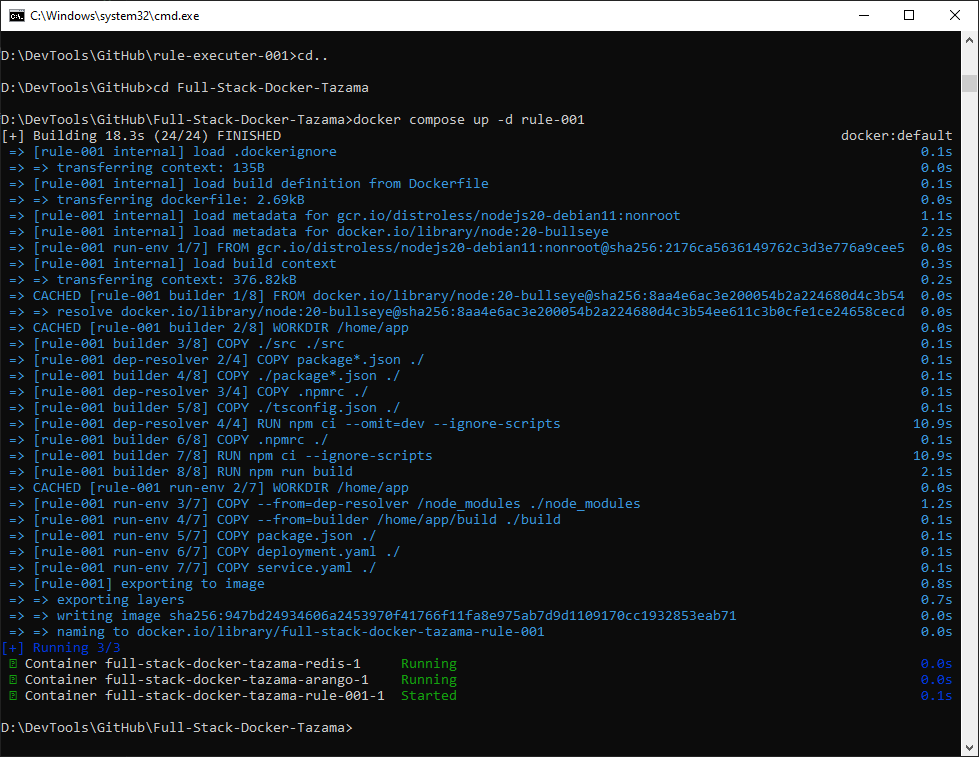

#### 6. Repeat steps 1 to 5 for the other rule processors as well

The steps 1 to 5 above must be performed for each private rule processor to deploy them all.

## Batch process alternative

Instead of deploying all the private rule processors by hand, you can run the one of the following batch scripts to automate the steps above for all the rule processors.

### Microsoft Windows batch file

For Windows download the Windows batch file `deploy-all-tazama-rule-processors.bat` file into your source code root folder from:

<https://github.com/frmscoe/docs/blob/main/files/full-stack-docker-tazama/deploy-all-tazama-rule-processors.bat>

From a Command Prompt, from the source code root folder, execute the batch file as follows:

```
deploy-all-tazama-rule-processors.bat "source-code-root-folder-path"
```

 - The `source-code-root-folder-path` is the full path to the location on your local machine where you have been cloning the GitHub repositories from.
 - For example, the source code root folder path I have been using the compiled this guide is `D:\DevTools\GitHub`:

 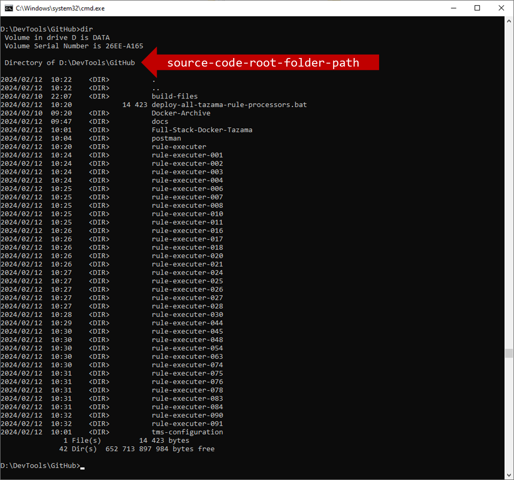

### MacOS shell script

For MacOS download the MacOS batch file into your source code root folder from [MacOS-deploy-all-tazama-rule-processors](../files/full-stack-docker-tazama/macos-deploy-all-tazama-rule-processors.sh).

> **Note:** The source code root folder is the folder where you have been cloning the GitHub repositories from.

From a Command Prompt, from the source code root folder, execute the following command:

```shell
# Grant execution rights to the script by running the following command in your terminal:
chmod +x ./deploy-rule-processors.sh​

# You can run the script with:
./deploy-rule-processors.sh

# Then, follow the prompts in the terminal to complete the deployment process.
```

### Execution

Depending on the performance of your local machine, this process may take quite a while. The batch process is divided into three parts:

1. Creating and modifying all the rule-executor-xxx folders from the `rule-executer` folder
2. Running `npm install` from within each rule-executer-xxx folder
3. Installing each rule processor into the Full-Stack-Docker-Tazama container in Docker

You will be prompted to "Press any key to continue..." between each of the stages.

**Output:**

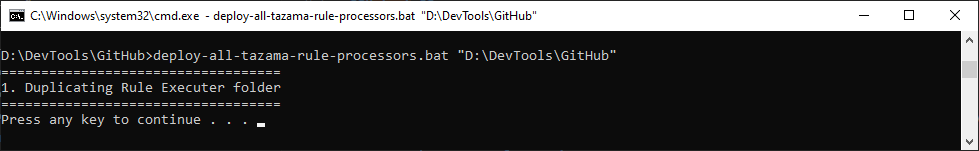

## Testing the End-to-End Deployment

Now, if everything went according to plan, you'll be able to submit a test transaction to the Transaction Monitoring Service API and then be able to see the result of a complete end-to-end evaluation in the database. We can run the following Postman test via Newman to see if our deployment was successful:

```
newman run collection-file -e environment-file --timeout-request 10200 --delay-request 500
```

 - The `collection-file` is the full path to the location on your local machine where the `tms-configuration\default\tms-config-test.postman_collection.json` file is located.
 - The `environment-file` is the full path to the location on your local machine where the `postman\environments\Tazama-Docker-Compose-LOCAL.postman_environment.json` file is located.
 - If the path contains spaces, wrap the string in double-quotes.
 - We add the `--delay-request` option to delay each individual test by 500 milliseconds to give them evaluation time to complete before we look for the result in the database.

**Output:**

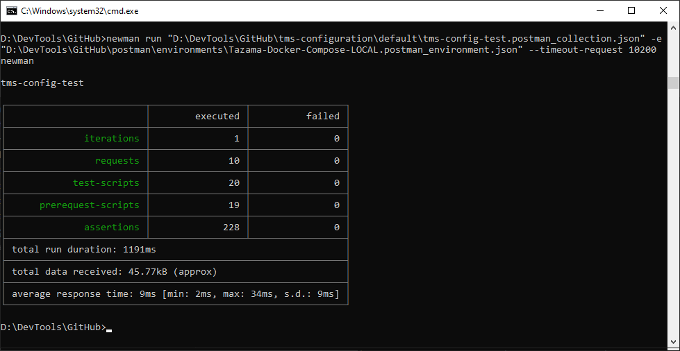
