### KeyCloak Operator Guide for Tazama

Official documentation found [here](https://www.keycloak.org/docs/23.0.6/server_admin/index.html)
#### Logging into Admin Console

An admin account would have been created with KeyCloak deployment and management console is reached at the following endpoint:
`{keycloak_url}/admin/master/console`

#### Creating a Realm
First we need to create a Realm for Tazama to house our management of users and credentials. Realm creation is available at the KeyCloak web admin panel. Note a default master realm will exist but we will want a realm for our custom entity.

<details open>
    <summary> 
      Navigate Realm
    </summary>

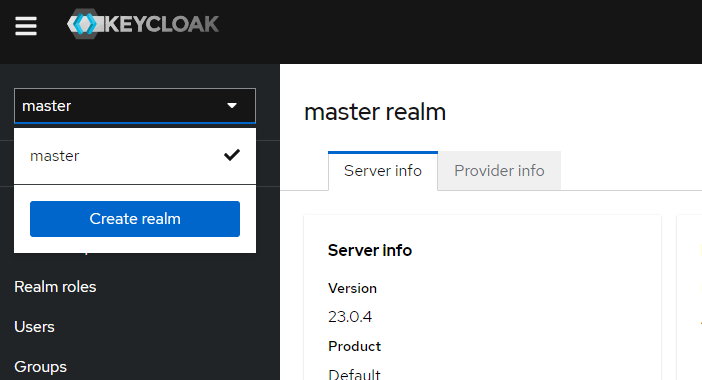

</details>

<details open>
    <summary> 
      Create Realm
    </summary>

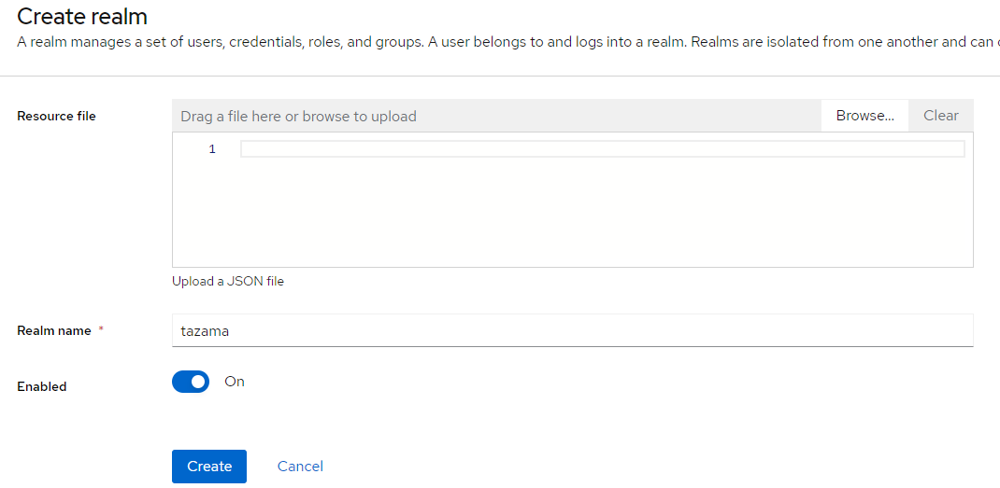
</details>

---

#### Creating a Client
We want to create a client to be able to authenticate and authorize using KeyCloak. In our scenario we are using the `auth lib` in Tazama. So we want to create a client for this purpose.
To create a client first ensure we are on the right realm on the dropdown top left then navigate to the create client button under Clients.

<details open>
    <summary> 
      Navigate Client
    </summary>

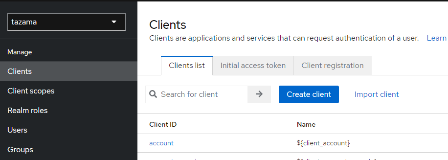

Then you can create the client 
</details>

<details open>
    <summary> 
      Create Client
    </summary>

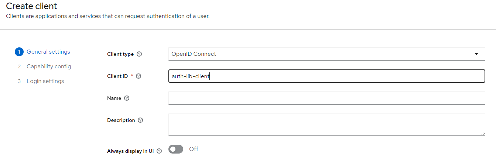

And enable authentication and authorization
</details>


<details open>
    <summary> 
      Client Capabilities
    </summary>

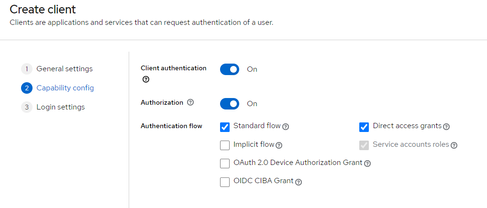

Now that you have created a client just need to navigate to the client-secret as these details are needed by the auth-lib to function.
</details>

<details open>
    <summary> 
      Client Id and Secret
    </summary>

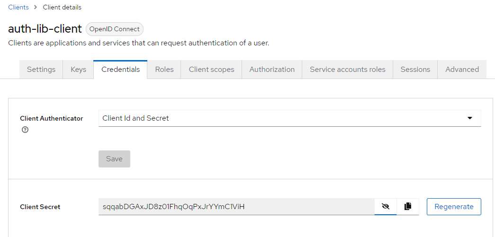

We have now created the following variables for auth-lib.

| Variable  | Value               | 
|-----------|---------------------|
| **client_id**  | auth-lib-client    | 
| **client_secret** | sqqabDGAxJD8z01FhqOqPxJrYYmC1ViH    | 

</details>

---

#### Creating roles 
Roles are permissions to define varying scope of access for users (also clients) in a KeyCloak realm. Roles can either be created on the realm level or in the individual client level. For this use case we will only be using realm roles.
To create a realm role navigate to Realm roles and click on Create role button.

<details open>
    <summary> 
      Navigate Realm
    </summary>

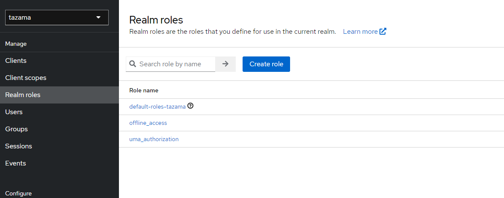

Here we can create many roles for different permissions we will use in `auth lib` 
Let's create a role for `POST_V1_EVALUATE_ISO20022_PAIN_001_001_11`
</details>

<details open>
    <summary> 
      Create Realm Role
    </summary>

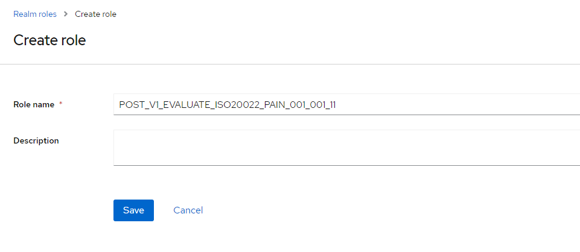

We can repeat this process for `POST_V1_EVALUATE_ISO20022_PAIN_013_001_09`, `POST_V1_EVALUATE_ISO20022_PACS_008_001_10` and `POST_V1_EVALUATE_ISO20022_PACS_002_001_12`
</details>


---

#### Creating groups
Now that we have a roles defined we can create a group with roles assigned to them. To create a group navigate to Groups and click on create group button.

<details open>
    <summary> 
      Navigate Group
    </summary>

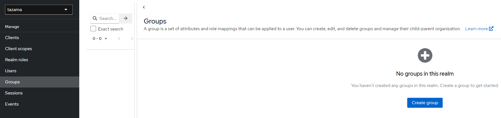

Let's create a group called tazama-tms to assign the role(s) we previously created to the tazama-tms group.
</details>

<details open>
    <summary> 
      Create Group
    </summary>

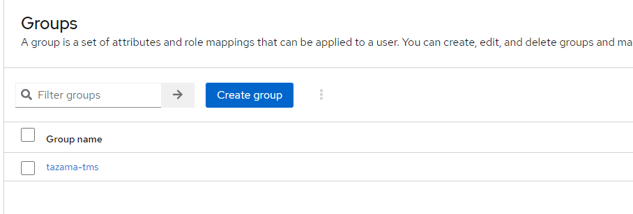

Then click on the group and navigate to Role mappings to assign the role(s)

</details>

<details open>
    <summary> 
      Navigate Group Role Mappings
    </summary>

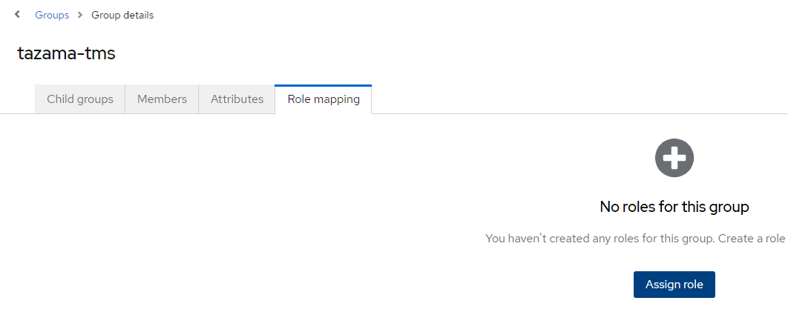
</details>

<details open>
    <summary> 
      Assign Group Role Mappings
    </summary>

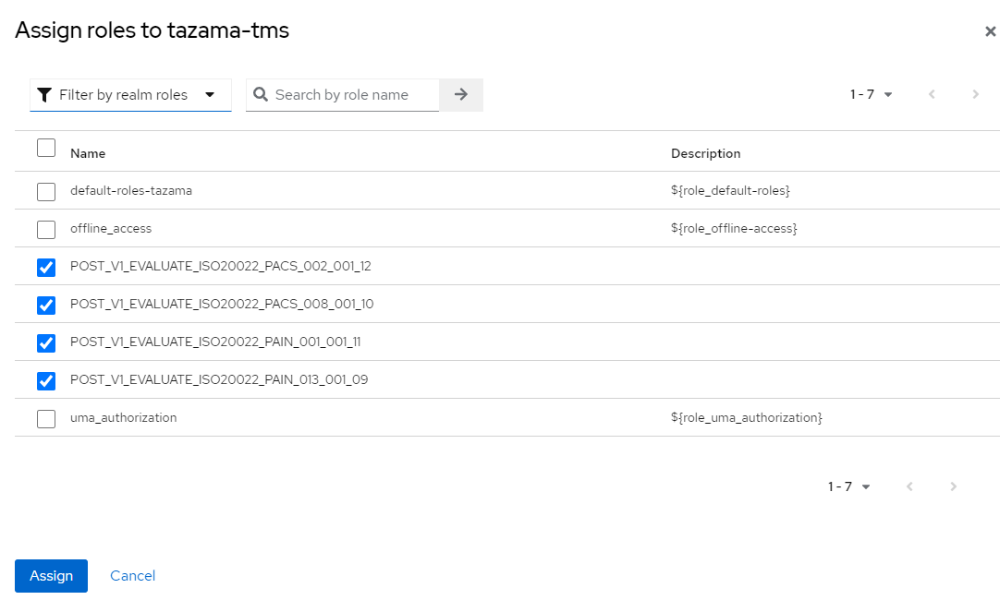

We now have a tazama-tms group but no users. Let's create some users next.
</details>

---

#### Creating users
Users are individuals that will authenticate through KeyCloak to obtain permissions to use Tazama.
To create a user in KeyCloak navigate to the Users section and click on add user button.

<details open>
    <summary> 
      Navigate Users
    </summary>

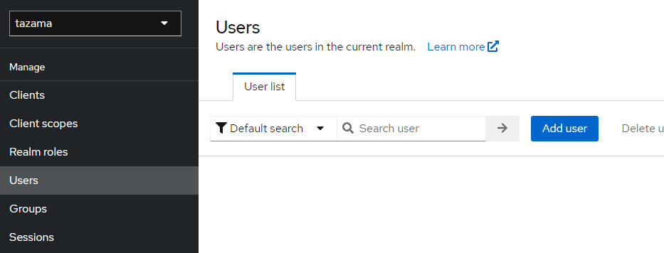

Then let's fill in the user details and additionally let the user join the tazama-tms group.
</details>

<details open>
    <summary> 
      Create User and Join Group
    </summary>

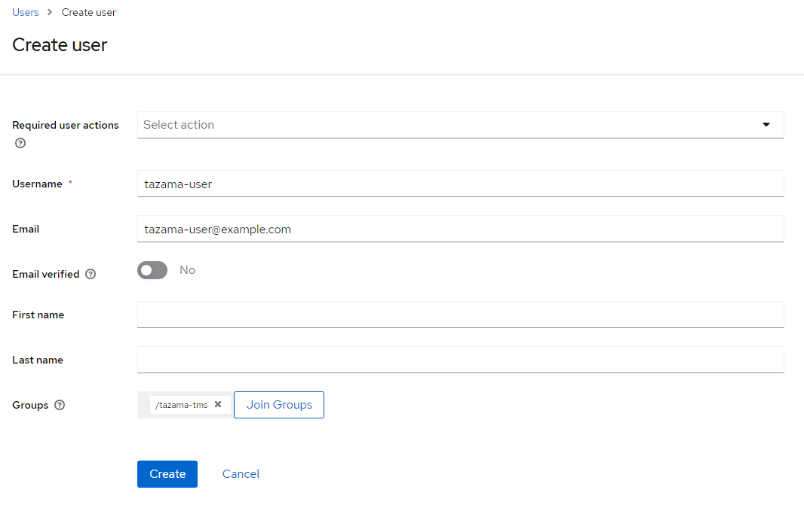

While the user is created a password was not yet set. So let's create a password for the newly created user under Credentials
</details>

<details open>
    <summary> 
      Set User Password
    </summary>

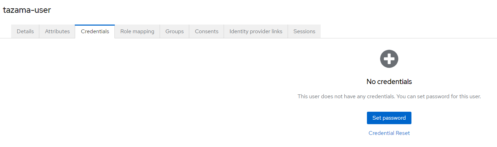
---
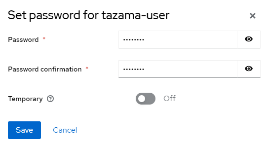

Congratulations. You now have a user with the appropriate roles to interact with Tazama TMS.

If you do not want the user to interact to the UI components of KeyCloak this would be the end.
</details>

<details>
    <summary>
        <strong>Additionally</strong>
    </summary> 
    If the user is expected to change their password the temporary password option should stay toggled at password creation or on the client page you can set required actions to `update password` and `verify email`.
    This will require the user to login to the KeyCloak account portal. The link is found by the Clients sidebar for the account entries home URL.
    <details>
        <summary> 
        Account Portal
        </summary>

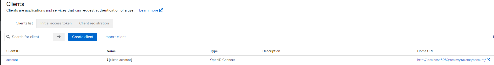

   </details>
</details>
---

#### Deleting users
Deleting users are simple.
We navigate to the Users section

<details open>
    <summary> 
      Navigate Users
    </summary>

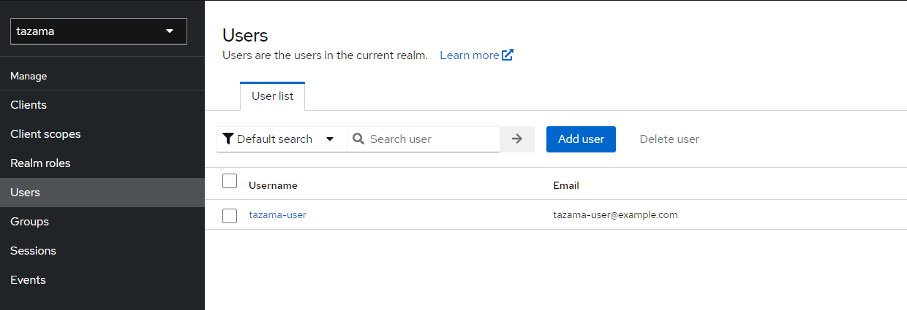

We check the user(s) we want to delete and press the delete user button.
</details>

<details open>
    <summary> 
      Deleting a User
    </summary>

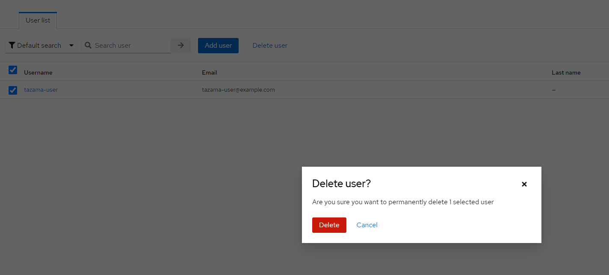

The user is deleted.
</details>

---

#### Local Deployment
<details>
    <summary>
        <strong>Docker Compose</strong>
    </summary> 
    <details open>
        <summary> 
        docker-compose.yaml
        </summary>

```yaml
services:
    postgres:
        image: postgres:16.2
        volumes:
        - postgres_data:/var/lib/postgresql/data
        environment:
        POSTGRES_DB: ${POSTGRES_DB}
        POSTGRES_USER: ${POSTGRES_USER}
        POSTGRES_PASSWORD: ${POSTGRES_PASSWORD}
        networks:
        - kc_net

    keycloak:
        image: quay.io/keycloak/keycloak:23.0.6
        command: start
        environment:
        KC_HOSTNAME: localhost                  # local use only 
        KC_HOSTNAME_STRICT_BACKCHANNEL: false   # local use only
        KC_HTTP_ENABLED: true                   # local use only
        KC_HOSTNAME_STRICT_HTTPS: false         # local use only
        KC_HOSTNAME_PORT: 8080
        KC_HEALTH_ENABLED: true
        KEYCLOAK_ADMIN: ${KEYCLOAK_ADMIN}
        KEYCLOAK_ADMIN_PASSWORD: ${KEYCLOAK_ADMIN_PASSWORD}
        KC_DB: postgres
        KC_DB_URL: jdbc:postgresql://postgres/${POSTGRES_DB}
        KC_DB_USERNAME: ${POSTGRES_USER}
        KC_DB_PASSWORD: ${POSTGRES_PASSWORD}
        ports:
        - 8080:8080
        restart: always
        depends_on:
        - postgres
        networks:
        - kc_net

volumes:
    postgres_data:
        driver: local

networks:
    kc_net:
        driver: bridge
```
</details>
<details open>
        <summary> 
        .env
        </summary>

```yaml
POSTGRES_DB=keycloak_db
POSTGRES_USER=keycloak_db_user
POSTGRES_PASSWORD=keycloak_db_user_password
KEYCLOAK_ADMIN=admin
KEYCLOAK_ADMIN_PASSWORD=admin
```
   </details>
</details>


