<!-- SPDX-License-Identifier: Apache-2.0 -->

# KeyCloak Guide for Tazama <!-- omit in toc -->

- [1. Keycloak Integration with Tazama Ecosystem](#1-keycloak-integration-with-tazama-ecosystem)
- [2. Auth-Lib-Provider-Keycloak](#2-auth-lib-provider-keycloak)
  - [2.1. Overview](#21-overview)
  - [2.2. Installation of Auth-Lib-Provider-Keycloak](#22-installation-of-auth-lib-provider-keycloak)
  - [2.3. Usage of Auth-Lib-Provider-Keycloak](#23-usage-of-auth-lib-provider-keycloak)
    - [2.3.1. Environment variables](#231-environment-variables)
- [3. KeyCloak Operator Guide for Tazama](#3-keycloak-operator-guide-for-tazama)
  - [3.1. Logging into Admin Console](#31-logging-into-admin-console)
    - [3.1.1 Keycloak admin user and password](#311-keycloak-admin-user-and-password)
  - [3.2. Keycloak Realm Management](#32-keycloak-realm-management)
    - [3.2.1. Creating a Realm](#321-creating-a-realm)
    - [3.2.2. Switching Realm](#322-switching-realm)
  - [3.3. Keycloak Client Management](#33-keycloak-client-management)
    - [3.3.1. Creating a Client](#331-creating-a-client)
    - [3.3.2. Multi-Tenant Client Settings](#332-multi-tenant-client-settings)
  - [](#)
  - [3.4. Creating Roles (Permissions)](#34-creating-roles-permissions)
  - [3.5. Creating Groups](#35-creating-groups)
    - [3.5.1. Create Tenants as Child Groups](#351-create-tenants-as-child-groups)
  - [3.6. Creating Users](#36-creating-users)
    - [3.6.1. Creating Tenant Users](#361-creating-tenant-users)
  - [](#-1)
    - [3.6.2. Creating Operator Users](#362-creating-operator-users)
    - [3.6.3. Deleting users](#363-deleting-users)
  - [4. Local Deployment](#4-local-deployment)


# 1. Keycloak Integration with Tazama Ecosystem

KeyCloak is the default open source identity and access management solution that works as part of the Tazama authentication architecture:

```
┌─────────────────┐    ┌─────────────────┐    ┌─────────────────┐
│   Client App    │──▶│  Auth-Service   │───▶│    KeyCloak     │
│                 │    │ (using Keycloak │    │   (Identity     │
│                 │    │  provider)      │    │   Provider)     │
└─────────────────┘    └─────────────────┘    └─────────────────┘
```

1. **Client applications** (TMS API, other Tazama services) send authentication requests
2. **Auth-service** validates these requests using this KeyCloak provider
3. **KeyCloak** performs the actual authentication and returns tokens
4. **Auth-service** processes the response and provides tokens back to clients

The auth-service container runs independently and is configured via the `.env` file. Other Tazama services then call the auth-service endpoint (typically `http://auth-service:3020`) to validate tokens and check permissions.

Official Keycloak documentation found [here](https://www.keycloak.org/docs/23.0.6/server_admin/index.html)

---

# 2. Auth-Lib-Provider-Keycloak

## 2.1. Overview

An auth provider is required to bridge Tazama Authentication with the keycloak backend. The Keycloak auth provider is reliant on the [auth-lib](https://github.com/tazama-lf/auth-lib) package to function.

## 2.2. Installation of Auth-Lib-Provider-Keycloak

A personal access token is required to install Auth-Lib-Provider-Keycloak repository. For more information read the following.
https://docs.github.com/en/packages/learn-github-packages/about-permissions-for-github-packages#about-scopes-and-permissions-for-package-registries

Make sure you've got an .npmrc file in the root of your project, specifying where the @tazama-lf repo is. 
```
@tazama-lf:registry=https://npm.pkg.github.com
```

Thereafter you can run 
  > npm install @tazama-lf/auth-lib 
  > npm install @tazama-lf/auth-lib-provider-keycloak 

## 2.3. Usage of Auth-Lib-Provider-Keycloak

Ensure whichever application consumes this auth provider alongside auth-lib set the environmental variables unique to this provider as defined below. These variables are typically configured in the `.env` file of your Tazama deployment or in the environment configuration of your auth-service container.

### 2.3.1. Environment variables

| Variable | Purpose | Example | Tazama Default Configuration
| ------ | ------ | ------ | ------ |
| `AUTH_URL` | Base URL where KeyCloak is hosted | `https://keycloak.example.com:8080` | `http://keycloak:8080` (internal Docker network) |
| `KEYCLOAK_REALM` | KeyCloak Realm for Tazama | `tazama` | `tazama` |
| `CLIENT_ID` | KeyCloak defined client for auth-lib | `auth-lib-client` | `auth-lib-client` |
| `CLIENT_SECRET` | The secret of the KeyCloak client | `someClientGeneratedSecret123` | Generated during client creation (see security note below) |

**Complete .env configuration example for Tazama auth-service**

If you have installed a local deployment of Tazama using the `full-stack-docker-tazama` repo (https://github.com/tazama-lf/Full-Stack-Docker-Tazama), then the auth-services `env` file can be found in the env sub-folder in the FULL-STACK-DOCKER-TAZAMA folder.

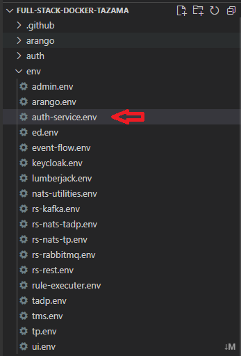

This example shows the complete `.env` file used to deploy the auth-service component in the Tazama ecosystem. The auth-service acts as the authentication gateway that integrates with KeyCloak using this provider.

```bash
# SPDX-License-Identifier: Apache-2.0

# Service Configuration
FUNCTION_NAME=auth-service
NODE_ENV=dev
MAX_CPU=1

# Fastify Web Server Configuration
PORT=3020
HOST=0.0.0.0

# Auth Library Configuration
AUTH_PROVIDER=@tazama-lf/auth-lib-provider-keycloak
CERT_PATH_PRIVATE=private-key.pem
CERT_PATH_PUBLIC=public-key.pem

# KeyCloak Provider Configuration
AUTH_URL=http://keycloak.your-domain.com:8080
KEYCLOAK_REALM=tazama
CLIENT_SECRET=your-generated-client-secret-here
CLIENT_ID=your-client-id-here
KEYCLOAK_CLIENT_ID=your-client-id-here
KEYCLOAK_CLIENT_SECRET=your-generated-client-secret-here
```
**Deployment**
This `.env` file is used when deploying the auth-service container, which serves as the authentication endpoint that other Tazama services call to validate tokens and permissions. The auth-service uses this provider to communicate with your KeyCloak instance configured following the steps in this guide.

---

# 3. KeyCloak Operator Guide for Tazama

## 3.1. Logging into Admin Console

An admin account would have been created with KeyCloak deployment and management console is reached at the following endpoint:
`{keycloak_url}/admin/master/console`

### 3.1.1 Keycloak admin user and password

If you have installed a local deployment of Tazama using the `full-stack-docker-tazama` repo (https://github.com/tazama-lf/Full-Stack-Docker-Tazama), then the default Keycloak admin user and password can be found in the keycloak.env file:

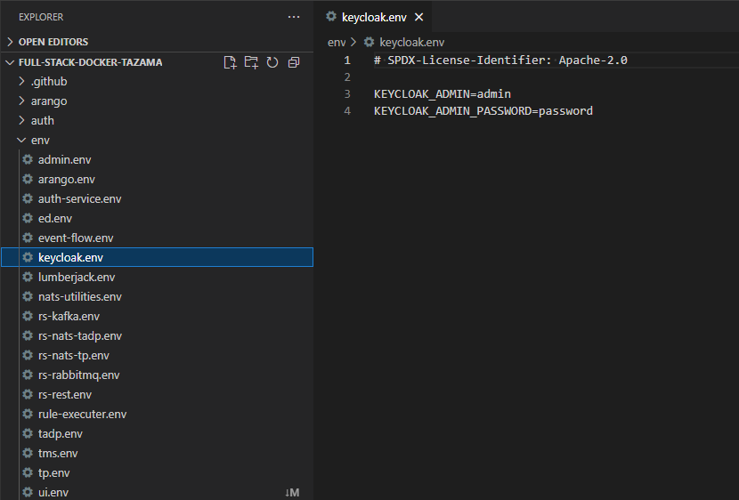

## 3.2. Keycloak Realm Management

By default Keycloak has a master realm.  All Tazama identity and access management must be set up and maintained in a `Tazama` realm.

### 3.2.1. Creating a Realm

If the Tazama Realm does not already exist, create a Realm for Tazama to house the management of users and credentials. Realm creation is available at the KeyCloak web admin panel. Note a default master realm will exist but we want a realm for our custom entity.

<details open>
    <summary> 
      Navigate Realm
    </summary>

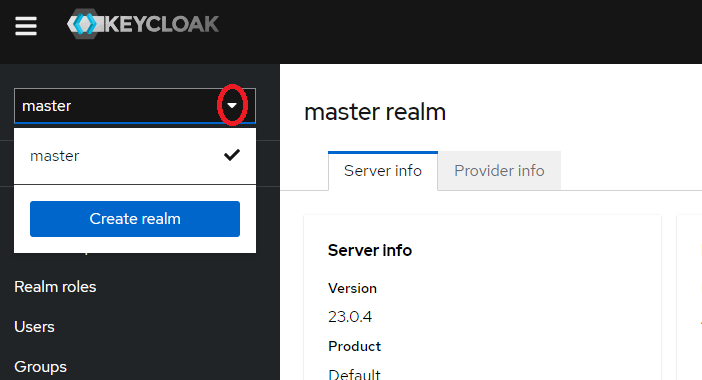

</details>

<details open>
    <summary> 
      Create Realm
    </summary>

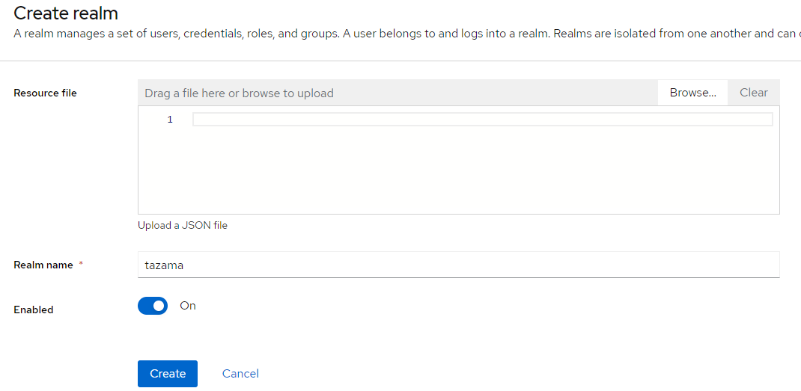
</details>

### 3.2.2. Switching Realm

If the Tazama Realm already exists, it will be available in the Realm list in the top left of the KeyCloak web admin panel. To switch to the Tazama Realm, select it from the list of available realms. 

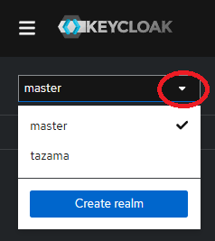

---

## 3.3. Keycloak Client Management

Tazama requires an `auth-lib-client` Client to be able to authenticate and authorize using KeyCloak via `auth-lib`.

### 3.3.1. Creating a Client
We want to create a client to be able to authenticate and authorize using KeyCloak. In our scenario we are using the `auth lib` in Tazama. So we want to create a client for this purpose.
To create a client first ensure we are on the right realm on the dropdown top left (See [3.2.2. Switching Realm](#322-switching-realm)) then navigate to the `create client` button under the `Clients` menu option on the left.

<details open>
    <summary> 
      Navigate to Clients
    </summary>

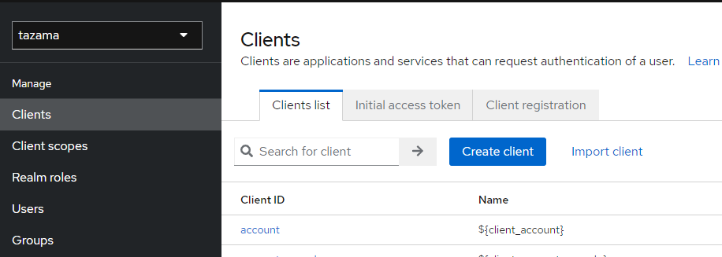

Click on the `Create client` button
</details>

<details open>
    <summary> 
      Create Client - General Settings
    </summary>

Capture the Client ID as `auth-lib-client`
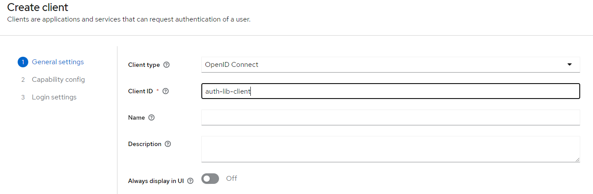

Click on the `next` button

</details>

<details open>
    <summary> 
      Create Client - Capability Config
    </summary>

Enable the options for `Client authentication` and `Authorisation`

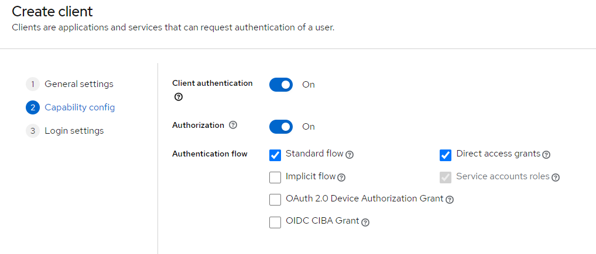

Click on the `next` button

<details open>
    <summary> 
      Create Client - Login Settings
    </summary>

Click on the `save` button without adding any detail to the login settings page

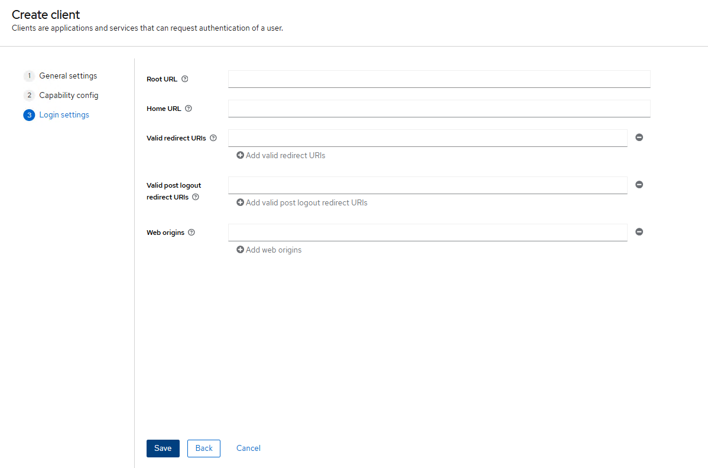
</details>
After creating a client, navigate to the Credentials page as Client Id and Secret are needed by the auth-lib to function.

<details open>
    <summary> 
      Client Credentials
    </summary>

Click on the `regenerate` button and then save
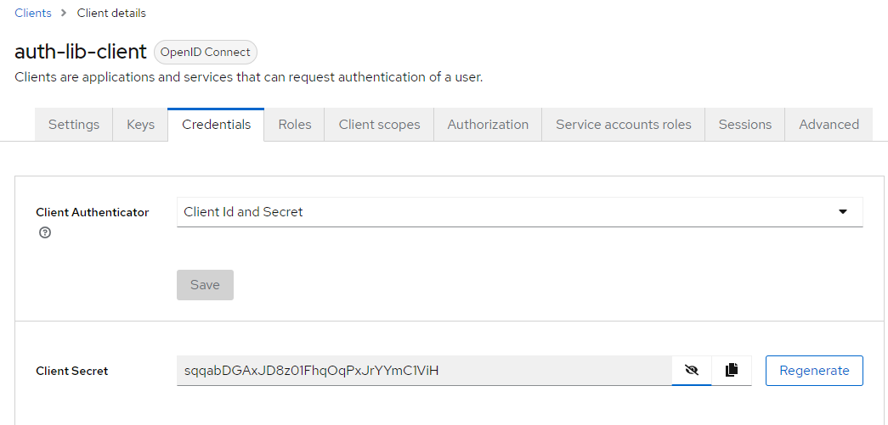

We have now created the following variables for auth-lib:

| Variable  | Value               | 
|-----------|---------------------|
| **client_id**  | auth-lib-client    | 
| **client_secret** | your-generated-client-secret-here    | 

</details>

### 3.3.2. Multi-Tenant Client Settings

To support multi-tenancy in Tazama, we need to configure Keycloak to include tenant information in the JWT tokens. This is achieved by creating a custom user attribute mapper that adds the TENANT_ID attribute to access tokens.

To enable multi-tenancy on the `auth-lib-client` created above, nagivate to the `auth-lib-client` in the client list via the `Clients` menu option on the left. 

<details open>
    <summary> 
      Navigate to auth-lib-client
    </summary>

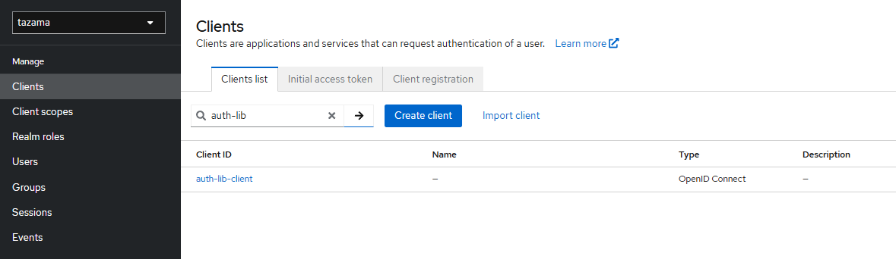

</details>

Click on the `auth-lib-client` in the list and navigate to the `Client scopes` page

<details open>
    <summary> 
      Client scopes
    </summary>

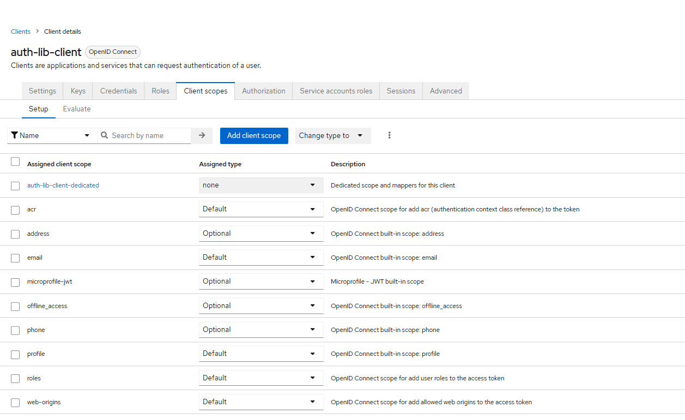

</details>

Click on `auth-lib-client-dedicated` assigned client scope to add the tenant_id user attribute

<details open>
    <summary> 
      Dedicated scopes - add mapper
    </summary>

Click on the `add mapper` button and select the `by configuration` option

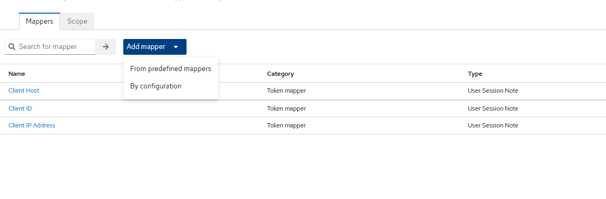

</details>

<details open>
    <summary> 
      Dedicated scopes - mapping option
    </summary>

Click on the `user attribute` option in the list of available mappings

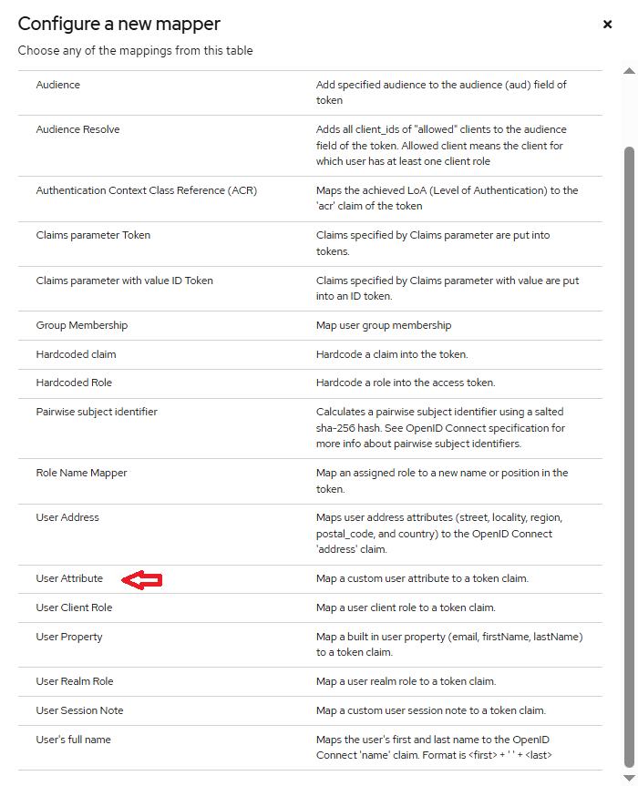

</details>


<details open>
    <summary> 
      Dedicated scopes - mapper details - user attribute configuration
    </summary>

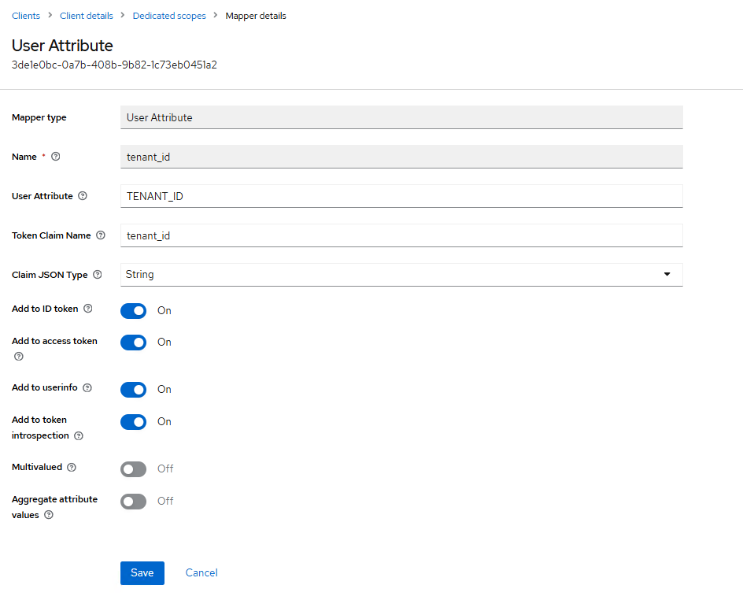

In the user attribute configuration capture the following:
1. **Mapper type**: Defaults to "User Attribute" 
2. **Name**: Set to "tenant_id" (this will be the claim name in the token)
3. **User Attribute**: Set to "TENANT_ID" (this should match the attribute name in user profiles)
4. **Token Claim Name**: Set to "tenant_id" (this is how it appears in the JWT)
5. **Claim JSON Type**: Select "String"
6. **Add to ID token**: Toggle "On" 
7. **Add to access token**: Toggle "On"
8. **Add to userinfo**: Toggle "On"
9.  **Add to token introspection**: Toggle "On"
10. **Multivalued**: Toggle "Off" (since tenant_id should be a single value)
11. **Aggregate attribute values**: Toggle "Off"

Click the `save` button

</details>
---

## 3.4. Creating Roles (Permissions)

Roles are permissions to define varying scope of access for users (also clients) in a KeyCloak realm. Roles can either be created on the realm level or in the individual client level. For this use case we will only be using realm roles.
To create a realm role navigate to Realm roles and click on Create role button.

<details open>
    <summary> 
      Navigate Realm
    </summary>

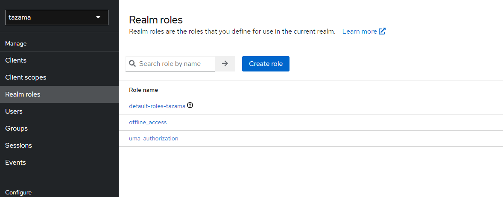

Here we can create many roles for different permissions we will use in `auth lib` 
Let's create a role for `POST_V1_EVALUATE_ISO20022_PAIN_001_001_11`
</details>

<details open>
    <summary> 
      Create Realm Role
    </summary>

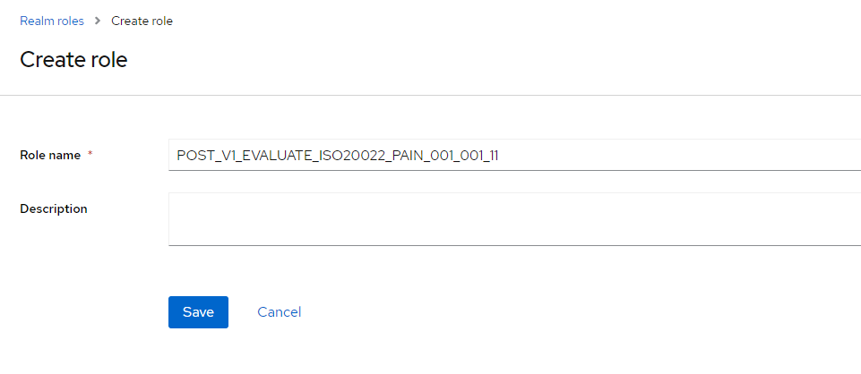

We can repeat this process for `POST_V1_EVALUATE_ISO20022_PAIN_013_001_09`, `POST_V1_EVALUATE_ISO20022_PACS_008_001_10` and `POST_V1_EVALUATE_ISO20022_PACS_002_001_12`
</details>

---

## 3.5. Creating Groups
Now that we have roles defined we can create a group with roles assigned to them. To create a group navigate to `Groups` and click on `create group` button.

<details open>
    <summary> 
      Navigate Group
    </summary>

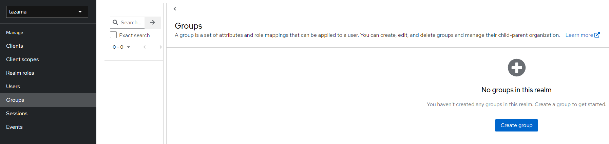

Let's create a group called tazama-tms to assign the role(s) we previously created to the tazama-tms group.
</details>

<details open>
    <summary> 
      Create Group
    </summary>

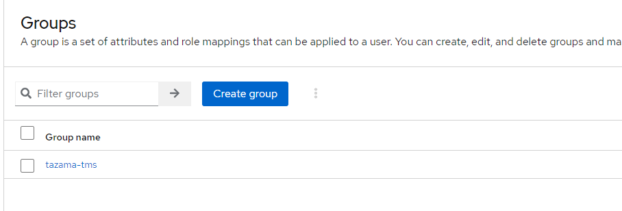

Then click on the group and navigate to Role mappings to assign the role(s)

</details>

<details open>
    <summary> 
      Navigate Group Role Mappings
    </summary>

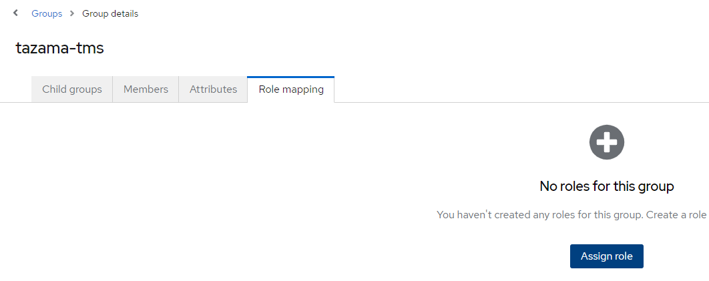
</details>

<details open>
    <summary> 
      Assign Group Role Mappings
    </summary>

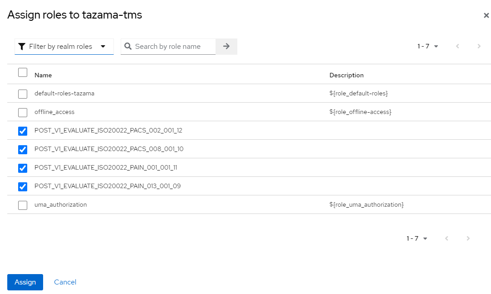

</details>

### 3.5.1. Create Tenants as Child Groups

<details open>
    <summary> 
      Navigate Groups
    </summary>


Let's create a tenant called `tenant-001` within the tazama-tms group created above. Click on the `Group name` called `tazama-tms` 
</details>

<details open>
    <summary> 
      Create group
    </summary>

Within the group `tazama-tms` selected, click on the `Create group` button to create a child group within the tazama-tms group.

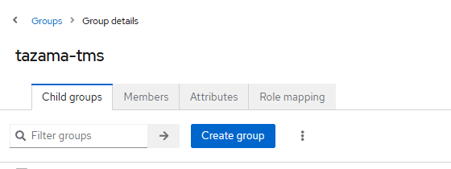

</details>

<details open>
    <summary> 
      Create tenant-001
    </summary>
    
Create a tenant called `tenant-001` and click on the `create` button.

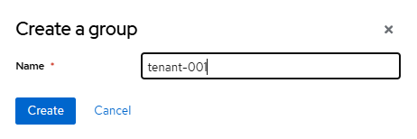

</details>

<details open>
    <summary> 
      Configure tenant-001
    </summary>
    
Click on `tenant-001` to be able to configure it

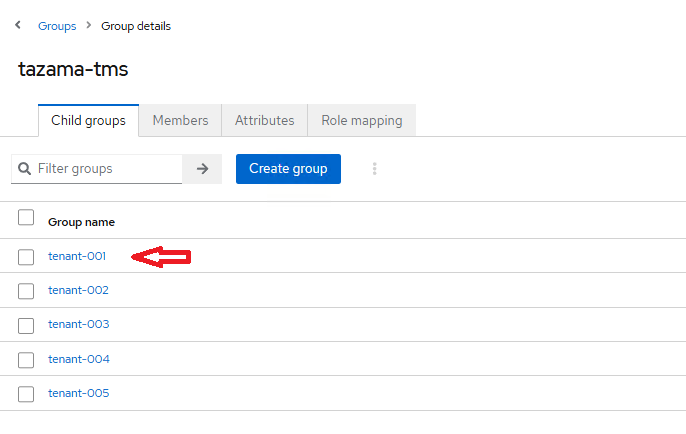

</details>

<details open>
    <summary> 
      Configure tenant-001
    </summary>
    
Click on `attributes` tab and click on `add an attribute` button.  

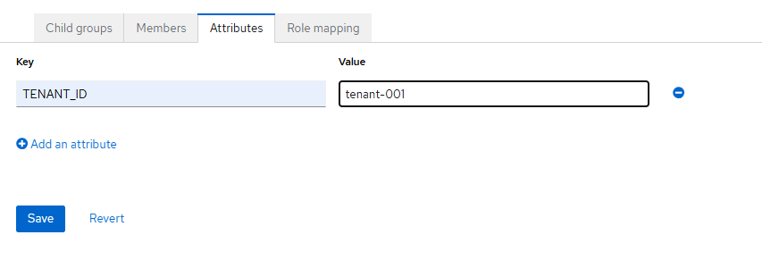
Add a new attribute:
1. **Key**: `TENANT_ID`
2. **Value**: The actual tenant identifier (e.g., `tenant-001`)

This ensures that all users in this group will inherit this tenant ID, which will then be included in their JWT tokens through the mapper configured above.

**Important Notes:**
- Each group must have its own TENANT_ID attribute value
- Users will inherit the TENANT_ID from their primary group
- The Tazama auth library will use this TENANT_ID attribute for multi-tenant authorization
- Make sure the TENANT_ID attribute name matches exactly what's configured in the user attribute mapper

---

## 3.6. Creating Users
Users are individuals that will authenticate through KeyCloak to obtain permissions to use Tazama. There are two types of users in the Tazama ecosystem:

1. **Tenant Users**: Users who belong to specific tenant organizations and inherit tenant-specific permissions and tenant ID attributes
2. **Operator Users**: Administrative users who manage the Tazama system across multiple tenants

### 3.6.1. Creating Tenant Users

For tenant-specific users, follow these steps to ensure proper multi-tenancy setup:

To create a tenant user in KeyCloak navigate to the `Users` section and click on `add user` button.

<details open>
    <summary> 
      Navigate Users
    </summary>

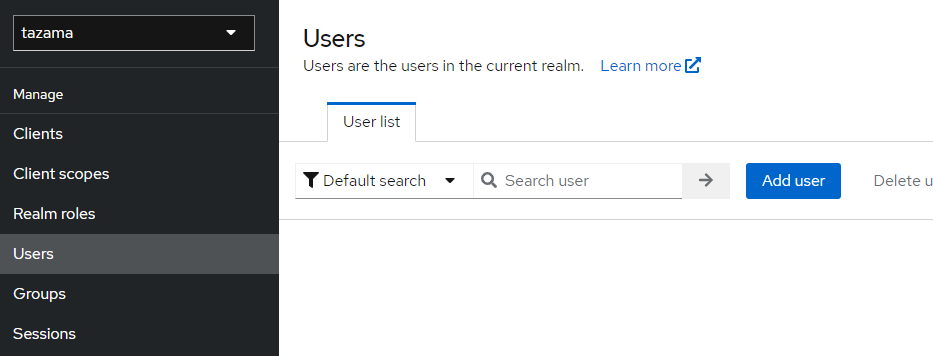

</details>

When creating tenant users, ensure you assign them to the appropriate tenant group (e.g., "tazama-tms" with TENANT_ID "tenant-001").

<details open>
    <summary> 
      Create Tenant User
    </summary>

Capture the usename and email, and then click on `Join Groups`

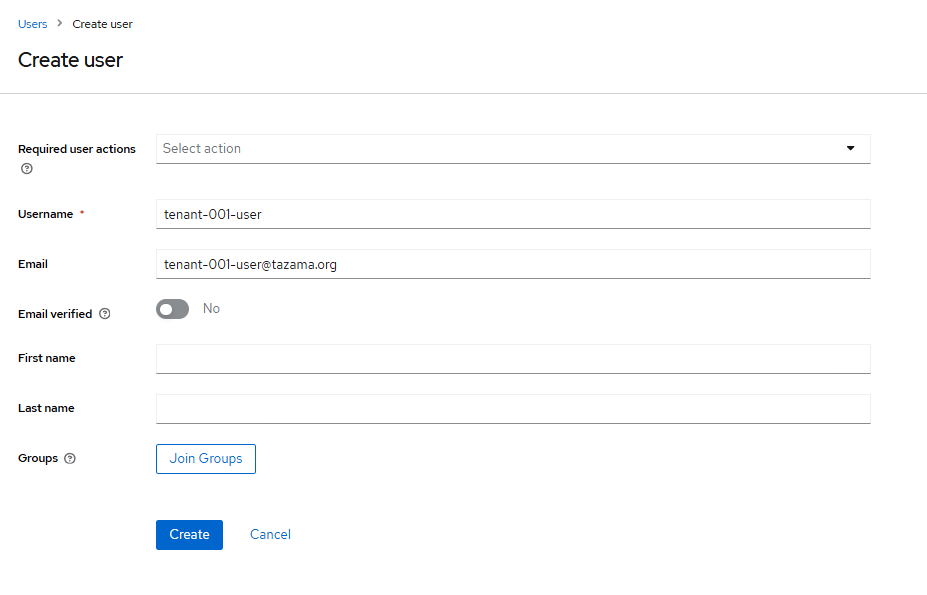

</details>

<details open>
    <summary> 
      Join groups
    </summary>

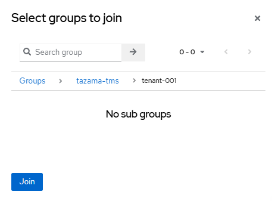

Select the group (e.g. tazama-tms) and the child group (e.g.tenant-001), and then click on `Join`

</details>

**Important Multi-Tenancy Notes:**
- Tenant users can ONLY access data associated with their tenant ID
- Operator users can access system-wide data and configurations
- The auth-lib will automatically enforce tenant restrictions based on the user's token claims
- Each tenant group should have a unique TENANT_ID attribute value
- Users can only be members of one tenant group at a time to avoid conflicts
  
**Important**: For tenant users, make sure to:
- Assign them to the correct tenant group, assigning the user to tenant will add tenant roles to the user and add the TENANT_ID to their token.
- Verify the group has the proper TENANT_ID attribute configured
- The user will automatically inherit the TENANT_ID from their group membership

While the user is created a password was not yet set. So let's create a password for the newly created user under Credentials
<details open>
    <summary> 
      Set User Password
    </summary>

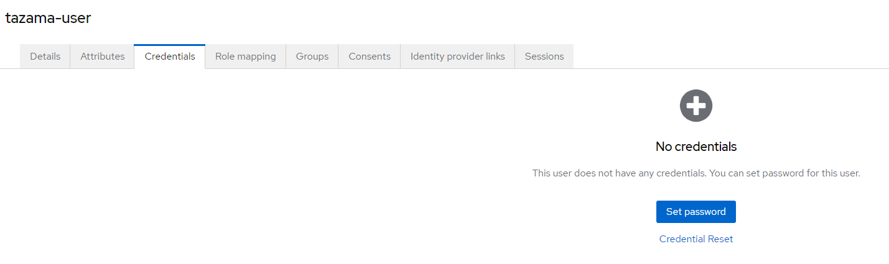
---
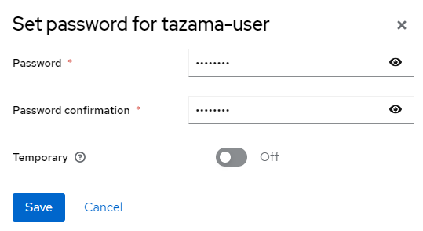

### 3.6.2. Creating Operator Users

For operator-specific users who need cross-tenant access or system-wide management capabilities:

1. **Create the user** following the same navigation steps above
2. **Assign them to a group**
3. **Do NOT assign a tenant-specific group** (or assign a special operator tenant ID if required)

**Operator User Configuration:**
- Group membership: None
- TENANT_ID: None
- Permissions: Cross-tenant visibility and system administration
- Use case: System administrators, support staff, cross-tenant analysts

**User Type Summary:**

| User Type | Group Assignment | TENANT_ID | Access Scope | Use Case |
|-----------|-----------------|-----------|--------------|----------|
| **Tenant Users** | Tenant-specific group (e.g., "paysys") | Inherited from group (e.g., "tenant_value_005") | Restricted to tenant data only | End users, tenant administrators |
| **Operator Users** | None |

</details>

<details>
    <summary>
        <strong>Additionally</strong>
    </summary> 
    If the user is expected to change their password the temporary password option should stay toggled at password creation or on the client page you can set required actions to `update password` and `verify email`.
    This will require the user to login to the KeyCloak account portal. The link is found by the Clients sidebar for the account entries home URL.
    <details>
        <summary> 
        Account Portal
        </summary>

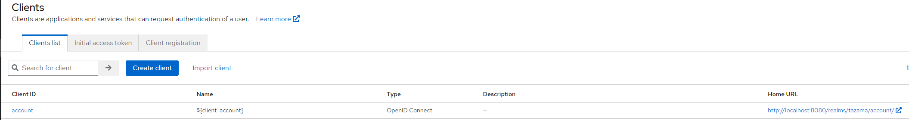

   </details>
</details>

### 3.6.3. Deleting users
Navigate to the Users section

<details open>
    <summary> 
      Navigate Users
    </summary>

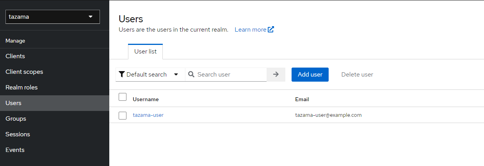

Select the user(s) to be deleted and press the delete user button.
</details>

<details open>
    <summary> 
      Deleting a User
    </summary>

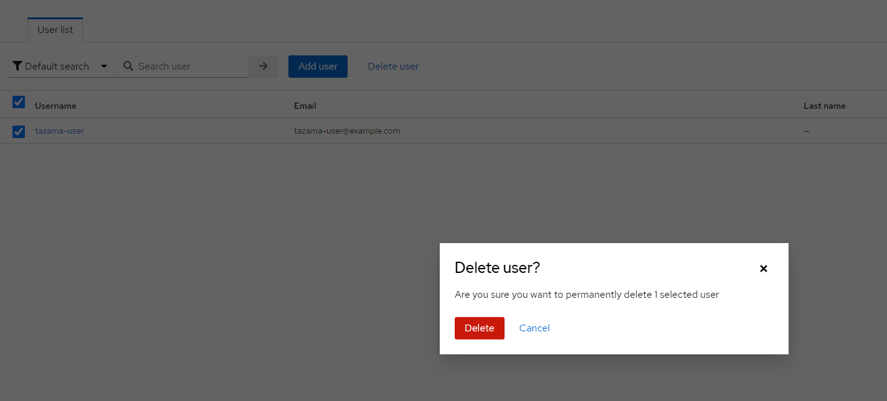

The user is deleted.
</details>

---
## 4. Local Deployment
<details>
    <summary>
        <strong>Docker Compose</strong>
    </summary> 
    <details open>
        <summary> 
        docker-compose.yaml
        </summary>

```yaml
services:
    postgres:
        image: postgres:16.2
        volumes:
        - postgres_data:/var/lib/postgresql/data
        environment:
        POSTGRES_DB: ${POSTGRES_DB}
        POSTGRES_USER: ${POSTGRES_USER}
        POSTGRES_PASSWORD: ${POSTGRES_PASSWORD}
        networks:
        - kc_net

    keycloak:
        image: quay.io/keycloak/keycloak:23.0.6
        command: start
        environment:
        KC_HOSTNAME: localhost                  # local use only 
        KC_HOSTNAME_STRICT_BACKCHANNEL: false   # local use only
        KC_HTTP_ENABLED: true                   # local use only
        KC_HOSTNAME_STRICT_HTTPS: false         # local use only
        KC_HOSTNAME_PORT: 8080
        KC_HEALTH_ENABLED: true
        KEYCLOAK_ADMIN: ${KEYCLOAK_ADMIN}
        KEYCLOAK_ADMIN_PASSWORD: ${KEYCLOAK_ADMIN_PASSWORD}
        KC_DB: postgres
        KC_DB_URL: jdbc:postgresql://postgres/${POSTGRES_DB}
        KC_DB_USERNAME: ${POSTGRES_USER}
        KC_DB_PASSWORD: ${POSTGRES_PASSWORD}
        ports:
        - 8080:8080
        restart: always
        depends_on:
        - postgres
        networks:
        - kc_net

volumes:
    postgres_data:
        driver: local

networks:
    kc_net:
        driver: bridge
```
</details>
<details open>
        <summary> 
        .env
        </summary>

```yaml
POSTGRES_DB=keycloak_db
POSTGRES_USER=keycloak_db_user
POSTGRES_PASSWORD=keycloak_db_user_password
KEYCLOAK_ADMIN=admin
KEYCLOAK_ADMIN_PASSWORD=admin
```
   </details>
</details>