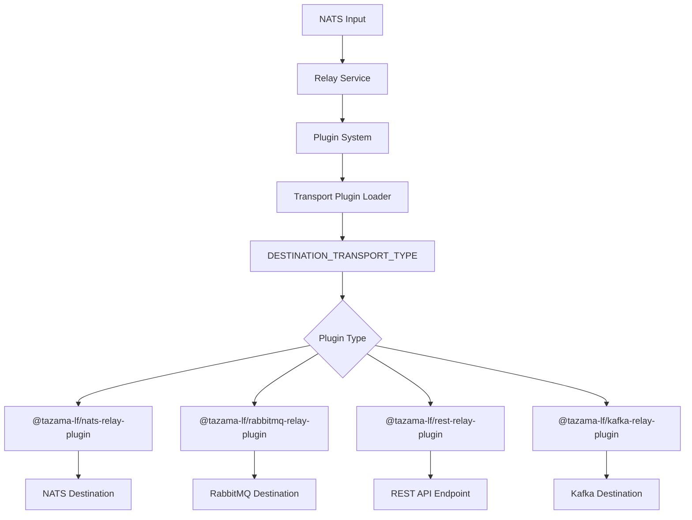

# Relay Service Plugin Development Guide

## Table of Contents

- [1. Relay Service](#1-relay-service)
  - [1.1 Features](#11-features)
  - [1.2 Plugin-Based Transport Architecture](#12-plugin-based-transport-architecture)
- [2. Transport Plugin Development](#2-transport-plugin-development)
  - [2.1 Plugin Development Standards](#21-plugin-development-standards)
  - [2.2 Plugin Interface](#22-plugin-interface)
  - [2.3 Plugin Configuration](#23-plugin-configuration)
  - [2.4 Plugin Development Steps](#24-plugin-development-steps)
- [3. Standard Plugin File Structure](#3-standard-plugin-file-structure)

## **_1. Relay Service_**

The Tazama Relay Service acts as an intermediary, relaying messages from a Tazama source (NATS) to an external destination (NATS, RabbitMQ, Kafka, REST API). The purpose is to provide a seamless transmission solution from Tazama to an external system.

### 1.1 Features

- Consumes NATS messages
- **Plugin-based transport system** for extensible destination support
- Compatible with various output destinations through transport plugins (NATS, RabbitMQ, REST API, Kafka)
- Dynamic plugin loading and installation at runtime
- Support for both JSON and Protobuf message formats
- Built using TypeScript for enhanced type safety and maintainability
- Comprehensive APM (Application Performance Monitoring) integration
- Designed specifically for financial risk management and transaction processing scenarios

### 1.2 Plugin-Based Transport Architecture



## **_2. Transport Plugin Development_**

The Tazama Relay Service supports custom transport plugins. This allows for extending the service to support new destination types. To develop plugins, there are specific structures and conventions that need to be followed to ensure compatibility with the relay service's plugin loading system.

### 2.1 Plugin Development Standards

Transport plugins must adhere to the following structural requirements:

1. **Package Structure**: Follow the standard npm package layout with proper TypeScript configuration
2. **Interface Compliance**: Implement the required `ITransportPlugin` interface
3. **Export Convention**: Must export the transport class as the default export
4. **Dependency Management**: Include required dependencies and peer dependencies
5. **Configuration Standards**: Follow environment variable naming conventions
6. **Init Method**: Must implement async initialization logic,
   must also accept `loggerService` and `apm` parameters, and assigns value to the variables.

```typescript
init(loggerService?: LoggerService, apm?: Apm) {
  this.apm = apm;
  this.loggerService = loggerService;
}
```

7. **Relay Method**: Must implement message forwarding logic
8. **Error Handling**: Implement proper error handling and logging integration
   Errors specific to relay service and _fatal_ errors should be thrown back
   for the `relay-service` to catch and handle.

### 2.2 Plugin Interface

All transport plugins must implement the following interface:

```typescript
interface ITransportPlugin {
  init: (loggerService?: LoggerService, apm?: Apm) => Promise<void>;
  relay: (data: Uint8Array | string) => Promise<void>;
}
```

### 2.3 Plugin Configuration

Plugins can access environment variables and should follow the naming convention:

- `DESTINATION_TRANSPORT_URL` - Primary connection URL
- `PRODUCER_STREAM` - Stream/queue/topic name
- Plugin-specific variables as needed

### 2.4 Plugin Development Steps

### **1. Setup Project**

Initialize with `npm init` and configure `.npmrc` for @tazama-lf npm registry. Set up GH_TOKEN with package:write and read permissions.
Reference this [document](https://github.com/tazama-lf/docs/blob/dev/Guides/dev-set-up-environment.md#311-step-1-setting-up-github-token-locally) as a guide.
Install required dependencies (e.g., @tazama-lf/frms-coe-lib, protocol SDK, dotenv, etc.).

### **2. Implement Plugin Interface**

From the `@tazama-lf/frms-coe-lib/lib/interfaces/relay-service/ITransportPlugin`,
import the shared interface:

```typescript
export interface ITransportPlugin {
  init: (loggerService?: LoggerService, apm?: Apm) => Promise<void>;
  relay: (data: Uint8Array | string) => Promise<void>;
}
```

### **3. Create Config Loader**

In `src/config.ts`, define all required environment variables and load them using dotenv:

```typescript
import * as dotenv from 'dotenv';
dotenv.config();

export interface ExtendedConfig {
  DESTINATION_TRANSPORT_URL: string;
  PRODUCER_STREAM: string;
  // Add plugin-specific variables here
}
```

### **4. Implement the Transport Plugin**

In `src/service/<YourTransportPlugin>.ts`:

- **Init**: Accept loggerService and apm as parameters.
  Establish client connections, initialize resources.
- **Relay**: Accept data and forward to destination.

Example excerpt:

```typescript
import { LoggerService, ITransportPlugin } from '@tazama-lf/frms-coe-lib';
import { Apm } from '@tazama-lf/frms-coe-lib/lib/services/apm';
import { additionalEnvironmentVariables, type Configuration } from '../config';

export default class CustomTransport implements ITransportPlugin {
  constructor() {}

  async init(loggerService?: LoggerService, apm?: Apm): Promise<void> {
    // Initialize loggerService and apm if needed.
    this.loggerService = loggerService;
    this.apm = apm;
    // Initialize connection, setup configurations
    this.loggerService.log('Custom transport initialized');
  }

  async relay(data: Uint8Array | string): Promise<void> {
    // Implement message forwarding logic
    this.loggerService.log('Relaying message via custom transport');
    // Forward message to your destination
  }
}
```

### **5. Export the Plugin**

In `src/index.ts`:

```typescript
import CustomRelayPlugin from './service/CustomRelayPlugin';
export default CustomRelayPlugin;
```

### **6. Build and Publish**

Add appropriate build and lint scripts to `package.json` (see [Kafka](https://github.com/tazama-lf/relay-service-integration-kafka/blob/feat/package.json) plugin for reference).

Run `npm run build` to generate the output in `/dist`.

Publish the package to your npm registry.

## **3. Standard Plugin File Structure**

```
your-plugin/
├── .npmrc
├── .gitignore
├── README.md
├── tsconfig.json
├── package-lock.json
├── LICENSE
├── jest.config.js
├── jest.setupEnv.ts
├── package.json
├── src/
│   ├── config.ts
│   ├── index.ts
│   └── service/
│       └── <YourRelayPlugin>.ts
└── __tests__/
    └── <YourRelayPlugin>.test.ts
```
