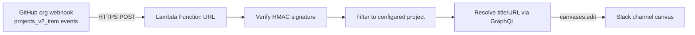

<!-- SPDX-License-Identifier: Apache-2.0 -->
<!-- Last reviewed: 2026-09-07 -->

# Slack Canvas Relay Guide

This guide describes the GitHub-to-Slack relay that mirrors changes on a GitHub Projects v2 board onto a Slack channel canvas in near real time. It covers the architecture, initial setup, configuration reference, and ongoing maintenance.

## Table of Contents

- [1. Overview](#1-overview)
- [2. Architecture](#2-architecture)
- [3. Current Deployment](#3-current-deployment)
- [4. Setup from Scratch](#4-setup-from-scratch)
  - [4.1 Create the Slack App](#41-create-the-slack-app)
  - [4.2 Resolve or Create the Channel Canvas](#42-resolve-or-create-the-channel-canvas)
  - [4.3 Create the GitHub Personal Access Token](#43-create-the-github-personal-access-token)
  - [4.4 Deploy the AWS Stack](#44-deploy-the-aws-stack)
  - [4.5 Create the Organization Webhook](#45-create-the-organization-webhook)
  - [4.6 Verify](#46-verify)
- [5. Configuration Reference](#5-configuration-reference)
- [6. Maintenance](#6-maintenance)
  - [6.1 Rotating Tokens and Secrets](#61-rotating-tokens-and-secrets)
  - [6.2 Changing the Monitored Project or Target Channel](#62-changing-the-monitored-project-or-target-channel)
  - [6.3 Updating the Lambda Code](#63-updating-the-lambda-code)
  - [6.4 Canvas Housekeeping](#64-canvas-housekeeping)
- [7. Monitoring and Troubleshooting](#7-monitoring-and-troubleshooting)
- [8. Decommissioning](#8-decommissioning)

## 1. Overview

Slack channel canvases cannot be updated by the official GitHub Slack integration, and GitHub Projects v2 boards do not emit repository-level webhook events. The relay bridges both gaps with a single AWS Lambda function:

- A **GitHub organization webhook** delivers `projects_v2_item` events (item added, field changed, archived, restored, removed, converted) to a Lambda Function URL.
- The **Lambda function** verifies the webhook signature, filters events down to one configured project board, resolves the affected issue or pull request title via the GitHub GraphQL API, and appends a timestamped markdown line to the Slack canvas using the `canvases.edit` API.

The relay is stateless: the webhook payload carries the old and new values of every change, so no snapshot, database, or polling schedule is required. Latency from board change to canvas entry is one to two seconds.

## 2. Architecture



Security model:

- The Lambda Function URL is public (`AuthType: NONE`), but every request must carry a valid `X-Hub-Signature-256` HMAC computed with the shared webhook secret. Requests that fail verification are rejected with `401` before any processing.
- The organization webhook fires for items on **all** projects in the organization. The Lambda drops events for any project other than the configured one (returned as `202` so GitHub records a successful delivery).
- Secrets (webhook secret, Slack bot token, GitHub PAT) are passed as `NoEcho` CloudFormation parameters into Lambda environment variables. They are encrypted at rest but visible to anyone with Lambda read access in the AWS account.

## 3. Current Deployment

The relay is deployed in the Tazama operations AWS account. Concrete deployment values - account ID, region, monitored project (name, number, and node ID), Slack channel and canvas IDs, and the organization webhook ID - are recorded internally and intentionally not published in this repository.

Non-identifying stack facts:

| Item | Value |
| --- | --- |
| CloudFormation stack | `slack-canvas-relay` |
| Lambda function | `slack-canvas-relay` (Node.js 20, arm64) |
| Packaging S3 bucket | `slack-canvas-relay-sam-<ACCOUNT_ID>` |
| CloudWatch alarm | `slack-canvas-relay-errors` |
| Log retention | 30 days (`/aws/lambda/slack-canvas-relay`) |

The Lambda handler source (`src/index.mjs`) and SAM template (`template.yaml`) are the deployment artifacts for the stack. Keep them under version control; changes are rolled out with the two commands in [section 6.3](#63-updating-the-lambda-code).

## 4. Setup from Scratch

Follow this section only when recreating the relay in a new environment. Prerequisites: AWS CLI v2 with credentials for the target account, GitHub CLI authenticated as a `tazama-lf` organization admin, Node.js, and a paid Slack workspace plan (the canvas APIs are not available on the free tier).

### 4.1 Create the Slack App

1. Go to `https://api.slack.com/apps`, select **Create New App** > **From scratch**, and choose the workspace.
2. Under **OAuth & Permissions**, add these **Bot Token Scopes**:
   - `canvases:write` - edit the canvas
   - `channels:read` - resolve public channel metadata
   - `groups:read` - resolve private channel metadata (required if the target channel is private)
3. Select **Install to Workspace** and record the bot token (`xoxb-...`).
4. In Slack, invite the bot to the target channel: `/invite @<app-name>`. The bot must be a channel member to create or edit the channel canvas.

> **NOTE:** Adding scopes after installation requires reinstalling the app, which issues a new bot token.

### 4.2 Resolve or Create the Channel Canvas

Check whether the channel already has a canvas:

```powershell
$r = Invoke-RestMethod -Uri "https://slack.com/api/conversations.info?channel=<CHANNEL_ID>" `
  -Headers @{Authorization = "Bearer $env:SLACK_BOT_TOKEN"}
$r.channel.properties.canvas.file_id
```

If the result is empty, create one:

```powershell
$body = @{ channel_id = "<CHANNEL_ID>"; document_content = @{ type = "markdown"; markdown = "# GitHub Project Activity`n" } } | ConvertTo-Json -Depth 4
Invoke-RestMethod -Method Post -Uri "https://slack.com/api/conversations.canvases.create" `
  -Headers @{Authorization = "Bearer $env:SLACK_BOT_TOKEN"; "Content-Type" = "application/json"} -Body $body
```

Record the returned canvas ID (`F...`).

### 4.3 Create the GitHub Personal Access Token

Create a classic PAT with the `read:project` scope only. The Lambda uses it for a single GraphQL lookup per event, to resolve the issue or pull request title and URL (the webhook payload carries only the node ID). Resolve the project node ID while you are at it:

```powershell
gh api graphql -f query='query { organization(login: "tazama-lf") { projectV2(number: <N>) { id title } } }'
```

### 4.4 Deploy the AWS Stack

Generate a webhook secret and keep it in the shell session only:

```powershell
$env:GH_WEBHOOK_SECRET = node -e "console.log(require('node:crypto').randomBytes(32).toString('hex'))"
```

Create the packaging bucket (once per account/region), then package and deploy:

```powershell
aws s3 mb s3://slack-canvas-relay-sam-<ACCOUNT_ID> --region <REGION>

aws cloudformation package --template-file template.yaml `
  --s3-bucket slack-canvas-relay-sam-<ACCOUNT_ID> `
  --output-template-file packaged.yaml --region <REGION>

aws cloudformation deploy --template-file packaged.yaml `
  --stack-name slack-canvas-relay --capabilities CAPABILITY_IAM `
  --region <REGION> --no-fail-on-empty-changeset `
  --parameter-overrides `
    "GitHubWebhookSecret=$env:GH_WEBHOOK_SECRET" `
    "SlackBotToken=$env:SLACK_BOT_TOKEN" `
    "SlackCanvasId=<CANVAS_ID>" `
    "GitHubToken=$env:RELAY_GITHUB_TOKEN" `
    "ProjectNodeId=<PROJECT_NODE_ID>"
```

The SAM CLI is not required; `aws cloudformation package`/`deploy` process the SAM transform natively. Retrieve the Function URL:

```powershell
aws cloudformation describe-stacks --stack-name slack-canvas-relay --region <REGION> `
  --query "Stacks[0].Outputs[?OutputKey=='WebhookUrl'].OutputValue" --output text
```

### 4.5 Create the Organization Webhook

Requires organization admin rights and the `admin:org_hook` scope on the GitHub CLI token:

```powershell
gh api orgs/tazama-lf/hooks -X POST -f name=web -F active=true `
  -f "events[]=projects_v2_item" `
  -f "config[url]=<FUNCTION_URL>" `
  -f "config[content_type]=json" `
  -f "config[secret]=$env:GH_WEBHOOK_SECRET"
```

> **NOTE:** Projects v2 events exist only at the organization level. Repository webhooks cannot deliver them, which is why an organization webhook is required.

### 4.6 Verify

GitHub sends a `ping` event on webhook creation. Confirm it returned `200`:

```powershell
gh api orgs/tazama-lf/hooks/<HOOK_ID>/deliveries --jq '.[] | {event, status, status_code}'
```

A `200` on the ping proves the Function URL is reachable and HMAC verification passed. Then move an item on the board and confirm a new line appears on the canvas within a few seconds.

## 5. Configuration Reference

CloudFormation parameters (all consumed as Lambda environment variables):

| Parameter | Env var | Purpose |
| --- | --- | --- |
| `GitHubWebhookSecret` | `GITHUB_WEBHOOK_SECRET` | HMAC key for `X-Hub-Signature-256` verification |
| `SlackBotToken` | `SLACK_BOT_TOKEN` | Slack bot token with `canvases:write` |
| `SlackCanvasId` | `SLACK_CANVAS_ID` | Target canvas file ID (`F...`) |
| `GitHubToken` | `GITHUB_TOKEN` | PAT with `read:project`, used for title/URL lookup |
| `ProjectNodeId` | `PROJECT_NODE_ID` | Projects v2 node ID filter; empty relays all projects |

Event handling behaviour:

| Webhook action | Canvas entry |
| --- | --- |
| `created` | "was added to the board" |
| `edited` | Field change, for example "moved *Status* **Todo → In Progress**" |
| `archived` / `restored` | "was archived" / "was restored" |
| `deleted` | "was removed from the board" |
| `converted` | "was converted from a draft to an issue" |
| `reordered` | Ignored (drag-sorting within a column is noise) |

## 6. Maintenance

### 6.1 Rotating Tokens and Secrets

All secrets are stack parameters, so rotation is a redeploy with new values:

1. Issue the replacement credential (Slack bot token via app reinstall, GitHub PAT via token settings, webhook secret via the `node -e` one-liner above).
2. Rerun the `aws cloudformation deploy` command from [section 4.4](#44-deploy-the-aws-stack) with all five `--parameter-overrides` values (unchanged values must be re-supplied; there is no partial override for `NoEcho` parameters).
3. When rotating the webhook secret, also update the webhook: `gh api orgs/tazama-lf/hooks/<HOOK_ID>/config -X PATCH -f "secret=$env:GH_WEBHOOK_SECRET"`. Update the stack first, then the webhook, to avoid a window where deliveries fail verification.

Rotate immediately if a token is exposed. The Slack token is invalidated by reinstalling the Slack app; the PAT is revoked from GitHub token settings.

### 6.2 Changing the Monitored Project or Target Channel

- **Different project:** resolve the new project node ID ([section 4.3](#43-create-the-github-personal-access-token)) and redeploy with the new `ProjectNodeId`.
- **Different channel:** invite the bot to the new channel, resolve or create its canvas ([section 4.2](#42-resolve-or-create-the-channel-canvas)), and redeploy with the new `SlackCanvasId`.
- **Multiple projects/channels:** deploy additional stacks with distinct stack names rather than widening one relay; the one-project-one-canvas pairing keeps the filter logic trivial.

### 6.3 Updating the Lambda Code

Edit `src/index.mjs`, then repackage and redeploy (same two commands as [section 4.4](#44-deploy-the-aws-stack)). The handler has no npm dependencies; it uses only the Node.js standard library and native `fetch`.

### 6.4 Canvas Housekeeping

The relay is append-only, so the canvas grows indefinitely. Slack canvases degrade in usability well before any hard limit, so periodically (for example monthly) trim old entries manually, or archive the canvas content elsewhere and clear it. If this becomes a burden, extend the handler to replace a dated section instead of appending.

## 7. Monitoring and Troubleshooting

| Symptom | Check |
| --- | --- |
| No canvas updates | GitHub org **Settings > Webhooks > Recent Deliveries**: a `4xx`/`5xx` status shows the response body from the Lambda. `202` responses are normal for filtered events (other projects, `reordered`, pings from other event types). |
| `401 signature verification failed` | Webhook secret mismatch between GitHub and the stack. Rotate per [section 6.1](#61-rotating-tokens-and-secrets). |
| `canvases.edit failed: not_in_channel` | The bot was removed from the channel. Re-invite it. |
| `canvases.edit failed: invalid_auth` / `token_revoked` | Slack token rotated or app reinstalled without redeploying the stack. |
| Item shows as `Issue \`PVT...\`` instead of a title | GraphQL lookup failed - usually an expired or under-scoped `GITHUB_TOKEN`. The relay degrades gracefully rather than dropping the event. |
| Alarm `slack-canvas-relay-errors` firing | `aws logs tail /aws/lambda/slack-canvas-relay --region <REGION> --since 1h` for the stack trace. |

Failed deliveries can be replayed from the GitHub webhook **Recent Deliveries** page (**Redeliver**). GitHub retries failed deliveries only briefly on its own, so redelivery is the recovery path after an outage.

Costs are negligible at board-event volumes: the Lambda free tier covers millions of invocations per month, and the only standing costs are CloudWatch log storage and the alarm.

## 8. Decommissioning

1. Delete the org webhook: `gh api orgs/tazama-lf/hooks/<HOOK_ID> -X DELETE`.
2. Delete the stack: `aws cloudformation delete-stack --stack-name slack-canvas-relay --region <REGION>`.
3. Empty and delete the packaging bucket if no longer needed.
4. Revoke the GitHub PAT and uninstall the Slack app (or remove its scopes).
5. The canvas itself is unaffected; delete or repurpose it in Slack as desired.
