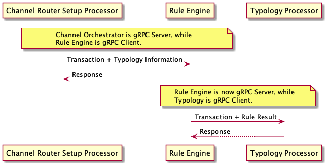
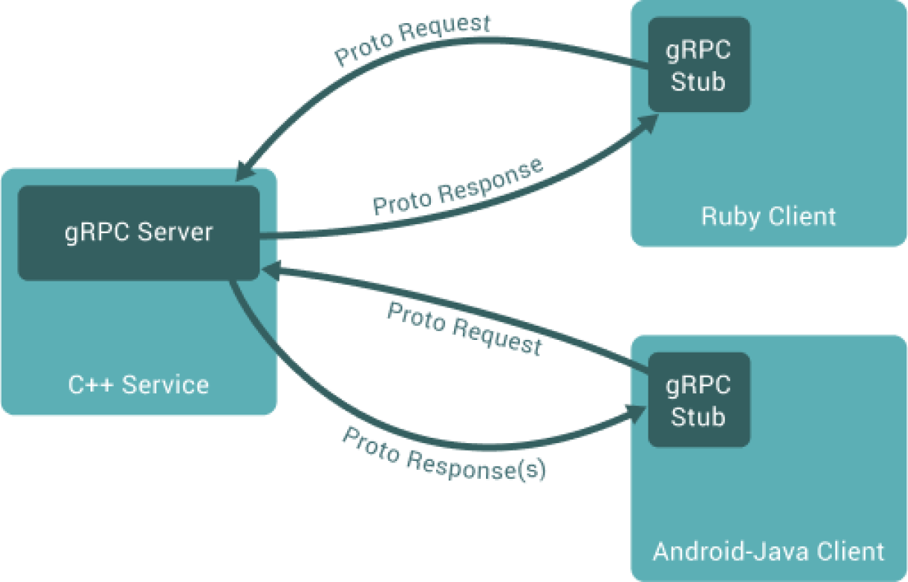
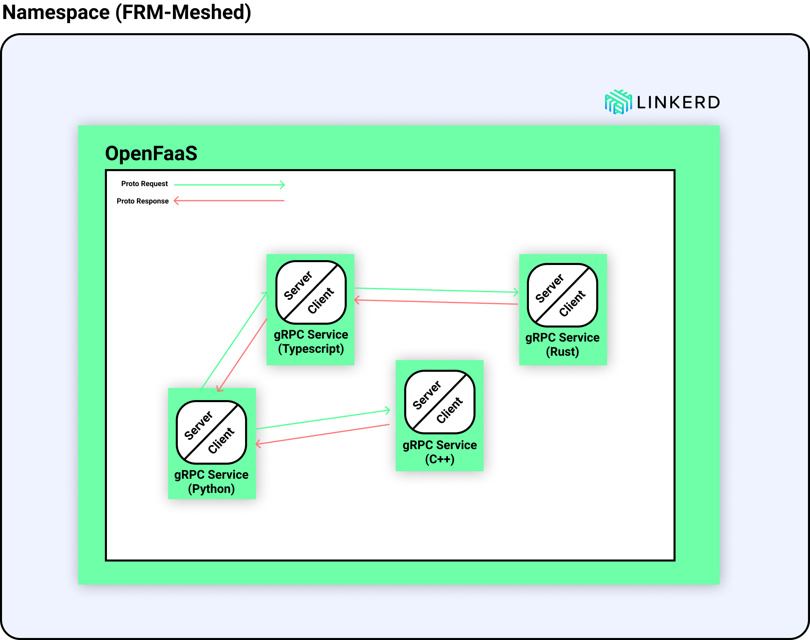
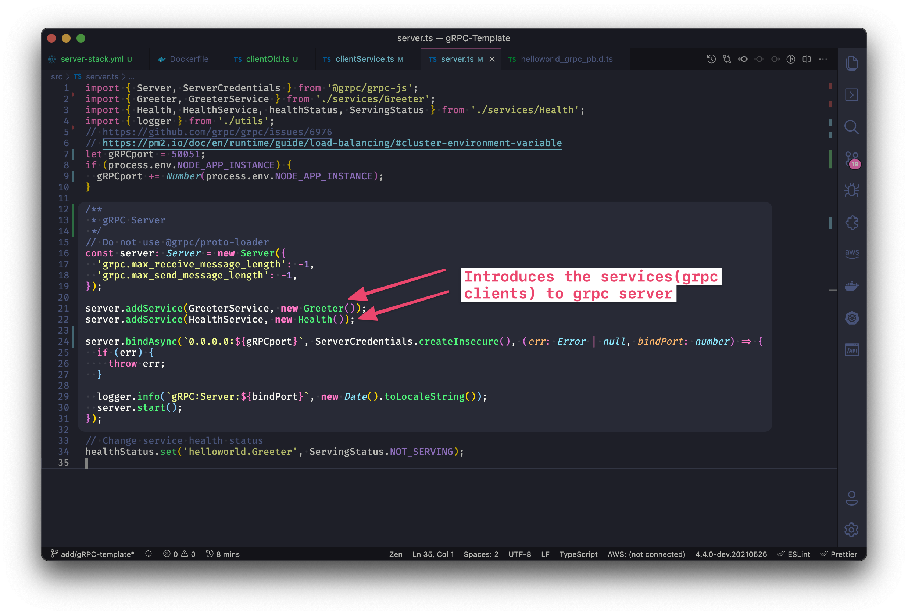

<!-- SPDX-License-Identifier: Apache-2.0 -->

# Deep Dive into gRPC Deployment

## Overview of REST vs. gRPC

To understand REST and gRPC, we need to start with APIs (application programming interfaces). APIs provide rules and definitions that allow applications to communicate and interact with each other.

**REST (Representational State Transfer) API:** REST defines specific constraints that support interoperability between microservices and internet-based applications. Although a REST API can receive and return messages written in a variety of formats, the most common format used is JSON. JSON is a text-based, human-readable format that is flexible, efficient, and language/platform agnostic.

**gRPC (Google Remote Procedure Call):** gRPC is an open-source RPC architecture designed by Google to achieve high-speed communication between microservices. gRPC allows developers to integrate services programmed in different languages. gRPC uses the Protobuf (protocol buffers) messaging format, which is a highly-packed, highly efficient messaging format for serializing structured data.

Here’s a simple matrix that compares the basics of **REST APIs** and **gRPC**:

| **Characteristic** | **gRPC** | **REST API** |
| --- | --- | --- |
| HTTP Protocol | *HTTP 2* | *HTTP 1.1* |
| Messaging Format | *Protobuf (Protocol Buffers)* | *JSON (usually) or XML and others* |
| Code Generation | *Native Protoc Compiler* | *Third-Party Solutions Like Swagger* |
| Communication | *Unary Client-Request or Bidirectional/Streaming* | *Client-Request Only* |

## gRPC Use Case

## Understanding gRPC APIs

As a variant of the RPC architecture, gRPC was created by Google to speed up data transmission between microservices and other systems that need to interact with each other. Compared to REST APIs, gRPC APIs are unique in the following ways:

1. Protobuf Instead of JSON
2. Built on HTTP 2 Instead of HTTP 1.1
3. In-Born Code Generation Instead of Using Third-Party Tools Like Swagger
4. 7 to 10 times Faster Message Transmission
5. Slower Implementation than REST

### Built on HTTP 2 Instead of HTTP 1.1

Another way that gRPC boosts efficiency is through its use of the HTTP 2 protocol.  

There are three types of streaming that gRPC makes available:

- **Server-side:** A client sends a request message to a server. The server returns a stream of responses back to the client. After completing the responses, the server sends a status message (and in some cases trailing metadata), which completes the process. After receiving all of the responses, the client completes its process.
- **Client-side:** A client sends a stream of request messages to a server. The server returns one response back to the client. It (usually) sends the response after receiving all of the requests from the client and a status message (and in some cases trailing metadata).
- **Bidirectional:** A client and server transmit data to one another in no special order. The client is the one that initiates this kind of bidirectional streaming. The client also ends the connection.

## Our Architecture

* * *

# Codebase

## gRPC Server Code

## gRPC Client

* * *

## Deployment to Namespace and OpenFaaS

The **gRPC server** can be deployed to OpenFaaS using FaasCLI.

**Related**

[https://lextego.atlassian.net/browse/AM-317](https://lextego.atlassian.net/browse/AM-317)

[Load balancing with gRPC](../architecture-and-design/linkerd/load-balancing-with-grpc.md)
