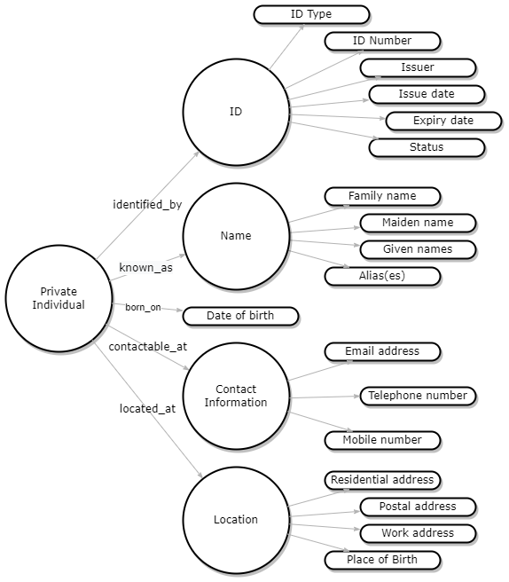
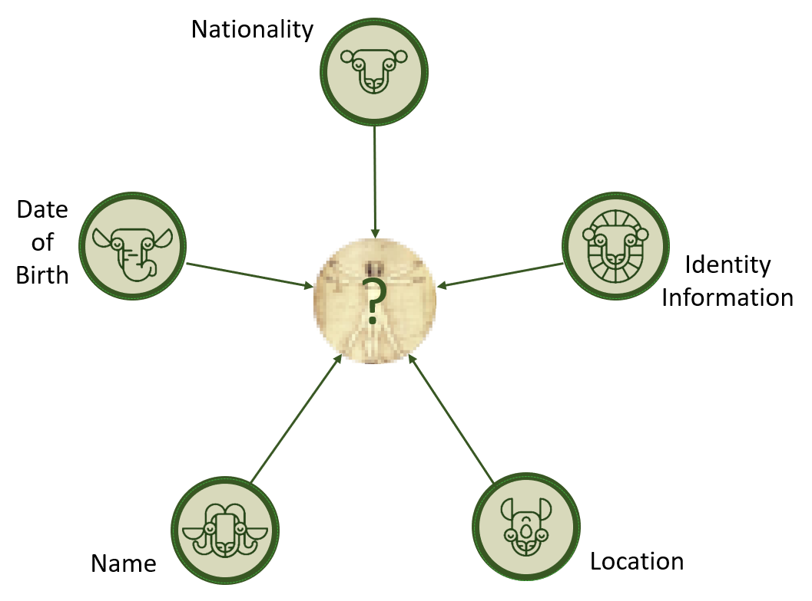
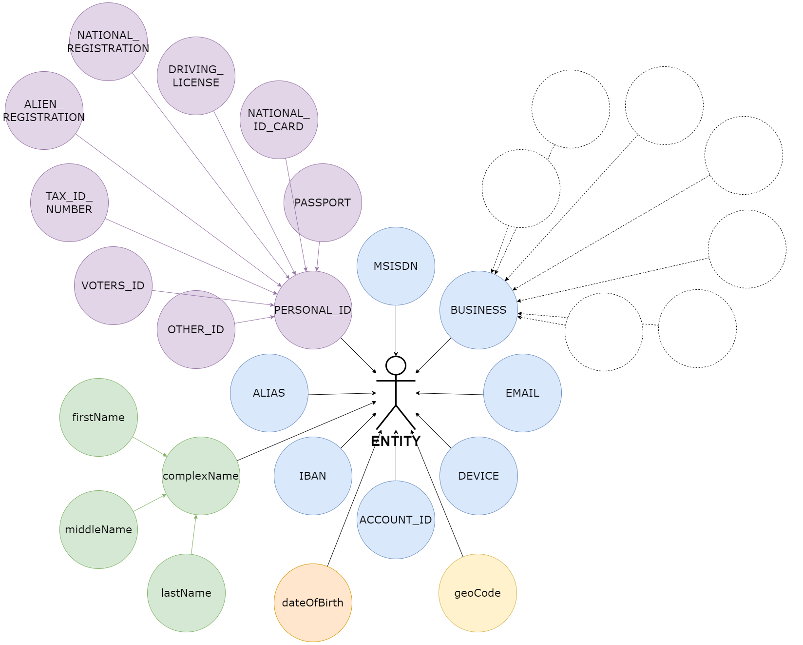
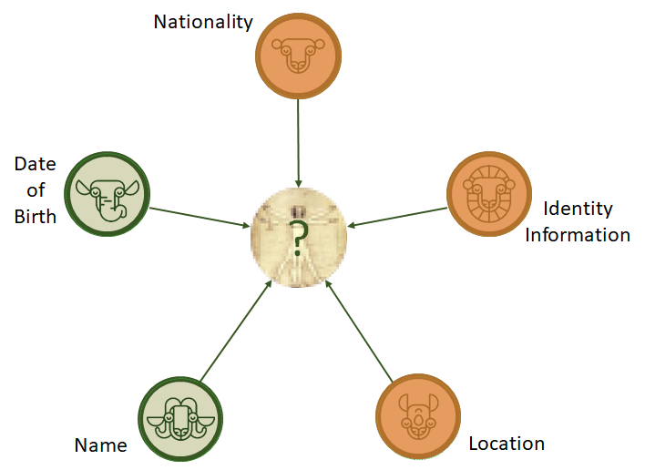

<!-- SPDX-License-Identifier: Apache-2.0 -->

# Entity Resolution Explained

- [Entity Resolution Explained](#entity-resolution-explained)
  - [What is it?](#what-is-it)
    - [Entity](#entity)
    - [(Effective) Resolution](#effective-resolution)
  - [Why do we need it?](#why-do-we-need-it)
  - [Entity Resolution Data in Mojaloop](#entity-resolution-data-in-mojaloop)
    - [Analysis of Mojaloop message fields](#analysis-of-mojaloop-message-fields)
    - [Suitability of Mojaloop message information](#suitability-of-mojaloop-message-information)
    - [Name](#name)
    - [Date of Birth](#date-of-birth)
    - [Nationality](#nationality)
    - [Identity Information](#identity-information)
    - [Location](#location)
  - [Additional information that may be useful](#additional-information-that-may-be-useful)

## What is it?

Entity resolution is a process of data disambiguation, which is a fancy way of saying that we want to identify a unique entity out of the sum of available data. To understand entity resolution, we must first define what we mean by an “entity”.

### Entity

An entity is a thing that exists in the real world or language (i.e. a noun). An entity can be loosely defined by a grouping of related data that collectively defines or describes an object (a *thing*). In a database, an entity may comprise a whole table, and is similar to the “entity” in “Entity Relationship Diagram”. An entity may also be described by other things that may themselves be entities (i.e. a person may be associated with a device, or an account, or an address).

In an Tazama or Mojaloop ecosystem, examples of entities may include:

- People / Persons / Individuals (customers, users, employees, etc)

- Businesses / Non-individuals (business customers, vendors, merchants, DFSPs, Mojaloop Operators, Tazama Operators, etc)

- Accounts

- Devices (personal computers, tablets, mobile phones, etc)

- Locations

An entity is described by its data. For example, the sum of data that defines a person could be mapped out as follows:

### (Effective) Resolution

The resolution part of the entity resolution process aims to determine if a new (prospective) entity is the same entity that had been introduced to the ecosystem previously, or if an entity is indeed a brand new entity. Sometimes this process is necessary because there is no explicit identifier for the entity in the system and the system must then calculate the probability that the entity is known and identifiable.

A resolution process evaluates the uniqueness of an entity based on the combination of its attributes. The more information we have available about an entity, the more accurate the result. Conversely, the less we know about an entity, the less accurate the result.

Imagine you’re travelling to a different country on holiday and you make a friend. He hears you’re from India, and he says: “Hey, I knew someone from India once. Do you know Sunita Singh?” And so you start negotiating: Male or female? How old is she? Which part of India is she from? Maybe you eventually manage to narrow it down and discover how small the world really is. But probably not.

The amount and variety of information about a person is essential to the resolution process, but it is also important to evaluate information that is itself strong indicators of identity, such as a government-issued identification document that contains a unique government-issued identification number. This way, if you know the country that someone hails from, and you have their government issued ID number, then you can be fairly certain of your ability to uniquely identify a person. (It’s still not a guarantee though… South Africa identified 517,249 duplicated identification numbers in 2020).

The most complex part of the resolution process is to define the strength of the match between a prospective entity and an existing entity.

The type of information related to an entity can be ranked in order of priority, and given a weighting. For example, a government issued identification number is considered a ultra-slow-to-almost-never-changing dimension over time and is usually a high-priority attribute with a high weighting. An address, which is a slow-changing dimension over time will have a lower priority weighting. E-mail addresses or telephone numbers are transient attributes and in certain environments may have a very low priority rating.

Some combinations of attributes are expected to have self-referential integrity. A person’s name by itself may have a medium weighting, but it is expected that a person’s name associated with a government identification document should create a great pairing; however very few people call themselves by their full given name all of the time, and sometimes people can change their names, for instance if they marry and adopt the name of their partner. And then there are nicknames. Names are generally a poor choice as a driver for entity resolution and it is essential to pair names with additional and higher priority information.

Effective entity resolution relies on what could be called the “big five” attributes of entity resolution:

## Why do we need it?

The prevention of fraud and money laundering requires us to be able to explicitly identify the person behind a transaction, and not just the account from or to which the transaction was performed. It is a common money-laundering method for a criminal to open multiple accounts with different financial institutions. Financial institutions do not have the means to identify the banking facilities held by another institution and much fraud and money laundering is perpetrated in this blind-spot between institutions.

A switching hub such as Mojaloop is largely concerned with the flow of funds from account to account, and less with the persons operating those accounts. The identity of the account-holders, including the processes to onboard customers and verify their identities, is assumed to be the responsibility of the associated DFSPs. Sometimes, account-holder information may be shows to a payer to verify that they are paying the right payee, though this transparency may depend on applicable privacy legislation.

As Tazama, we would need to be able to explicitly identify the persons operating an account in order to increase the likelihood of detecting fraud and money-laundering behaviour through transaction monitoring. For example, if we need to review the transaction history for a person so that we can model patterns of behaviour, we need to be able to identify that person beyond a doubt, otherwise the modelling will be flawed and we the detection will be compromised.

## Entity Resolution Data in Mojaloop

### Analysis of Mojaloop message fields

The table below lists the data fields available in the Mojaloop messages that could be used to support an entity resolution process for the payer or payee in a transaction.

| Field Name | Description | POST /quotes | PUT /quotes | POST /transfers | PUT /transfers | Comments |
| --- | --- | --- | --- | --- | --- | --- |
| payee | Information about the Payee in the proposed financial transaction. | Y   |     |     |     | This field and sub-fields define a container structure for information about the payee |
| payee.partyIdInfo | Party Id type, id, sub ID or type, and FSP Id. | Y   |     |     |     | This group of fields define a container structure for information about the payee. The set of information aims to uniquely identify a payee within the payee DFSP network. The Mojaloop API provides for a number of different ID Types (MSISDN, EMAIL, PERSONAL_ID, etc) but it is important to note that this information is intended to assist the eco-system in identifying the *account*, and not necessarily the *account-holder*. In all uses, this information is assumed to be unique within the context of a DFSP, and with possible intrinsic meaning only to that DFSP.  Where the partyIdType is PERSONAL_ID, the partySubIdOrType field contains additional descriptors for the identification information (e.g. PASSPORT, NATIONAL_ID_CARD, etc).  Depending on which ID Types are in use, this information is essential in resolving the identity of the payee, or at the very least the payee account information.  It is also possible, given the way that the Account Lookup Service (ALS) functions, that the same account may be identified through vastly different sets of partyIdType information, e.g. an MSISDN vs an EMAIL may resolve to the same payee account. This decision and information is not transparent even to Mojaloop - a DFSP will confirm that the target payee can be reached on the DFSP network using the credentials provided, but nothing more.  This information is initially supplied by the Payer in the POST /quotes message to specify the destination (Payee) of the transaction.  While a payee may be identified by a number of different attributes, the Mojaloop API only provides for the specification of a single attribute per transaction, which complicates the entity resolution process somewhat. If additional information is deemed essential to the entity resolution process, it would have to be provided in the extension list.  {OPEN QUESTION} What happens if a DFSP has multiple facilities for the same payee? |
| payee.partyIdInfo.partyIdType | The type of the identifier. | Y   |     |     |     |
| payee.partyIdInfo.partyIdentifier | An identifier for the Party. | Y   |     |     |     |
| payee.partyIdInfo.partySubIdOrType | A sub-identifier or sub-type for the Party. | Y   |     |     |     |
| payee.partyIdInfo.fspId | The FSP identifier. | Y   |     | Y   |     | This field defines the DFSP that says that it can reach an account that is linked to the partyIdInfo information provided. The DFSP provides necessary context for the identity of the payee and is essential in entity resolution. |
| payee.partyIdInfo.extensionList | Optional list of extensions to the payee information, specific to deployment. | Y   |     |     |     | While this data structure information does not explicitly contain information that identifies the payee entity, additional information may be provided in the extension list for this purpose. The range of additional information is defined by the scheme rules under which a Mojaloop switch operates. |
| payee.partyIdInfo.extensionList.extension | An optional extension element defined by a key-value pair | Y   |     |     |     |
| payee.partyIdInfo.extensionList.extension.key | The key for an optional extension element value | Y   |     |     |     |
| payee.partyIdInfo.extensionList.extension.value | The value for an optional extension element key | Y   |     |     |     |
| [payee.name](http://payee.name) | The name of the party, could be a real name or a nick name. | Y   |     |     |     | This information has limited utility since it is largely scheme-specific. It is as likely that this field will contain an alias to describe the account as it is to have the name of the payee; however since the use of this field may be prescribed by the Mojaloop implementation scheme rules, it may be used to contain information useful for entity resolution.  {OPEN QUESTION} Which of the 4 messages contains this information? |
| payee.personalInfo | Personal information used to verify identity of Party such as first, middle, last name and date of birth. | Y   |     |     |     | This field and sub-fields define a container structure for personal information about the payee. |
| payee.personalInfo.complexName | First, middle and last name. | Y   |     |     |     | This group of fields is expected to contain the name of the payee and is essential in resolving the identity of the payee.  {OPEN QUESTION} Which of the 4 messages contains this information? |
| payee.personalInfo.complexName.firstName | First name | Y   |     |     |     |
| payee.personalInfo.complexName.middleName | Middle name | Y   |     |     |     |
| payee.personalInfo.complexName.lastName | Last name | Y   |     |     |     |
| payee.personalInfo.dateOfBirth | Date of birth | Y   |     |     |     | The date of birth is an essential additional component to resolve the identity of a person.  {OPEN QUESTION} Which of the 4 messages contains this information? |
| payer | Information about the Payer in the proposed financial transaction. | Y   |     |     |     | This field and sub-fields define a container structure for information about the payer |
| payer.partyIdInfo | Party Id type, id, sub ID or type, and FSP Id. | Y   |     |     |     | This group of fields define a container structure for information about the payer. The set of information aims to uniquely identify a payer within the payer DFSP network. The Mojaloop API provides for a number of different ID Types (MSISDN, EMAIL, PERSONAL_ID, etc) but it is important to note that this information is intended to assist the eco-system in identifying the *account*, and not necessarily the *account-holder*. In all uses, this information is assumed to be unique within the context of a DFSP, and with possible intrinsic meaning only to that DFSP.  Where the partyIdType is PERSONAL_ID, the partySubIdOrType field contains additional descriptors for the identification information (e.g. PASSPORT, NATIONAL_ID_CARD, etc).  Depending on which ID Types are in use, this information is essential in resolving the identity of the payer, or at the very least the payer account information.  It is expected that the payer that is associated with a DFSP is usually identified in a standardised way from one transaction to the next by that payer’s DFSP, based on the DFSP’s preferred identification method, as well as, possibly, scheme rule directives; however it is also possible, given the way that the Account Lookup Service (ALS) functions, that the payer’s account may be identified through different sets of partyIdType information when the payer becomes a payee.  While a payer may be identified by a number of different attributes, the Mojaloop API only provides for the specification of a single attribute per transaction, which complicates the entity resolution process somewhat. If additional information is deemed essential to the entity resolution process, it would have to be provided in the extension list. |
| payer.partyIdInfo.partyIdType | The type of the identifier. | Y   |     |     |     |
| payer.partyIdInfo.partyIdentifier | An identifier for the Party. | Y   |     |     |     |
| payer.partyIdInfo.partySubIdOrType | A sub-identifier or sub-type for the Party. | Y   |     |     |     |
| payer.partyIdInfo.fspId | The FSP identifier. | Y   |     | Y   |     | This field defines the DFSP that hosts the account of the payer identified by the partyIdInfo information provided. The DFSP provides necessary context for the identity of the payee and is essential in entity resolution. |
| payer.partyIdInfo.extensionList | Optional list of extensions to the payer information, specific to deployment. | Y   |     |     |     | While this data structure information does not explicitly contain information that identifies the payee entity, additional information may be provided in the extension list for this purpose. The range of additional information is defined by the scheme rules under which a Mojaloop switch operates. |
| payer.partyIdInfo.extensionList.extension | An optional extension element defined by a key-value pair | Y   |     |     |     |
| payer.partyIdInfo.extensionList.extension.key | The key for an optional extension element value | Y   |     |     |     |
| payer.partyIdInfo.extensionList.extension.value | The value for an optional extension element key | Y   |     |     |     |
| [payer.name](http://payer.name) | The name of the party, could be a real name or a nick name. | Y   |     |     |     | This information has limited utility since it is largely scheme-specific. It is as likely that this field will contain an alias to describe the account as it is to have the name of the payer; however since the use of this field may be prescribed by the Mojaloop implementation scheme rules, it may be used to contain information useful for entity resolution.  This information is expected in the POST /quotes message. |
| payer.personalInfo | Personal information used to verify identity of Party such as first, middle, last name and date of birth. | Y   |     |     |     | This field and sub-fields define a container structure for personal information about the payer |
| payer.personalInfo.complexName | First, middle and last name. | Y   |     |     |     | This group of fields is expected to contain the name of the payer and is essential in resolving the identity of the payer. |
| payer.personalInfo.complexName.firstName | First name | Y   |     |     |     |
| payer.personalInfo.complexName.middleName | Middle name | Y   |     |     |     |
| payer.personalInfo.complexName.lastName | Last name | Y   |     |     |     |
| payer.personalInfo.dateOfBirth | Date of birth | Y   |     |     |     | The date of birth is an essential additional component to resolve the identity of a person. |
| geoCode | Longitude and Latitude of the initiating Party. Can be used to detect fraud. | Y   | Y   |     |     | While this information does not necessarily resolve to a specific address that is related to a person, this location information can be used to differentiate between two persons who share significant ambiguous attributes between them. For example, a person who (usually or exclusively) transacts from one town or country, as opposed to a person with similar information who transacts from another town or country.  This information is to be used to resolve an ambiguous profile via inspection by a user, and not as part of the automated entity resolution process due to a higher level of inference. |
| geoCode.latitude | The Latitude of the service initiating Party. | Y   | Y   |     |     |
| geoCode.longitude | The Longitude of the service initiating Party. | Y   | Y   |     |     |

Ref: [ISO20022 and Tazama | Mojaloop to ISO 20022 mapping](https://lextego.atlassian.net/wiki/spaces/ACTIO/pages/358481974/ISO20022+and+Actio#Mojaloop-to-ISO-20022-mapping)

Ref: [https://docs.mojaloop.io/api-snippets/?urls.primaryName=v1.1](https://docs.mojaloop.io/api-snippets/?urls.primaryName=v1.1)

In Mojaloop, the information contained in the `partyIdInfo` data structure, is used to identify the account in the ecosystem from or to which a transfer is performed. The identification information by itself may not necessarily be unique: for example a personal identification number may be duplicated between sovereign territories and you would also need to include the issuer of an identification number to ensure that it is unique world-wide. A simple account number may also be duplicated between DFSPs and you would need to define the account number within the context of the DFSP as well.

In addition to the `partyIdInfo` information, Mojaloop is also able to transmit the account-holder’s first name, middle name and last name, but this information by itself is also not necessarily unique. One John No-middle-name Smith is indistinguishable from another John No-middle-name Smith.

The last piece of information that Mojaloop offers is the person’s date of birth to further narrow down the explicit identity of the account holder. It is less likely that two John Smiths with the same `partyIdInfo` and the same date of birth, are two different people.

But it is not impossible.

The information available out of Mojaloop can be illustrated in the following diagram:

Values in the PartyIdType are:

- MSISDN - An MSISDN (Mobile Station International Subscriber Directory Number, that is, the phone number) is used as reference to a participant. The MSISDN identifier should be in international format according to the [ITU-T E.164 standard](https://www.itu.int/rec/T-REC-E.164/en). Optionally, the MSISDN may be prefixed by a single plus sign, indicating the international prefix.
- EMAIL - An email is used as reference to a participant. The format of the email should be according to the informational [RFC 3696](https://tools.ietf.org/html/rfc3696).
- PERSONAL_ID - A personal identifier is used as reference to a participant. Examples of personal identification are passport number, birth certificate number, and national registration number. The identifier number is added in the PartyIdentifier element. The personal identifier type is added in the PartySubIdOrType element.
- BUSINESS - A specific Business (for example, an organization or a company) is used as reference to a participant. The BUSINESS identifier can be in any format. To make a transaction connected to a specific username or bill number in a Business, the PartySubIdOrType element should be used.
- DEVICE - A specific device (for example, a POS or ATM) ID connected to a specific business or organization is used as reference to a Party. For referencing a specific device under a specific business or organization, use the PartySubIdOrType element.
- ACCOUNT_ID - A bank account number or FSP account ID should be used as reference to a participant. The ACCOUNT_ID identifier can be in any format, as formats can greatly differ depending on country and FSP.
- IBAN - A bank account number or FSP account ID is used as reference to a participant. The IBAN identifier can consist of up to 34 alphanumeric characters and should be entered without whitespace.
- ALIAS An alias is used as reference to a participant. The alias should be created in the FSP as an alternative reference to an account owner. Another example of an alias is a username in the FSP system. The ALIAS identifier can be in any format. It is also possible to use the PartySubIdOrType element for identifying an account under an Alias defined by the PartyIdentifier.

Values under the PERSONAL_ID from PartySubIdOrType (PersonalIdentifierType) are:

- PASSPORT - A passport number is used as reference to a Party.
- NATIONAL_REGISTRATION - A national registration number is used as reference to a Party.
- DRIVING_LICENSE - A driving license is used as reference to a Party.
- ALIEN_REGISTRATION - An alien registration number is used as reference to a Party.
- NATIONAL_ID_CARD - A national ID card number is used as reference to a Party.
- EMPLOYER_ID - A tax identification number is used as reference to a Party.
- TAX_ID_NUMBER - A tax identification number is used as reference to a Party.
- SENIOR_CITIZENS_CARD - A senior citizens card number is used as reference to a Party.
- MARRIAGE_CERTIFICATE - A marriage certificate number is used as reference to a Party.
- HEALTH_CARD - A health card number is used as reference to a Party.
- VOTERS_ID - A voter’s identification number is used as reference to a Party.
- UNITED_NATIONS - An UN (United Nations) number is used as reference to a Party.
- OTHER_ID - Any other type of identification type number is used as reference to a Party.

### Suitability of Mojaloop message information

In summary, Mojaloop can fulfil only the following requirements in relation to the big five:

That’s… not optimal. Let’s look at the individual animals:

### Name

The debtor name in the Mojaloop message is explicitly captured and provided by the debtor’s DFSP.

The availability of the creditor name is less certain and may only be provided by the creditor DFSP in response messages.

The name fields encompass first, middle and last names and may not be consistently populated, especially if the separation between names are unclear, or if people have more then two first names. We would also hope that names are captured directly from verified and verifiable official identification documentation, but a Mojaloop hub operator has no control over DFSP onboarding processes and data processing. A hub operator would be limited to implementing standards through their scheme rules and enforcing compliance through routine audits.

In short, the effective use of the name field for entity resolution depends on consistency and completeness of the data, traceable back to official identification information.

### Date of Birth

The debtor date of birth in the Mojaloop message is explicitly captured and provided by the debtor’s DFSP.

The availability of the creditor date of birth is less certain and may only be provided by the creditor DFSP in response messages.

Date of Birth leaves a little less wriggle room for variation in the composition than the name information. The field is also expected to be correctly and consistently formatted and validated in the Mojaloop API. There is a risk that the field may be fudged by the DFSP to pass validation if the correct information is not available to the DFSP and it is expected that a hub operator will also have to monitor the quality of the Date of Birth information over time.

In short, we can assume that the Date of Birth is usable “out of the box”.

### Nationality

Nationality is an expression of someone’s place of birth.

The nationality of a person is not explicitly defined in any of the Mojaloop messages. At best, we may be able to derive the nationality from other information in the Mojaloop message, but this is highly dependent on the identification information that is presented in the message. An additional complication here is that the identification information that is captured does not also include the issuing authority of the identification information.

To understand the problem, let’s consider the following:

There is no centralised global authority for the issuing of passport numbers. Each sovereign country has their own scheme for issuing passport numbers. A sovereign would want to ensure that each passport number is unique in their systems, but for the passport number to be unique on a global stage, the issuing authority must be part of the unique passport “key”.

Furthermore, the formal identification information, if provided, does not necessarily indicate nationality as an view on someone’s place of birth, but rather only denotes citizenship or even worse, merely residency. Citizenship and/or residency are far more dynamic attributes compared to nationality, and may also be duplicated for a specific person at any point in time.

In short, we do not have a reliable measure of a person’s nationality.

### Identity Information

In our analysis of the Mojaloop messages, we identified that the information presented in the `partyIdInfo` structure for both the debtor and the creditor may vary in its direct relatability to an individual.

Consider the following scenarios related to the kind of information captured in the `partyIdInfo` structure:

1. MSISDN: An MSISDN is a mobile phone number. The number is often used in Mobile Money contexts as the identifier for the facility where monetary value is stored (i.e. an 'account'). An average person may have the same mobile number for many years; however people who use this number for nefarious ends typically change their number often and as soon as the number is compromised. In poorer environments, people may also share a number within a family, or within a community. Over a longer time-frame, numbers may also be recycled by an operator and may not currently be connected to the same person that previously used the number. As such, an MSISDN is considered a secondary and unreliable identifier, with low to high volatility, for entity resolution purposes.
2. EMAIL: An email address can also be used to identify a customer profile and account within many systems. Consider where a customer uses their email address to log into a platform. Even beyond that, an email address may be an attribute of the customer profile that could be used to look up the profile. Email addresses are generally expected to belong to a single person and it is tempting to use the email address as an identifier for a person. Using an Email address as a unique identifier is challenged by the fact that a person may have multiple email addresses and could have full control over the issuing of their own email addresses. Public email providers will allow the creation of any number of email addresses and even a single email address may be reachable by an alias extension as part of the email specification (e.g. [name+1@email.com](mailto:name+1@email.com) will reach the same destination as [name@email.com](mailto:name@email.com)). Email addresses can be abandoned or cancelled at any time. On certain platforms, abandoned or cancelled email addresses may even be recycled. As such, an email address is considered a secondary and unreliable identifier, with low to high volatility, for entity resolution purposes.
3. PERSONAL_ID: In general, a personal identification number is the holy grail as a trusted and unique identifier for the customer’s identity. In theory, numbers issued by a specific issuing authority is supposed to be unique, though identity theft and poor process control in issuing or verifying/validating information pose challenges in the effectiveness of certain types of personal identification. As mentioned previously, without the additional information regarding the specific issuing authority, the personal identifying information provided in the Mojaloop message is insufficient to guarantee uniqueness. Regardless, a personal identifier, with varying degrees of trust determined by the issuer, is considered a primary and reliable identifier, with extremely low volatility, for entity resolution purposes.

One additional over-arching challenge in Mojaloop’s implementation of the `partyIdInfo` structure is that any given transaction only provides a single means of identification at a time. The message cannot natively provide an MSISDN *and* a PERSONAL_ID. Also, consecutive transactions from or to the same person may provide different values for partyIdInfo, even from the same DFSP. In one transaction, it may be an MSISDN. In another, it may be an email address. In yet another, it may be a personal ID of some kind.

Over-all, the identity information provided out of Mojaloop will be unreliable as a primary attribute for effective entity resolution.

### Location

Location information in the Mojaloop message is limited to the information available in the geoCode object. This object only provides a possible GPS mapping for the source of the transaction, which may be the location of the physical device from which the customer is transacting. Scheme rules may dictate that the geoCode is a GPS representation of the KYC address of the customer, though this is not currently the expectation. The geoCode will likely be different from one transaction to the next, but may be able to be mapped to a relatively small region for a number of transactions that may then be used to differentiate between customers. The geoCode information is considered highly volatile and without a large sample population of transactions to infer a common location, extremely unreliable for entity resolution purposes.

In short, the geoCode is a poor substitute for an actual determinable address.

## Additional information that may be useful

It is typical for regulated financial and telecommunications service providers to have to perform some additional due diligence in collecting and verifying customer identification information when onboarding a new customer. Banks have been subject to Know Your Customer (KYC) compliance requirements for many years now as regulators seek to combat financial crime in their various financial eco-systems. These fundamental compliance requirements have over time also been extended to include Mobile Number Operators (MNOs).

In general, these institutions are expected to collect documentation from their customers that can verify the customer’s identity and often also where the customer resides. The provision of Proof of Identity (POI) and Proof of Address (POA) documentation by customers to access services is by now fairly standard practice.

Against this background, we are assuming that a DFSP in a Mojaloop ecosystem has a customer’s POI and POA information on file, and through the proper execution of the DFSPs compliance processes, this information is verified and can be trusted to be correct (though not always up to date).

It should therefore be reasonable to expect that this information can be added to the transaction record to assist in the identification of a customer. As we have seen from the analysis of the Mojaloop message traffic, the information that is currently available in the message is highly ambiguous, though perhaps slightly less so for the payer than the payee, but in either case we have no guarantee that we are able to resolve the same person between two consecutive transactions.

The following additional information is deemed essential to the entity resolution process:

- The explicit identification of both the payer and the payee based on the POI KYC information retained by the DFSP for that customer.
- It is also highly recommended that customer name information, as captured in the personalInfo structures for the payer and payee, is captured as specified on the POI documents.
- The address of a person, as identified in that person’s POA information would assist greatly in resolving ambiguous entities.

At the very least, this information will enable Tazama to uniquely and explicitly identify a person within a DFSP network, and in many instances even between different DFSP networks.

It remains possible that a person with access to multiple forms of identification (e.g. national ID, passport and driver’s license), could use these forms of identification to open multiple transacting facilities with one or more DFSPs and so obfuscate their true identity; however the entity resolution process should be able to identify enough over-lapping information to at least flag the ambiguous entities for review.
