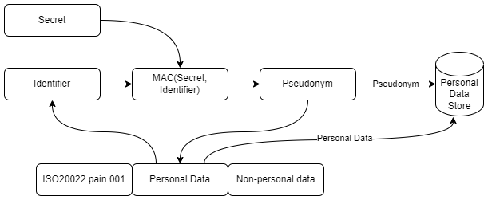

# Pseudonymisation of customer data

- [Pseudonymisation of customer data](#pseudonymisation-of-customer-data)
  - [Introduction and context](#introduction-and-context)
  - [Tazama risk assessment](#tazama-risk-assessment)
  - [Tazama requirements](#tazama-requirements)
    - [Tazama Pseudonymisation Policy](#tazama-pseudonymisation-policy)
    - [Tazama Pseudonymisation Techniques](#tazama-pseudonymisation-techniques)
    - [The MAC function](#the-mac-function)
    - [Personal Data to be pseudonymised](#personal-data-to-be-pseudonymised)
  - [Additional references and sources:](#additional-references-and-sources)

## Introduction and context

Psuedonymisation is the processing of personal data in such a manner that the personal data  
can no longer be attributed to a specific individual (data subject) without the use of additional information,  
provided that such additional information is kept separately and is subject to technical and  
organisational measures to ensure that the personal data are not linked to an identified or  
identifiable natural person.

Pseudonymisation is a de-identification process that has gained additional attention  
following the enforcement of GDPR and other Data Protection Acts, where it is referenced as both a security and data protection by design mechanism. Pseudonymisation can reduce the risk of data leading to an identifiable individual lowering some of the burdens of managing that data.

Pseudonymisation is distinguished from other data obfuscation techniques such as anonymisation (a process by which personal data is *irreversibly* altered in such a way that a data subject can no longer be identified directly or indirectly, either by the data controller alone or in collaboration with any other party) in that the process is reversible by an authorised user or process should the need arise.

In Tazama terms, we would want to hide personal any personally identifiable information in general through pseudonymisation and utilise pseudonymised data for customer profiling and only re-identify the customer (or parts of the customer’s data) if explicitly required for a specific rule, typology or investigation or reporting process.

A Tazama system operator might identify as a data processor or a data controller:

- As a data controller, the system operator determines the purposes (financial crime risk management through participant and transaction monitoring and investigations)
- As a data processor, the system operator processes personal data through the Tazama system for the established purpose (fraud risk management), on behalf of the data controller
- For completeness, and from a data processing perspective, Tazama system the following data processing activities, largely in an automated fashion:
  - **Collection**: Tazama will not likely collect data directly from a data subject, though may possibly obtain data about a data subject from a third party such as a switching hub or DFSP
  - **Recording**: Tazama will definitely keep a record of personal data obtained from a source system
  - **Organisation, structuring, alignment and combination**: Tazama will likely organise personal data during preparation and monitoring activities and will, through the Payment Platform Adapter, structure incoming personal data in a non-ISO-compliant format into an ISO-compliant format.
  - **Storage**: Tazama will need to persist and retain personal data for prescribed periods and later retrieval, subject to storage limitation principles: Tazama will not be allowed to retain personal data for longer than it is required for financial crime risk management purposes (currently 13 months, if no suspicious behaviour has been detected)
  - **Adaptation or alteration**: Tazama may reformat or enrich personal data for use during monitoring activities. Additionally, any annotations to assist rules and typology processing or entity resolution, will fall under this category. Data subjects are also able to exercise the right to rectification which will further require alteration of processed personal data.
  - **Retrieval**: Tazama will need to retrieve personal data that had previously been stored as part of the evaluation of historical data for behavioural modelling and scoring purposes, and also to support processes for investigations and regulatory reporting.
  - **Consultation**: Tazama will not be directly involved in consultation (i.e. discussing a data subject’s personal data); however data contained in Tazama may be retrieved for consultation during investigations.
  - **Use**: Tazama will use the personal data obtained, stored and/or retrieved by the system for the sole and exclusive purpose of financial crime risk management. No other purposes will be allowed.
  - **Disclosure by transmission, dissemination or otherwise making available**: Tazama may be required to share personal data with regulators, or with the regulated entities responsible for managing financial crime risk on behalf of, or related to, a data subject.
  - **Restriction**: Tazama may, on the instruction of a legal authority or administrative process, be required to restrict processing of a particular data subject’s personal data on a permanent or temporary basis. Restriction of personal data processing will inevitably require that some of the data subject’s personal data is obtained, stored and/or retrieved to manage the execution of the restriction.
  - **Erasure and destruction**: In general, Tazama will be required to erase, and eventually purge, any personal data that is no longer required, provided proscribed and legally mandated retention periods have passed.

*References*:

[https://www.termsfeed.com/blog/gdpr-processing-activities/](https://www.termsfeed.com/blog/gdpr-processing-activities/)

[https://www.freeprivacypolicy.com/blog/gdpr-processing-activities-examples](https://www.freeprivacypolicy.com/blog/gdpr-processing-activities-examples)

The European Union Agency for Cybersecurity (ENISA) drafted a [pseudonymisation and best practices guide](https://www.enisa.europa.eu/publications/pseudonymisation-techniques-and-best-practices/at_download/fullReport) that outlines 5 scenarios for pseudonymisation, detailed here: [Operating Scenarios Background](02-operating-scenarios-background.md)

**Scenario 2** (Processor involved in pseudonymisation) most closely reflects personal data processing within Tazama. The Tazama system operator functions as both a data controller and data processor, though a source system such as a DFSP or a switching hub (i.e. Mojaloop) will likely also fulfil both data processor and data controller roles. Due to the nature of the financial crime risk management, a DFSP or switching hub must submit unmasked personal data to the Tazama system so that the unmasked personal data can be used for the purpose of financial crime risk management; however the data must then be pseudonymised within the Tazama system to provide the required personal data protection.

The selection of the right approach to pseudonymisation is important: [Attacks on Pseudonymisation](03-attacks-on-pseudonymisation.md)

There are a number of techniques available for pseudonymisation: [Pseudonymisation Techniques](04-pseudonymisation-techniques.md)

Pseudonymisation must be governed by one or more appropriate policies: [Pseudonymisation Policies](05-pseudonymisation-policies.md)

## Tazama risk assessment

Personal data in Tazama may be vulnerable to the following risks:

1. Due to the sensitive nature of the financial crime risk monitoring process, all aspects of the monitoring service is logged and logs will be available for inspection by operators of the system for operational purposes. Personal data that is not pseudonymised may be exposed to unauthorised users, or insiders with links to the criminals that the system aims to detect.
2. A data breach may expose the personal data information stored in the system. Pseudonymisation of personal data provides an additional layer of protection in the event that data is leaked.
3. A third party may retrieve data from the Tazama system for investigation purposes, but if data is retrieved beyond the scope of the third party’s authority, the third party may retrieve data that it is not directly privy to. Pseudonymisation of personal data would allow the third party to reverse the pseudonymisation for only the data it has authority over, while maintaining the protection of personal data over which the third party does not have authority over.

## Tazama requirements

- Personal data that can be used to identify data subjects must be pseudonymised as soon as is feasible in the data pipeline. The purpose of the pseudonymisation is to protect the identity of the individuals involved in a transaction as transactions are screened for financial crime risk.

**Figure 1***: Sequence for creation of a pseudonym*

- Due to the need to retrieve historical transactions related to a specific individual, certain rules processors must be able to retrieve ALL the historical transactions related to a specific person, regardless of the number of pseudonyms that had been generated to obfuscate the personal data for that person across multiple transactions (e.g. through randomised pseudonymisation).

- Some typology rules may require access to the identifying personal data of a data subject to perform an evaluation of the specific information. These rules must be able to retrieve the information, reverse the pseudonymisation and perform the evaluation. Personal data thus exposed may not be transmitted beyond the scope of the specific rules processor.

- A pseudonym must be reversed to reveal (recover) the identifying personal data when the data is retrieved for regulatory reporting purposes.

- A pseudonym must be reversed during an investigation when the investigation has reached a stage where the visibility of identifiable information is deemed necessary.

- A pseudonym must be able to be unambiguously reversed to reveal (recover) the underlying identifying personal data.

- A pseudonym must not be able to be reversed without the appropriate secrets or keys.

  - The size of the pseudonym should be fixed for all identifiers regardless of length.

- The pseudonymisation approach must not hamper overall system performance in a significant way. The impact on performance and processing cost must be less than 1% of the over-all processing delay and operating cost of the system.

### Tazama Pseudonymisation Policy

Considering the requirements, the most appropriate policy for pseudonymisation in Tazama appears to be deterministic pseudonymisation:

- Collisions introduced by randomisation may result in ambiguous reversal, unless the randomisation method is focused on effectively eliminating collisions or if the pseudonymisation service checks for collisions at the time of pseudonymisation.

- The ability to retrieve history for a person with multiple pseudonyms will be prohibitively complex and computationally expensive.

- Deterministic pseudonymisation has some limitations in terms of scale, but with a sufficiently large pseudonym range, this should not be an issue.

### Tazama Pseudonymisation Techniques

A straight-forward counter could be used to pseudonymise personal data, though the range of information that would have to be individually pseudonymised would require the management of multiple counters simultaneously and the sequential nature of the counters allows for sub-optimal protection. Some form of randomisation is recommended.

Similarly, though to a lesser degree, straightforward hashing (MD5, SHA, etc) also does not protect personal data from brute force attacks sufficiently.

Message Authentication Codes offers a more secure way to generate a pseudonym, and also creates the opportunity to pseudonymise personal data in different groups by using a separate secret.

Regardless of the method selected, with the exception of encryption, the use of a lookup or mapping table is inevitably required to reverse the pseudonymisation. As such, we do not expect to have to extract the pseudonymised personal data from the pseudonym itself.

### The MAC function

[https://en.wikipedia.org/wiki/Message_authentication_code](https://en.wikipedia.org/wiki/Message_authentication_code)

[https://cryptobook.nakov.com/mac-and-key-derivation](https://cryptobook.nakov.com/mac-and-key-derivation)

### Personal Data to be pseudonymised

Effectively, the entire transaction is personal data that belongs to the customer, i.e. who the customer is, who their DFSP is, whom they paid, and how much they paid. Some of this information can, and should, be effectively pseudonymised without impacting the utility of the information in relation to financial crime risk management. Some information can remain exposed, provided personal identifying information is protected, to provide for higher utility of that information, for example the amount of a transaction is used in a wide variety of typologies and evaluated across a multitude of rules and it makes sense for this data to remain in its original format, provided information related to the customer’s identity is pseudonymised.

For some personal data, such as the name of a customer, it makes sense to pseudonymise the individual data attribute. For other types of personal data, such as an address, it may make sense to pseudonymise the entire data structure, including all data attributes that constitute the address.

Instead of specifying explicit fields from specific messages for pseudonymisation, from a functional perspective, the pseudonymisation of a field, or group of fields, should be configurable within NiFi through a specialised pseudonymisation processor. The system operator will configure the pseudonymisation processor to pseudonymise a field, or group of fields, by dropping the processor into the data stream, outlining the scope of the pseudonymisation and specifying the secret for the pseudonymisation. The processor should then prepare the service functionality for hosting the protected data, the pseudonym lookup.mapping table and the protocol for reversing the pseudonymisation.

When a new data stream (ISO 20022 message) is added to the Tazama Transaction Monitoring Service, the personal data requiring pseudonymisation must be identified and a pseudonymisation processor must be added to the data stream for each, or each group, of fields.

It should also be possible, though probably not generally desirable, to nest multiple layers of pseudonymisation.

For example, the fields in the ISO 20022 pain.001.001.10 message that should be pseudonymised are:

- GroupHeader.InitiatingParty (all sub-fields)
- PaymentInformation.Debtor (all sub-fields)
- PaymentInformation.DebtorAccount, including the fields:
  - CustomerCreditTransferInitiationV11.PaymentInformation.DebtorAccount.Identification.Other.Identification
  - CustomerCreditTransferInitiationV11.PaymentInformation.DebtorAccount.Identification.Other.Identification.SchemeName.Proprietary
  - CustomerCreditTransferInitiationV11.PaymentInformation.DebtorAccount.Name
  - CustomerCreditTransferInitiationV11.PaymentInformation.DebtorAgent.FinancialInstitutionIdentification.ClearingSystemMemberIdentification.MemberIdentification
- PaymentInformation.CreditTransferTransactionInformation.Creditor (all sub-fields)
- PaymentInformation.CreditTransferTransactionInformation.CreditorAccount, including the fields:
  - CustomerCreditTransferInitiationV11.PaymentInformation.CreditTransferTransactionInformation.CreditorAccount.Identification.Other.Identification
  - CustomerCreditTransferInitiationV11.PaymentInformation.CreditTransferTransactionInformation.CreditorAccount.Identification.Other.Identification.SchemeName.Proprietary
  - CustomerCreditTransferInitiationV11.PaymentInformation.CreditTransferTransactionInformation.CreditorAccount.Name
  - CustomerCreditTransferInitiationV11.PaymentInformation.CreditTransferTransactionInformation.CreditorAgent.FinancialInstitutionIdentification.ClearingSystemMemberIdentification.MemberIdentification
- CustomerCreditTransferInitiation.PaymentInformation.CreditTransferTransaction.RemittanceInformation.Unstructured

## Additional references and sources:

[https://www.gsma.com/iot/wp-content/uploads/2019/02/Protecting-Privacy-big-data-report-gsma.pdf](https://www.gsma.com/iot/wp-content/uploads/2019/02/Protecting-Privacy-big-data-report-gsma.pdf)

[https://www.ncbi.nlm.nih.gov/pmc/articles/PMC4350982/](https://www.ncbi.nlm.nih.gov/pmc/articles/PMC4350982/)

[https://arxiv.org/pdf/1912.05861.pdf](https://arxiv.org/pdf/1912.05861.pdf)
