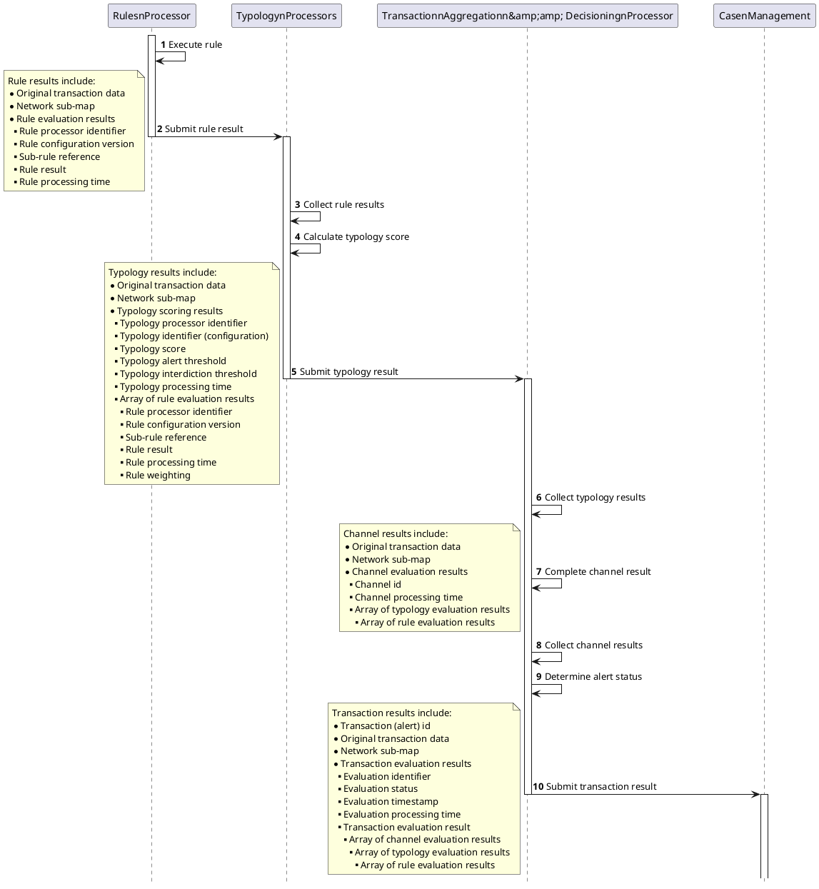

# Processor results propagation

- [Processor results propagation](#processor-results-propagation)
  - [Processor results sequence diagram](#processor-results-sequence-diagram)
  - [Processor results flow](#processor-results-flow)
  - [Processor results formatting](#processor-results-formatting)
    - [Rule processor results](#rule-processor-results)
    - [Typology processor results](#typology-processor-results)
    - [CADProc results](#cadproc-results)
    - [TADProc results](#tadproc-results)
  - [Sample TADProc result](#sample-tadproc-result)

## Processor results sequence diagram

Array of rule evaluation results


1. Each rule processor delivers its results to the Typology Processor.
2. The typology processor aggregates the results from a number of rules associated with a specific typology into a typology result.
3. The Channel Aggregation & Decisioning Processor (CADProc) .
4. The Transaction Aggregation & Decisioning Processor (TADProc) will first aggregate the results from a number of typologies associated with a specific channel into a channel result and will then aggregate the results from a number of channels associated with a specific transaction into a final result.
5. The network map contains the overall structure and relationship between the transaction, channels, typologies and rules.
6. The structure of the results maps exactly to the network map. The specific processor id, including the version, as well as the specific config version that was used to execute a processor is included in the processor results to account for situations where the same processor may be called with different versions or configurations to evaluate a transaction.

## Processor results flow


1. As a transaction progresses through the evaluation pipeline, the results from each processor should be wrapped around the results from a previous processor:
2. ruleResults {} are issued from a rule processor
3. In the typology processor, the ruleResults are wrapped inside the typology results:  
    typologyResults {ruleResults[1..n]}
4. In CADProc, the typology results are wrapped inside the channel results:  
    channelResults {typologyResults[1..n] {ruleResults[1..n]}}
5. Finally, in TADProc, the typology results are first wrapped inside the channel results:  
    channelResults {typologyResults[1..n] {ruleResults[1..n]}}  
    and then the channel results are wrapped inside the transaction results:  
    transactionResults {channelResults[1..n] {typologyResults[1..n] {ruleResults[1..n]}}}

## Processor results formatting

### Rule processor results

All rule processor results must contain the following information:

Original transaction +

Network map +

“ruleResult”:

```json
                            {
                                "id": "002@1.0.0",
                                "cfg": "1.0.0",
                                "subRuleRef": ".01",
                                "result": true,
                                "reason": "Debtor received < 10 transactions within the last 72 hours"
                            }
```

| **Field** | **Source** | **Example** |
| --- | --- | --- |
| ruleResult.id | Rule ID from networkMap.messages[0].channels[0].typologies[0].rule[0].id including the “@version” part. | 028@1.0.0 |
| ruleResult.cfg | Rule config version from networkMap.messages[0].channels[0].typologies[0].rule[0].cfg | 1.0.0 |
| ruleResult.subRuleRef | The specific sub-rule reference for the rule result based on the execution of the rule processor. | .01 |
| ruleResult.result | The boolean outcome of the rule evaluation based on the execution of the rule processor. | true |
| ruleResult.reason | The descriptive reason for the rule result based on the execution of the rule processor. | Debtor received < 10 transactions within the last 72 hours |

### Typology processor results

All typology processor results must contain the following information:

Original transaction +

Network map +

“typologyResult”:

```json
                    {
                        "id": "001@1.0.0",
                        "cfg": "1.0.0",
                        "result": 600,
                        "ruleResults": [
                            {
                                "id": "002@1.0.0",
                                "cfg": "1.0.0",
                                "subRuleRef": ".01",
                                "result": true,
                                "reason": "Debtor received < 10 transactions within the last 72 hours"
                            },
                            {
                                "id": "016@1.0.0",
                                "cfg": "1.0.0",
                                "subRuleRef": ".01",
                                "result": true,
                                "reason": "Creditor received >= 10 transactions within the last 24 hours"
                            },
                            {
                                "id": "026@1.0.0",
                                "cfg": "1.0.0",
                                "subRuleRef": ".01",
                                "result": true,
                                "reason": "Accumulation and rapid disbursement detected in debtor account"
                            },
                            {
                                "id": "044@1.0.0",
                                "cfg": "1.0.0",
                                "subRuleRef": ".01",
                                "result": true,
                                "reason": "No prior successful and complete outgoing transactions from the debtor found"
                            },
                            {
                                "id": "048@1.0.0",
                                "cfg": "1.0.0",
                                "subRuleRef": ".01",
                                "result": true,
                                "reason": "Transaction amount >= 1 but less then 2 standard deviations from historical maximum"
                            }
                        ]
                    }
```

| **Field** | **Source** | **Example** |
| --- | --- | --- |
| typologyResult.id | Typology ID from networkMap.messages[0].channels[0].typologies[0].id including the “@version” part. | 028@1.0.0 |
| typologyResult.cfg | Typology config version from networkMap.messages[0].channels[0].typologies[0].cfg | 1.0.0 |
| typologyResult.result | Typology score calculated by the typology processor based on the rule results and typology configuration information. | 500 |
| typologyResult.threshold | Note: The typology processor only retrieves the typology threshold information from the typology configuration if the platform is configured to interdict a transaction from the typology processor.<br><br>If the platform is not configured to interdict a transaction from the typology processor, this value will only be read from the transaction configuration by the TADProc.<br><br>The typology processor must only add this field to the output if the platform is configured for interdiction and then set the value to the threshold read from the typology configuration file. If the platform is not configured for interdiction, this value must be omitted. | 500 |
| typologyResult.ruleResults | Collection of ruleResult objects submitted by rule processors | [ruleResult](https://frmscoe.atlassian.net/wiki/spaces/FRMS/pages/1741435/Processor+results+propagation#Rule-processor-results) |

### CADProc results

All CADProc results must contain the following information:

Original transaction +

Network map +

“channelResult”:

```json
            {
                "id": "001@1.0.0",
                "cfg": "1.0.0",
                "result": "Interdiction not configured",
                "typologyResults": [
                    {
                        "id": "001@1.0.0",
                        "cfg": "1.0.0",
                        "result": 600,
                        "threshold": 400,
                        "ruleResults": [
                            {
                                "id": "002@1.0.0",
                                "cfg": "1.0.0",
                                "subRuleRef": ".01",
                                "result": true,
                                "reason": "Debtor received < 10 transactions within the last 72 hours"
                            },
                            {
                                "id": "016@1.0.0",
                                "cfg": "1.0.0",
                                "subRuleRef": ".01",
                                "result": true,
                                "reason": "Creditor received >= 10 transactions within the last 24 hours"
                            },
                            {
                                "id": "026@1.0.0",
                                "cfg": "1.0.0",
                                "subRuleRef": ".01",
                                "result": true,
                                "reason": "Accumulation and rapid disbursement detected in debtor account"
                            },
                            {
                                "id": "027@1.0.0",
                                "cfg": "1.0.0",
                                "subRuleRef": ".01",
                                "result": true,
                                "reason": "Immediate transaction mirorring detected for debtor account"
                            },
                            {
                                "id": "045@1.0.0",
                                "cfg": "1.0.0",
                                "subRuleRef": ".01",
                                "result": true,
                                "reason": "First recorded successful and complete incoming transaction received by the creditor"
                            }
                        ]
                    },
                    {
                        "id": "002@1.0.0",
                        "cfg": "1.0.0",
                        "result": 400,
                        "threshold": 400,
                        "ruleResults": [
                            {
                                "id": "002@1.0.0",
                                "cfg": "1.0.0",
                                "subRuleRef": ".01",
                                "result": true,
                                "reason": "Debtor received < 10 transactions within the last 72 hours"
                            },
                            {
                                "id": "003@1.0.0",
                                "cfg": "1.0.0",
                                "subRuleRef": ".01",
                                "result": true,
                                "reason": "The creditor account has seen activity within the last 3 months"
                            }
                        ]
                    }
                ]
            }

```

| **Field** | **Source** | **Example** |
| --- | --- | --- |
| channelResult.id | Channel ID from networkMap.messages[0].channels[0].id including the “@version” part. | 001@1.0.0 |
| channelResult.cfg | Channel configuration from networkMap.messages[0].channels[0].cfg | 1.0.0 |
| channelResult.result | Hardcoded placeholder text<br><br>If interdiction is implemented, the CADProc may also be tasked to issue a “go” result based on the collective results of a number of typologies. The specific circumstances of such a result would be recorded in the channel result. | Interdiction not configured |
| channelResult.typologyResults | Collection of typologyResult objects submitted by the typology processor | [typologyResult](https://frmscoe.atlassian.net/wiki/spaces/FRMS/pages/1741435/Processor+results+propagation#Typology-processor-results) |

### TADProc results

All TADProc results must contain the following information:

Original transaction +

Network map +

“transactionResult”:

```json
{
        "resultId": "cbd3b57a-e659-4e54-8b45-36fbd56cd50c",
        "dateTime": "2021-12-02T12:45:57.000Z",
        "id": "004@1.0.0",
        "cfg": "1.0.0",
        "status": "ALRT",
        "description": "Alert triggered",
        "channelResults": [
            {
                "id": "001@1.0.0",
                "cfg": "1.0.0",
                "result": "Interdiction not configured",
                "typologyResults": [
                    {
                        "id": "001@1.0.0",
                        "cfg": "1.0.0",
                        "result": 600,
                        "threshold": 400,
                        "ruleResults": [
                            {
                                "id": "002@1.0.0",
                                "cfg": "1.0.0",
                                "subRuleRef": ".01",
                                "result": true,
                                "reason": "Debtor received < 10 transactions within the last 72 hours"
                            },
                            {
                                "id": "016@1.0.0",
                                "cfg": "1.0.0",
                                "subRuleRef": ".01",
                                "result": true,
                                "reason": "Creditor received >= 10 transactions within the last 24 hours"
                            },
                            {
                                "id": "026@1.0.0",
                                "cfg": "1.0.0",
                                "subRuleRef": ".01",
                                "result": true,
                                "reason": "Accumulation and rapid disbursement detected in debtor account"
                            },
                            {
                                "id": "044@1.0.0",
                                "cfg": "1.0.0",
                                "subRuleRef": ".01",
                                "result": true,
                                "reason": "No prior successful and complete outgoing transactions from the debtor found"
                            },
                            {
                                "id": "048@1.0.0",
                                "cfg": "1.0.0",
                                "subRuleRef": ".01",
                                "result": true,
                                "reason": "Transaction amount >= 1 but less then 2 standard deviations from historical maximum"
                            }
                        ]
                    },
                    {
                        "id": "002@1.0.0",
                        "cfg": "1.0.0",
                        "result": 700,
                        "threshold": 400,
                        "ruleResults": [
                            {
                                "id": "001@1.0.0",
                                "cfg": "1.0.0",
                                "subRuleRef": ".01",
                                "result": true,
                                "reason": "The derived creditor account age is less than 1 day"
                            },
                            {
                                "id": "016@1.0.0",
                                "cfg": "1.0.0",
                                "subRuleRef": ".01",
                                "result": true,
                                "reason": "Creditor received >= 10 transactions within the last 24 hours"
                            },
                            {
                                "id": "026@1.0.0",
                                "cfg": "1.0.0",
                                "subRuleRef": ".01",
                                "result": true,
                                "reason": "Accumulation and rapid disbursement detected in debtor account"
                            },
                            {
                                "id": "044@1.0.0",
                                "cfg": "1.0.0",
                                "subRuleRef": ".01",
                                "result": true,
                                "reason": "No prior successful and complete outgoing transactions from the debtor found"
                            },
                            {
                                "id": "045@1.0.0",
                                "cfg": "1.0.0",
                                "subRuleRef": ".01",
                                "result": true,
                                "reason": "First recorded successful and complete incoming transaction received by the creditor"
                            }
                        ]
                    }
                ]
            }
        ]
    }
```

| **Field** | **Source** | **Example** |
| --- | --- | --- |
| transactionResult.resultId | Auto-generated UUIDv4 to identify the transaction result to down-stream applications | b5ef6a1d-59cd-4b95-87b0-45bee27224dd |
| transactionResult.dateTime | The time at which the result was completed | 2021-12-02T12:45:57.000Z |
| transactionResult.id | Message ID from networkMap.messages[0].id including the “@version” part. | 001@1.0.0 |
| transactionResult.cfg | Transaction configuration from networkMap.messages[0].cfg | 1.0.0 |
| transactionResult.status | If any typology had breached their threshold, the value is “ALRT”.<br><br>If no typology had breached their threshold, the value is “NALT”. | ALRT |
| transactionResult.description | Description related to the status:<br><br>ALRT - Alert triggered<br><br>NALT - No alert triggered | Alert triggered |
| transactionResult.channelResults | Collection of channelResult objects submitted by the CADProc | [channelResult](https://frmscoe.atlassian.net/wiki/spaces/FRMS/pages/1741435/Processor+results+propagation#CADProc-results) |
| transactionResult.channelResults[i].typologyResults[i].threshold | The typology alert trigger threshold is read from the transaction configuration file for each typology and recorded against the typology result to which the threshold applies. | 500 |

## Sample TADProc result

[TADPROC_Response_v0.14_20211209.json](./TADPROC_Response_v0.14_20211209.json)
