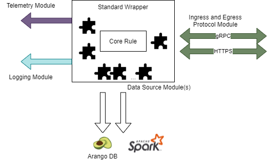

# Component Block Diagram (API's)

The purpose is to provide a high-level view of the services (API’s) within the Tazama system and a short description for each of the services.

Figure 1 - High-level overview of the services (API) within the Tazama system
