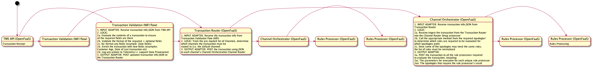

# Sequence Flows

List of Sequence Flows (this does not have all the detailed logic at least not yet)

1. Transaction Routing
2. Transaction Validation
3. Channel Routing
4. Service Routing
5. Transaction Aggregation
6. Rules Processing
7. Typology Processing
8. Channel Scoring
9. Transaction Decisioning

## Transaction Routing

1. Processor/Function: Transaction Router (OpenFaaS)
2. Type of Instances: 1 per transaction
    1. For this PI: just 1
3. Input (invokes the OpenFaaS function): From the NIFI
4. Logic: Details in the UML diagram
5. Output:
    1. To the Channel Router (inside of Channel Orchestrator)
        1. How: Call Function (API for this PI)
        2. What: Send JSON (transaction info)
    2. To Transaction Cache
        1. Write to Redis
        2. What: Transaction details

## Transaction Validation

1. Processor/Function: NIFI (Flow + Data Processor)
2. On Launch: Read Transaction schema
3. Input: From TMS
4. Logic: Details in the UML diagram
    1. Validate transaction json against the schema
5. Output:
    1. To: Transaction Router
    2. How: Call Function(API for this PI)
    3. What: Validated Json

## Channel Routing

1. Processor/Function: Channel Orchestrator (OpenFaaS)
2. Input: From Transaction Router
3. Logic: Details in the UML diagram
    1. Typology Filtering (is a separate story; for now - pass through)
    2. Call Typologies (Get List of Rules)
    3. Rules de-duplication (is a separate story)
4. Output:
    1. To: Service Router
    2. How: Call method (in the same Channel Orchestrator Function)
    3. What: List of De-duped Rules (with rules details includes destination Typologies info)

## Service Routing

1. Processor/Function: Channel Orchestrator (OpenFaaS)
2. Input: From Channel Router
3. Logic: Details in the UML diagram
4. Output:
    1. To: Rules Function (One or more)
    2. How: Call Function (API for this PI)
    3. What: provide Transaction info + Target Typology Scoring Info

## Transaction Aggregation

1. Processor/Function: Transaction Decisioning Processor (OpenFaaS)
2. Input: From Channel Scoring Processor
3. Logic: Details in the UML diagram
    1. List of Rules, Typologies, Channel Scores that have been ran for a particular Txn
    2. Write transaction aggregation details to Transaction Datastore
4. Output:
    1. To: Transaction Decisioning (within the same Transaction Aggregation and Decisioning Processor)
    2. How: Call Method (in the same Transaction Decisioning Processor Function)
    3. What: Transaction Aggregation status

## Rules Processing

1. Processor/Function: Rules Processor (OpenFaaS)
2. Input: From Service Router
3. Logic: Details in the UML diagram
4. Output:
    1. To: Typology Scoring (Typology Processor)
    2. How: Call Function (API for this PI)
    3. What: Rules Result + Transaction Info

## Typology Processing

1. Processor/Function: Typology Processor (OpenFaaS)
2. Input: From Rules Processor
3. Logic: Details in the UML diagram
4. Output:
    1. To: Channel Scoring Processor
    2. How: Call Function (API for this PI)
    3. What: Typology Score + Transaction Info

## Channel Scoring

1. Processor/Function: Channel Scoring Processor (OpenFaaS)
2. Input: From Typology Processor
3. Logic: Details in the UML diagram
4. Output:
    1. To: Transaction Decisioning Processor
    2. How: Call Function (API for this PI)
    3. What: Channel Score + Transaction Info

## Transaction Decisioning

1. Processor/Function: Transaction Decisioning Processor
2. Input: From Transaction Aggregation (within the same Transaction Aggregation and Decisioning Processor)
3. Logic: Details in the UML diagram
    1. Transaction Decisioning Logic
4. Output:
    1. To: Transaction Interdiction
        1. How: Email or SMS
        2. What: JSON with transaction info (Red flags)
    2. To: Workflow Orchestration
        1. How: Target system not decided yet
        2. What: JSON with transaction info

## Overall Flow

