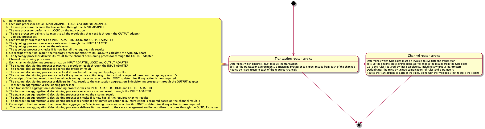

# Design Considerations

1. Concept of a Channel / Channel Orchestrator - The Channel Orchestrator will be a process that will manage the transactions flowing through the channel.
    1. Inputs to the Channel Orchestrator - The TMS API will send transactions to the Channel Orchestrator via an API call / invocation
    2. The Channel Orchestrator will be responsible for determining which Rules and / or Typologies to send the transaction to
    3. For MVP - for Channel A (Super fast channel 35ms processing time), there will be no DRY rules. If it is determined during end-to-end or performance testing that 35ms processing time is very difficult to achieve, then we will disable the Channel Orchestrator and send a transaction to all the Typologies that are part of the Channel A
    4. The Channel Orchestrator will be kept enabled for Channels B (and C)
    5. There will be a mapping between Typology and Channels
    6. There will be a mapping between Rules and Channels (both DRY and WET). You can argue that WET rules are part of Typology and Typology is mapped to a Channel but here is why I propose we have that mapping (between Rules and Channels)
        1. It will be much quicker to compute which WET rules belong to which Channel (and vice-versa)
    7. Typology = Mapping of what rules belong to it + WET Rules + Typology Scoring
2. ~~The Channel is just a concept and that is it. There will not be a Channel Processor (service) or a Channel Scoring (service).~~ The Channel is represented via a Channel Orchestrator (service)
    - [~~https://actiofrm.slack.com/archives/C01SHL2K62C/p1616143560006100?thread\_ts=1616143420.003700&cid=C01SHL2K62C~~](https://actiofrm.slack.com/archives/C01SHL2K62C/p1616143560006100?thread_ts=1616143420.003700&cid=C01SHL2K62C)
    - ~~They (Rules) are not needed if not in a typology, as long as that is expectation, we are aligned~~
    - ~~Rules are part of a Typology and Typology is part of a Channel. So effectively Rules are part of a Typology. But there will be no mapping between Rules and Channel.~~
    - It is the orchestration of the rules that will define some of this. A rule might be part of a number of typologies. When the typologies for a given rule in a channel = 0, then it is no longer needed. But that requires a mapping for rules and typologies
    - We will have channels based on the speed of processing and priority. Channel is just a group of Typologies and that mapping will be stored in a yaml config file.
    - Rules are part of a Typology and Typology is part of a Channel. So effectively Rules are part of a Typology. ~But there will be no mapping between Rules and Channel.~
    - ~~Typology = Mapping of what rules belong to it + Typology Scoring~~
3. Authentication / Authorization of various services - The Authentication / Authorization will only be at the point of Ingress (Payment Platform Adaptor for Mojaloop OR TazamaTMS for others). Between services (example: Rules Processor or Transaction Scoring) we will use the Linkerd service mesh for mTLS (no other explicit authorization/authentication) will be implemented.
    - [https://actiofrm.slack.com/archives/C01SHL2K62C/p1616143614006600?thread\_ts=1616143572.006500&cid=C01SHL2K62C](https://actiofrm.slack.com/archives/C01SHL2K62C/p1616143614006600?thread_ts=1616143572.006500&cid=C01SHL2K62C)
    - Engines are not exposed externally the TMS API is the only surface exposed ... although you still have to defeat the API gateway just to interact with it
    - To manage/update Rules is where [@Greg McCormick](https://actiofrm.slack.com/team/U01MPR00A68) proposed BPM tool (which should mean that you will be authenticated before you can view or change the rules)
4. Typology Processor will not execute any DRY Rules inside of it - It just has a map of what DRY rules belong to it. Typology Process will execute WET Rules inside of it
    - [https://actiofrm.slack.com/archives/C01SHL2K62C/p1616143955010300?thread\_ts=1616143877.009500&cid=C01SHL2K62C](https://actiofrm.slack.com/archives/C01SHL2K62C/p1616143955010300?thread_ts=1616143877.009500&cid=C01SHL2K62C)
    - Would state - it is more than a map, and the rules it needs output from rather than belong to it
    - This will be better explained in the session, once we can visualize the concept we are suggesting.
    - WET Rules will not be separate services. This will save on total execution time (WET Rules will execute within the Typology service)
5. ETL / Data Pipeline will not be part of the critical path. (I believe this is reflected in some of the diagrams) but want to make it explicit. TMS and Data Pipeline will happen in parallel
    - [https://actiofrm.slack.com/archives/C01SHL2K62C/p1616144125012900?thread\_ts=1616144069.012600&cid=C01SHL2K62C](https://actiofrm.slack.com/archives/C01SHL2K62C/p1616144125012900?thread_ts=1616144069.012600&cid=C01SHL2K62C)
    - Critical path = Transaction Monitoring Service
    - transaction comes through Payment Platform Adaptor = then it go into TMS and Data Pipeline in parallel
    - not helping then - if I need a data point in TMS and it needs to be extracted, it is in the critical path
    - If you need it inside any part of the TMS - then you can always query/call from outside of the TMS
    - If I need to urgently get the data, it becomes part of the critical path
    - May be I should not call it critical path. What i meant is that TMS and Data Pipeline will execute in parallel (rather than sequentially)
    - I cannot run rule X until I get the data from Data Pipeline.
    - Yes, example historic data or enriched data needed for that rule X. This will be more applicable to Channel B and C (slower channels that depend on that data). So rule X output will have to be persisted to a store until the data from the Data Pipeline is available - holding it in memory for hours - won't work. Expected volume of transactions will bloat the infrastructure need.
    - And the Typology Y that is mapped to Rule X will have wait as well. And it cannot occupy memory for hours. It will have to persisted too
    - Data Pipeline’s primary building block is the Data Processor. Data Processor will be implemented using NIFI (part of NIFI flow)
6. There will be ~~no~~ Channel Orchestration for the MVP. If it is determined that Channel Orchestration service makes it difficult to hit the Channel A (35ms) requirement then the Channel Orchestration is skipped/disabled. In that situation: A transaction will call all Active Rules. Reasons to skip/disable Channel Orchestration for Channel A for the MVP:
    - 5.1 We do not even have the logic for Channel Orchestration.
    - 5.2 It is an extra hop that we do not need (especially for 35ms total execution to produce a Transaction Score)
    - [https://actiofrm.slack.com/archives/C01SHL2K62C/p1616144977020300?thread\_ts=1616144909.019600&cid=C01SHL2K62C](https://actiofrm.slack.com/archives/C01SHL2K62C/p1616144977020300?thread_ts=1616144909.019600&cid=C01SHL2K62C)
    - End of MVP: PI4
    - Rob - to me Channel Orchestration is 1. creating / managing channels + 2. Knowing what rules are called for a particular transaction. For the MVP, we will go with 3 channels (not customizable). So pt 1 is handled. Pt.2 - We do not have the logic built for it. Even if we have the logic for it - it is an extra hop that we do not need (especially for 35ms commitment)
    - so channel orchestration is more operational? - Yes (We will go with a static list of Channels for MVP)
    - How do we know what rules are “fired” for a specified transaction?  
        We also need to keep track of the process since the output of the rules will need to be input for the Typologies required.  
        We need to keep track of the Typologies that was “fired”, to know when all is completed. That is only when the score for that transaction in that channel will be available. All the channels will then contribute to the final score for the transaction and more….  
        We need to keep track of the transaction and the current stage it is at. If at any stage a transaction is flagged, the appropriate notification will be returned without the need for the channel process to be completed.
    - Hi Henk - to add to your points - it is a little easier for Channel A - fast channel (35ms). But for Channel B and C - it will require persisting Rules and Typologies results to a store, until all of them are available to go into Transaction Scoring (Updating)
7. Related to pt.1 - Channel Scoring will happen as part of Transaction Scoring (inside the Transaction Scoring Processor)
    - [https://actiofrm.slack.com/archives/C01SHL2K62C/p1616145110021600?thread\_ts=1616144980.020600&cid=C01SHL2K62C](https://actiofrm.slack.com/archives/C01SHL2K62C/p1616145110021600?thread_ts=1616144980.020600&cid=C01SHL2K62C)
    - To me: Channel Scoring is an aggregation of Typology Scoring. If it is not needed (or understood by us) and not required to be provided to the client - I recommend we take it out of the architecture. The only value I see is that it could potentially provide inputs into the Data Science / ML models in the near future - but I am not certain of that
    - Whether we score a transaction against the typologies remains to be seen
    - I could live with that scoring being postponed - as we will have enough on a typology, making it an issue for Case management
    - If we can postpone that then great. My perspective - to avoid any processors, we can avoid. And if channel scoring is needed, we can implement it inside of the Transaction Scoring processor (whether now or later)
8. This applies to all the above points + the overall architecture: Every processing (processor) will cost time. And 35ms can get consumed very easily and quickly. So we should only have processors that are absolutely needed.
    - [https://actiofrm.slack.com/archives/C01SHL2K62C/p1616145960027800?thread\_ts=1616145931.027500&cid=C01SHL2K62C](https://actiofrm.slack.com/archives/C01SHL2K62C/p1616145960027800?thread_ts=1616145931.027500&cid=C01SHL2K62C)
    - part of the reason for classification of entities was to push off the need to run some rules
    - 35ms is a hard requirement - just not on 100% of the rules and typologies
9. Channel A will produce a transaction score. Channel B and Channel C will update the transaction score. The code will remain the same for Transaction Scoring service irrespective of which channel it belongs to. The difference in producing and updating will be via a config.
10. Typologies associated with Channel B or C cannot be only APIs because of the time they have to wait. The Invocation is an API call but actually implementation will involve API + other services (possibly scheduling/polling) especially when a Typology in Channel B or C could take many hours.
11. Some of the design requirements of a Rule:
    1. Serializable
    2. Rules in Channel A have to be denormalized (it cannot depend on another rule).
        1. Rule will have a field that indicates it is denormalized
12. The Typology(ies) that a Rule is associated knows if the Rule is normalized or not
13. ~~When a Typology is deployed (Commissioned) it reads the~~ `Typology to Rules map` ~~and discovers if all the required Rules are deployed or not. If any of the required Rules are not deployed, then the Typology calls the deployment of those Rules~~
14. Channel A to only have “DRY” rules - rules that are denormalized (and not dependent on each other)
15. The purpose of the channel architecture is:
    - prioritise the allocation of limited resources to achieve high speed throughput where necessary;
    - group rules and typologies according to priority;
    - avoid the unnecessary invocation of all rule and typology processors;
    - achieve a modular and extensible architecture with functional separation by design;

