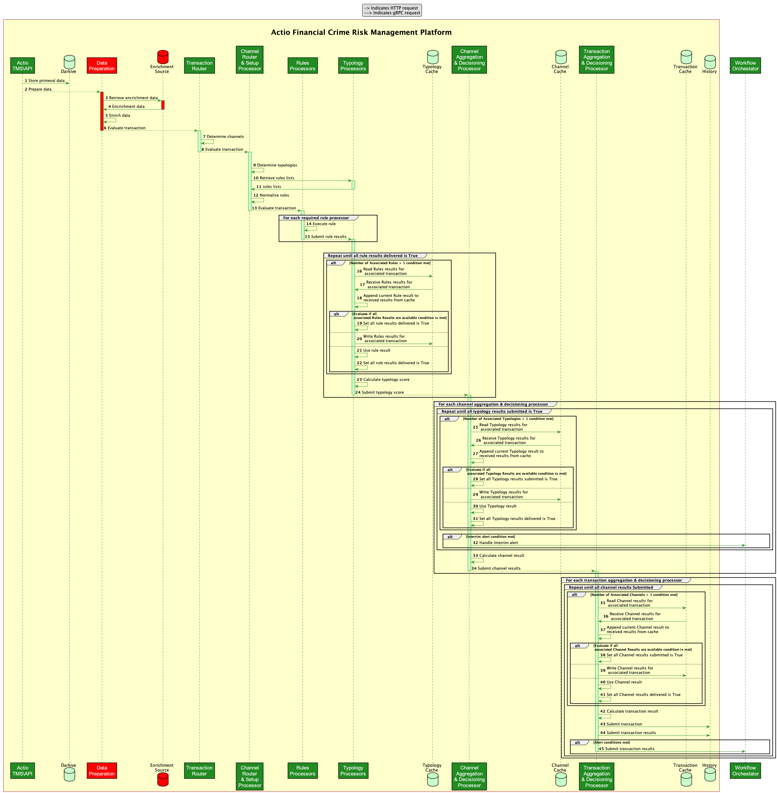
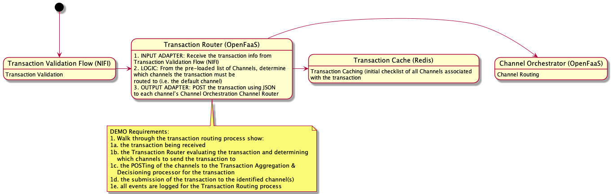
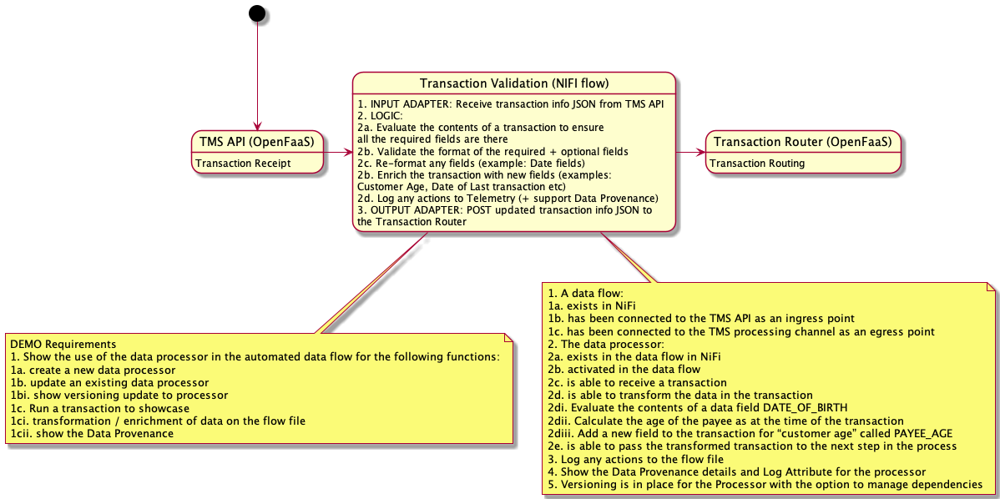
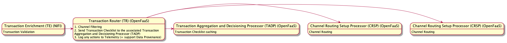
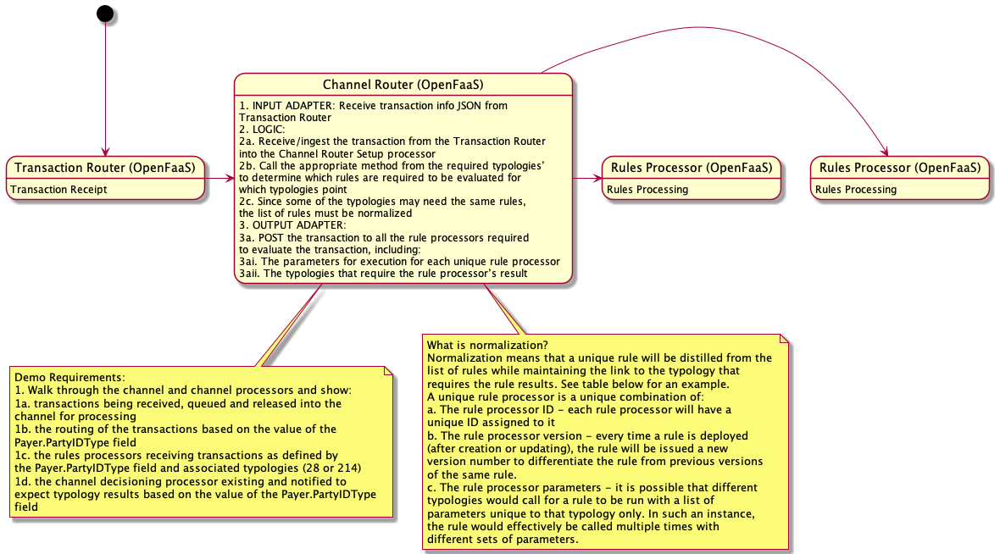
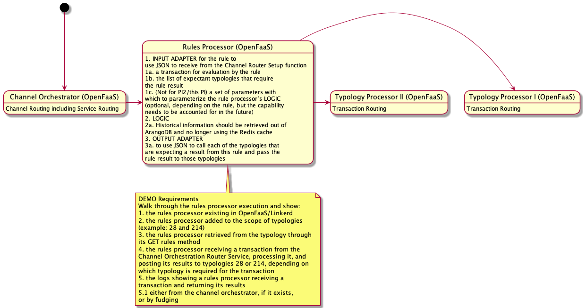
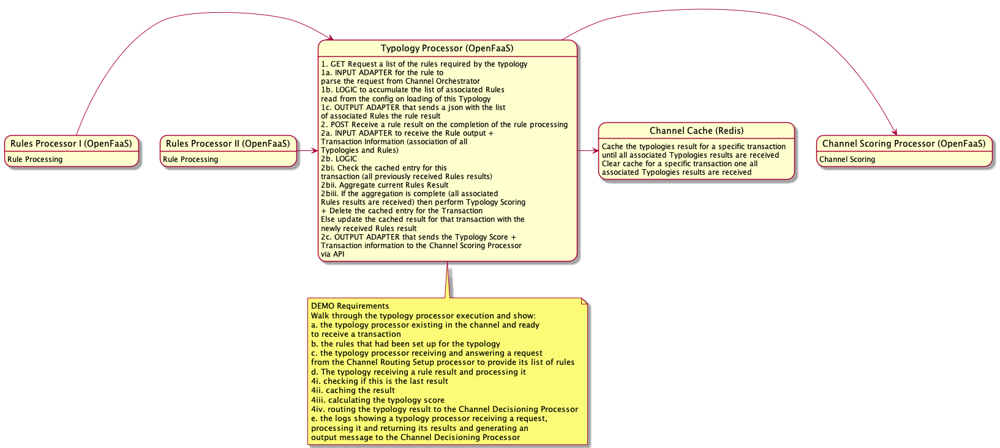
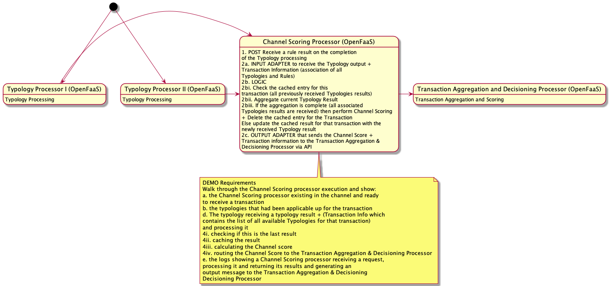
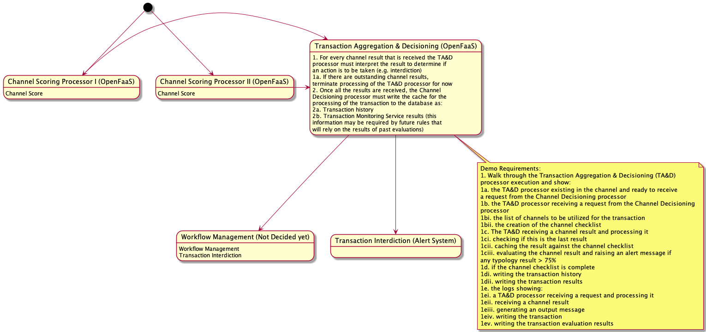

# Platform Components

- [Platform Components](#platform-components)
  - [Transaction Monitoring Service (TMS API)](#transaction-monitoring-service-tms-api)
  - [Data Preparation - Transaction Enrichment (TE)](#data-preparation---transaction-enrichment-te)
  - [Transaction Router (TR)](#transaction-router-tr)
  - [Channel Routing Setup Processor (CRSP)](#channel-routing-setup-processor-crsp)
  - [Rules Processor (RP)](#rules-processor-rp)
  - [Typology Processor (TP)](#typology-processor-tp)
  - [Channel Aggregation and Decisioning Processor (CADP)](#channel-aggregation-and-decisioning-processor-cadp)
  - [Transaction Aggregation and Decisioning Processor (TADP)](#transaction-aggregation-and-decisioning-processor-tadp)

Tazamaplatform has the following implementation components:

1. Transaction Monitoring Service (TMS API)
2. Data Preparation (DP)
    1. Transaction Enrichment (TE)
3. Evaluation Routing
    1. Transaction Router (TA)
    2. Channel Routing Setup Processor (CRSP)
4. Evaluation
    1. Rules Processor (RP)
5. Aggregation and Decisioning
    1. Typology Processor (TP)
    2. Channel Aggregation and Decisioning Processor (CADP)
    3. Transaction Aggregation and Decisioning Processor (TADP)

## Transaction Monitoring Service (TMS API)

1. Processor/Function: Transaction Monitoring Service (OpenFaaS)
2. Input (invokes the OpenFaaS function): From one of the following:
    1. External to the platform
    2. Payment Platform Adapter (PPA)
    3. Custom Input Transformation Adapter (CITA)
3. Logic:
    1. Evaluate the contents of a transaction to ensure all the required fields are there
    2. Validate the format of the required + optional fields
    3. Re-format any fields (example: Date fields)
4. Output:
    1. To: Transaction Enrichment (TE)
        1. How: NIFI Processor API Call
        2. What: JSON with Transaction info

## Data Preparation - Transaction Enrichment (TE)

1. Processor/Function: Transaction Enrichment Flow + Data Processor (NIFI)
2. Input: From TMS API
3. Logic:
    1. Enrich the transaction with new fields (examples:
        1. Customer Age, Date of Last transaction etc)
    2. Perform transformation
        1. Optimize performance
        2. Pseudonymisation of data
    3. Log any actions to Telemetry (+ support Data Provenance)
4. Output:
    1. To: Transaction Router (TR)
        1. How: gRPC Call
        2. What: Proto file containing pseudonymised ISO formatted JSON with Transaction Info

## Transaction Router (TR)

1. Processor/Function: Transaction Router (OpenFaaS)
2. Input: From Transaction Enrichment (TE) (NIFI)
3. Logic:
    1. Channel Filtering
    2. Send Transaction Checklist to the associated Transaction Aggregation and Decisioning Processor (CRSP)
    3. Log any actions to Telemetry (+ support Data Provenance)
4. Output:
    1. To: one or more associated Channel Routing Setup Processors (CRSPs)
        1. How: API Call
        2. What: JSON with Transaction info
    2. To: Transaction Aggregation and Decisioning Processor (TADP)
        1. How: API Call
        2. What: Transaction Checklist (list of all the Channel Scores to expect)

## Channel Routing Setup Processor (CRSP)

1. Processor/Function: Channel Routing Setup Processor (OpenFaaS)
2. Input: From Transaction Router (TR)
3. Logic:
    1. Typology Filtering
    2. Call all associated Typology Processors (TPs) (Get List of Rules)
    3. Rules de-duplication
    4. Send Channel Checklist to the associated Channel Aggregation and Decisioning Processor (CRSP)
    5. Send Typology Checklist to all the associated Typology Processors (TPs)
    6. Log any actions to Telemetry (+ support Data Provenance)
4. Output (Service Routing):
    1. To: one or more associated Rules Processors (RPs)
        1. How: API Call
        2. What: JSON with Transaction info + Target Typology(ies) Info
    2. To: Channel Aggregation and Decisioning Processor (CADP)
        1. How: API Call
        2. What: Channel Checklist (list of all the Typology Scores to expect)
    3. To: All the associated Typology Processors (TPs)
        1. How: API Call
        2. What: Typology Checklist (list of all the Rules Results to expect)

## Rules Processor (RP)

1. Processor/Function: Rules Processor (OpenFaaS)
2. Input: From Service Router
3. Logic:
    1. Rules logic is pre-loaded into the Rules Processor
    2. Transaction information + List of target Typologies is received in the Rules Processor
    3. Historic information required for Rules logic is retrieved from ArangoDB
    4. Rules result is computed
    5. Log any actions to Telemetry (+ support Data Provenance)
4. Output:
    1. To: all associated Typology Processors (TPs)
        1. How: API Call
        2. What: JSON with Rules Result + Transaction Info

## Typology Processor (TP)

1. Processor/Function: Typology Processor (TP) (OpenFaaS)
2. Input:
    1. From Channel Routing Setup Processor (CSRP) (Service Routing functionality)
    2. From One or more Rules Processors (RPs)
3. Logic:
    1. JSON that contains Checklist (Typology Checklist) of the following that have been ran for a particular Txn from the Channel Routing Setup Processor (CRSP)
        1. associated Rules
    2. On the receipt of the JSON (contains the Rule Result) from any of the RPs, it counts the number of Rules Results received for that transaction (it will be one Rule Result for the first JSON receipt). If that count = total count of all the associated Rules for that Typology for the associated transaction
        1. THEN
            1. perform Typology Scoring
            2. Send Typology Score info to Channel Aggregation and Decisioning Processor (CADP)
        2. ELSE
            1. check to see if interdiction/alert needs to be sent. IF
                1. YES: Send info the Transaction Interdiction
                2. NO: cache (to the Typology Datastore) the received JSON (tagged with the transaction id)
    3. Log any actions to Telemetry (+ support Data Provenance)
4. Output:
    1. To: Transaction Interdiction
        1. How: Email or SMS
        2. What: JSON with transaction info (Red flags)
    2. To: Channel Aggregation and Decisioning Processor (CADP)
        1. How: API Call
        2. What: JSON with Typology Score
    3. To: Typology Datastore
        1. How: cache write
        2. What: Rule Result for that Typology for the associated Transaction

## Channel Aggregation and Decisioning Processor (CADP)

1. Processor/Function: Channel Aggregation and Decisioning Processor (CADP) (OpenFaaS)
2. Input:
    1. From Channel Routing Setup Processor (CSRP)
    2. From One or more Typology Processors (TPs)
3. Logic:
    1. JSON that contains Checklist (Channel Checklist) of the following that have been ran for a particular Txn from the Channel Routing Setup Processor (CRSP)
        1. associated Rules
        2. associated Typologies
    2. On the receipt of the JSON (contains the Typology Score) from any of the TPs, it counts the number of Typology Scores received for that transaction (it will be one Typology score for the first JSON receipt). If that count = total count of all the associated Typologies for that Channel for the associated transaction
        1. THEN
            1. perform Channel Decisioning (Channel Score)
            2. Send Channel Decision info to Transaction Aggregation and Decisioning Processor (TADP)
        2. ELSE
            1. check to see if interdiction/alert needs to be sent. IF
                1. YES: Send info the Transaction Interdiction
                2. NO: cache (to the Channel Datastore) the received JSON (tagged with the transaction id)
    3. Log any actions to Telemetry (+ support Data Provenance)
4. Output:
    1. To: Transaction Interdiction
        1. How: Email or SMS
        2. What: JSON with transaction info (Red flags)
    2. To: Transaction Aggregation and Decisioning Processor (TADP)
        1. How: API Call
        2. What: JSON with Channel Decision (Channel Score)
    3. To: Channel Datastore
        1. How: cache write
        2. What: Typology Score for that Channel for the associated Transaction

## Transaction Aggregation and Decisioning Processor (TADP)

1. Processor/Function: Transaction Aggregation and Decisioning Processor (TADP) (OpenFaaS)
2. Input:
    1. From Transaction Router (TR)
    2. From One or more Channel Aggregation and Decisioning Processors (CADPs)
3. Logic:
    1. JSON that contains Checklist (Transaction Checklist) of the following that have been ran for a particular Txn from the Transaction Router (TR)
        1. associated Rules
        2. associated Typologies
        3. associated Channels
    2. On the receipt of the JSON (contains the Channel Score) from any of the CADPs, it counts the number of Channel Scores received for that transaction (it will be one Channel score for the first JSON receipt). If that count = total count of all the associated Channels for the transaction
        1. THEN
            1. perform Transaction Decisioning (Transaction Score)
            2. Send Transaction Decision info to Workflow Orchestration
        2. ELSE
            1. check to see if interdiction/alert needs to be sent. IF
                1. YES: Send info the Transaction Interdiction
                2. NO: cache (to the Transaction Datastore) the received JSON (tagged with the transaction id)
    3. Log any actions to Telemetry (+ support Data Provenance)
4. Output:
    1. To: Transaction Interdiction
        1. How: Email or SMS
        2. What: JSON with transaction info (Red flags)
    2. To: Workflow Orchestration
        1. How: Target system not decided yet
        2. What: JSON with Transaction Decision (Transaction Score)
    3. To: Transaction Datastore
        1. How: cache write
        2. What: Channel Score for the associated Transaction

