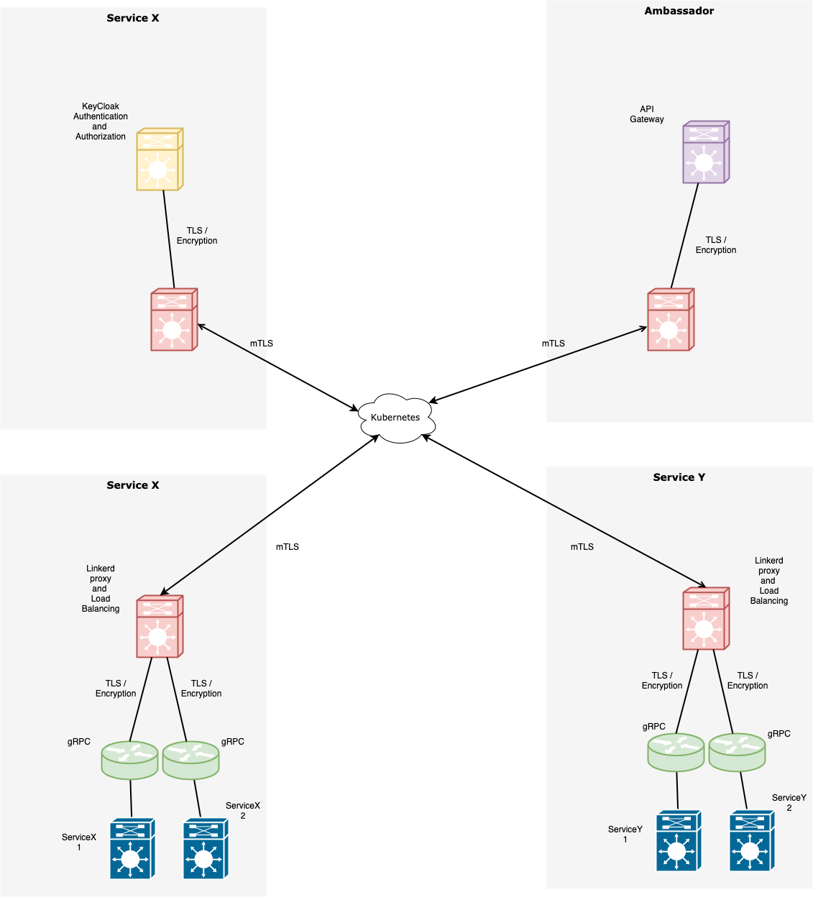
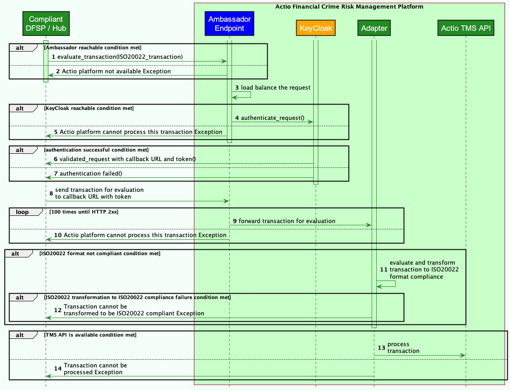
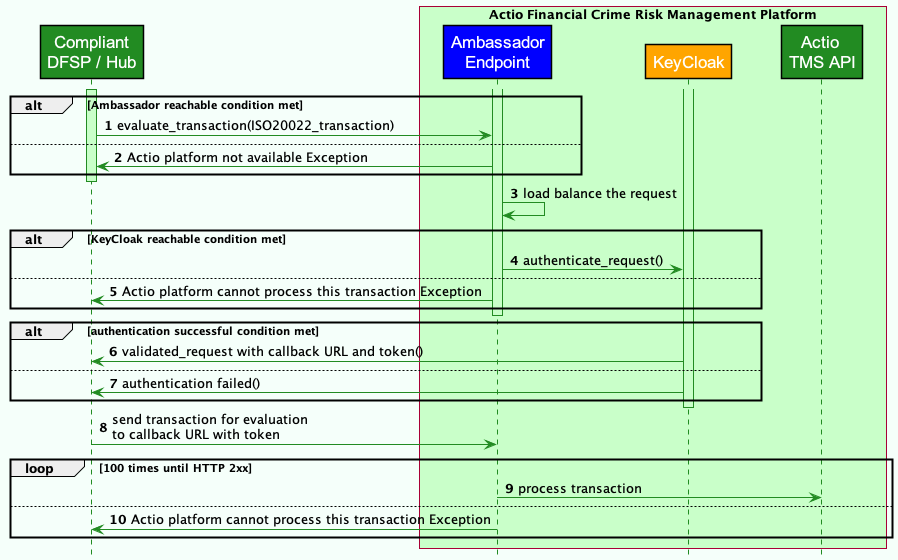

# Security Design

Being a financial monitoring system, Tazama is built with Security-first design principle.

Security is implemented by Design + Tools.

Security implies implementing the following:

1. Authentication - KeyCloak
2. Authorization - KeyCloak
3. Encryption - Linkerd and gRPC
4. Secure Proxy - Linkerd
5. End-to-end mTLS - Linkerd

## KeyCloak

Keycloak implements Authentication and Authorization using the following:

1. Creating a Realm
2. Creating Clients
3. Creating Roles
4. Creating Users
5. Creating Authorization
6. Creating Policies
7. Creating Permissions

## Linkerd

Linkerd is the service mesh that provides mTLS between different containers in the Kubernetes infrastructure. mTLS ensures that the Inter-Service communication is encrypted and with zero coding (eliminating any code-induced risks).

## gRPC

gRPC has SSL/TLS integration and promotes the use of SSL/TLS to authenticate the server, and to encrypt all the data exchanged between the client and the server. Optional mechanisms are available for clients to provide certificates for mutual authentication. But since we use Linkerd, we will use it to provide mTLS (which covers mutual authentication).

### Ambassador

As the API gateway, Ambassador only exposes a certain set of services for Ingress into the Tazamaplatform (example: TMS API). Many services will not be exposed to the outside (example: Channel Router, Rules Processor etc). So Ambassador provides security by design and deny by default (when exposing services to the outside)

### Secure (Authentication, Authorization, Encryption and Inter-Service Communication)

### Sequence Diagram with Adapter in the flow

### Sequence Diagram without Adapter in the flow

