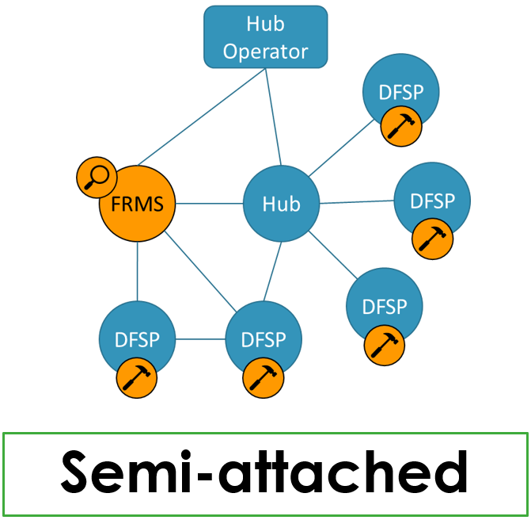
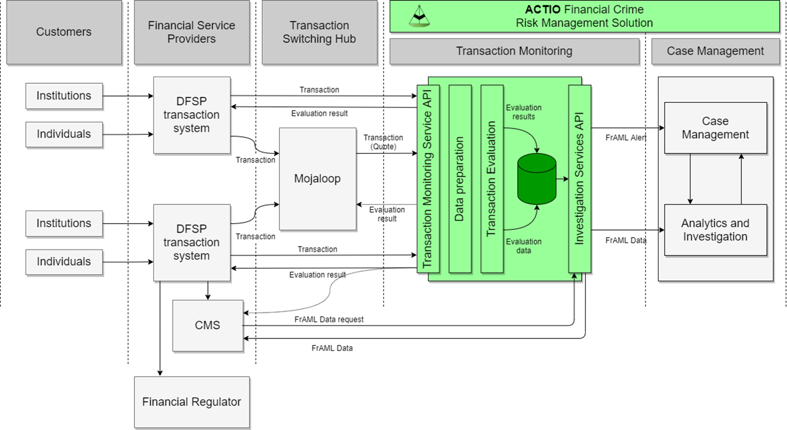

# Transaction Monitoring Service API

The purpose of Transaction Monitoring Service (TMS) API is to facilitate the submission of a transaction to the Tazama platform so that the transaction can be evaluated for behaviour that may indicate financial crime, including fraud and money laundering.

The Tazama platform is designed to be able to take on transaction messages from customer platforms, evaluate these messages for specific behaviours, and deliver an assessment of the financial crime risk inherent in the transaction.

Tazama can be deployed to service the needs of a single DFSP, a switching platform such as Mojaloop, and also a combination of DFSP and switching platforms in what is called a “Semi-attached” configuration:

In this configuration, the switching hub and DFSPs both inside and outside the switching eco-system can submit transaction messages to the Tazama platform for evaluation.

To facilitate this configuration, the Tazama platform exposes its services through its own API.

The TMS API implements ISO 20022 message formats to facilitate Payment Initiation messages pain.001 and pain.013 (equivalent to Mojaloop POST and PUT Quote messages) and Payment Settlement messages pacs.008 and pacs.002 (equivalent to Mojaloop POST and PUT Transfer messages).

ISO20022 is traditionally an XML-based standard, but Tazama has implemented an abridged JSON message format to minimise the message payload to increase the performance and lessen bandwidth requirements.

For more information on Tazama’s ISO 20022 implemented, see the [ISO20022 and](https://frmscoe.atlassian.net/l/cp/J7uLUgRb) Tazama page.

The TMS API ingests transaction messages in real-time through secure API endpoints. Each incoming message is validated using a Swagger document to ensure that the message meets the requirements to be ISO 20022 compliant, and also that the information that is necessary for a successful evaluation is provided.

If an Tazama client platform is unable to submit messages in the required ISO 20022 format, client organisations would need to submit their transactions to a custom-built adaptor so that their transaction can be transformed and then passed to the Tazama platform to meet the specification of the Tazama Transaction Monitoring Service (TMS) API.

A Mojaloop Payment Platform Adapter, along with the integration design into Mojaloop has been specified and approved, but not yet developed.

The implementation of the TMS API is covered on the [1\. Transaction Monitoring Service (TMS)](https://frmscoe.atlassian.net/wiki/spaces/FRMS/pages/1739897) Developer Documentation page.
