<!-- SPDX-License-Identifier: Apache-2.0 -->

# Configuration Management <!-- omit in toc -->

- [TL;DR](#tldr)
- [1. Overview of the detection methodology](#1-overview-of-the-detection-methodology)
- [2. Configuration Management](#2-configuration-management)
  - [2.1. Rule Processor Configuration](#21-rule-processor-configuration)
    - [Introduction](#introduction)
    - [Rule configuration metadata](#rule-configuration-metadata)
    - [The configuration object - parameters](#the-configuration-object---parameters)
    - [The configuration object - exit conditions](#the-configuration-object---exit-conditions)
      - [The `".err"` condition](#the-err-condition)
    - [The configuration object - rule results](#the-configuration-object---rule-results)
      - [Rule results - banded results](#rule-results---banded-results)
      - [Rule results - cased results](#rule-results---cased-results)
    - [Complete example of a rule processor configuration](#complete-example-of-a-rule-processor-configuration)
  - [2.2. Typology Configuration](#22-typology-configuration)
    - [Introduction](#introduction-1)
    - [Typology configuration metadata](#typology-configuration-metadata)
    - [The rules object](#the-rules-object)
    - [The weights object](#the-weights-object)
    - [The expression object](#the-expression-object)
    - [The workflow object](#the-workflow-object)
    - [Event Flow typology configuration](#event-flow-typology-configuration)
    - [Complete example of a typology configuration](#complete-example-of-a-typology-configuration)
  - [2.3. The Network Map](#23-the-network-map)
    - [Introduction](#introduction-2)
    - [Network map metadata](#network-map-metadata)
    - [The messages object](#the-messages-object)
    - [The typology object](#the-typology-object)
    - [The rules object](#the-rules-object-1)
    - [Complete network map example](#complete-network-map-example)
  - [2.4. Updating configurations via the ArangoDB API](#24-updating-configurations-via-the-arangodb-api)
- [3. Version Management](#3-version-management)
  - [3.1. Introduction and Basics](#31-introduction-and-basics)
  - [3.2. Configuration version management of processors](#32-configuration-version-management-of-processors)
  - [3.3. The Network Map](#33-the-network-map)
- [4. FAQ](#4-faq)
  - [4.1. Can rules and typologies be configured through configuration files without coding changes?](#41-can-rules-and-typologies-be-configured-through-configuration-files-without-coding-changes)
  - [4.2. How do I update the configuration files if I what we want is to create new rule?](#42-how-do-i-update-the-configuration-files-if-i-what-we-want-is-to-create-new-rule)
  - [4.3. If I change rules, typologies and the network map through configuration, are these changes available in the Demo UI?](#43-if-i-change-rules-typologies-and-the-network-map-through-configuration-are-these-changes-available-in-the-demo-ui)
  - [4.4. Coming soon: Configuration user interface to make this process easier for users](#44-coming-soon-configuration-user-interface-to-make-this-process-easier-for-users)

# TL;DR

System configuration is managed through a number of configuration files, each containing a JSON document that configures a specific processor type (Event director, rules and typologies) and specific processor instance identified by a processor identifier (id@version) and a configuration version.

Changes to a rule processor's behavior can be made by changing the parameters or rearranging the result bands (or cases).

Changes to the typology processor's behavior for a specific typology can be made by changing the thresholds for interdiction or alerting or by changing the weighting of the rule results from the rule processors that contribute to the typology score.

Changes to the network map, that is used in the Event Director for routing, can add/remove rules to typologies and change the version of a configuration file that is used to calculate a rule or typology result.

In a production environment, configurations should never be over-written and new versions of configurations should be issued to supersede older versions. A new network map must then be issued to implement the updated configuration.

In a test or PoC environment, it may sometimes be simpler to just overwrite existing configuration files so that you don't have to constantly update the network map every time you experiment with a change, *but don't do this in your production environment*.

Configuration documents can be uploaded to the system using the ArangoDB API deployed with the platform.

<div style="text-align: right">
    <a href="#configuration-management">Top</a>
</div>

# 1. Overview of the detection methodology

The core detection capability within the system is distributed across three distinct steps in the end-to-end evaluation flow.

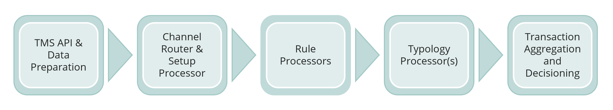

Once data is ingested into the transaction history by the TMS API, the Event Director performs an initial "triage" step to determine if the transaction should be inspected by the system, and in what way. At the moment this is a very simple decision based on the transaction type only (i.e. pain.001, pain.013, pacs.008 and pacs.002), though we envisage that the decision-making here can be more complex in the future by inspecting attributes contained in the message. For now, the ED uses the transaction type to select the typologies that are to be evaluated and triggers the rules required by the typologies. The default configuration of the system only evaluates the pacs.002 as the trigger payload for the rule processors and typologies. The ED routing is configured via a network map that defines the hierarchy of typologies and rules. While not directly influenced by a calibration process at present, the behavior of existing rules and typologies may result in changes to the scope of the evaluation defined in the network map. Some rules or typologies may be deemed to be ineffective in the current configuration and removed or recomposed, and new rules or typologies may be added as new behaviors emerge.

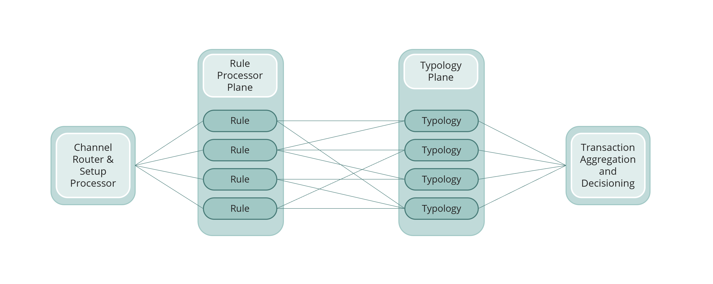

Each rule processor that receives the trigger payload from the Event Director evaluates the transaction and the historical behavior of its participants according to its specification and configuration. Rule processors are driven by a combination of parameters and result specifications to determine only one of a number of related outcomes. The rule outcome is then submitted to the typology processor for scoring.

The typology processor assigns a weighting to each rule outcome as it is received based on the rule's parent typologies' configurations. Once all the rule results for a specific typology has been received, the typology adds all the weighted scores together into the typology score. The typology score can be evaluated against an "interdiction" threshold to determine if the client system should be instructed to block a transaction "in flight" and also an investigation threshold to trigger a review process at the end of the transaction evaluation. The typology processor is not currently configured to interdict the transaction when the threshold is breached; only investigations are commissioned once the evaluation of all the typologies are complete.

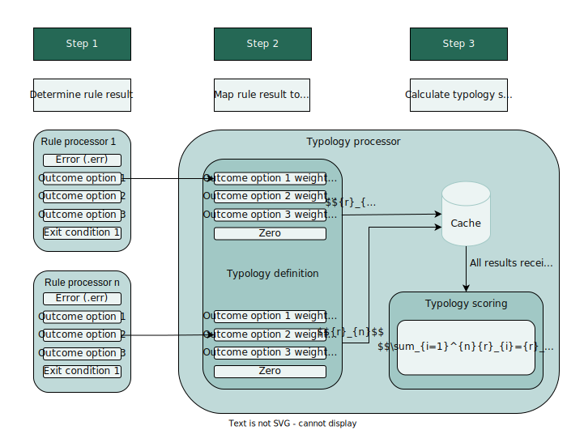

Once these three steps are complete, the evaluation of the transaction is wrapped up in the Transaction Aggregation and Decisioning Processor where the results from typologies are aggregated and reviewed to determine if an investigation alert should be sent to the Case Management System. If any typology had breached either its investigation or interdiction threshold, the transaction will trigger an alert.

The evaluation process accommodates a number of different calibration levers that can be manipulated to alter the evaluation outcome.

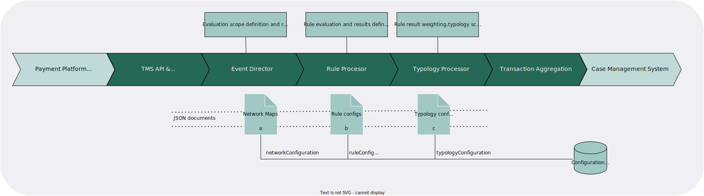

In the Event Director:

*   Changes to the rule and typology scope of the evaluation (**a** - *network map*)
    

In the rule processors:

*   Changes to the parameters that influence the rule processors' behavior (**b** - *rule config*)
    
*   Changes to the result bands that classify the rule processors' outcomes (**b** - *rule config*)
    

In the typology processor:

*   Changes to the rule result weightings (**c** - *typology config*)
    
*   Changes to the typology threshold (**c** - *typology config*)
    

In this document, we will discuss how the various configuration documents are expected to be updated to influence evaluation behavior.

<div style="text-align: right">
    <a href="#configuration-management">Top</a>
</div>

# 2. Configuration Management

Configuration documents are essentially files that contain a processor-specific configuration object in JSON format. The recommended way to upload the configuration file to the appropriate configuration database (`networkMap` or `configuration`) and collection is via ArangoDB's HTTP API that is deployed as standard during system deployment.

The system processes configurations in a specific order to evaluate an incoming transaction. Starting with the Event Director that interprets the network map for routing, then following with the rule processors that interpret their individual rule configurations to determine how to evaluate the transaction, and then concluding with the typology processor that uses a variety of typology configurations to summarize rule results into typologies (fraud or money laundering scenarios).

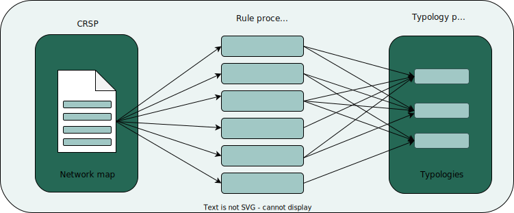

The development cycle for the system processors and their associated configurations follow a slightly different flow. The development and configuration process follows somewhat loosely cascading dependencies amongst the configuration documents: typologies rely on rules, and the network map that defines routing relies on typology-and-rule structures.

Typically, a rule processor is developed first to implement a new rule to evaluate an incoming transaction. The rule processor will already need a configuration for testing purposes during the development, but this may not be the final configuration with the default processor calibration. Regardless, the rule processor may be deployed simultaneously with an initial configuration, or the processor and its configuration may be deployed independently.

Rule results roll up into typologies through a typology configuration. One would typically only start composing a typology once the target rules have been developed and deployed, though sometimes rules may be added to, or removed from, an existing typology. Without a view of the target rules and their configurations, blindly composing a typology would be very difficult, so this step usually follows the completion of the rules.

Finally, the typologies and rules are bound together into the network map and attached to the specific transaction type for which the rules and typologies are intended. The network map defines the rules that should receive the transaction for evaluation, and also the routing to the typologies composed out of the rules.

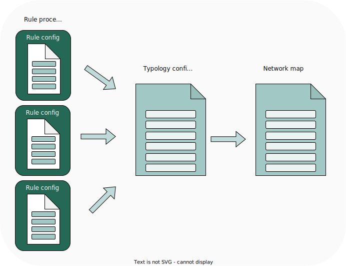

<div style="text-align: right">
    <a href="#configuration-management">Top</a>
</div>

## 2.1. Rule Processor Configuration

### Introduction

A rule processor is a custom-built module that evaluates an incoming message according to its code. When a new rule processor is developed, the rule designer will specify both the input parameters for the rule, as well as the output results. Changes to these attributes can alter a rule processor's behavior, and it is expected that these attributes are hosted in the rule configuration so that the rule processor behavior can be altered by updating the configuration instead of changing the rule processor code.

A rule processor configuration document typically contains the following information:

*   Rule configuration metadata
    
*   A `config` object, that
    
    *   may contain a number of parameters
        
    *   may contain a number of exit conditions
        
    *   will contain either result bands
        
    *   or alternatively will contain result cases
       
### Rule configuration metadata

The rule configuration "header" contains metadata that describes the rule. The metadata includes the following attributes:

*   `id` identifies the specific rule processor and its version that will use the configuration. It is recommended that the rule processor "name" is drawn from the source-code repository where the rule processor code resides, and the version should match the semantical version of the source code as defined in the source code repository.
    
*   `cfg` is the unique version of the rule configuration. Multiple different versions of a rule configuration can co-exist simultaneously in the system.
    
*   `desc` offers a readable description of the rule
    
The combination of the `id` and `cfg` strings forms a unique identifier for every rule configuration and is sometimes compiled into a database key, though this is not essential: the database enforces the uniqueness of any configuration to make sure that a specific version of a configuration can never be over-written.

Example of the rule configuration metadata:

```
{
  "id": "rule-001@1.0.0",
  "cfg": "1.0.0",
  "desc": "Derived account age - creditor",
  ...
  }
```

### The configuration object - parameters

A rule processor's parameters are used to define how a rule processor will operate to evaluate the incoming message. The requirement for the parameters are coded into the rule processor and must be provided in the configuration for the rule processor to deliver a successful outcome. If any of the required parameters are missing, the rule processor will still deliver a result, but it will be a default error outcome. Parameters are given descriptive names to assist the operator in specifying them correctly. Parameters often differ from one rule to the next, but typically define thresholds and time-frames for the historical queries that are executed inside a rule processor. Some notable examples:

| **Parameter** | **Description** |
| --- | --- |
| `evaluationIntervalTime` | The time-frame that defines the intervals into which a histogram is partitioned. Some rules perform a statistical analysis of behavior over time and partitions the historical data into a histogram. This parameter defines, in milliseconds, the time-frame of each interval. |
| `maxQueryLimit` | The maximum number of records to return in the query. This parameter limits the number of results that can be returned from the database. |
| `maxQueryRange` | A time (in milliseconds) that limits the maximum extent of a historical query. A query with a value of 86400000 would only look up messages received within the last 24 hours. |
| `minimumNumberOfTransactions` | The least number of transactions required for the rule processor to produce a result. Some statistical algorithms required at least a certain number of data-points to be able to render a useful result. If the minimum number of transactions cannot be retrieved, the rule processor will raise a non-deterministic exit condition. |
| `tolerance` | A margin of error for an evaluation against a threshold. With a tolerance of 0 (zero) the match against a target value would have to be exact, but with a tolerance value of 0.1, the match could be in a range either 10% below or above the threshold value. |

Example of the `parameters` object:

```
  "config": {
    "parameters": {
      "maxQueryRange": 86400000,
      "commission": 0.1,
      "tolerance": 0.1
    }
  }
```

If a rule processor does not use any parameters, the parameters object may either be empty (`parameters{}`) or omitted entirely.

### The configuration object - exit conditions

A rule processor's exit conditions ensure that a rule processor is always able to produce a result, even if the rule processor is unable to reach a definitive, deterministic outcome. Exit conditions account for non-deterministic exceptions in the rule processor's behavior. The exit conditions are coded into the rule processor and each exit condition must be provided in the configuration for the rule processor to deliver a successful outcome. If any of the exit conditions are missing, the rule processor will still deliver a result, but it will be error outcome complaining about the missing exit condition related to the specific exit condition code.

By convention, exit condition codes are prefaced with an "x" to differentiate them from regular rule results that have no prefix.

From a configuration perspective, the only real purpose for including the exit conditions in the configuration file is to accommodate implementation-specific and user-defined descriptions for the exit conditions, and, in a future release, accommodate multi-language support.

A rule processor may use zero or many different exit conditions. Exit conditions are arranged in an array object inside the configuration object. The exit conditions array object may be an empty placeholder if no exit conditions are defined, or omitted altogether.

Exit conditions cover a number of different exception conditions for rule processors. In principle, each distinct exit condition code relates to a specific type or class of exit condition and this principle has been generally applied to all rule processors that share common exit conditions as follows:

| **Code** | **Description** | **Example(s)** |
| --- | --- | --- |
| `.x00` | This condition applies to rule processors that rely on the current transaction being successful in order for the rule to produce a meaningful result. Unsuccessful transactions are often not processed to spare system resources or because the unsuccessful transaction means that the rule processor is unable to function as designed. | `Unsuccessful transaction` |
| `.x01` | For certain rules, a specific minimum number of historical transactions are required for the rule processor to produce an effective result. This exit condition will be reported if the minimum number of historical records cannot be retrieved in the rule processor. | `Insufficient transaction history`<br><br>`At least 50 historical transactions are required` |
| `.x02` | Currently unused. |     |
| `.x03` | The statistical analyses employed in some rule processors evaluate trends in behavior over a number of transactions over a period of time. While the trend itself can be categorized and reported by the regular rule results, some results are not part of an automatable scaled result. This exception provides an outcome when the historical period does not show a clear trend, but the most recent period shows an upturn. | `No variance in transaction history and the volume of recent incoming transactions shows an increase` |
| `.x04` | Similar to `.x03`, but this exception provides an outcome when the historical period does not show a clear trend, but the most recent period shows a downturn. | `No variance in transaction history and the volume of recent incoming transactions is less than or equal to the historical average` |

Example of the `exitConditions` object:

```
  "config": {
    "exitConditions": [
      {
        "subRuleRef": ".x00",
        "reason": "Unsuccessful transaction"
      },
      {
        "subRuleRef": ".x01",
        "reason": "Insufficient transaction history"
      }
    ]
  }
```
<div style="text-align: right">
    <a href="#configuration-management">Top</a>
</div>


Each exit condition contains the same attributes:

| **Attribute** | **Description** |
| --- | --- |
| `subRuleRef` | Every rule processor is capable of reporting a number of different outcomes, but only a single outcome from the complete set is ultimately delivered to the typology processor. Each outcome is defined by a unique sub-rule reference identifier to differentiate the delivered outcome from the others and also to allow the typology processor to apply a unique weighting to that specific outcome.<br><br> By convention, the exit condition sub-rule references are prefaced with an "x". |
| `reason` | The reason provides a human-readable description of the result that accompanies the rule result to the eventual over-all evaluation result. Reason descriptions will be refined during future enhancements[^1] |

#### The `".err"` condition

All rule processors are encoded with an error condition outcome that accounts for exceptions that do not fall into any of the exit conditions above, or the rule results below. These error conditions reflect a fatal error that occurred during the execution of the rule processor, such as, for example, if the database is inaccessible or if some expected data dependency had not been met due to an error during data ingestion or transformation.

Rule processor error conditions are too numerous and diverse to explicitly define, and their definition is not required for the rule configuration anyway. The error conditions are handled exclusively in the rule code; however the error condition outcome will still be produced as a rule result to ensure continuity and end-to-end robustness in the system. If an error occurs, a rule processor will deliver a rule result with a very unique `".err"` sub-rule reference and with a specific reason that describes the error. In rare instances, where an error condition was not anticipated during development, the reason might be a generic `Unhandled rule result outcome` message.

### The configuration object - rule results

While the parameters and exit conditions may be optional for a specific rule processor, the core function and output of a rule processor is contained in the results object. Rule processors offer two different kinds of rule results:

**Banded results**, where the result from the rule processor is categorized into one out of a number of discrete bands that partition a contiguous range of possible results.

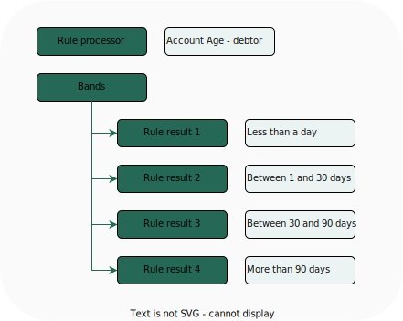

**Cased results**, where the result from the rule processor is an explicit value from a list of discrete and explicit values.

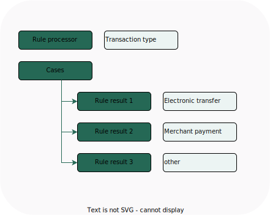

The rule processor's core purpose is to produce a definitive deterministic result based on its programmed behavioral analysis of historical data. The rule configuration defines the bands or values for which rule results can be provided.

> [!WARNING] It is extremely important that the configuration of a rule processor does not leave any gaps in the results, whether banded or cased. Every possible outcome of a rule result must be accounted for, otherwise the rule processor may deliver a result that the typology processor cannot interpret. In the event that a rule processor result misses the configured results, the rule processor will issue an error (`".err"`) result with a reason description of `Value provided undefined, so cannot determine rule outcome`.

#### Rule results - banded results

Banded results are partitions in a contiguous range of results, effectively from -∞ to +∞. When a target value is evaluated against a result band the lower limit of a band is *always* evaluated with the `>=` operator and the upper limit is *always* evaluated with the `<` operator. This way, we can configure the upper limit of one band and the lower limit of the next band with the exact same value to make sure there is no overlap between bands and also no gap.

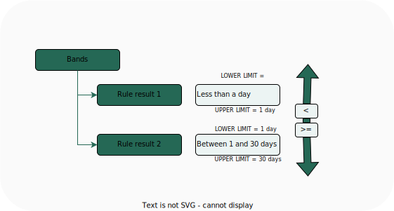

Where a lower limit is not provided, the rule processor will assume the intended target lower limit is -∞.

Where an upper limit is not provided, the rule processor will assume the intended target upper limit is +∞.

A rule processor with a banded results configuration can have an unlimited number of specified bands.

The rule result bands are specified in the `config` object in the rule configuration as an array of elements under a `bands` object:

```
"config": {
  "bands": [
    {
      "subRuleRef": ".01",
      "upperLimit": 86400000,
      "reason": "Account is less than 1 day old"
    },
    {
      "subRuleRef": ".02",
      "lowerLimit": 86400000,
      "upperLimit": 2592000000,
      "reason": "Account is between 1 and 30 days old"
    },
    {
      "subRuleRef": ".03",
      "lowerLimit": 2592000000,
      "reason": "Account is more than 30 days old"
    }
  ]
}
```

Each rule result band contains the same information:

| **Attribute** | **Description** |
| --- | --- |
| `subRuleRef` | Every rule processor is capable of reporting a number of different outcomes, but only a single outcome from the complete set is ultimately delivered to the typology processor. Each outcome is defined by a unique sub-rule reference identifier to differentiate the delivered outcome from the others and also to allow the typology processor to apply a unique weighting to that specific outcome.<br><br> We have elected to assign a numeric sequence to the sub-rule references for result bands, prefaced with a dot (".") separator, but this format is not mandatory for the sub-rule reference string. Any descriptive and unique string would be an acceptable sub-rule reference. |
| `lowerLimit` | This attribute defines the lower limit of the band range and is evaluated inclusively (`>=`).<br><br> Where a lower limit is not provided, the rule processor will assume the intended target lower limit is -∞. Unless the very first result band in a configuration has a clear and unambiguous lower limit, it is often omitted. |
| `upperLimit` | This attribute defines the upper limit of the band range and is evaluated exclusively (`<`).<br><br>Where an upper limit is not provided, the rule processor will assume the intended target upper limit is +∞. Unless the very last result band in a configuration has a clear and unambiguous upper limit, it is often omitted. |
| `reason`| The reason provides a human-readable description of the result that accompanies the rule result to the eventual over-all evaluation result. Reason descriptions will be refined during future enhancements[^1]|

One of the most frequent limit values in use in the system is based on time-frames. In the system, all time-frames and associated limits are represented in milliseconds. The following table reflects the conventional milliseconds for different time terms in our configurations:

| **Term** | **Milliseconds** |
| --- | --- |
| second | 1,000 |
| minute | 60,000 |
| hour | 3,600,000 |
| day | 86,400,000 |
| week | 604,800,000 |
| month (30.44 days) | 2,629,743,000 |
| year (365.24 days) | 31,556,926,000 |

#### Rule results - cased results

In contrast to the partitioning of a result range as in banded results, cased results are a collection of discrete and explicit outcomes for a rule processor out of which the rule processor will determine the specific result applicable to the evaluation it performed.

Case results do not have upper or lower limits to define a range of values within which a rule result is placed. Instead, every case result is simply evaluated with a `=` operator. The rule result is either that specific case value, or a different one.

It is extremely important that every case-based rule configuration contains a catch-all "else" outcome that defines an outcome for the rule processor if none of the listed case results can be matched. By convention, this "else" outcome is attached to the `.00` sub-rule reference outcome and rule developers and configurers should reserve this sub-rule reference exclusively for this purpose.

Beyond the default "else" outcome, the cased rule processor configuration can contain any number of results.

The rule result cases are specified in the `config` object in the rule configuration as an array of elements under a `cases` object:

```
"config": {
  "cases": [
    {
      "subRuleRef": ".00",
      "reason": "Value found is non-deterministic"
    },
    {
      "value": "P2B",
      "subRuleRef": ".01",
      "reason": "The transaction is a merchant payment"
    },
    {
      "value": "P2P",
      "subRuleRef": ".02",
      "reason": "The transaction is a peer-to-peer transfer"
    }
  ]
}
```

Each rule result case contains the same information:

| **Attribute** | **Description** |
| --- | --- |
| `value` | This attribute defines the specific value that will be matched in the rule processor (`=`).<br><br>Every case contains a value, with the exception of the default "else" case.<br><br>Values can be either strings, encapsulated in quotes, or numbers, without quotes. |
| `subRuleRef` | Every rule processor is capable of reporting a number of different outcomes, but only a single outcome from the complete set is ultimately delivered to the typology processor. Each outcome is defined by a unique sub-rule reference identifier to differentiate the delivered outcome from the others and also to allow the typology processor to apply a unique weighting to that specific outcome.<br><br> We have elected to assign a numeric sequence to the sub-rule references for result cases, prefaced with a dot (".") separator, but this format is not mandatory for the sub-rule reference string. Any descriptive and unique string would be an acceptable sub-rule reference.<br><br>By convention, the default "else" outcome has a sub-rule reference of `.00`. |
| `reason`| The reason provides a human-readable description of the result that accompanies the rule result to the eventual over-all evaluation result. Reason descriptions will be refined during future enhancements[^1] |

### Complete example of a rule processor configuration

[Complete example of a rule processor configuration](/product/complete-example-of-a-rule-processor-configuration.md)

<div style="text-align: right">
    <a href="#configuration-management">Top</a>
</div>

## 2.2. Typology Configuration

### Introduction

The typology processor collects rule results and compiles the rule results into a variety of fraud and money laundering scenarios, called typologies. Unlike rule processors that have specific and unique functions guided by their individual configurations, the typology processor is a centralized processor that arranges rules into scenarios based on multiple typology-specific configurations. Effectively, a typology is described solely by its configuration and does not otherwise exist as a physical processor. When the typology processor receives a rule result, it determines which typologies rely on the result and a typology-specific configuration is used to formulate the scenario.

A typology processor configuration document typically contains the following information:

*   Typology configuration metadata
    
*   A `rules` object, that specifies the rule identifier, configuration version and term identifier
*   A `wghts` object, that is a component of the `rules` object, that specifies the weighting for each rule result by sub-rule reference
    
*   An `expression` object, that defines the formula for calculating the typology score out of the rule result weightings
    
*   A `workflow` object, that contains the alert and interdiction thresholds against which the typology score will be measured
    
### Typology configuration metadata

The typology configuration "header" contains metadata that describes the typology. The metadata includes the following attributes:

*   `id` identifies the specific typology processor and its version that will be used by the configuration. There will typically only be a single typology processor active in the system at a time, but it is possible and conceivable that multiple typology processors and/or versions can co-exist simultaneously. It is recommended that the typology processor "name" is drawn from the source-code repository where the typology processor code resides, and the version should match the semantical version of the source code as defined in the source code.
    
*   `cfg` is the unique version of the typology configuration. Though unlikely, multiple different versions of a typology configuration can co-exist simultaneously in the system. The configuration consists of two parts: an arbitrary identifier for the typology to differentiate one typology from another, and then, separated by an `@`, a semantical version that defines the specific version of the configuration for that typology, for example `typology-001@1.0.0`.
    
*   `desc` offers a readable description of the typology
    
The combination of the `id` and `cfg` strings forms a unique identifier for every rule configuration and is sometimes compiled into a database key, though this is not essential: the database enforces the uniqueness of any configuration to make sure that a specific version of a configuration can never be over-written.

**Why does the typology configuration** `cfg` **look different from the rule configuration** `cfg`**?**

A rule processor (defined by its id) is closely paired with its configuration (defined by the `cfg`): the configuration works for that rule processor and no other, and the rule processor won't work with another rule processor's configuration.

A typology processor is a generic "engine" processor. It is not paired with a specific typology the way a rule processor is - it is intended to work for multiple, if not all, typologies. The typology configuration needs another way to reference the specific typology that will be scored by the typology processor. For that reason, the `cfg` attribute is subdivided in the same way as the id into name and a version parts. And remember we can have multiple parallel typology processors if we need them, so the `id` describes the specific typology processor and its version (for routing purposes), and the `cfg` describes the specific typology and the version of its configuration.

Example of the typology configuration metadata:

```
{
  "id": "typology-processor@1.0.0",
  "cfg": "typology-001@1.0.0",
  "desc": "Use of several currencies, structured transactions, etc",
  ...
  }
```

### The rules object

The `rules` object is an array that contains each rule in scope for the typology, and within each rule there is an array for every possible outcome for the rule results that can be received from the rule processors.

Each rule result element in the rules array contains the attributes:

| **Attribute** | **Description** |
| --- | --- |
| `id` | The rule processor that was used to determine the rule result is uniquely identified by this identifier attribute. |
| `cfg` | The configuration version attribute specifies the unique version of the rule configuration that was used by the processor to determine this result. |
| `termId` | The unique identifier for the rule outcome. |

### The weights object

The `wghts` object is an array that contains the sub-rule references and the associated weights for each rule outcome.

| **Attribute** | **Description** |
| `ref` | Every rule processor is capable of reporting a number of different outcomes, but only a single outcome from the complete set is ultimately delivered to the typology processor. Each unique outcome is defined by a unique sub-rule reference identifier to differentiate the delivered outcome from the others.<br><br>The unique combination of `id`, `cfg` and `ref` attributes references a unique outcome from each rule processor and allows the typology processor to apply a unique weighting to that specific outcome. |
| `wght` | The outcome of the rule result will be assigned a weighting according to the sub-rule reference |


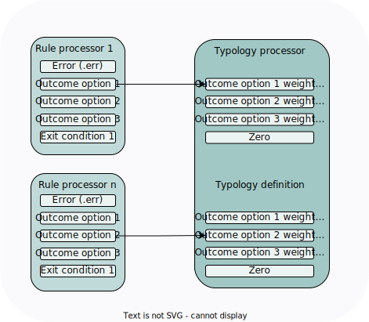

***Every. Possible. Outcome.***

All the possible outcomes from the rule processors are encapsulated in each rule's configuration, with the exception of the `".err"` outcome that is not listed in the rule configuration because the conditions and descriptions are built into the rule processor itself. When composing the typology configuration, the user must remember to include the `".err"` outcome, but the rest of the rule results (exit conditions and banded/cased results) can be directly reconciled with the elements in the `rules` object.

**What does "every possible outcome" mean?**

A rule processor must always produce a result, and only ever a single result from a number of possible results. The rule result will always fall into one of the following categories: error, exit or band/case. Results across all the categories are mutually exclusive and there can be only one result regardless of the category. Results are uniquely identified via the `subRuleRef` attribute:

*   `".err"` is reserved for the error condition, of which there will only ever be one;
    
*   exit conditions are prefaced with an ".x" and there may be many;
    
*   bands/cases are typically sequentially numbered (and ".00" is reserved in cases) and will always have at least two.
    

The rule processor must produce one of these results (identified by the result's `subRuleRef`) and when it does, the typology processor must be configured via a typology configuration to "catch" that specific `subRuleRef`. If the rule processor produces a result that the typology processor can't process, the typology processor won't be able to complete the evaluation of that specific typology that contains the typology the evaluation will "hang". For this reason alone the exit conditions must be represented in the typology configuration and interpreted in the typology processor, even if the interpretation is non-deterministic (false, with a zero weighting), but some (few!) exit conditions actually also have deterministic results that have a weighting.

Because the `rules` object contains every possible rule result outcome from each of the rule processors allocated to the typology, the typology configuration can become quite verbose, but here's a short example of a rules object for a typology that contains two rules:

```JSON
    "rules": [
        {
            "id": "001@1.0.0",
            "cfg": "1.0.0",
            "termId": "v001at100at100",
            "wghts": [
                {
                    "ref": ".err",
                    "wght": 0
                },
                {
                    "ref": ".x00",
                    "wght": 100
                },
                {
                    "ref": ".x01",
                    "wght": 100
                },
                {
                    "ref": ".01",
                    "wght": 0
                },
                {
                    "ref": ".02",
                    "wght": 200
                },
                {
                    "ref": ".03",
                    "wght": 300
                }
            ]
        },
        {
            "id": "002@1.0.0",
            "cfg": "1.0.0",
            "termId": "v002t100at100",
            "wghts": [
                {
                    "ref": ".err",
                    "wght": 0
                },
                {
                    "ref": ".00",
                    "wght": 0
                },
                {
                    "ref": ".01",
                    "wght": 0
                },
                {
                    "ref": ".02",
                    "wght": 1
                },
                {
                    "ref": ".03",
                    "wght": 0
                }
            ]
        }
    ]
```

### The expression object

The expression object in the typology processor defines the formula that is used to calculate the typology score. The expression is able to accommodate any formula composed out of a combination of multiplication ("`Multiply`"), division ("`Divide`"), addition ("`Add`") and subtraction ("`Subtract`") operations.  The expression object uses an  abbreviated [MathJSON](https://cortexjs.io/math-json/) _<sup>L</sup><sub>A</sub><sup>T</sup><sub>E</sub><sup>X</sup>_ format. 

In its most basic implementation, the expression is merely a sum of all the weighted rule results. This also means that every deterministic rule listed in the `rules` array object in the typology configuration must be represented in the expression as a term, otherwise the rule weighting will not be taken into account during the score calculation.

The `termId` e.g. `"v006t100at100"` in the `rules` object is the variable that holds the rule weighting that is used in the expression.

The `expression` object contains the operators and terms that make up the typology scoring formula. Operators and their associated terms are defined as a series of nested objects in the JSON structure. For example, if we wanted to add two terms, a and b, we would start the expression with the operator and then nest the terms beneath it, as follows:

`a + b`

```JSON
  "expression": [
    "Add",
    "v006t100at100",
    "v078t100at100"
  ]
```

We don't have to also supply a specific sub-rule reference: each rule processor only submits one of its possible rule results at a time.

If, for example, we wanted to apply an additional multiplier to the formula e.g. `(a + b) * c`, the resulting expression would be structured as follows:

```
"expression": [
  "Multiply",
  "c",
    ["Add",
    "a",
     "b"]
  ]
```

For example, a complete expression for a typology that relies on 4 rule results and calculates the typology score as a sum of the rule result weightings would be composed as follows:

```JSON
"expression": [
  "Add",
  "v001at100at100",
  "v002at100at100",
  "v003at100at100",
  "v004at100at100"
  ]
```

Mathematically, this expression would translate to:

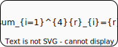

or simply:

`typology score = rule 001 weighting + rule 002 weighting + rule 003 weighting + rule 004 weighting`

### The workflow object

The workflow object determines the thresholds according to which the typology processor will decide if an action is necessary in response to the typology score. A typology can be configured with two separate thresholds:

**Alert** (`alertThreshold`): this threshold will only alert an investigator if the threshold was breached, but will not force the typology processor to take any other direct action

**Interdiction** (`interdictionThreshold`): if breached, this threshold will force the typology processor to issue a message to the client system to block the transaction. This action will also force an alert to an investigator at the end of the evaluation process.

A threshold breach occurs when the calculated typology score is greater or equal to the threshold (`>=`).

Alerts are intended to trigger the investigation of a transaction; either because the transaction was blocked by interdiction, or perhaps because there was insufficient evidence to outright block a transaction, but enough evidence was accumulated to arouse suspicion.  
A typology may be configured with alert threshold, but without an interdiction threshold, usually when the typology is focused on money laundering and the intention of the alert is to trigger surveillance processes without tipping the participants off that their criminal behavior had been noticed.

The system also allows for separate thresholds for alerts and interdictions so that the system can generate an alert for a lower and more sensitive threshold than an interdiction. The system may also omit the alert threshold altogether since the interdiction threshold will generate an alert anyway if the interdiction threshold is breached. (And even though it is possible to specify an alert threshold greater or equal to an interdiction threshold, this alert threshold would be redundant.)

| **Option** | **Outcome** |
| --- | --- |
| Alert threshold only | An alert will be generated out of the Transaction Aggregation and Decisioning Processor (TADProc) if the alert threshold for a typology is breached. A single alert will be generated to cover all typologies that breached this threshold if any one of the typologies breached this threshold. |
| Interdiction threshold only | An interdiction will be generated out of the typology processor if the interdiction threshold is breached. An alert will also be generated out of the TADProc once the evaluation of the transaction is complete, similar to if an alert threshold was breached. |
| Alert threshold and interdiction threshold | A typology that is configured with both an alert and an interdiction threshold will typically generate an alert only if the alert threshold is breached at a lower value and then may also interdiction the transaction if the interdiction threshold is breached at a higher value. |

If a specific type of threshold is not required, the threshold should be omitted entirely. A typology configuration threshold value of 0 (zero) will always result in a breach of that typology.

The thresholds are located in a workflow object in the typology configuration. If, for example, the system is expected to alert on a typology score of 500 or more, and interdict on a typology score of 1000 or more, the workflow object would be composed as follows:

```JSON
"workflow": {
  "alertThreshold": 500,
  "interdictionThreshold": 1000
}
```

### Event Flow typology configuration 

If the event flow processor is applicable to a typology, the EFRuP rule must be added to the list of rules in the typology configuration and EFRuP `"flowProcessor": "EFRuP@1.0.0"` should be added to the workflow object. `flowProcessor` may be omitted from the workflow object and the rules list in which case a particular typology is not affected by EFRuP results.

**EFRuP workflow object**

```JSON
        "workflow": {
            "alertThreshold": 200,
            "interdictionThreshold": 400,
            "flowProcessor": "EFRuP@1.0.0"
        }
```

**EFRuP rule object**

```JSON
            {
                "id": "EFRuP@1.0.0",
                "cfg": "none",
                "termId": "vEFRuPat100atnone",
                "wghts": [
                    {
                        "ref": ".err",
                        "wght": "0"
                    },
                    {
                        "ref": "override",
                        "wght": "0"
                    },
                    {
                        "ref": "non-overridable-block",
                        "wght": "0"
                    },
                    {
                        "ref": "overridable-block",
                        "wght": "0"
                    },
                    {
                        "ref": "none",
                        "wght": "0"
                    }
                ]
            }
```

### Complete example of a typology configuration

[Complete example of a typology processor configuration](/product/complete-example-of-a-typology-processor-configuration.md)

<div style="text-align: right">
    <a href="#configuration-management">Top</a>
</div>

## 2.3. The Network Map

### Introduction

The network map associates a specific transaction type with the rules and typologies that will be used to evaluate the incoming transaction. The network map is structured as a decision tree that defines the rules in a typology:

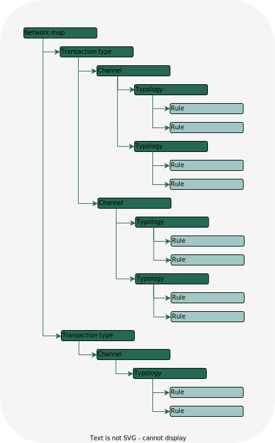

The network map contains the following information:

*   Network map metadata
    
*   A `messages` array object containing
    
    *  an array of `typologies`, containing
        *    an array of `rules`
                            

The network map allows the Event Director to:

1.  Identify whether the incoming transaction type should be routed for evaluation (undefined types are not routed at all)
    
2.  Determine which typologies will be used to evaluate the transaction
    
3.  Determine which unique rules are required by those typologies
    
4.  Route the transaction to each of the identified rule processors
    

The network map defines the route in a hierarchy following the order:

**transactions -> typologies -> rules**

and the evaluation is executed along the defined route in reverse order:

**rules -> typologies -> transaction**.

### Network map metadata

The network map "header" contains metadata that describes the network map. The metadata includes the following attributes:

*   `cfg` is the unique version of the network map. The version allows an investigator or auditor to know which version of the network map was used in a specific evaluation.
    
*   `active` is a flag that identifies the current active network map in use by the system. There can only ever be one active version of the network map and this flag is updated when a network map is superseded by a new version. The value of this attribute for the current active network is `true`. The value for every inactive version is `false`. The purpose of this flag is to allow the system operator to roll back to a previous version of a network map by deactivating the current active network map and activating the older version.
    
```
{
  "active": true,
  "cfg": "1.0.0",
}
```

### The messages object

The `messages` object is an array that contains information about the transactions that the system is expected to evaluate. Each element in the `messages` object contains the following attributes[^4]:

*   `id` is the unique identifier for the Transaction Aggregation and Decisioning Processor (TADProc) that will be used to ultimately conclude the evaluation of a specific transaction. It is possible for a transaction to be routed to a unique TADProc that contains specialized functionality related to summarizing the transaction's results[^3]
    
*   `cfg` is the unique version of the deployed TADProc that will be used to conclude the evaluation of the transaction.
    
*   `txTp` defines the transaction type for which the message element is intended. The `txTp` value here must match a corresponding `TxTp` attribute in the root of the incoming message. If no matching `txTp` attribute is found in the network map, the transaction will not be routed for evaluation and will simply be ignored by the Event Director.
    
    
```
  "messages": [
    {
      "id": "004@1.0.0",
      "cfg": "1.0.0",
      "txTp": "pacs.002.001.12",
      "typologies": [     
```

### The typology object

The `typologies` object is a nested array object inside the transaction element in the `messages` array object. The typology object array contains the following attributes:

*   `id` is the unique identifier for the typology processor that will be invoked to aggregate the specified rule results into a typology. It is possible for a transaction to be routed to a unique typology processor[^3] that contains specialized functionality related to calculating the specific typology.
    
*   `cfg` defines the unique typology and the version of its configuration. The typology processor is effectively just a generic engine that processes the typology's configuration to combine rules into a typology in a specific way. From a certain perspective, the typology configuration *is* the typology.
    
*   `rules` defines the first layer of evaluation destinations along the route laid out by the network map for the evaluation.
    

```
    "id": "typology-processor@1.0.0",
    "cfg": "001@1.0.0",
    "rules": 
```

### The rules object

The rules object array contains the following attributes:

*   `id` is the unique identifier for the rule processor and version that will be invoked to evaluate the transaction.
    
*   `cfg` defines the unique rule configuration version that will guide the execution of the rule processor.
    

```
"rules": [
  {
     "id": "002@1.0.0",
     "cfg": "1.0.0"
  }
```

Example of the rules object for the event flow processor

```JSON
{
  "id": "EFRuP@1.0.0",
  "cfg": "none"
}
```

By adding the EFRuP processor to the network map, the event director will route transactions to the event flow rule processor in addition to the other rules specified in the typologies array. 

### Complete network map example

[Complete example of a network map](/product/complete-example-of-a-network-map.md)

<div style="text-align: right">
    <a href="#configuration-management">Top</a>
</div>

## 2.4. Updating configurations via the ArangoDB API

# 3. Version Management

## 3.1. Introduction and Basics

Each configuration document in the system can be assigned a unique semantic version that will identify one instance of a configuration document as distinctly separate from another instance of the same configuration document.

Configuration documents in Tazama are strictly structured JSON documents. Each document contains an identifier related to the specific processor and version of that processor to which the configuration is to be applied. For example, the configuration for a rule processor would have the following attribute and value in the typology configuration:

```
"id": "099@1.0.0"
```

The rule would typically be known as "rule 099" and is called the rule name. The deployed version of the rule processor would be "1.0.0" and is called the rule processor version.

In reality system processors are deployed from their GitHub source code via Jenkins. Rule processors are version- or source-controlled using GitHub's native source control functionality and changes to a rule processor's source code are fully accounted for between versions.

The configuration of a particular processor is handled separately from the processor source code. The configuration of a specific version of a processor may be changed without changing the underlying code and will then result in a new behavior in the rule processor's execution. The same rule processor version may even be deployed multiple times with a different configuration applied to each of the different instances.

In order to manage multiple consecutive or parallel versions of a processor's configuration, each configuration file contains a configuration version attribute as well:

```
"cfg": "1.0.0"
```

The configuration version attribute defines the specific version of the configuration file when it is used by a processor.

Tazama employs [semantic versioning](https://semver.org/) for both processor source control and configuration documents:

Given a version number **MAJOR.MINOR.PATCH (99.999.9999)**, increment the:

*   **MAJOR** version when you make incompatible API changes
    
*   **MINOR** version when you add functionality in a backward compatible manner
    
*   **PATCH** version when you make backward compatible bug fixes
    

## 3.2. Configuration version management of processors

Every rule processor, typology processor and transaction aggregation and decisioning processor (TADProc) is guided by its own configuration document. The specific version of a configuration document that is required to operate a processor is defined in the network map when the evaluation routing is specified. When a processor receives an instruction from its predecessor in the evaluation flow, the processor checks the network map to determine which configuration document and version to use to perform its tasks.

When a new version of a configuration document is required, the updated version must be deployed to the appropriate configuration collection in the configuration database.

Configuration documents can be posted to the appropriate collection via the ArangoDB API, either in bulk or one-by-one. When posting a new configuration for an existing processor, the database will not allow a user to submit a configuration for an "id" and "cfg" combination that already exists in the database: a new configuration must always be assigned a unique configuration version.

Beyond this constraint imposed by the database, configuration versions are expected to be managed outside the system. Tazama does not currently offer a native user interface for configuration management, though Sybrin, one of the FRMS Centre of Excellence's System Integrator partners, have created a user interface that allows for the creation of configuration documents as well as the automated management of configuration versions between iterations of a configuration document.

Once a configuration document has been created or updated and uploaded to the configuration database, the configuration is ready to be used, but not in use yet. To activate a new configuration (or version), the configuration must be linked to the processor in the network map.

## 3.3. The Network Map

The network map defines the routing of an incoming transaction to all rules and typologies that are required to evaluate the transaction. By default, the system is configured to evaluate a pacs.002 transaction that concludes a transaction initiated from a pain.001 or pacs.008 message with a status response.

Unlike the processor configuration documents, the network map does not contain an explicit configuration version[^2]. Instead, the network map contains an attribute to identify the current active network map being used to perform evaluations:

```
"active": true
```

The network map that is used to perform a particular evaluation is dynamically determined in the Event Director and is always encapsulated in the payload that is evaluated by all downstream processors. The processor uses the network map to retrieve the correct configuration and also accompanies the results of the evaluation so that the network map that was used for the evaluation is always explicitly traceable.

There can only be one network map in an "active" state in the system at a time. A new network map can be posted to the network map database via the ArangoDB API. An existing network map's "active" state can also be changed via the API.

As with other configuration documents, a network map is never intended to be updated. A new iteration (or version) of the network map must be uploaded and then the existing active network map must be deactivated, and the new network map must be activated.

The unique "true" state of the active flag is expected to be enforced outside the system. Sybrin have also embedded this functionality in their configuration management utility.

The active network map ultimately defines the scope of a particular evaluation, right down to the specific processors and their versions that are going to be used, as well as the specific version of the processor configuration required. If any of the components in a network map changes, a new network map must be deployed and activated to replace the previous iteration of the network map.

# 4. FAQ

## 4.1. Can rules and typologies be configured through configuration files without coding changes? 

There are rule configuration files, typology configuration files and a network map which can all be updated without coding changes.  The configuration files in Tazama reside in the configuration database in the system. If you are accessing the system from the full-stack-docker-tazama deployment, you will be able to access the database on http://localhost:18529 and once you have accessed the ArangoDB web UI, you will be able to navigate to the configuration database. The configuration database contains three separate collections. I'll give a brief overview here, but the overall design is discussed above.

**Network Configuration**: This collection may contain a number of different documents, but only one of these should have an active=true state to identify the network map that will be used to route an incoming transaction. The network map can contain a number of different "branches" with their own unique value of "TxTp". The TxTp, or transaction type, defines the routing for a specific transaction message format. In the default deployment, there is only one evaluation route defined, and it is for TxTp = pacs.002.001.12. If any other transactions arrive at the Event Director that handles the routing, the messages are not routed for review and their journey ends at the Event Director. The Network Configuration contains an array of typologies (scenarios) for the TxTp, and each typology contains its own array of rules that will be executed for the TxTp. If you want to change the rules in a typology, or the typologies in a TxTp, or you want to create an evaluation route new TxTp with its own rules and typologies, you would update the network configuration. It is generally expected that you create a completely new version of the network configuration, and when you are ready to deploy it, you set the old network configuration to active=false and the new one to active=true.

<div style="text-align: right">
    <a href="#configuration-management">Top</a>
</div>

**Rule Configuration**: Rule Configurations contain the attributes that determines how a rule processor is expected to evaluate a transaction. For example, if we look at the rule configuration for Rule 006:

```JSON
{
  "id": "006@1.0.0",
  "cfg": "1.0.0",
  "desc": "Outgoing transfer similarity - amounts",
  "config": {
    "parameters": {
      "maxQueryLimit": 3,
      "tolerance": 0.1
    },
    "exitConditions": [
      {
        "subRuleRef": ".x00",
        "reason": "Incoming transaction is unsuccessful"
      },
      {
        "subRuleRef": ".x01",
        "reason": "Insufficient transaction history"
      }
    ],
    "bands": [
      {
        "subRuleRef": ".01",
        "upperLimit": 2,
        "reason": "No similar amounts detected in the most recent transactions from the debtor"
      },
      {
        "subRuleRef": ".02",
        "lowerLimit": 2,
        "upperLimit": 3,
        "reason": "Two similar amounts detected in the most recent transactions from the debtor"
      },
      {
        "subRuleRef": ".03",
        "lowerLimit": 3,
        "reason": "Three or more similar amounts detected in the most recent transactions from the debtor"
      }
    ]
  }
}
```

The different types of rule attributes can be summarised in this image:

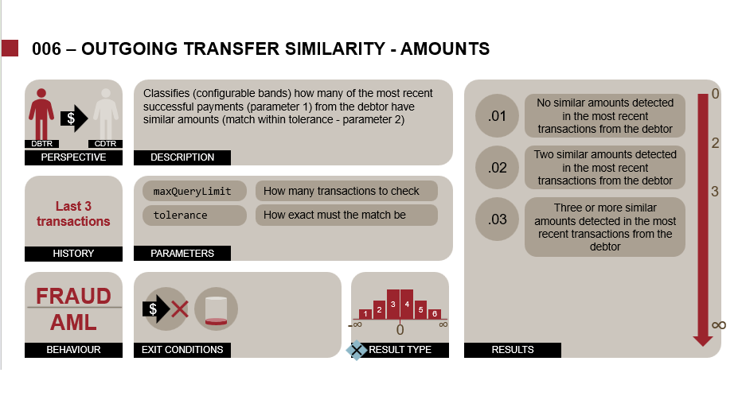

(This is from an overview presentation that we typically provide to our users when they are considering an implementation of Tazama.)

<div style="text-align: right">
    <a href="#configuration-management">Top</a>
</div>

There are generally two different kinds of attributes in the rule configuration.

If we look at config.parameters and config.exitConditions, these reflect explicit and specific input parameters that are expected in the code of the rule processor itself. If any of these are missing, the rule processor will fail execution and throw an error. This also means that if you add any parameters and exit conditions here, they will have no impact on the rule processor at all. You can, however, update the values of some of the attributes. If you change the values of the parameter attributes, you will change the behaviour of the rule according to the purpose of the parameter. 

For example, if you change maxQueryLimit, you will change the maximum number of transactions that the rule will retrieve from transaction history when it evaluates a transaction. If you change the tolerance value, you will change how closely the rule will match transaction amounts to determine if they are "similar" (currently it's within 10% of the trigger transaction amount). For the exit conditions, the only value to change is the description, and it is only used for reporting and presentation purposes. You should not change the value of the subRuleRef here, since it is referenced in the code and also mapped in the typology processor.

The next attribute is the config.bands array. This array contains each of the categorization parameters for the rule's evaluation result. It is structured in such a way that when the rule performs its analysis of behaviour over the historical transactions, the final outcome of that analysis will be a number that can be mapped to one, and only one, of the categories (called bands). These are effectively category "buckets". The lowest bucket doesn't always have a lowerLimit value, and if it is omitted, the system will assume that any lookup value lower than the upperLimit will fall in this bucket. Similarly, the highest bucket does not always have an upperLimit and if a lookup value is higher than the lowerLimit, it will fall in this bucket. The remaining bucket in this example contains both a lowerLimit and an upperLimit and if a lookup value falls between these values, it will fall in this category bucket. Note that all buckets must be mutually exclusive. The bucket limits must never overlap, and must never leave any gaps. For this reason also, the system evaluates a value against bucket limits as follows:
```
lowerLimit <= lookup value < upperLimit
```
The lookup value must be greater or equal to the lowerLimit, but must only be less than the upperLimit. This is why the actual upperLimit value in one band is the same value as the lowerLimit value in the next band, so that there is no gap between bands.
We expect that the categorization of the results will be where most operators will tweak the system to match their data and their customers' behavior. You can add and remove bands, and you can change the lowerLimit and upperLimit for the bands, provided you observe the rule of "no gaps, no overlaps".   

We have been using a convention for the sequential arrangement of the rule bands through the subRuleRef attribute, but the actual naming of this attribute is somewhat arbitrary. We use .01, .02, etc. but you can use more descriptive terms here such as none, two, three or more if you want to. The only thing to remember is that these values are also mapped to the typology configuration, so any changes you make to the number of bands, or the identifiers for the bands, must also be followed through to the typology configuration where the rule is used. Similar to the reason in the exit conditions, the reason for each of the bands is merely a text description that can be used in reporting and presentation.

<div style="text-align: right">
    <a href="#configuration-management">Top</a>
</div>

**Typology Configuration**: The typology configuration defines the weighting of all of the rule results for a specific typology and also sets the thresholds according to which the typology processor will either alert (investigate) or interdict (block) for the typology. Different rules are composed into different typologies, and some typologies may share rule results, but assign different weightings to the results. Which rules belong in which typologies are firstly defined in the Network Configuration for a particular transaction, but the Typology Configuration must reflect the exact same composition, otherwise the typology processor will be unable to complete the evaluation for that particular typology.

When you are deploying the system from the full-stack repository, the deployment will only give you a single typology. We don't publicly publish all of the typologies so that the detection approach for specific scenarios cannot be easily reverse engineered by scammers, but access can be requested to the complete configuration of all the typologies.

As an example, let's look at typology 10 that contains rule 006 above. Typology 10 is a money laundering typology and does not interdict (only fraud typologies interdict, to avoid triggering a "tipping off" compliance exception), so the typology only contains an alertThreshold and not an interdictionThreshold. If the total (sum) of all the rule weightings in this typology is greater or equal to this value, then the system will alert on this transaction for an investigation. If there was an interdictionThreshold, and the sum was equal to or greater than this threshold, then the system would suggest an interdiction on the transaction to block it. 

Inside the typology configuration there is also a rules array that contains the scoring configuration for each of the rules in the typology. There is some header information to synchronise the configurations, and then there is also an (arbitrary) termId that creates an identifier that is used later in the formula used to calculate the typology score. We have been formatting this termId as a verbose combination of the id and cfg values to ensure its uniqueness.

Each rule object in the rules array contains a wghts array that provides a weighting mapping for each of the possible outcomes of that particular rule processor. These are all the outcomes that are defined in the Rule Configuration for this rule, and one additional outcome that is not in the Rule Configuration, but allows for the communication of a failed rule execution in the rule results. So, for rule 006:

```JSON
      "wghts": [
        {
          "ref": ".err",
          "wght": 0
        },
        {
          "ref": ".x00",
          "wght": 0
        },
        {
          "ref": ".x01",
          "wght": 0
        },
        {
          "ref": ".01",
          "wght": 0
        },
        {
          "ref": ".02",
          "wght": 200
        },
        {
          "ref": ".03",
          "wght": 400
        }
      ]
```
The subRuleRef values from the Rule Configuration maps through the ruleResult object in the payload to the ref values in the typology configuration. Each of these ref values is then assigned a weighting. You can immediately see the subRuleRef values from the previous rule configuration: .x00 and .x01 for the exit conditions (with no weighting) and the .01, .02, and .03 values for the bands array with increasingly severe weightings. And then the wghts array must always include a .err element and weighting (usually zero).

If you want to change the contribution of a particular rule to a particular typology, you can adjust its weighting to reflect the impact of that behaviour on the scenario according to the data and customer behaviour in the ecosystem.

If you want to adjust the sensitivity of a particular typology, you can adjust the alertThreshold and interdictionThreshold values for that typology.

Finally the typology configuration also contains an expression object that defines the formula according to which the typology score will be calculated. At the moment we only use a "sum" and it is specified in this format:

```JSON
 "expression": [
    "Add",
    "v006at100at100",
    "v017at100at100",
    "v048at100at100",
    "v091at100at100"
  ]
```
You will recognise the termId that we were speaking about earlier. Our formulas are specified according to a standardish parser here: https://mathlive.io/math-json/

In theory you can specify any kind of mathematical formula you like, but so far we've only encountered a need for a straightforward sum.

As a general rule, we do not recommend overwriting an existing configuration with any changes, but rather you should create a new version of that configuration and then link the version into your evaluation flow through the network map. If you make changes to an existing configuration version, then any previous evaluations that were made with that version will be invalidated and their original results will not be repeatable, which could cause issues for auditing and enforcement actions.

Note: You will need to restart the Event Director, Typology Processor, and Transaction Aggregation and Decisioning Processor to absorb the updated configuration documents.

<div style="text-align: right">
    <a href="#configuration-management">Top</a>
</div>

## 4.2. How do I update the configuration files if I what we want is to create new rule?  

If you want to create a new rule, then you will also need to create a new rule configuration for that new rule in the ruleConfiguration collection in the database. You will then also have to integrate the various ruleResult outcomes into the typology configurations for the typologies that will include that rule, and then you will finally have to update the network configuration with the updated typology array(s).

At this point, you have created a new rule configuration, a new version of a typology configuration (or even a new typology configuration entirely) and you have created a new version of a network configuration, but no evaluates will yet follow this route.

As your final step, you will then change the active=true flag in the existing networkConfiguration to false and then the active=false flag in the new networkConfiguration to true.
Only then will your new route be deployed and active.

You will need to restart the Event Director, Typology Processor, and Transaction Aggregation and Decisioning Processor to absorb the updated configuration documents 

<div style="text-align: right">
    <a href="#configuration-management">Top</a>
</div>

## 4.3. If I change rules, typologies and the network map through configuration, are these changes available in the Demo UI?

The Demo UI loads the current active network map on start up, so if you change typologies by adding or removing rules, the rules and typologies displayed in the demo UI will change.

## 4.4. Coming soon: Configuration user interface to make this process easier for users

The Configuration UI will enforce and manage all the processes discussed above through a User Interface and will even handle the deployment of the configurations.

<div style="text-align: right">
    <a href="#configuration-management">Top</a>
</div>

* * *
NOTES:

[^1]: We have found during our performance testing that the text-based descriptions in our processor results undermines the performance gains we achieved with our ProtoBuff implementation. We will be removing the unabridged reason and processor descriptions from the configuration documents in favor of shorter look-up codes that will then also be used to introduce regionalized/language-specific descriptions.
   
[^2]: An explicit version reference has been planned for development to make it easier for an operator to link an evaluation result to the specific originating network map.
    
[^3]: In its default deployment, the system contains a single version of the "core" system processors (the typology processor and TADProc) at a time. Though it is possible to deploy and maintain multiple parallel versions of these processors and manage routing to these processors through the network map, this guide will only focus on singular core processors for now.
    
[^4]: Before our implementation of NATS, Tazama processors were implemented as RESTful microservices. The `host` attributes in the network map contained the URL where the processors could be addressed. With our initial implementation of NATS, the routing information was moved into environment variables that were read into the processors when they were deployed, or restarted in the event of a processor failure. We have now removed the need to specify the host property for a processor - the routing is automatically determined from the network map at processor startup - see [https://github.com/tazama-lf/General-Issues/issues/310](https://github.com/tazama-lf/General-Issues/issues/310) for details.
