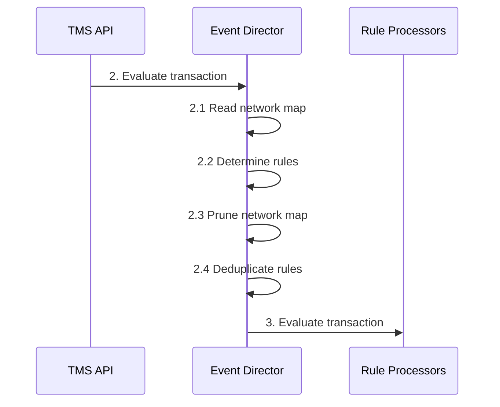
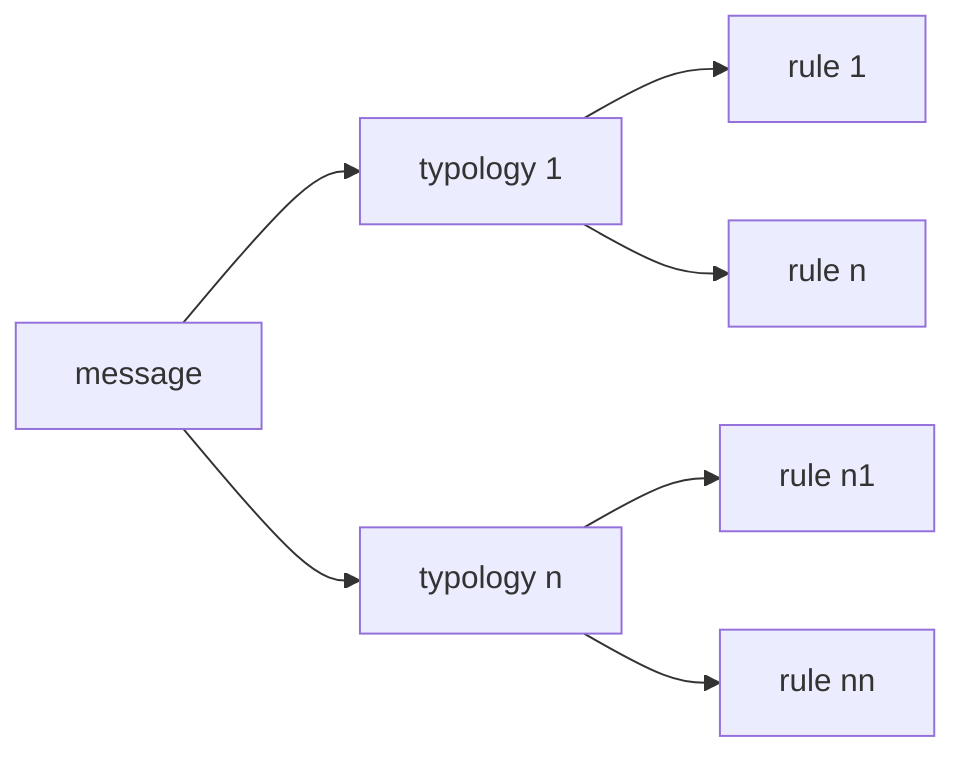

<!-- SPDX-License-Identifier: Apache-2.0 -->

- [The Event Director](#the-event-director)
  - [Event Director Context](#event-director-context)
    - [2. Evaluate Transaction](#2-evaluate-transaction)
      - [Payload:](#payload)
    - [2.1. Read Network Map](#21-read-network-map)
    - [2.2. Determine Rules](#22-determine-rules)
    - [2.3 Prune the Network Map](#23-prune-the-network-map)
    - [2.4. De-duplicate Rules](#24-de-duplicate-rules)
    - [3. Evaluate Transaction](#3-evaluate-transaction)
      - [Payload](#payload-1)


# The Event Director


The foundation of the Tazama Transaction Monitoring service is its ability to evaluate incoming transactions for financial crime behaviors through the execution of a number of conditional statements (rules) that are then combined into typologies that describe the nature of the financial crime that the system is trying to detect. 


The Event Director is responsible for determining which typologies a transaction must be submitted to for the transaction to be evaluated. As part of this process, the Event Director determines which rules must receive the transaction and then which typologies are to be scored. The Event Director then routes the transaction to the individual rule processors.

## Event Director Context



### 2. Evaluate Transaction

Once all the data preparation work in the TMS API is complete, the TMS API will route the incoming transaction message to the Event Director to commence the evaluation of the transaction.

#### Payload:
 - Transaction data (the original, submitted transaction message)
 - Metadata (process information picked up in the TMS API)

### 2.1. Read Network Map

The network map defines the configuration according to which a transaction will be routed to typologies and their associated rule processors. The network map is a polynomial tree that contains the associations between a message type (at the root) and typologies and rules:



The primary purpose of the Event Director is to determine which typologies are appropriate for the incoming transaction and then to route the transaction to the rules associated to those typologies. The network map allows the configuration of the relationships between message types, typologies and rules to be hosted in an external configuration file, rather than hard-coded in the Event Director.

The network map also contains the detailed identification and version information of each of the processors comprising the network map.

Because the network map is routed to each evaluation node along with the incoming transaction, it would be possible to update the network map, or any of the evaluation nodes, while the system is in operation and without impacting the evaluation of any transactions in progress. It is also equally important that each iteration of the network map is properly versioned and also that the system keeps a record of which version of a network map was used when a transaction was evaluated so that the execution of the evaluation can be audited and even replayed or simulated.

The network map is a JSON object with nested key-value pairs describing the nodes in the map and their relationships.

For performance reasons, the network map is not read from the configuration database with every new incoming transaction: instead, the Event Director will attempt to retrieve the network map from its internal cache first and will only retrieve the latest active network map from the network map database when the cached version is not, or no longer, available.

For a detailed overview of the composition and maintenance of the network map, refer to the Tazama [Configuration Management](configuration-management.md) documentation.

### 2.2. Determine Rules

The Event Director's ultimate goal is to distribute the incoming transaction to all the rule processors that are required to evaluate the transaction. The network map identifies the rules that are required for a specific transaction and rules are located inside typologies. Each transaction type will be configured with its own set of typologies and rules.

This step in the Event Director process navigates the network map from the perspective of the incoming transaction's message type and compiles a list of all the rules that will need to be executed to evaluate the transaction.

With the network map in hand, the Event Director interrogates the incoming transaction and determines which typologies from the map are to be utilized for evaluating the transaction (i.e. in the transaction evaluation scope), based on the transaction's message type.

Currently, all transactions are submitted to the Event Director and the only attribute from the transaction that is used to evaluate the typology is the message type located in the message payload (TxTp = pain.001, pain.013, pacs.008 and pacs.002).

Once the message type has been determined, the Event Director determines which typologies are required. The typologies are listed as an array of typologies associated with the specific message type. Typologies are expected to be unique per message type and the list of typologies will not contain any duplicates for that message type.

Each typology comprises a number of rules that are executed to support the calculation of the typology score. The typology score provides a measure of the amount of evidence of suspicious behavior detected in the transaction.

A single rule may be associated with multiple different typologies, but each rule will only be executed once to prevent unnecessary and wasteful processing.
The default Tazama deployment and configuration only facilitates the evaluation of an incoming pacs.002 message. The pain.001, pain.013 and pacs.008 messages are not submitted to any rule processors for evaluation and processing of these messages terminates at the Event Director.

### 2.3 Prune the Network Map

Once the Event Director has determined which typologies and rules will be invoked for the incoming transaction, the Event Director will prune (remove) all the unwanted typologies (and their associated rules) from the network map. What will remain will be an abbreviated network map, or a network sub-map, that only contains the typologies and rules that are in scope for the evaluation of the incoming transaction's message type.

The pruned network sub-map will accompany the transaction message to the rule processors so that processors downstream from the Event Director will be able to use the network map to complete the evaluation and routing of the transaction to a final evaluation result.

### 2.4. De-duplicate Rules

A single rule could be used to evaluate more than one typology. One of the primary advantages and reasons for the config-driven approach is to be able to minimize the number of times that a specific rule has to be executed. To achieve this objective, the Event Director will draft a list of all the rules in the network map and then eliminate duplicate rules from the list (the “Highlander” principle).

Each rule in the network map can be uniquely described by the combination of the following attributes:

```json
  "id": "003@1.0.0",
  "cfg": "1.0.0"
```

The Event Director will remove all duplicate rules for the unique combination of these fields from the draft list of rules to identify only one unique rule processor to execute the evaluation of the transaction.

### 3. Evaluate Transaction

Using the list of unique rules from step 2.4, the Event Director invokes all the unique rule processors and passes the transaction message and network sub-map to each rule processor for processing.

#### Payload
 - Transaction data (the original, submitted transaction message)
 - Metadata (process information picked up in the TMS API and Event Director)
 - Network sub-map (the portion of the network map that defines the in-scope rules and typologies)

See the page on [processor results propagation](https://github.com/frmscoe/docs/blob/main/Product/processor-results-propagation.md) for more information on the payload composition and propagation from one processor to the next.
