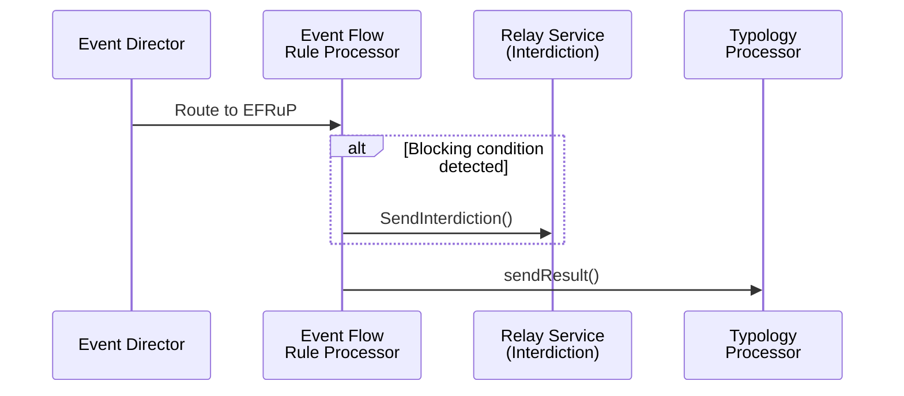
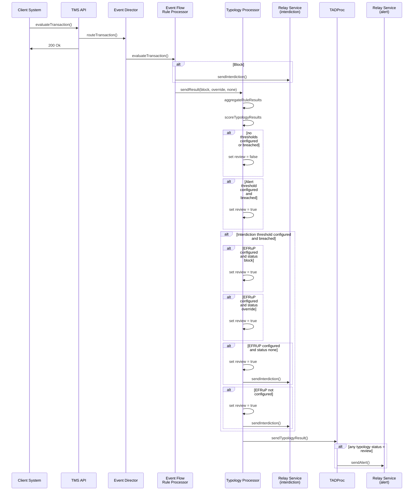

# Event Flow Rule Processor<!-- omit in toc -->

- [Introduction](#introduction)
- [EFRuP dependencies](#efrup-dependencies)
    - [1. Network map configuration](#1-network-map-configuration)
    - [2. Typology configuration](#2-typology-configuration)
    - [3. Conditions](#3-conditions)
- [EFRuP processing](#efrup-processing)
    - [Event Director](#event-director)
    - [Event flow rule processor](#event-flow-rule-processor-1)
    - [Typology processor](#typology-processor)


## Introduction

The event flow rule processor (EFRuP) is a special rule processor that operates alongside all the other rule processors and enables operational control over the normal Tazama system functioning, for example, to be able to block a customer from transacting from any account or to override an interdiction and allow a transaction where it would otherwise have been blocked.

The EFRuP can be configured to block or allow a transaction based on the evaluation of conditions against one of the transaction attributes. There are two types of conditions that can control event flow in the Tazama system. These conditions can be created on a debtor or creditor: 
1.	Blocking conditions
    - non-overridable-block conditions (red)
    - overridable-block conditions (amber)
2.	Override conditions (green)


## EFRuP dependencies

The following configuration steps are required to enable event flow processing
1.  Update network map configuration
2.  Update typology configuration
3.  Add conditions

#### 1. Network map configuration

By adding the EFRuP processor to the network map, the event director will route transactions to the event flow rule processor in addition to the other rules specified in the typologies array. 

```JSON
[
    {
        "active": true,
        "cfg": "1.0.0",
        "messages": [
            {
                "id": "004@1.0.0",
                "cfg": "1.0.0",
                "txTp": "pacs.002.001.12",
                "typologies": [
                    {
                        "id": "typology-processor@1.0.0",
                        "cfg": "999@1.0.0",
                        "rules": [
                            {
                                "id": "901@1.0.0",
                                "cfg": "1.0.0"
                            },
                            {
                                "id": "EFRuP@1.0.0",
                                "cfg": "none"
                            }
                        ]
                    }
                ]
            }
        ]
    }
]
```

<div style="text-align: right">
    <a href="#introduction">Top</a>
</div>

#### 2. Typology configuration 

If the event flow processor is applicable to a typology, the EFRuP rule must be added to the list of rules in the typology configuration and EFRuP `"flowProcessor": "EFRuP@1.0.0"` should be added to the workflow object.

`flowProcessor` may be omitted from the workflow object and the rules list in which case a particular typology is not affected by EFRuP results.

```JSON
[
    {
        "_key": "999@1.0.0",
        "desc": "Rule-901 Typology",
        "id": "typology-processor@1.0.0",
        "cfg": "999@1.0.0",
        "workflow": {
            "alertThreshold": 200,
            "interdictionThreshold": 400,
            "flowProcessor": "EFRuP@1.0.0"
        },
        "rules": [
            {
                "id": "901@1.0.0",
                "cfg": "1.0.0",
                "termId": "v901at100at100",
                "wghts": [
                    {
                        "ref": ".err",
                        "wght": "0"
                    },
                    {
                        "ref": ".x00",
                        "wght": "100"
                    },
                    {
                        "ref": ".01",
                        "wght": "100"
                    },
                    {
                        "ref": ".02",
                        "wght": "200"
                    },
                    {
                        "ref": ".03",
                        "wght": "400"
                    }
                ]
            },
            {
                "id": "EFRuP@1.0.0",
                "cfg": "none",
                "termId": "vEFRuPat100atnone",
                "wghts": [
                    {
                        "ref": ".err",
                        "wght": "0"
                    },
                    {
                        "ref": "override",
                        "wght": "0"
                    },
                    {
                        "ref": "non-overridable-block",
                        "wght": "0"
                    },
                    {
                        "ref": "overridable-block",
                        "wght": "0"
                    },
                    {
                        "ref": "none",
                        "wght": "0"
                    }
                ]
            }
        ],
        "expression": [
            "Add",
            "v901at100at100"
        ]
    }
]
```

<div style="text-align: right">
    <a href="#introduction">Top</a>
</div>

#### 3. Conditions

Conditions can be created against an entity or account and multiple conditions can exist at the same time, in which case the hierarchy of conditions will be evaluated as follows:
1. Prevailing non-overridable-block conditions (red) are always applied to transactions
2. Prevailing override conditions (green) trump overridable-blocking conditions (amber)
3. If an overridable condition (amber) is not over-ridden (i.e. it is a prevailing overridable condition) it will still be applied to transactions
4. Override conditions (green) can also override a typology interdiction result and suppress an interdiction alert on a transaction event (if the EFRuP and/or interdiction workflows are configured in the Typology configuration)

Admin APIs exist for
1. Create a condition for an entity
2. Create a contition for an account
3. Retrieve a condition for an entity
4. Retrieve a condition for an account
5. Expire a condition

Technical documentation for the implementation of the Admin API is covered in the [Admin service repository](https://github.com/tazama-lf/admin-service).


<div style="text-align: right">
    <a href="#introduction">Top</a>
</div>

## EFRuP processing

#### Event Director

The event director will route a transaction event to EFRuP, if it is configured in the network map. 

#### Event flow rule processor

The Event flow Rule processor (EFRuP) sends a single result to the typology processor. The `subRuleRef` will be one of `block`, `override` or `none`. If the evaluation of conditions results in `subRuleRef` = `block` then the EFRuP will generate an interdiction alert _immediately_ `ALRT` (interdiction alert). The EFRuP will publish an interdiction alert message to the NATS subject defined in the EFRuP's environment variables.

**Sequence diagram**


#### Typology processor

If a typology score is equal to or greater than the threshold value and there is an override in place, the Typology Processor will not trigger an interdiction workflow to instruct the client system to block the transaction event.

**Note** The event flow rule processor result does not have a weight `wght` and will not be added to the typology score. 

If the event flow processor is applicable to a typology, the EFRuP rule must be added to the list of rules in the typology configuration and EFRuP `"flowProcessor": "EFRuP@1.0.0"` will be added to the workflow object.

`flowProcessor` may be omitted from the workflow object and the rules list in which case a particular typology is not affected by EFRuP results.
 
**Sample output**

```JSON
  "report": {
    "evaluationID": "ecbd6990-09d6-4010-9f1c-2baddbd2bc73",
    "metaData": {
      "prcgTmDP": 5829672,
      "prcgTmED": 3375241
    },
    "status": "NALT",
    "timestamp": "2024-05-22T14:24:20.373Z",
    "tadpResult": {
      "id": "004@1.0.0",
      "cfg": "1.0.0",
      "typologyResult": [
        {
          "id": "typology-processor@1.0.0",
          "cfg": "999@1.0.0",
          "result": 100,
          "ruleResults": [
            {
              "id": "901@1.0.0",
              "cfg": "1.0.0",
              "subRuleRef": ".01",
              "prcgTm": 11024622,
              "wght": 400
            }
            {
              "id": "EFRuP@1.0.0",
              "cfg": "none",
              "subRuleRef": "override",
              "prcgTm": 11024622
            }
          ],
          "prcgTm": 1532599,
          "review": true,
          "workflow": {
            "alertThreshold": 200,
            "interdictionThreshold": 400,
            "flowProcessor": "EFRuP@1.0.0"
          }
        }
      ],
      "prcgTm": 7142981
    }
```

<div style="text-align: right">
    <a href="#introduction">Top</a>
</div>

**Sequence diagram (end-to-end)**
