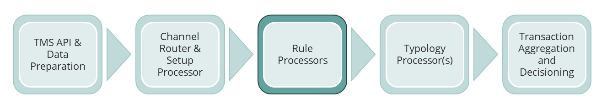
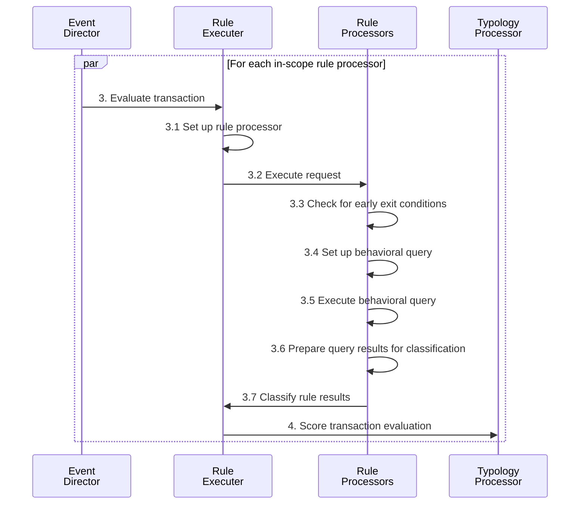
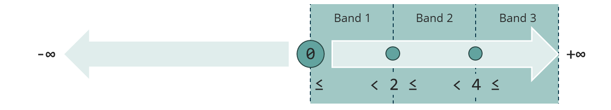

- [Rule Processors](#rule-processors)
  - [The rule executer](#the-rule-executer)
  - [Rule processor context](#rule-processor-context)
    - [3. Evaluate transaction](#3-evaluate-transaction)
      - [Payload](#payload)
    - [3.1 Set up rule processor](#31-set-up-rule-processor)
    - [3.2 Execute request](#32-execute-request)
    - [3.3.1 Check for early exit conditions](#331-check-for-early-exit-conditions)
    - [3.3.2 Set up behavioral query](#332-set-up-behavioral-query)
    - [3.3.3 Execute behavioral query](#333-execute-behavioral-query)
    - [3.3.4 Prepare query results for classification](#334-prepare-query-results-for-classification)
    - [3.4 Classify rule results](#34-classify-rule-results)
      - [3.4.1 Banded rule processor results](#341-banded-rule-processor-results)
      - [3.4.2 Cased rule processor results](#342-cased-rule-processor-results)
    - [4. Score transaction evaluation](#4-score-transaction-evaluation)

# Rule Processors

The foundation of the Tazama Transaction Monitoring System is its ability to evaluate incoming transactions for financial crime behavior through the execution of a number of conditional statements (rules) that render a result. Rule evaluations consider specific attributes of the incoming transaction and the historical behavior of the transaction participants.

The Event Director is responsible for determining which typologies are applicable for a transaction. (Typologies are a way to describe a specific financial crime scenario.) As part of this process, the Event Director determines which rules must receive the transaction and then routes the transaction to these rules as the next step in the evaluation process.

The rules receive the transaction, as well as the portion of the Network Map that was used to identify the rules as recipients (and by association also identifies which typologies are beneficiaries of the rule results).

Each rule executes as a discrete and bespoke function in the evaluation process. It is a Tazama design principle that any given rule in the system has as small a purpose as possible and seeks to answer a single and very specific behavioral question about the transaction it is evaluation, for example:

 - How many transactions were made by the debtor?
 - How many accounts does the creditor have?
 - Has the creditor immediately transferred the money they just received?

Once a rule has completed its execution, it will pass its result, along with the transaction information and its Network sub-map to the Typology Processor where the rule result will be combined with the results from other rules to score a transaction according to a specific typology.

Tazama is preconfigured with a number of rule processors, but these rule processors are not publicly accessible to protect them from prying, unscrupulous eyes. Uncontrolled access to rule processors, and the typologies they belong to, may allow fraudsters to reverse-engineer the detection mechanisms that are designed to prevent fraud. Tazama has provided one rule processor as a publicly available example of a rule processor, and we will use this rule processor as a reference rule in our documentation.

Our reference rule is [Rule 901 - Number of transactions performed by the debtor](https://github.com/frmscoe/rule-901).

## The rule executer

Individual rule processors are wrapped in a rule executer shell that handles common functions for all rule processors in a common way. While this makes rule processors easier to maintain by abstracting common code into the rule executer and leaving unique code in the rule processor, it does make the deployment process a little more complicated and onerous. In a production setting we would automate the deployment of the rule processors via Helm charts, but for our Docker Compose deployment, the process is a little more manual.

Each rule processor must be wrapped in its own rule-executer when it is deployed. The rule executer source code is centralized in the public `rule-executer` repository, and each rule processor's unique source code is hosted in its own private repository.

## Rule processor context

### 3. Evaluate transaction

Using a list of unique rules, the Event Director invokes all the unique rule processors and passes the transaction message and network sub-map to each rule processor for processing.

#### Payload
 - Transaction data (the original, submitted transaction message)
 - Metadata (process information picked up in the TMS API and Event Director)
 - Network sub-map (the portion of the network map that defines the in-scope rules and typologies)

### 3.1 Set up rule processor

The rule executer acts as a wrapper function for the rule-specific code that conducts the behavioral assessment of the transaction. The rule executer performs a number of generic tasks that applies to all rule processors.

See the documentation for the rule executer in the [rule executer repository readme](https://github.com/frmscoe/rule-executer) for more information.

Once the setup is complete, the rule executer invokes the rule-specific `handleTransaction` to initiate the behavioral assessment of the transaction.

### 3.2 Execute request

The rule-specific portion of the rule processor receives the request from the rule executer and performs the following functions to complete the behavioral assessment:

### 3.3.1 Check for early exit conditions

Tazama aims to spare system resources whenever possible to optimize performance. In particular, database queries are expensive in terms of performance and Tazama seizes opportunities to avoid costly database queries through this initial step.

The purpose of this step is to see if there is any information included in the incoming payload the disqualifies the rule processor's results as non-viable, perhaps because the outcome may be non-deterministic for (i.e. have no impact on) the typologies associated with the rule.

See the page on [Standard Rule Processing Exit and Error Conditions](https://github.com/frmscoe/docs/blob/main/Technical/Processors/Rule-Processors/standard-rule-processor-exit-and-error-conditions.md) for examples of exit conditions prevalent in Tazama.

### 3.3.2 Set up behavioral query

This step composes the database query to retrieve the behavioral history in an injection-safe way, including the specified parameters from the rule configuration.

Each rule is configured through an external JSON document hosted in the Tazama configuration database. This configuration document is read when the rule processor starts up and cached in Node cache for faster retrieval.

Among other things, the rule configuration may contain specific parameters that determine the shape of the database query that will retrieve the behavioral history.

Examples are the minimum number of documents to retrieve for a viable result, or the timeframe over which the query must be executed.

See the page on [configuration management](https://github.com/frmscoe/docs/blob/main/Product/configuration-management.md) for more information on how Tazama's processors are configured.

### 3.3.3 Execute behavioral query

This step simply executes the composed query and retrieves the behavioral data from the database in support of the rule processor's purpose.

In some rare instances a rule processor result is entirely dependent on only information contained in the incoming payload and no historical query is performed. In such instances no database query is composed or executed and the rule processor proceeds straight to the classification of the rule results.

### 3.3.4 Prepare query results for classification

As a design principle, the Tazama rule queries are intended to do much of the heavy lifting in assessing the behavior evident in the transaction. As such the queries usually aim to deliver a result that can be classified immediately, but occasionally the rule processor has to perform a few extra steps to properly format the results for classification.

One common task that is often performed in this step is the arrangement of the query results into a statistical analysis of some sort, such as a histogram over which a behavioral trend can be mapped.

### 3.4 Classify rule results

As mentioned previously, each rule is configured through an external configuration document hosted in the Tazama configuration database. One of the primary functions of the external configuration file is to define the classification of the query results and form what will be the rule processor's results. Tazama classifies the query results in one of two ways:

#### 3.4.1 Banded rule processor results

Banded rule processor results are subdivisions of a contiguous range of values, theoretically from –infinity to +infinity. Banded rule results are by far the most common type of rule processor result in Tazama.

For example, in our reference rule 901, we expect that the rule query will return a number that reflects the number of transactions previously performed by the debtor.

We can classify that number as follows, according to the rule configuration document for rule 901:

 - If the debtor had performed only a single transaction to date, including the one that is currently being assessed by the rule processor, the rule processor result will fall into band 1.
 - If the debtor had previously performed 2 or more transactions, but less than 4 transactions, including the transaction that is being assessed, the rule processor result will fall into band 2.
 - If the debtor had previously performed 4 or more transactions, effectively up to an infinite number of transactions, including the transaction under assessment, the rule processor result will fall into band 3.

As a Tazama design principle, the assessment of a value within a band is always:

`lowerBandLimit <= value < upperBandLimit`

This way we can always ensure that the bands are contiguous and there are no accidental overlaps between the different bands.

See the page on [configuration management](https://github.com/frmscoe/docs/blob/main/Product/configuration-management.md) for more information on how rule processor banded results are configured.

#### 3.4.2 Cased rule processor results

Cased rule processor results form an explicit list of values and includes a specific outcome for "none of the above".

An example of a cased rule might be if the rule processor is required to evaluate the type of service channel that the debtor is using to perform their transaction. If, for instance, the following channels are available:

| Code | Description | Case |
|---|---|---|
| AGT | Agent network | ELSE |
| ATM | Automated teller machines (ATMs) | ELSE |
| BRN | Branch | ELSE |
| CCT | Call centre | 1 |
| APP | Digital Application | 2 |
| WEB | Web-site | 3 |
| MMW | Mobile money wallet | 4 |

The cased rule processor configuration would specify the codes from the list that are of interest to the behavioral modelling, and then also a catch-all "else" value if the data contains none of the codes of interest (e.g. "AGT", "ATM", or "BRN").

See the page on [configuration management](https://github.com/frmscoe/docs/blob/main/Product/configuration-management.md) for more information on how rule processor cased results are configured.

### 4. Score transaction evaluation

Once the rule processor has completed its work and updated the outgoing payload, the payload is sent to the typology processor where the rule result will be combined with results from other rule processor to score any evidence of suspicious behavior detected in the transaction.

Outgoing payload:

 - Transaction data (the original, submitted transaction message)
 - Metadata (process information picked up in the TMS API, Event Director and rule processor)
 - Network sub-map (the portion of the network map that defines the in-scope rules and typologies)
 - The rule processor evaluation result

https://github.com/frmscoe/docs/blob/main/Product/processor-results-propagation.md
