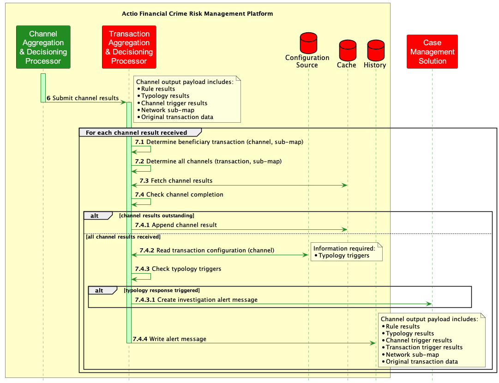

<!-- SPDX-License-Identifier: Apache-2.0 -->

# Transaction Aggregation and Decisioning Processor (TADProc)

## Introduction

The foundation of the Tazama Transaction Monitoring service is its ability to evaluate incoming transactions for financial crime risk through the execution of a number of conditional statements (rules) that are then combined into typologies that describe the nature of the financial crime that the system is trying to detect.

The Channel Router & Setup Processor (CRSP) is responsible for determining which channels and typologies a transaction must be submitted to for the transaction to be evaluated for Financial Crime Risk. As part of this process, the CRSP determines which rules must receive the transaction and then which typologies are to be scored. The CRSP routes the transaction to the individual rule processors.

The rules receive the transaction, as well as the portion of the Network Map that was used to identify the rules as recipients (and by association also identifies which typologies are beneficiaries of those rules’ results).

Each rule executes as a discrete and bespoke function in the evaluation process. Once a rule has completed its execution, it will pass its result, along with the transaction information and its Network sub-map to the Typology Processor where the rule result will be combined with the results from other rules as the results arrive to score a transaction according to a specific typology.

The Typology Processor is a single and centralised configuration-driven processing function that calculates a typology score for any and every typology in the platform based on the incoming rule results for a typology, the Network Sub-map that defines the rules that roll up into a typology and a typology logic statement or “expression” that defines how the rules are to be composed into a typology score.

Once each typology has been scored, the result of the typology will be passed to the Channel Aggregation and Decisioning Processor (CADProc) which will check each typology result as it is delivered for any immediate workflow triggers. All typology results for a specific channel will be combined by the CADProc into a single comprehensive channel result.

Once each channel has been completed, the result of the channel will be passed to the Transaction Aggregation and Decisioning Processor (TADProc). All channel results for a specific channel will be combined by the CADProc into a single comprehensive channel result and written to the database. The TADProc will alert the CMS of any typologies that warrant investigation.

## Transaction Aggregation and Decisioning Processor Context



**Figure**: *Tazama TMS Transaction Aggregation and Decisioning Context*

### 6. Submit channel results

If all typology results have been received and processed by the CADProc, the CADProc must pass the channel results, including the transaction information, Network Sub-map, channel trigger results, typology results and rule results to the Transaction Aggregation and Decisioning Processor.

### 7.1. Determine beneficiary transaction

When the TADProc receives a channel result, the TADProc must interrogate the Network Sub-Map to identify which transaction in the Network Sub-map is the recipient (beneficiary) of the channel result.

### 7.2. Determine all channels

The TADProc must again interrogate the Network Sub-Map to determine which other channels have been invoked that also has this transaction as a beneficiary. This step defines all of the constituent channels for which the transaction expects results before the transaction can be closed.

### 7.3 Fetch channel results

For each channel identified as a constituent channel in 7.2, the TADProc must retrieve any previously cached channel results (if any) that had been received for the current transaction.

### 7.4. Check transaction completion

Using the list of constituent channels determined in 7.2 and previously cached channel results (if any), the TADProc must check if all of the channel results specified in the Network Sub-map have now been received.

#### 7.4.1. Append channel result

If all of the channels specified in the Network Sub-map for the channel have not yet been received, the incoming channel result must be cached so that it can be retrieved at a future time when another channel result is received.

#### 7.4.2. Read transaction configuration

The channel architecture provides three specific opportunities to take action in response to a typology score:

1. During the scoring of the typology itself

2. During the aggregation of the typology score with other typology scores in the CADProc

3. During conclusion of the transaction evaluation in the TADProc

Where interdiction is required, either option 1 and 2 above is the most suitable to satisfy requirements for urgency and immediacy. Where interdiction is not required, evaluation of the typology is still required to determine if an investigation is warranted, but not as urgently. The evaluation for investigation purposes only can be performed in the TADProc on the conclusion of the transaction evaluation.

The purpose of step 7.3 is to allow for the creation of a case should any typology breach its review thresholds and only if interdiction (and associated case creation) is not in scope for the deployment.

The TADProc must retrieve the typology triggers from the Tazama configuration store so that the TADProc can determine if any of the typologies just received with the channel results warrant an investigation.

The typology triggers must define a specific threshold value linked to each of the typologies that defines the following workflow outcomes:

1. **Review**: If a typology score is equal to or greater than this value, the TADProc will trigger an alert to an adjacent Case Management System via egress API to initiate an investigation into the transaction.

2. **None**: If a typology score is less than the Review threshold, no triggered action is taken by the TADProc.

Additionally, if a transaction configuration for a transaction cannot be found, or is empty, no investigation will be triggered out of the transaction.

##### 7.4.2.1 The transaction configuration

The transaction configuration defines the typology alert thresholds for each of the typologies in the platform. The structure of the transaction configuration models that of the network map.

**Example**:

```json
{
    "messages": [
        {
            "id": "004@1.0.0",
            "cfg": "1.0.0",
            "txTp": "pacs.002.001.12",
            "channels": [
                {
                    "id": "001@1.0.0",
                    "cfg": "1.0.0",
                    "typologies": [
                        {
                            "id": "001@1.0.0",
                            "cfg": "1.0.0",
                            "threshold": 500
                        },
                        .
                        .
                        .
                        {
                            "id": "216@1.0.0",
                            "cfg": "1.0.0",
                            "threshold": 400
                        }
                    ]
                }
            ]
        }
    ]
}

```

#### 7.4.3 Check typology triggers

If all channel results had been received, evaluate each typology in every channel against the transaction configuration to determine if an investigation is required. The outcomes of the evaluation depends on the typology score against the defined thresholds and may be to create (or update) an investigation case, or to do nothing.

The evaluation outcome of a typology against its thresholds must be logged for each typology, i.e. that the typology was evaluated, what the threshold was, and what the determination was (Review, or None).

##### 7.4.3.1. Create investigation case

If the typology score is equal to or greater than the review threshold defined for the typology in the TADProc configuration, the TADProc will trigger a review message in JSON format to an adjacent Case Management System to flag the transaction for review.

The outgoing alert message contains:

- The original transaction data that was evaluated

- The network map that defined the routing for the evaluation

- The complete and unabridged results from each of the rules, typologies and channels

- An alert status

Sample output message:

```json
{
    "transaction": { ...
    },
    "networkMap": { ...
    },
    "transactionResult": {
        "resultId": "9f896062-41d4-4a66-8ecc-b16fc6146919",
        "dateTime": "2021-12-09T11:13:06.000Z",
        "id": "004@1.0.0",
        "cfg": "1.0.0",
        "status": "ALRT",
        "description": "Alert triggered",
        "channelResults": [
            {
                "id": "001@1.0.0",
                "cfg": "1.0.0",
                "result": "Interdiction not configured",
                "typologyResults": [
                    {
                        "id": "001@1.0.0",
                        "cfg": "1.0.0",
                        "result": 700,
                        "threshold": 400,
                        "ruleResults": [
                            {
                                "id": "002@1.0.0",
                                "cfg": "1.0.0",
                                "subRuleRef": ".01",
                                "result": true,
                                "reason": "Debtor received < 10 transactions within the last 72 hours"
                            },
                            {
                                "id": "016@1.0.0",
                                "cfg": "1.0.0",
                                "subRuleRef": ".01",
                                "result": true,
                                "reason": "Creditor received >= 10 transactions within the last 24 hours"
                            },
                            {
                                "id": "018@1.0.0",
                                "cfg": "1.0.0",
                                "subRuleRef": ".01",
                                "result": true,
                                "reason": "Debtor transfered an amount >= the historical maximum threshold over the last 3 months"
                            },
                            {
                                "id": "027@1.0.0",
                                "cfg": "1.0.0",
                                "subRuleRef": ".01",
                                "result": true,
                                "reason": "Immediate transaction mirorring detected for debtor account"
                            },
                            {
                                "id": "045@1.0.0",
                                "cfg": "1.0.0",
                                "subRuleRef": ".01",
                                "result": true,
                                "reason": "First recorded successful and complete incoming transaction received by the creditor"
                            }
                        ]
                    },


```

#### 7.4.4. Write transaction results

If all channel results had been received and processed by the TADProc, the TADProc must write the transaction result (in the same JSON format as an alert in 7.4.3. above) to the transaction history database.
