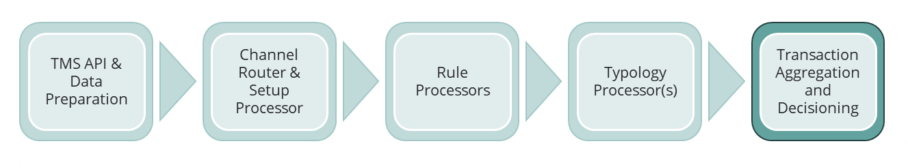

<!-- SPDX-License-Identifier: Apache-2.0 -->

# Transaction Aggregation and Decisioning Processor (TADProc)

## Introduction

The foundation of the Tazama Transaction Monitoring service is its ability to evaluate incoming transactions for financial crime risk through the execution of a number of conditional statements (rules) that are then combined into typologies that describe the nature of the financial crime that the system is trying to detect.

The Event Director (ED) is responsible for determining which typologies a transaction must be submitted to for the transaction to be evaluated for Financial Crime Risk. As part of this process, the ED determines which rules must receive the transaction and then which typologies are to be scored. The ED routes the transaction to the individual rule processors.

The rules receive the transaction, as well as the portion of the Network Map that was used to identify the rules as recipients (and by association also identifies which typologies are beneficiaries of those rules' results).

Each rule executes as a discrete and bespoke function in the evaluation process. Once a rule has completed its execution, it will pass its result, along with the transaction information and its Network sub-map to the Typology Processor where the rule result will be combined with the results from other rules as the results arrive to score a transaction according to a specific typology.

The Typology Processor is a single and centralized configuration-driven processing function that calculates a typology score for any and every typology in the platform based on the incoming rule results for a typology, the Network Sub-map that defines the rules that roll up into a typology and a typology logic statement or "expression" that defines how the rules are to be composed into a typology score.

Once each typology has been scored, the result of the typology will be passed to the Transaction Aggregation and Decisioning Processor (TADProc) which will check each typology result as it is delivered for any immediate workflow triggers. The TADProc will alert the CMS of any typologies that warrant investigation.

## Transaction Aggregation and Decisioning Processor Context



#### 7.1 Read transaction configuration

The system provides three specific opportunities to take action in response to a typology score:

1. During the scoring of the typology itself

2. During the aggregation of the typology score with other typology scores in the TADProc

3. During conclusion of the transaction evaluation in the TADProc

Where interdiction is required, either option 1 and 2 above is the most suitable to satisfy requirements for urgency and immediacy. Where interdiction is not required, evaluation of the typology is still required to determine if an investigation is warranted, but not as urgently. The evaluation for investigation purposes only can be performed in the TADProc on the conclusion of the transaction evaluation.

The TADProc must retrieve the typology triggers from the Tazama configuration so that the TADProc can determine if any of the typologies results warrant an investigation.

##### 7.2 The typology configuration

The typology configuration defines the typology alert and interdiction thresholds for each of the typologies in the platform. 

**Example**:

```json
  "typology_name": "Rule-901-Typology-999",
  "id": "typology-processor@1.0.0",
  "cfg": "999@1.0.0",
  "workflow": {
    "alertThreshold": 200,
    "interdictionThreshold": 400,
    "flowProcessor": "EFRuP@1.0.0"
  }
```

#### 7.3 Check typology triggers

If all typology results had been received, the typology processor evaluate each typology against the typology configuration to determine if an investigation is required. The outcomes of the evaluation depends on the typology score against the defined alertThreshold. If the typology score is equal to or greater than the alertThreshold, the typology processor sets the typology review flag to `true`.

##### 7.4 Create investigation case

If any typology `review` flag is `true`, the TADProc will trigger a review message in JSON format to an adjacent Case Management System to flag the transaction for review.

The outgoing alert message contains:

- The original transaction data that was evaluated

- The network map that defined the routing for the evaluation

- The complete and unabridged results from each of the rules and typologies

- An alert status
  
- Data cache

Sample output message:

```json
{
  "transactionID": "d71103b09a4a47a987e4fa6d5f5497a7",
  "transaction": {
 ...
  },
  "networkMap": {
...
  },
  "report": {
    "evaluationID": "548ac93a-69e9-4acf-b804-85f7ff2c57db",
    "metaData": {
      "prcgTmDP": 12166572,
      "prcgTmED": 236381
    },
    "status": "ALRT",
    "timestamp": "2025-01-17T08:15:10.433Z",
    "tadpResult": {
      "id": "004@1.0.0",
      "cfg": "1.0.0",
      "typologyResult": [
        {
          "id": "typology-processor@1.0.0",
          "cfg": "999@1.0.0",
          "result": 200,
          "ruleResults": [
            {
              "id": "EFRuP@1.0.0",
              "cfg": "none",
              "subRuleRef": "none",
              "prcgTm": 6052681,
              "wght": 0
            },
            {
              "id": "901@1.0.0",
              "cfg": "1.0.0",
              "subRuleRef": ".02",
              "prcgTm": 17682366,
              "wght": 200
            }
          ],
          "prcgTm": 8754078,
          "review": true,
          "workflow": {
            "alertThreshold": 200,
            "interdictionThreshold": 400,
            "flowProcessor": "EFRuP@1.0.0"
          }
        }
      ],
      "prcgTm": 6509701
    }
  },
  "dataCache": {
    "dbtrId": "9884a6ef00ed40b8823d7ea8c05180faTAZAMA_EID",
    "cdtrId": "302aea41b6d543d9b7e7553d24f3331dTAZAMA_EID",
    "cdtrAcctId": "93e955bf86c8447aacf84daa5aecbd30MSISDNfsp001",
    "dbtrAcctId": "c64f443acfde45c6a751d25e6b9e257aMSISDNfsp001",
    "instdAmt": {
      "amt": 940,
      "ccy": "USD"
    },
    "intrBkSttlmAmt": {
      "amt": 940,
      "ccy": "USD"
    },
    "creDtTm": "2025-08-25T08:33:09.960Z"
  }
}
```

#### 7.5 Write transaction results

If all typology results had been received and processed by the TADProc, the TADProc must write the transaction result to the transaction history database.
