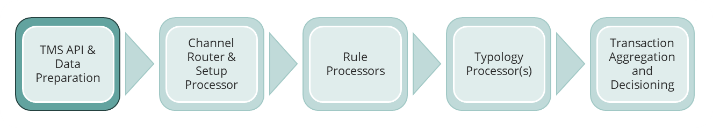
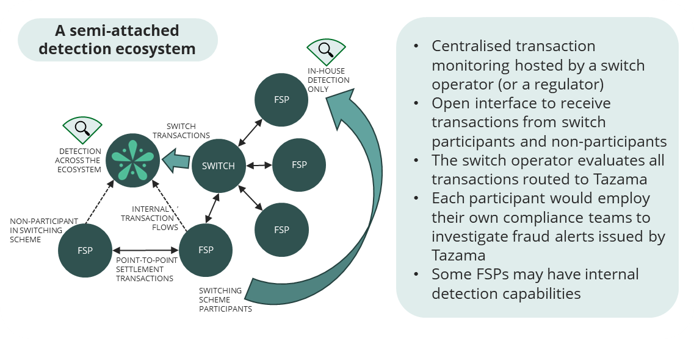
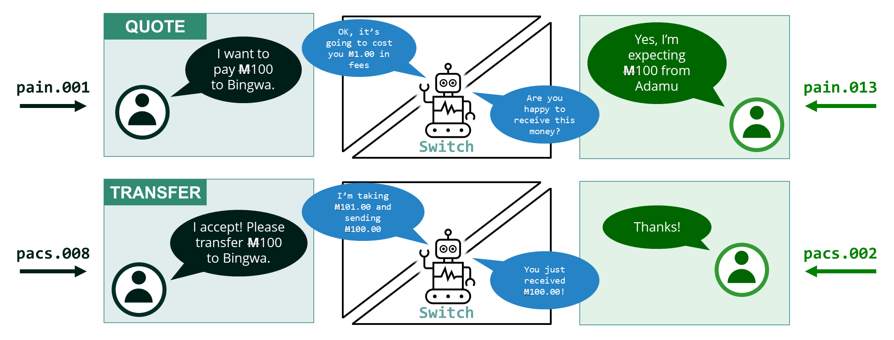
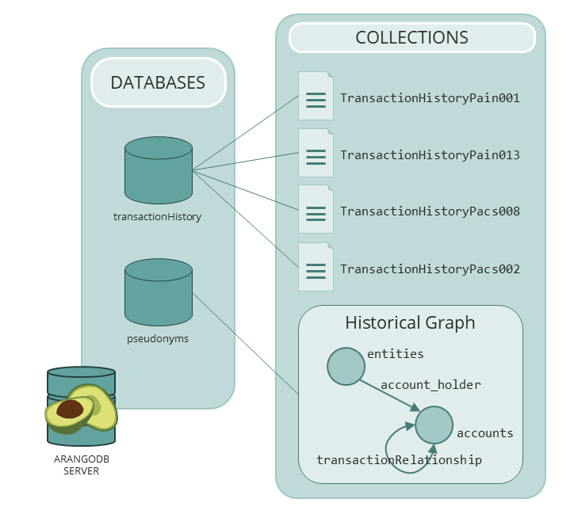

<!-- SPDX-License-Identifier: Apache-2.0 -->

# The Transaction Monitoring Service API



The purpose of Transaction Monitoring Service (TMS) API is to facilitate the submission of a transaction to the Tazama system so that the transaction can be evaluated for behavior that may indicate financial crime, including fraud and money laundering.

The Tazama system is designed to be able to take on transaction messages from customer systems, evaluate these messages for specific behaviors, and deliver an assessment of the evidence of financial crime inherent in the transaction.

Tazama can be deployed to service the needs of a single Financial Service Provider (FSP), an intermediary system such as a clearing house or payment switch, and also a combination of FSP and switching participants in what we call a “semi-attached” configuration:



In this configuration, the switching hub and FSPs both inside and outside the switching ecosystem can submit transaction messages to the Tazama system for evaluation.

To facilitate this configuration, the Tazama system exposes its services through its own API.


The TMS API implements ISO 20022 message formats to facilitate Payment Initiation messages `pain.001` and `pain.013` and Payment Settlement messages `pacs.008` and `pacs.002`.

ISO20022 is traditionally an XML-based standard, but Tazama has implemented an abridged JSON message format to minimize the message payload to increase the performance and reduce bandwidth requirements.

For more information on Tazama’s ISO 20022 implemented, see the [ISO20022 and Tazama](../Knowledge-Articles/iso20022-and-tazama.md) page.

The TMS API ingests transaction messages in real-time through the TMS API. The intention is to evaluate each transaction as they are performed, before they are sent to their destinations, to give Tazama an opportunity to evaluate the transaction before completion and to allow a transaction to be blocked.

By default, Tazama is set up to evaluate four transactions composed into a two-stage quote-and-transfer process:



With Tazama and the TMS API up and running, you can send the messages to their respective endpoints:

 - `host:port/execute` - receives a [pain.001 message](https://www.iso20022.org/standardsrepository/type/pain.001.001.11) to initiate a **quote request**
 - `host:port/quoteReply` - receives a [pain.013 message](https://www.iso20022.org/standardsrepository/type/pain.013.001.08) for the **quote response**
 - `host:port/transfer` - receives a [pacs.008 message](https://www.iso20022.org/standardsrepository/type/pacs.008.001.09) to initiate a **transfer request**
 - `host:port/transfer-response` - receives a [pacs.002 message](https://www.iso20022.org/standardsrepository/type/pacs.002.001.11) for the **transfer response**

The TMS API follows the OpenAPI specification and each incoming message is validated using a Swagger document to ensure that the message meets the requirements to be ISO 20022 compliant, and also that the information that is necessary for a successful evaluation is provided.

## Data preparation

Once a transaction has been received successfully and the TMS API has validated the message, the TMS API also performs the initial processing of the transaction message to integrate the message into the Tazama historical data store.

The Tazama ArangoDB layout for historical data is as follows:



When each message is received and processed by the TMS API, the following tasks are performed:

1. Store the message as received

For audit purposes, incoming messages are stored unadulterated in separate data collections:

 - `pain.001` messages are stashed in the `TransactionHistoryPain001` collection in the `transactionHistory` database
 - `pain.013` messages are stashed in the `TransactionHistoryPain013` collection in the `transactionHistory` database
 - `pacs.008` messages are stashed in the `TransactionHistoryPacs008` collection in the `transactionHistory` database
 - `pacs.002` messages are stashed in the `TransactionHistoryPacs002` collection in the `transactionHistory` database

2. Load the message into the historical graph

The bulk of the behavioral modelling is performed over data composed into the historical graph database.

With the notable exception of the `pacs.002` message, each ISO20022 message contains information related to the entities participating in the transaction, their accounts, and information about the transaction itself. This information is used to populate the components of the graph model:

 - The debtor and creditor entity data is stored in the `entities` node collection
 - The debtor and creditor account data is stored in the `accounts` node collection
 - The debtors and creditors are connected to their accounts via an `account_holder` edge
 - The transaction itself is represented by a `transactionRelationship` edge between the debtor and creditor accounts

3. Create the `DataCache` object

The chain of four messages that comprises a complete transaction from quote to transfer contain the same information for some basic components that are used to interact with the graph database.

When the first message is received, the Data Preparation service will collect and store this information in an object called the `DataCache` that will then accompany the transaction message payload to the rule processors.

For improved performance, rule processors that require this basic information can retrieve the information from the `DataCache` in the payload, instead of having to retrieve the data from the database.

The following information is currently contained in the `DataCache` object:

```json
{
  "cdtrId": "<creditor identifier>",
  "dbtrId": "<debtor identifier>",
  "cdtrAcctId": "<creditor account identifier>",
  "dbtrAcctId": "<debtor account identifier>",
  "creDtTm": "<timestamp of the earliest message in the chain>",
  "amt": {
    "amt": "<the transaction amount>",
    "ccy": "<the transaction currency>"
  }
}
```

4. Generate meta-data

There are two additional pieces of information added to the transaction message payload that is worth mentioning. The outgoing transaction message will contain a new `metaData` object that will contain some additional information that is generated during the Data Preparation process.

Firstly, we create a `traceParent` attribute that will generate an over-arching identifier that we use to link logging across all the processors together into a single waterfall view in Elastic Application Performance Monitoring (APM).

Secondly, we record the time it took to process the transaction inside the TMS API and Data Preparation into a `prcgTmDP` attribute.

## Message transmission

On the conclusion of the Data Preparation process, the complete message payload is sent from the Transaction Monitoring Service API to the Event Director.

## Payment Platform Adapters

If a Tazama client system is unable to submit messages in the required ISO 20022 format, client organizations would need to submit their transactions to a custom-built adaptor so that their transaction can be transformed and then passed to the Tazama system to meet the specification of the Tazama Transaction Monitoring Service (TMS) API.

A [Mojaloop](https://mojaloop.io) Payment Platform Adapter has been developed and is hosted in the [Tazama GitHub Payment Platform Adapter repository](https://github.com/frmscoe/payment-platform-adapter).

Technical documentation for the implementation of the TMS API is covered in the [Transaction Monitoring Service (TMS) repository](https://github.com/frmscoe/tms-service).
