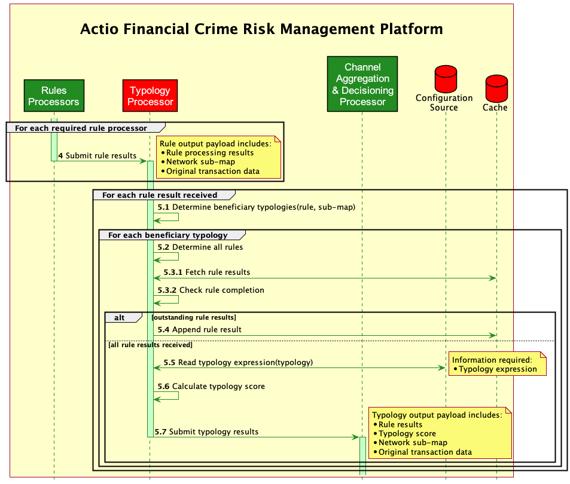

<!-- SPDX-License-Identifier: Apache-2.0 -->

# Typology Processing

- [Typology Processing](#typology-processing)
  - [Introduction](#introduction)
  - [Typology Processor Context](#typology-processor-context)
    - [4. Submit rule results](#4-submit-rule-results)
    - [5.1. Determine beneficiary typologies](#51-determine-beneficiary-typologies)
    - [5.2. Determine all rules](#52-determine-all-rules)
    - [5.3.1 Fetch rule results](#531-fetch-rule-results)
    - [5.3.2. Check rule completion](#532-check-rule-completion)
    - [5.4. Append rule result](#54-append-rule-result)
    - [5.5. Read typology configuration](#55-read-typology-configuration)
        - [5.5.1. The Typology Configuration](#551-the-typology-configuration)
    - [5.6. Calculate typology score](#56-calculate-typology-score)
    - [5.7. Submit typology results](#57-submit-typology-results)
    - [5.8 A note on typology interdiction](#58-a-note-on-typology-interdiction)

**Change notes:**

1. 2021/08/19: Changed the description of the typology *expression* as the configuration “file” of the typology to the typology *configuration.*

2. 2021/08/19: Added a requirement for interdiction out of the typology processor.



## Introduction

The foundation of the Tazama Transaction Monitoring service is its ability to evaluate incoming transactions for financial crime risk through the execution of a number of conditional statements (rules) that are then combined into typologies that describe the nature of the financial crime that the system is trying to detect.

The Channel Router & Setup Processor (CRSP) is responsible for determining which channels and typologies a transaction must be submitted to for the transaction to be evaluated for Financial Crime Risk. As part of this process, the CRSP determines which rules must receive the transaction and then which typologies are to be scored. The CRSP routes the transaction to the individual rule processors.

The rules receive the transaction, as well as the portion of the Network Map that was used to identify the rules as recipients (and by association also identifies which typologies are beneficiaries of those rules’ results).

Each rule executes as a discrete and bespoke function in the evaluation process. Once a rule has completed its execution, it will pass its result, along with the transaction information and its Network sub-map to the Typology Processor where the rule result will be combined with the results from other rules as the results arrive to score a transaction according to a specific typology.

The Typology Processor is a single and centralised configuration-driven processing function that calculates a typology score for any and every typology in the platform based on the incoming rule results for a typology, the Network Sub-map that defines the rules that roll up into a typology and a typology logic statement or “expression” that defines how the rules are to be composed into a typology score.

Once each typology has been scored, the result of the typology will be passed to the Channel Aggregation and Decisioning Processor (CADP) which will check each typology result as it is delivered for any immediate workflow triggers. All typology results for a specific channel will be combined by the CADP into a single comprehensive channel result.

## Typology Processor Context


**Figure**: *Tazama TMS Typology Processing Context*

### 4. Submit rule results

The rule processor passes its completed result to the Typology Processor.

The rule result message includes the original transaction, the Network Sub-map and the rule execution result (Rule identifier, sub-rule identifier (for rule-sets), boolean rule result and result reason).

### 5.1. Determine beneficiary typologies

When the Typology Processor receives a rule result, the Typology Processor must interrogate the Network Sub-Map to identify which typologies in the Network Sub-map are the recipients (beneficiaries) of the rule result.

Because a rule can be execute once regardless of the channels employed in the evaluation of a specific transaction, the beneficiary typologies thus identified could also be linked to multiple different channels.

### 5.2. Determine all rules

For each typology identified as a beneficiary of the incoming rule result, the Typology Processor must again interrogate the Network Sub-Map to determine which other rules have been invoked that also has this typology as a beneficiary. This step defines all of the constituent rules for which the typology expects results before it can calculate a score.

### 5.3.1 Fetch rule results

For each typology identified as a beneficiary of the incoming rule result, and using the list of constituent rules determined in 5.2, the Typology Processor must retrieve any previously cached rule results (if any) that had been received for the typology for the current transaction.

### 5.3.2. Check rule completion

For each typology identified as a beneficiary of the incoming rule result, and using the list of constituent rules determined in 5.2 and previously cached rule results (if any), the Typology Processor must check if all of the rule results specified in the Network Sub-map have now been received.

### 5.4. Append rule result

If all of the rule results specified in the Network Sub-map for a specific typology have not yet been received, the incoming rule result must be cached so that it can be retrieved at a future time when all of the rules had been received.

### 5.5. Read typology configuration

If all of the rule results specified in the Network Sub-map for a specific typology have been received, the Typology Processor must retrieve the typology configuration for the beneficiary typology so that the rule results can be combined into a typology score.

At present, the calculation of a typology score is a straight-forward logic expression:

typology result = IF(rule_result_1.outcome THEN rule_result_1.score) + … IF(rule_result_n.outcome THEN rule_result_n.score)

The individual rule result scores, as a mapped to a weighted number based on the rule’s boolean outcome (TRUE or FALSE), is defined as part of the typology configuration. Once mapped to a numerical value, the typology score is calculated as the sum of all rule result values.

typology score = rule_result_1.score + … + rule_result_n.score

**For example**: In the following rule outcome table for rule 003:

| **Sub-rule ref** | **Outcome** | **Typology Score Value** |
| --- | --- | --- |
| 003.00 | Payee account dormancy = FALSE | 0   |
| 003.01 | Payee account dormancy 3 = TRUE | 33  |
| 003.02 | Payee account dormancy 6 = TRUE | 67  |
| 003.03 | Payee account dormancy 12 = TRUE | 100 |
| 003.04 | Payee account dormancy = FALSE | 0   |

In other words, if there had been no transfer requests from or to the account in 211 days (i.e. 003.02 = TRUE), the contribution of this rule (003) to the typology score would be 67 (can we call them rule points?)

Only TRUE outcomes for a rule or sub-rule are expected to produce a score. FALSE outcomes are generally assumed to void a rule entirely and render a score of ZERO.

The logic expression for typology 28 would be composed as follows:

[IF(001.01 outcome THEN 001.01.score) + IF(001.02 outcome THEN 001.02.score) +

IF(001.03 outcome THEN 001.03.score) + IF(001.04 outcome THEN 001.04.score) +

IF(001.05 outcome THEN 001.05.score) + IF(001.06 outcome THEN 001.06.score)] +

[IF(002.01 outcome THEN 002.01.score) + IF(002.02 outcome THEN 002.02.score) +

IF(002.03 outcome THEN 002.03.score)] + … +

IF(071.outcome THEN 071.score) +

IF(078.outcome THEN 078.score)

##### 5.5.1. The Typology Configuration

The typology configuration contains two sections: the first (**rules**) defines all the rules and their outcomes, along with the weighted score attributed to each true or false outcome; the second (**expression**) defines the expression that combines the rule results into the typology score.

**Example**:

The archetypical scam typology (typology 28) contains 18 different rules that feed the typology. These rules are composed into the typology via the typology configuration as follows:

```json
{
    "typology_name": "False promotions, phishing, or social engineering scams, such as fraudsters impersonating providers and advising customers they have won a prize in a promotion and to send money to the fraudster's number to claim the prize.",
    "id": "028@1.0.0",
    "cfg": "1.0.0",
    "rules": [
        {
            "id": "003@1.1.0",
            "cfg": "1.1.0",
            "ref": ".01",
            "true": "100",
            "false": "0"
        },
        {
            "id": "003@1.1.0",
            "cfg": "1.1.0",
            "ref": ".02",
            "true": "100",
            "false": "0"
        },
        {
            "id": "003@1.1.0",
            "cfg": "1.1.0",
            "ref": ".03",
            "true": "100",
            "false": "0"
        },
        {
            "id": "003@1.1.0",
            "cfg": "1.1.0",
            "ref": ".00",
            "true": "100",
            "false": "0"
        },
        .
        .
        .
        {
            "id": "084@1.0.0",
            "cfg": "1.0.0",
            "ref": ".00",
            "true": "100",
            "false": "0"
        },
        {
            "id": "084@1.0.0",
            "cfg": "1.0.0",
            "ref": ".01",
            "true": "100",
            "false": "0"
        }
    ],
    "expression": {
        "operator": "+",
        "terms": [
            {
                "id": "003@1.1.0",
                "cfg": "1.1.0"
            },
            .
            .
            .
            {
                "id": "084@1.0.0",
                "cfg": "1.0.0"
            }
        ]
    }
}
```

### 5.6. Calculate typology score

For each beneficiary typology with a complete set of rule results, and using the typology expression and the associated score values, the Typology Processor must calculate the typology score for the typology.

### 5.7. Submit typology results

Once calculation of the typology score is complete, the Typology Processor must pass the typology result, including the transaction information, Network Sub-map, typology results and rule results to the Channel Aggregation and Decisioning Processor.

### 5.8 A note on typology interdiction

It makes sense for the typology processor to be able to interdict a transaction directly, if the threshold for interdiction has been met. This trigger was initially intended to be processed by the CADProc and may still be added to the CADProc for interdiction triggers over an aggregated assessment over a number of typologies, but it is more efficient to let a typology trigger its own interdiction immediately on a threshold breach.

1. For a given typology, a specific threshold value must be linked to the typology for the following workflow outcomes:
    1. **Interdiction**: If a typology score is equal to or greater than this value, the Typology Processor will trigger an interdiction workflow to instruct the client system to block the transaction.
    2. **Review**: If a typology score is equal to or greater than this value, the Typology Processor will trigger an alert to the Case Management System to initiate an investigation into the transaction.
    3. **None**: If a typology score is less than the Review threshold, no triggered action is taken by the Typology Processor.
2. The threshold for interdiction and investigation will be defined in the typology configuration.
