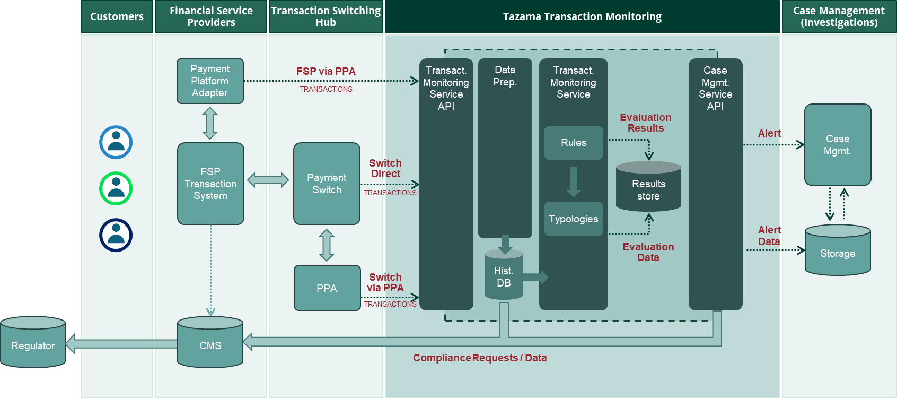

<!-- SPDX-License-Identifier: Apache-2.0 -->

# Welcome to the Tazama Project!

The sections below provide a brief overview of the Tazama system, with links to pages that contain more detailed information.

- [Welcome to the Tazama Project!](#welcome-to-the-tazama-project)
  - [1. What is Tazama?](#1-what-is-tazama)
  - [2. Understanding Typologies and Rules](#2-understanding-typologies-and-rules)
  - [3. Core Components](#3-core-components)
    - [3.1. Transaction Monitoring Service API](#31-transaction-monitoring-service-api)
    - [3.2. Event Director](#32-event-director)
    - [3.3. Rule Processors](#33-rule-processors)
    - [3.4. Typology Processor](#34-typology-processor)
    - [3.5. Transaction Aggregation and Decisioning Processor (TADProc)](#35-transaction-aggregation-and-decisioning-processor-tadproc)

##  1. What is Tazama?

Tazama is an Open Source Real-Time Transaction Monitoring System built to support any Financial Services Provider (FSP) that requires Transaction Monitoring for Fraud and Money Laundering detection. Whether that FSP is a small provider running one or 2 transactions per day or a national payment switch running at over 3,000 Transactions per second. With Tazama they can implement simple or complex rules, implement Fraud Detection controls or support Anti-Money Laundering activities.

Tazama is designed to ingest transaction data in real-time through its Transaction Monitoring Service API. Data can be received from multiple participants in a financial ecosystem, including customer-facing Financial Service Providers such as banks, remitters or mobile money operators, and also the intermediaries involved in facilitates transfers and payments across the ecosystem, such as clearing houses or payment switches. The Tazama API is designed to be ISO20022 compliant, but non-ISO20022 systems can still communicate with the system via a Payment Platform Adapter (PPA) that will transform message traffic into an ISO20022 equivalent.

Ingested transactions are stored in the Tazama database from where it will be used to support real-time modelling of participant behavior through a number of rule processors that will evaluate the transaction and its participants to look for suspicious behavior. Rule results will be summarized into fraud and money-laundering scenarios, called typologies.

If the rules and typologies show sufficient evidence of suspicious behavior, an investigation alert will be issued to an external case management system and in extreme cases, the transaction can also be blocked to prevent the transfer of funds.

In the following pages, we intend to give you a clear understanding of the Tazama Transaction Monitoring System, and how all the components of the system work together to detect fraud and money laundering.

<a href="#top">Top</a>

##  2. Understanding Typologies and Rules

To help detect any financial crime we have an extensive list of Typologies. A classic example of a typology is a Phishing Scam - where a susceptible individual is phoned by someone claiming to be legitimately chasing a payment from the individual. For example a tax collection bureau alleging someone has failed to pay taxes and there is now an urgent demand or risk of prison.

By assessing the transfer to the fraudsters, it is possible to identify more high risk transactions. Such as an **elderly person**, sending a **large amount of funds** to a **new payee (or creditor)**. The three rules being assessed in this example are:

 - Age
 - Value of transaction
 - Previous relationship with recipient

If the Fraudster recipient was the customer being monitored it is likely they will receive the funds, and quickly move it to the next person in their money laundering chain. This would be captured in a Layering Typology which would include age of the account or dormant account suddenly becoming active instead of age of the participant.

In the creation of a typology, it is worth highlighting that our phishing example can also create a false positive when a grandparent sends a large sum for an important life event to one of their grandchildren. Previously gifts had been sent via the parents and as such no historical financial relationship had been established. It is for this reason that a rule such as “allow-list of sender and receiver pairs” can be implemented. The typology will then assess if this transaction can be progressed because it is approved in the override request. It is worth noting that a diligent fraudster would look to circumnavigate this control by sending a small transaction that would be allowed, and then moving larger amounts once the history had been established. It is therefore important that an understanding of the customers in a given FSP is developed, as finding the balance of low false positives and managing the activity of fraudsters “testing the boundaries” are critical to the success of an implementation.

<a href="#top">Top</a>

##  3. Core Components
The Tazama system has a number of key components that have been selected and architected to allow maximum flexibility, ensure data protection, and reduced operational costs for high performance at scale. They are the:

 - Transaction Monitoring Service (TMS) API
 - Event Director
 - Rules Processor
 - Typology Processor
 - Transaction Aggregator and Decision Processor (TADProc)

These components are summarized below and described in detail in their own respective sections.

<a href="#top">Top</a>

###  3.1. Transaction Monitoring Service API

The Transaction Monitoring Service (TMS) API is the point of interaction for the FSP. It has been designed to support ISO 20022 compliant transaction messages to give implementers the confidence that, as the world's payments and transfers embrace the ISO 20022 standard, the system is already designed to support them.

Submitted message contents are validated to ensure that only valid messages are processed. Once the message is cleared, the messages are ingested into the historical data stores through the Data Preparation steps.

The message history is saved and the various transaction network graphs are updated before the transaction is sent on to the Event Director to commence the transaction evaluation.

Further information on the role of the TMS API is available on the [Transaction Monitoring Service API](/Product/transaction-monitoring-service-api.md) page.

<a href="#top">Top</a>

###  3.2. Event Director

The Event Director is responsible for determining which typologies a transaction must be submitted to, for the transaction to be evaluated. As part of this process, the Event Director determines which rules must receive the transaction and then which typologies are to be scored. The Event Director routes the transaction to the individual rule processors.

Transaction routing is configurable through a network map that is interpreted in the Event Director to invoke rules and typologies. Rules and typologies can be updated, or new versions added to the system, through configuration by only making changes to the network map.

Further information on the role of the Event Director is available on the [Event Director](/Product/event-director.md) page.

<a href="#top">Top</a>

###  3.3. Rule Processors

A rule processor is designed to address a singular scenario, but its output might be used by multiple typologies. For example a check on the age of the account, when the risk of having accepted a rogue actor as a customer is higher, will be used in more than one typology. This approach reduces the overall impact of combining a rule and typology into a singular function as each typology risks repeating the requests (in this example the age of the account) for the same transaction.

A rule can be used to assess more than one outcome, such as age bands if needed, as the same source data is used as the only variable in the calculation.

Rule processors are templated so that logging, data input, determined outcomes, data output and telemetry are consistently applied by all rule processors. It is just the specific rule’s logic, including the queries that retrieve transaction history according to the rule requirements, that changes between rules. Rules must be developed individually, but the parameters used in the calculation of a rule and its outcomes are contained in a configuration file. The rule behavior can be configured independent of the rule code, reducing the operational burden for modifying a rule to a mere configuration process.

Once the rule has completed its evaluation, the output is forwarded to the Typology Processor.

Further information on the role of the Rules Processor is available on the [Rule Processor Overview](/Product/rule-processor-overview.md) page.

<a href="#top">Top</a>

###  3.4. Typology Processor

The typology processor is designed to aggregate and assess the outcomes from the all rules within the scope of a specific typology. The scope of a typology is defined in a typology configuration specific to each typology. The typology processor scores the combined effect of a typology’s rules to determine if the weighted aggregation of the rule outcomes has reached a predefined threshold for raising a fraud or money laundering alert. Each rule’s weighted contribution to the typology score, as well as the scoring predicate, or formula, is also defined in the typology configuration.

Returning to our earlier example of a phishing scam where rules are implemented to assess an elderly person, sending a large amount of funds to a new payee (or creditor). The three rules being assessed in this example are:

 - Age
 - Value of transaction
 - Previous relationship with recipient

With the output from these rules an assessment is made to determine if there is sufficient evidence of the FSP customer falling victim to a phishing scam. The explicit identification of the contributing rules will later be able to assist a Financial Crime Analyst in investigating suspicious behavior, but also in the reduction of unnecessary investigations.

If a suspicious transaction is identified, there are a number of actions that can be considered. If the accumulated evidence of suspicious behavior in the transaction is considered:

 - **High** - the transaction can be interdicted (blocked) immediately, with an alert sent to the FSP transacting and/or case management systems;
 - **Moderate** - an investigation alert to a case management systems can be created once the evaluation of all the typologies are complete;
 - **Low** - the transaction will pass without intervention, but the evaluation outcome will be stored for future retrieval.

Further information on the role of the Typology Processor is available on the [Typology Processing](/Product/typology-processing.md) page.

<a href="#top">Top</a>

###  3.5. Transaction Aggregation and Decisioning Processor (TADProc)

The final assessment step is to consolidate all the results from all the typologies and persist the results by writing the transaction evaluation results to the database. If any typologies are breached, the completed evaluation results can be routed to a Case Management System for investigation.

The Tazama system does not currently integrate with an existing Case Management System, but does have the capability to submit the transaction evaluation results in JSON format to an external system. An implementer will be able to use this JSON output to pass an alert to the FSP's existing Case Management or Ticket Management systems.

Further information on the role of the Transaction Aggregator and Decision Processor (TADProc) is available on the [Transaction Aggregation and Decisioning Processor (TADProc)](/Product/transaction-aggregation-and-decisioning-processor.md) page.

<a href="#top">Top</a>

