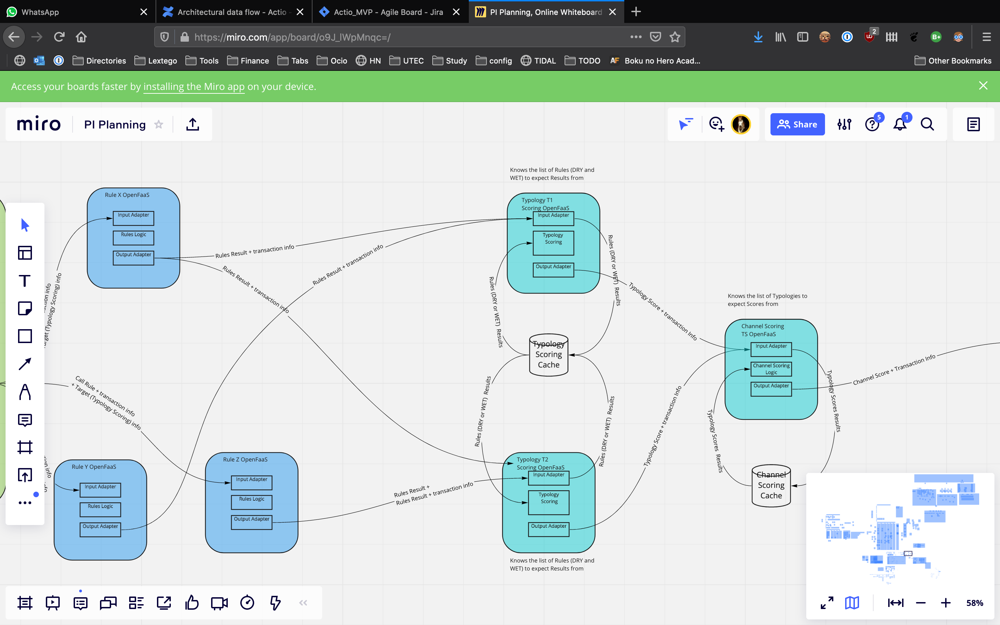
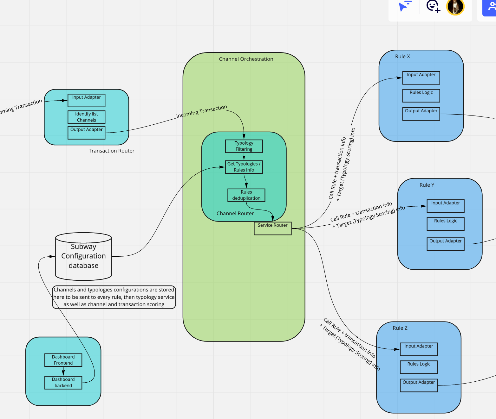
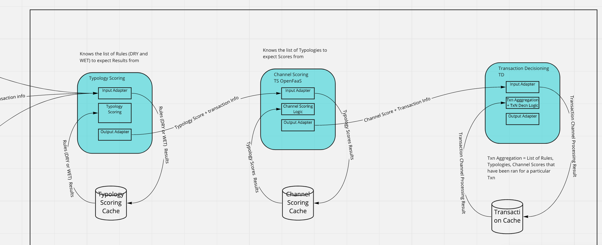

<!-- SPDX-License-Identifier: Apache-2.0 -->

# Architectural data flow

Add your comments directly to the page. Include links to any relevant research, data, or feedback.

Currently Tazama faces some issues with how it handles data that crosses from rules up to the transaction evaluation services. This document should work as a base to decide on actions to improve it.

|     |     |
| --- | --- |
| Status | IN PROGRESS |
| Impact | HIGH |
| Driver | Aarón Reynoza |
| Approver |     |
| Contributors |     |
| Informed |     |
| Due date |     |
| Outcome |     |

## Background

In Tazama, [we’re using not using OpenFaaS correctly](The-Openfaas-Dilemma.md). This is an issue that affects us on time, effort, and other factors.

Basically:

- OpenFaaS serverless advantages are not being used
- OpenFaaS “functions” are actually microservices
- OpenFaaS gateway communication will be replaced with gRPC
- Our current architecture will grow slower to maintain and difficult to update.

## Current architecture

While this architecture is GREAT for OpenFaaS serverless functions, that’s not what we’re currently doing.

What we’re doing, is having multiple Koa servers, connecting with each other. This is a microservices architecture.

In order to make them real serverless functions, many of these services could be rewritten into simple functions. NodeJS functions into simple files.

This way, we could have a repository (When our own github org is ready) full of files for functions for rules. We can also do the same for typologies. This is probably the model that was meant to be used when OpenFaaS was specified in the project, as it will make sense.

There are still some unknowns, like interactions with external factors (databases, cache, etc) to be used inside functions, as they should be kept small.

A possible solution would be a middleware service that interacts with the rules. Performance will probably be decreased after this service is introduced.

Another solution may be to send the data the functions need directly from the channel orchestrator. This leaves connections with things like databases to a single service, and functions will just evaluate data (which follows a more functional method)

Further discussion needs to be made.

## Microservices architecture

OpenFaaS is just a burden on our current code, why not remove it?

Reasons:

- Most of our code is already microservices (for better or worse)
- In our services, it would probably be easier to leave the current architecture as it is and keep integrating services with third parties they need (databases, caches, and others)
- Removing OpenFaaS is easy peasy.

Ok, so once we remove OpenFaaS, we have easier deployments, but hardcoding withing the services is still there.

A possible solution would be to create a Dashboard that configures data for typologies and channels. The data is saved in a the database (Arango) and the channel orchestrator service uses that data to forward it to the rules alongside the transaction. Rules then receive the configuration and evaluate the transaction, then forward the result to the typology service.

Typologies are replaced with a single typology service. This service will be receiving data from rules, reading the configuration they send and creating typologies based on that data. Once typologies are evaluated, the service sends the results for each individual typology AND the configuration for channels received from the configuration to the Channel Scoring service. The Channel Scoring Service now takes the same approach as the Typology service, and evaluates it’s channels. Once they’re evaluated, they send the result alongside the configuration for the final transaction evaluation to the transaction decisioning service which evaluates the end result for a transaction.

The advantages of this approach:

- Less services developed: Since we’re grouping typologies into a single service, we only need to make the service to read the configuration and replicate this service as needed in order to scale.
- We remove hardcoding: Everything can be configured from the configuration data sent across services. even routing
- We can open-source/close-source what we want: We probably don’t want to share openly some rules, or typologies. At the same time we need to open source everything we can that doesn’t compromise the evaluation process. By following this idea, we can keep many services private.
- Typologies/Channels at will: Having a dashboard to configure the process can enable us to create typologies in seconds. Rules just need to be deployed and the typologies configured from a front end dashboard (or API). Same scenario for Channels. This enables users of the system to change this behavior.
  
## Hybrid approach

While both architectures has their ups and downs, they can be mixed, to have both functions as code, making it easier for us to develop, and at the same time updating the architecture to be configured by objects sent in a chain-like event. This idea needs to be investigated further.

## Outcome

TO BE DECIDED
