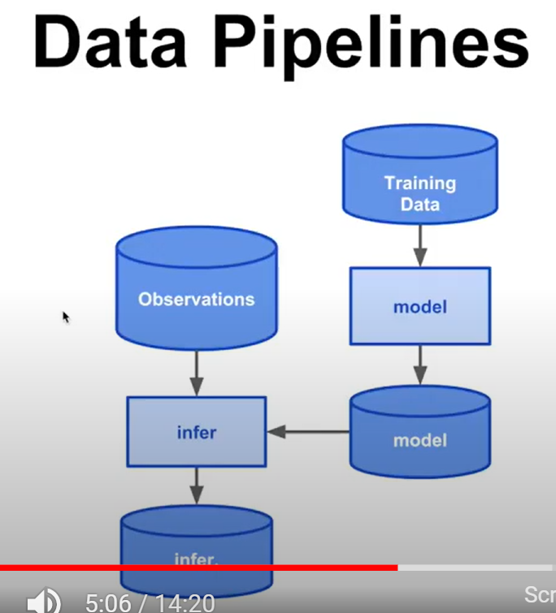
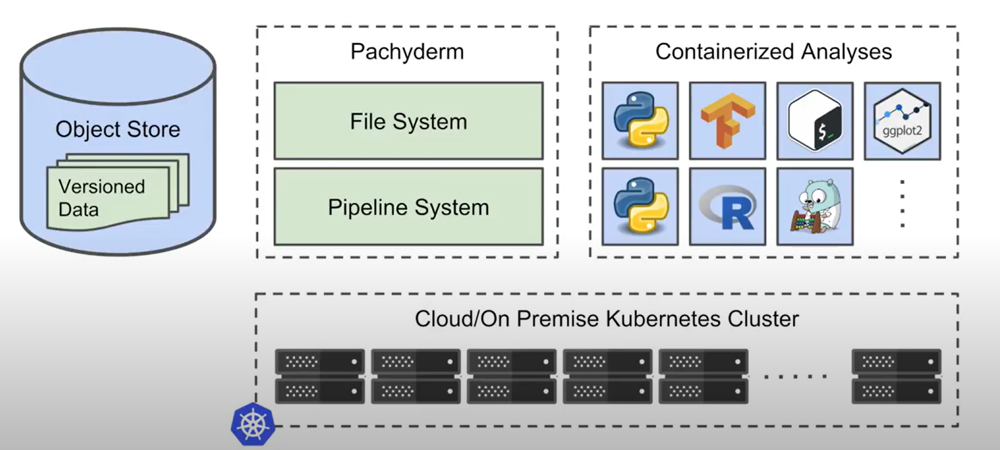
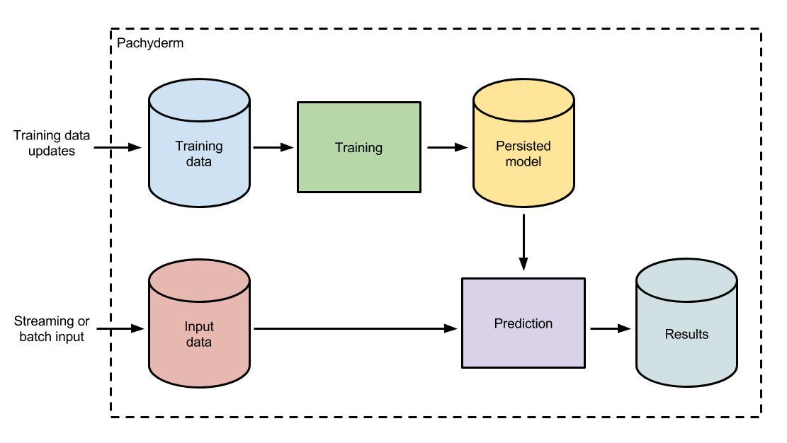

<!-- SPDX-License-Identifier: Apache-2.0 -->

# Data Path

Add your comments directly to the page. Include links to any relevant research, data, or feedback.

|     |     |
| --- | --- |
| Status | IN PROGRESS |
| Impact | HIGH / MEDIUM / LOW |
| Driver | Nabanita |
| Approver |     |
| Contributors | Greg McCormick Justus Ortlepp junaid Rob Reeve |
| Informed |     |
| Due date | 26 Feb 2021 |
| Outcome |     |

## Background

**Pachyderms’s Core Concepts:**

(1) Data versioning

(2) Containerized Analyses - Pachyderm allows any language/libraries/Frameworks for each of the transmission step within the pipeline

(3) Data Pipelines - pipeline stages are triggered by new dataset - uses the latest version of codes and data - we can go back and see each combination and compare previous results

(4) Individually scalable pipeline stages - every step in a pipeline can individually be scaled - can be scaled up and down very easily depending on data load

(5) Data Provenance - Tracks all of the data and processing that corresponds to any result - run as many jobs as you want and change data constantly without losing the context of the result

**Pachyderm Architecture:**

Deployed on Kubernetes which is used as Container scheduler and works on cloud or On premise Kubernetes cluster. At the storage layer uses any generic object store (S3/google cloud storage). Pachyderm itself is stored as a containerized application on Kubernetes cluster . Data scientists can create containerized analyses such as Python/R - pass the pipeline definitions to Pachyderm and then Pachyderm will chain them together and make sure the right data is passed on to each stage of the pipeline and have Kubernetes schedule it.

We can combine a model training process, persisted models, and a model utilization process (e.g., making predictions or generating results) into a single Pachyderm pipeline DAG (Directed Acyclic Graph). Such a pipeline is easily defined via a simple [JSON pipeline specification](http://docs.pachyderm.io/en/latest/deployment/pipeline_spec.html) that references the various pieces of the DAG, and it allows us to:

- Keep a rigorous historical record of exactly what models were used on what data to produce which results.
- Automatically update online ML models when training data or parameterization changes.
- Easily revert to other versions of an ML model when a new model is not performing or when “bad data” is introduced into a training data set.

This sort of sustainable ML pipeline looks like this:

At any time, a data scientist or engineer could update the training dataset utilized by the model to trigger the creation of a newly persisted model in the versioned collection of data (aka, a Pachyderm data “repository”) called “Persisted model.” This training could utilize any language or framework (Spark, Tensorflow, sci-kit learn, etc.) and output any format of persisted model (pickle, XML, POJO, etc.).

Regardless of framework, the model will be automatically updated and is versioned by Pachyderm. This process explicitly tracks what data was flowing into which model AND exactly what data was used to train that model.

In addition, when the model is updated, any new input data coming into the “Input data” repository will be processed with the updated model. Old predictions can be re-computed with the updated model, or new models could be backtested on previously input and versioned data. No more manual updates to historical results or worrying about how to swap out ML models in production!

## Relevant data

Useful

- [4 Alternatives to Pachyderm | Product Hunt | Product Hunt](https://www.producthunt.com/alternatives/pachyderm)
- [What are some alternatives to Pachyderm? - StackShare](https://stackshare.io/pachyderm/alternatives)
- [The Best Pachyderm Alternatives - neptune.ai](https://neptune.ai/blog/the-best-pachyderm-alternatives)
- [The 13 Best Pachyderm Alternatives & Reviews (2021) (saashub.com)](https://www.saashub.com/pachyderm-alternatives)

## Options considered:

Pachyderm surely is a powerhouse for ML experiments, but if you’re looking for a different solution focused more on specific aspects (part of the lifecycle) of machine learning projects, or need a more lightweight tool, Pachyderm may not be the perfect tool for you.

## Data and pipeline versioning:

| [**Pachyderm**](https://www.pachyderm.com/) | [**DVC**](https://dvc.org/) | [**Kubeflow**](https://www.kubeflow.org/) | [**Neptune**](https://neptune.ai/) | [**MLflow**](https://mlflow.org/) | [**Polyaxon**](https://polyaxon.com/) | [**SageMaker**](https://aws.amazon.com/sagemaker/) |
| --- | --- | --- | --- | --- | --- | --- |
| Pachyderm is a data science platform that helps to control an end-to-end machine learning life cycle. | DVC, or Data Version Control, is **an open-source version control system for machine learning projects**. It’s an experimentation tool that helps you define your pipeline regardless of the language you use  ## DVC's Features  - Git-compatible      - Storage agnostic      - Reproducible      - Low friction branching      - Metric tracking      - ML pipeline framework      - Language- & framework-agnostic      - HDFS, Hive & Apache Spark      - Track failures       In terms of core features, DVC is centered around:  1.  Version control for large files      2.  Lightweight pipelines with reproducibility built in      3.  Versioning and experimentation management on top of git | Kubeflow is the ML toolkit for Kubernetes. Kubeflow is an open source set of tools for building ML apps on Kubernetes.   The project is attempting to build a standard for ML apps that is suitable for each phase in the ML lifecycle: experimentation, data prep, training, testing, prediction, etc.  Everything can be orchestrated with Kubeflow Pipelines, which are controllable from a simple UI. There’s also integrated notebook servers for quick experimentation and easy access to the cluster’s resources.  It’s a very flexible and extensible framework due to it relying on Kubernetes to manage all code execution, resource management, and networking. Any other required Kubernetes applications (such as Dask in our case) can share the same cluster. We’ve also deployed a cluster autoscaler, which works seamlessly with Kubeflow, enabling the cluster to crunch some seriously large numbers with no added complexity. | Neptune brings organization and collaboration to data science projects. All the experiment-related objects are backed-up and organized ready to be analyzed and shared with others. Works with all common technologies and integrates with other tools.  ## (Experiment tracking and meta ML) | MLflow provides solutions for managing the ML process and deployment. It can do experimentation, reproducibility, deployment, or be a central model registry.   The platform can be used for ML deployment by individual developers as well as teams. It can be incorporated into any programming ecosystem. The library is built to satisfy various technological needs and can be used with different machine learning libraries.   Organizing the entire ML lifecycle revolves around four main functions: Tracking, Projects, Models, and Model Registry.   ## (Experiment tracking and meta ML) | Polyaxon is a platform for **reproducing and managing the whole life cycle of machine learning projects as well as deep learning applications**.  The tool can be deployed into any data center, cloud provider, and can be hosted and managed by Polyaxon. It supports all the major deep learning frameworks, e.g., Torch, Tensorflow, MXNet.  When it comes to orchestration, Polyaxon lets you maximize the usage of your cluster by scheduling jobs and experiments via their CLI, dashboard, SDKs, or REST API.  ## (Training run orchestration) | Amazon SageMaker is a platform that enables data scientists to **build, train, and deploy machine learning models**. It has all the integrated tools for the entire machine learning workflow providing all of the components used for machine learning in a single toolset.  SageMaker is a tool suitable for organizing, training, deployment,  and managing machine learning models. It has a single, web-based visual interface to perform all ML development steps – notebooks, experiment management, automatic model creation, debugging, and model drift detection  ## (Training run orchestration) |
|   - data versioning combined with data pipelining, which results in data lineage and ends with deploying machine learning models      - It holds all your data in a central accessible location      - It updates all depending data sets when data is added to or changed in a data set      - It can run any transformation, as long as it runs in a Docker, and accepts a file as input and outputs a file as result      - It versions all your data      - It handles both modified data and newly added fractions of data      - It can keep branches of your data sets when you are testing new transformation pipelines which is a great way to support different team members working with and on the same data sets.      - It has got its own dashboard -Pachdash      - Pachyderm is more focused on data engineering pipelines         - *Less practical is how to deploy a new version of your pipeline to the cluster.* It increases the development cycle, and it cannot be fully automated. Especially the manual handling of the docker tag will limit you in putting this all easily into a CI/CD pipeline |   - Managing large datafiles in ML systems      - Effective reproducibility in ML systems      - Team onboarding and code sharing efficiency      - Reduction in tooling and hacking required for ML system cohesion      - Performing and tracking experiments         - Overall system design      - Effective collaboration between teams, i.e. ensuring that silos between data science/product/engineering      - Figuring out your dependencies in the first place      - Failure to manage runtime dependencies and OS-level reproducibility issues (this is where containerization can help).      - Controlling non-deterministic behavior      - Operations that read directly from a changing datastore and do not save intermediate files (DVC does provide a strong reason to add these files though)      -  it does not seamlessly integrate into Git, DVC commands have to be run in addition to Git commands      - **False sense of security**: There is the risk that you configure your pipeline incorrectly, forgetting to add an output file or a dependency, and then assume your system is working correctly when DVC `repro` does not warn you about any issues. |   - Road to production for ML projects is simplified. It supposedly allows data scientists to use the same code locally as in production.       - Data scientists have easy access to the full compute power of the cluster from their notebooks, which are nicely separated from other processes thanks to Kubernetes namespaces.      - The *reusability* of components is also a big benefit.      - Kubeflow lets you customize everything, which always comes at the expense of simplicity.      - Simplifies the on-boarding of new team members         - Every script needed to be converted by hand into a Kubeflow component to get it running in a pipeline. For each one this meant writing a Dockerfile, building a container, creating a [component spec](https://www.kubeflow.org/docs/pipelines/reference/component-spec/), and adding a custom [container spec](https://kubernetes.io/docs/tasks/configure-pod-container/assign-memory-resource/#specify-a-memory-request-and-a-memory-limit) to make sure it ran on the right nodes and requested enough memory. **This is a lot of overhead**      - Difficult to set up and configure manually. |   - Allows you to track an exploratory analysis - In Neptune, you can version your exploratory data analysis or results exploration. After saving it, you can name, share, and download, or see differences in your notebook checkpoints.       - Neptune integrates with Jupyter notebooks, so you can automatically snapshot whenever you run a cell containing `neptune.create_experiment()`.       - Neptune lets you monitor hardware and resource consumption (CPU, GPU, memory) live persistently, while you train your models. With this data, you can optimize your code to utilize your hardware to the maximum.           This data is generated automatically, and you can find it in the monitoring section of the UI      - allows you to easily browse through hundreds of images and charts      - With Neptune, you can save experiment data by either backing it up on a hosting server, or an on-prem installation. You can easily share experiments with no overhead      - Neptune gives your full control over [user and access permissions](https://docs.neptune.ai/workspace-project-and-user-management/user-management/index.html). You can limit or grant viewing and editing capabilities by assigning different roles such as owner, contributor, or viewer.           **Inviting team members is as simple as an email invitation**      - After logging your experiments, you can easily organize them in the Neptune dashboard which is better than that of MLflow - such as group experiments by features         - Limited Data Versioning      - Limited Model Versioning      - Limited Environment Versioning      - No Code Diffs |   - The model tracking mechanism is easy to set up.      - It offers very intuitive APIs for serving.      - The logging is practical and simplified, so it’s easy to run experiments.      - Code-first approach      - Built-in Integration with Kubernetes         - The addition of extra workings to the models is not automatic.      - Not quite easy and ideal for deploying models to different platforms      - MLflow stores and tracks experiments locally, limiting user management and team setup capabilities.      - MLflow does not offer any features for user management      - one of the disadvantages of MLflow is that you can’t easily share experiments, nor collaborate on them.           In order to add organization and collaboration, you need to host the MLflow server, confirm that the right people have access, store backups, and jump through other hoops. **But you can integrate it with Neptune.** |   - Cli      - API      - Streamlit integration      - Python Client      - Notebook integration      - Tensorboard integration      - VSCode integration      - Polyaxon makes it easy to schedule training on a Kubernetes cluster. The problem this solves is that machine learning engineers generally spend too long running their jobs in series, rather than parallel. Instead of running one thing and waiting for it to finish, it's both more efficient and better methodology to plan out the experiments and then run them all at once.       (But Pachyderm is more concerned with versioning and asset management. It's more like Git+Airflow.)  - Polyaxon is useful to train deep learning models in a cluster. And Pachyderm may not be able to do it like Polyaxon does        Polyaxon focuses on different aspects of machine learning reproducibility than Pachyderm, although Polyaxon will be providing a very simple pipelining abstraction to start experiments based on previous jobs, triggers, or schedules, or provide the possibility to run post-experiment jobs. It will not focus on data provenance the same way Pachyderm does. In fact, Polyaxon and Pachyderm could be used together |   - SageMaker Debugger automatically captures real-time metrics during training to help improve model accuracy.      - SageMaker Experiments helps to organize and track iterations of machine learning models      - SageMaker Ground Truth helps you build and manage highly accurate training datasets      - Selecting Best Performing Model -Autopilot automatically inspects raw data, applies feature processors, picks the best set of algorithms, trains and tunes multiple models, tracks their performance, and then ranks the models based on performance         - SageMaker does not allow you to schedule training jobs      - SageMaker can take a long time to run on larger data sets      - Runs only on Amazon ecosystem |
| Open Source | Open Source | Open Source | – Free for individuals, non-profit and educational research   – Team: $79 per user   – Team Startup: $39 per user   – Enterprise: custom | Free | Open Source | With Amazon SageMaker, you pay only for what you use |

***Note:***

With Kubeflow, each pipeline step is isolated in it’s own container, which drastically improves the developer experience. Kubeflow over Airflow for an ML project because it scales better, and is a better developer experience. Kubeflow over SageMaker because it’s simpler, more portable, and has access to SageMaker anyway. Kubeflow could one day be an unbeatable tool for data science projects, but it’s not there yet.

Managed and integrated does not mean easy to use though. SageMaker pipelines look almost identical to Kubeflow’s but their definitions require lots more detail (like everything on AWS), and do very little to simplify deployment for scientists.

Kubeflow allows us to keep the entire application **portable** between cloud providers. *Multicloud portability* is an underrated but increasingly important factor when making architectural decisions. Vendor lock-in can put companies at a strategic disadvantage by preventing them from using the tools that their competitors have access to, or forcing them to use a more expensive provider.

**AWS Sagemaker cons**:

- Steep learning curve for junior developers.
- Strict workflows make it hard to customize.
- Works only with AWS ecostystem

***Note:***

MLflow and Neptune are two robust solutions for your machine learning needs so that you don’t have to manually track countless variables and artifacts such as:

- **Parameters**: hyperparameters, model architectures, training algorithms
- **Artifacts**: training scripts, dependencies, datasets, checkpoints, trained models
- **Metrics**: training and evaluation accuracy, loss
- **Debug data**: weights, biases, gradients, losses, optimizer state
- **Metadata**: experiment, trial and job names, job parameters (CPU, GPU and instance type), artifact locations (e.g. S3 bucket)

***Note:***

*As for the future of Pachyderm, it can be integrated in data science platforms like* [*Dataku*](https://www.dataiku.com/)*,* [*Azure ML*](https://azure.microsoft.com/en-us/services/machine-learning-studio/)*, or SageMaker.* While we all like modelling, a lot of time is spent on getting the data sets correct. Instead of managing our own new data warehouse, it would be great to run & deploy data pipelines in those environments. Enriched with the versioning and branching, it would really accelerate data science teams.

**Why Pachyderm + Kubeflow**

[https://github.com/kubeflow/kubeflow/issues/151](https://github.com/kubeflow/kubeflow/issues/151)

**And if our focus is on Experiment tracking and Meta ML, Neptune/MlFlow is a good alternative to Pachyderm**

[https://neptune.ai/vs/pachyderm](https://neptune.ai/vs/pachyderm)

## Action items

## Outcome
