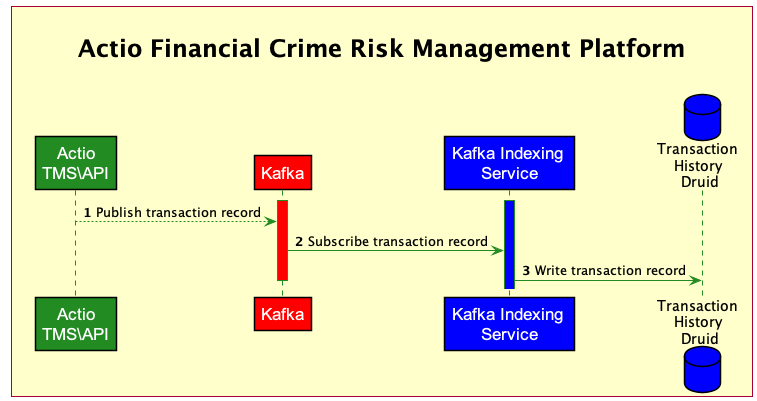
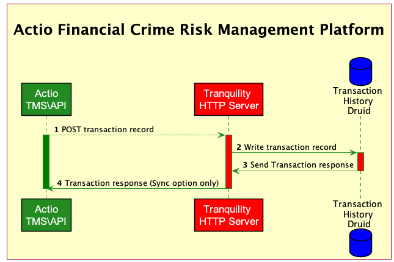

<!-- SPDX-License-Identifier: Apache-2.0 -->

# Druid Data Ingestion

*This page assumes that we will stay with Druid as our Datastore for all purposes (except GraphDB use cases)*

There are a few options for Data ingestion into Druid but not the typical ones where you have a library in most languages (Typescript, Python, Scala, Java etc) and that library encapsulates and abstracts the Insert record statement.

Here are the options:

1. Kafka Indexing Service (Community recommended option - but not our preference)
2. ***Tranquility (Server option) (Our preferred option)***
3. Go with another DB product: PostgreSQL [Encryption at rest database decision](Encryption-At-Rest-Database-Decision.md)

## Kafka Indexing Service

Important points of consideration:

1. Kafka will have to brought back into the Architecture. It will not have the serious infrastructure requirements as with the POC architecture because it will not be in the critical path for Transaction Monitoring
2. All components (Data Preparation, Rules Processors, Typology Processor etc) will have to use kafka library to write to Druid

## Tranquility (Server option)

Important points of consideration:

1. There is sync as well as async option
2. You can send more than 1 records / messages at a time
3. There is an option for message compression (we can look at that as optional for performance optimization LATER)
4. This will mean we will need a Tranquility Server as a front-end to Druid (every Druid write use case)
5. Tranquility will be its own pod that can be Service Meshed for Load Balancing and mTLS
6. There will be no new library needed in the components (Data Preparation, Rules Processors, Typology Processor etc) since write to Druid will be a HTTP call

Link to the github for tranquility server:

[https://github.com/druid-io/tranquility/blob/master/docs/server.md](https://github.com/druid-io/tranquility/blob/master/docs/server.md)

