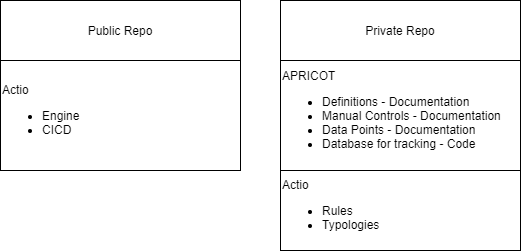
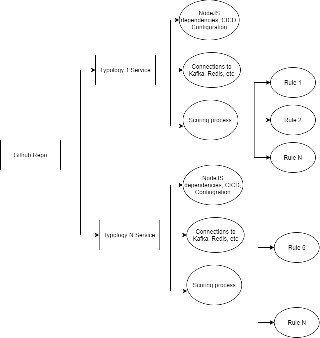
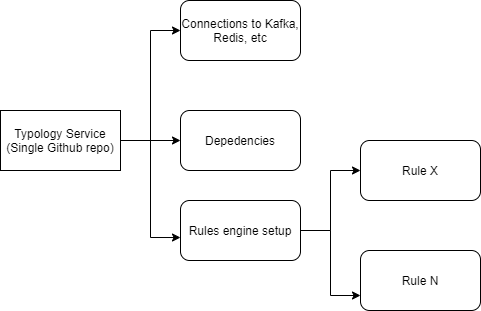

<!-- SPDX-License-Identifier: Apache-2.0 -->

# Refactoring of Typology Services

Add your comments directly to the page. Include links to any relevant research, data, or feedback.

|     |     |
| --- | --- |
| Status | NOT STARTED |
| Impact | HIGH / MEDIUM / LOW |
| Driver | Aarón Reynoza |
| Approver |     |
| Contributors | Greg McCormick Justus Ortlepp Sandro Lourenco Johan Foley |
| Informed |     |
| Due date | 19 Feb 2021 |
| Outcome |     |

## Background

## Relevant data



The current architecture for typologies is a GitHub repository where multiple NodeJS applications are stored. this applications are “Typologies”, and each typologies has a set of functionalities that is repeated across all of them. The only variant are rules, which may be different or similar based on each typology need.



This is incredibly inefficient when it comes to maintaining the code for each typology:

- When there is a dependency vulnerability, node modules need to be updated for each typology service.
- CICD Jobs like Linting and testing will run repeated jobs for similar tests on similar. Even if they’re different typologies, the services share common code.
- When updating a given rule, it needs to be updated for every typology.
- When creating a new rule, a whole new service needs to be created and maintained.

The process to develop typologies is too repetitive, which is [INSANITY](https://www.youtube.com/watch?v=zEWJ-JgVS7Q) (Rated R for Violence and Language).

## Options considered

Enter, the Injection Proposal:



The typology service will receive a configuration file, which is stored in a private place. This configuration tells the service which rules should it run and the scoring for the typology. Example file:

```json
{
  "typologyid": 214,
  "rules": \[
    {
      "ruleid": 12,
      "weight": 1,
      "score": 0.20
    },
    {
      "ruleid": 27,
      "weight": 1,
      "score": 0.20
    },
    {
      "ruleid": 30,
      "weight": 1,
      "score": 0.20
    },
    {
      "ruleid": 48,
      "weight": 1,
      "score": 0.20
    },
    {
      "ruleid": 78,
      "weight": 1,
      "score": 0.20
    }
  \],
  "score": "012.p + 027.p + 030.p + 048.p + 078.p"
}
```

This model allows us to:

- Easily maintain the typology service
- Use only a single service for typologies
- Dynamically configure typologies from config injected via Kubernetes secrets.

However, this model is still exposing rules publicly, and they need to be hidden in order to comply with the Tazama security requirements.

|     | Actual Architecture | Injection Proposal |
| --- | --- | --- |
| Description | An all-public, typology monorepo | Service that reads a configuration file to setup Typologies. |
| Pros and cons |  Fast to develop initially<br><br> Gets slower to develop/maintain by time<br><br> Duplication across code/tests<br><br> Slow CI<br><br> Gets harder to deploy<br><br> TYPOLOGIES SECURITY IS NOT MET<br><br> RULES SECURITY IS NOT MET |  Easy to develop/maintain<br><br> Easy to create new typologies<br><br> Fast CI<br><br> TYPOLOGIES SECURITY IS MET<br><br> RULES SECURITY IS NOT MET<br><br> Puts a burden in the deployment(DevOps) rather than development. |
| Estimated cost | LARGE | LOW |

## Action items

- Aarón Reynoza to add process for Rules service - so rules can also be injected (rules then stored in private repo). There might be a number of different services (the Pachinko Model) for the rules.

## Outcome
