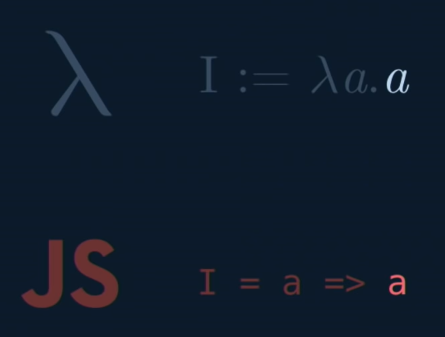
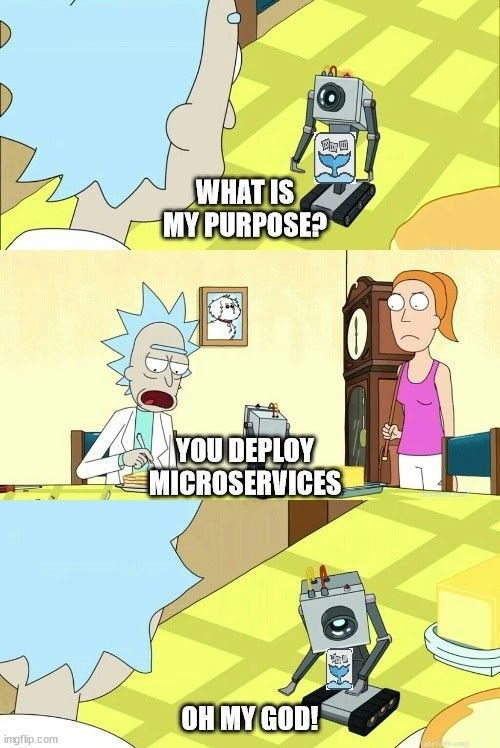

<!-- SPDX-License-Identifier: Apache-2.0 -->

# The OpenFaaS Dilemma

OpenFaaS is a serverless technology that runs on premise, meaning, Kubernetes. It enables it’s user to deploy and route serverless functions fairly easily.

# But what is serverless?

Some of the advantages of serverless can easily be found to be something similar to this:

- The serverless model requires no management and operation of infrastructure, giving developers more time to optimize code and develop innovative new features and functionality
- Serverless computing runs code on-demand only, typically in a stateless container, on a per-request basis, and scales transparently with the number of requests being served.
- Serverless computing enables end users to pay only for resources being used, never paying for idle capacity.

The main change during development is an entire switch on how code is done.

- Monolith: The entire project is a single application that does everything.
- Microservices: The project is split into multiple parts that communicate with each other, enabling some parts to be independent, or tolerate failure from other parts.
- Serverless: Same as monoliths, but the management of such parts are abstracted to the technology (In our case, OpenFaaS) and **the parts are coded as functions. Literal functions.**

So while serverless does seem to look a lot like microservices, functions are easier to develop, and maintain and faster to communicate. The reason for this, is that serverless is itself, functional programming applied to infrastructure.

# Why Functional Programming is so important

Some time ago, when there was no light and humanity's most important achievement was just motors, some mathematicians wondered if there was a way to create a machine that could solve all problems put into it. A mathematician called Alonzo Church made a process in which problems can be solved. This process was called “The Lambda calculus”. Parallel to Alonzo, and some years later, another mathematician took the same challenge, only with the extra feature of making it an actual machine. This mathematician's name is Alan Turing. He created the Turing machine. You may know these machines as today’s computers.

During this time, Turing discovered that Lambda calculus is interchangeable with the Turing machines process. This process is also the base for functional programming. You add a parameter into the function, you get a result. This is a simple lambda function with its representation in current JS (the functional version):

in standard JS: function I(a) { return a };

You can learn more here: [https://www.youtube.com/watch?v=3VQ382QG-y4](https://www.youtube.com/watch?v=3VQ382QG-y4)

Serverless has a pretty similar approach:

You input data to a function, and it will output a result.

In Tazama words:

You send transactions data to a rule, you get a rule result.

You send rules results to a typology, you get a typology result.

You send typologies results to a channel scoring, you get a channel score.

Etc…

The Tazama platform follows a pretty similar design, and the usage of a serverless platform, in our case OpenFaaS, is most likely a good decision! But sadly, our implementation is not correct.

# What’s wrong with Tazama’s implementation of Serverless

Open Function as a Service(OpenFaaS) enables us to implement functions directly into our Kubernetes cluster. Just like Amazon allows its users to create Lambda functions. However, we’re not doing that. **We’re building microservices.**

A rule, for example, is made of all these parts:

- Docker container
- A server (Koa.JS)
- Template code for the application to work
- Business Logic for the rule (less than 10% of the code!)

An actual function, would be just the business logic for the rule. 

- This greatly reduces the amount of code we’re not touching, just to make the server go up. Making the development of new rules faster, as well as maintaining old ones easier.
- Removes the need for docker and the usage of a registry as OpenFaaS handles it (REALLY NICE)
- Allows for intercommunication across functions using OpenFaaS’s gateway (to be removed by gRPC)

# OpenFaaS is not a tool, it’s a burden

Not only are we not doing functions correctly, we’re stepping over OpenFaaS advantages with other tools.

- In order to deploy Tazama, we’re using a mix of raw k8s yaml, helm (deployed along) and OpenFaaS files (that we need to deploy on our own). This increases the deployment process (just a little bit). Further investigation on how to deploy all these functions along with the rest of Tazama is needed.
- OpenFaaS gateway is going to become useless, since we’ll be using gRPC as our communication protocol, leaving the HTTP gateway provided by OpenFaaS as a possible vulnerability that we probably need to find how to disable.
- We need to set up environment variables for services to run and we have a docker workaround that is **a vulnerability**. Using real functions or pure k8s microservices would solve this issue.  

# So, what are the options?

## 1 Convert services to real functions

We can refactor services and start writing them as real functions. A refactor of all the services is needed.

***Advantages***:

- Easy to develop functions
- Easy to refactor microservices into functions
- Easier to test
- We already have the tools to do it!  

***Disadvantages***:

- Need to refactor all services
- We will still need to find what to do with the OpenFaaS gateway since we’re moving to gRPC
- Not sure on what would happen to telemetry/logging to ELK (Need to investigate)

## 2 Remove OpenFaaS

We already have microservices developed. OpenFaaS is only being used to deploy such services. We could remove OpenFaaS and create kubernetes deployments to get the services up and running in a relatively small amount of time.

***Advantages***:

- We already have the code/architecture ready
- Easy to remove OpenFaaS
- Easy to create k8s deployment files

***Disadvantages***:

- We lose the serverless advantages
- Aaron realy likes functions > services
