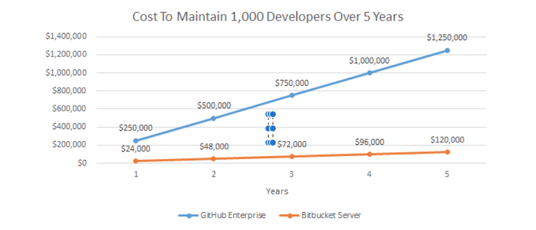

<!-- SPDX-License-Identifier: Apache-2.0 -->

# To Git or Not to Git

Add your comments directly to the page. Include links to any relevant research, data, or feedback.

|     |     |
| --- | --- |
| Status | DONE |
| Impact | HIGH |
| Driver | Joey Goksu |
| Approver | Justus Ortlepp  junaid  Rob Reeve  Greg McCormick  Aarón Reynoza  Joey Goksu |
| Contributors | Justus Ortlepp Greg McCormick junaid |
| Informed | Rob Reeve  junaid |
| Due date | 26 Feb 2021 |
| Outcome | Bitbucket Standard |

## Background

As we start to create code - we require a clear workflow tool to give us better control of the code release approvals.

We have GitBucket included in our OpenSource project

Mojaloop is invested in GitHub

Our current GitHub repo is a basic service - and we need to investigate if the more advanced controls are also free.

Moving to another tool will require validation with the Bill & Melinda Gates Foundation.

## Requirements

- Big files support (Git LFS)
- Do we need to set custom security rules? if yes, self-hosted would be better(?)
- Pricing
- Ease of use
- Typologies, Rules will be in the private repo

## Relevant data

WHAT ARE THE FEATURES WE THINK WE NEED

[https://kinsta.com/blog/bitbucket-vs-github/](https://kinsta.com/blog/bitbucket-vs-github/)

## Options considered

|     | BitBucket: | GitHub Enterprise: | GitHub self-hosted: | GitLab’s SaaS: | GitLab self-hosted: |
| --- | --- | --- | --- | --- | --- |
| Description | **Bitbucket** gives teams one place to plan projects, collaborate on code, test and deploy, all with free private Git repositories. Teams choose Bitbucket because it has a superior Jira integration, built-in CI/CD, & is free for up to 5 users. | **GitHub** is a web-based Git or version control repository and Internet hosting service. It was originally launched in 2008 by Tom Preston-Werner, Chris Wanstrath, and PJ Hyatt. This is the largest repository host with more than 38+ million projects. | GitHub-hosted runners offer a quicker, simpler way to run your workflows, while self-hosted runners are a highly configurable way to run workflows in your own custom environment. | **GitLab's SaaS** offering. You don't need to install anything to use GitLab SaaS, you only need to [sign up](https://gitlab.com/users/sign_in) and use GitLab straight away. | Install, administer, and maintain your own GitLab instance. |
| Pros and cons |  **Security** — BitBucket keeps your code secure with IP whitelisting and 2-step verification. Bitbucket comes with a SOC 2 Type II certification for peace of mind.   **JIRA & Trello integration** — BitBucket’s integrations with JIRA and Trello will definitely make your project management much easier than you can imagine.   Other integrations with tools like Slack, Crucible, Bamboo, Jenkins, HipChat are also available.   **LFS support** — shorter clone and fetch times for developers working with larger files.   Atlassian **support** teams are always available to solve your problems.   BitBucket Pipelines — a built-in CI/CD   Bitbucket's search algorithm includes several languages, which makes it possible to classify the results. The definition of a function or variable appears at the top, then the uses. You can determine the utility of a keyword very quickly.   Access to all the extensions available on the Atlassian marketplace.   Smart Mirroring for a faster clone, fetch, pull (only for Premium users).   Very small community compared to Github.   Sometimes seems buggy or unresponding.   Self hosted configuration is complex to deploy. |  Secure your supply chain: Keep open source components secure and compliant.   **Secure your code**: Find and fix code vulnerabilities as part of your workflows.   Secure your software lifecycle: Create and enforce security and compliance policies as code.   Accelerate delivery: Automate every step of your pipeline, including powerful, flexible CI/CD native to GitHub.   Build on best practices: Use and adapt workflows built by industry leaders and the open source community.   Scale secure automation: Consistently apply and scale policies across your organization, with traceability from source to deploy.   SAML single sign-on   50,000 Actions minutes/monthFree for public repositories   50GB of GitHub Packages storageFree for public repositories  ### 🟡 $21 per user/month |  Flexibility for your git server code (custom integration and modules).   Flexibility for your infrastructure.   Security - depends on your organisation   Security - continuous monitoring just in case protect the server.   Internet connection independence   Speed - depends on your network of course but in my case (Gov work) working on-site was much faster.   Data - containment and accessibility depends on you organisation   Receive automatic updates for the self-hosted runner application only. You are responsible updating the operating system and all other software.   Its usually a better fit for large teams because of the different tasks required to maintain it.   Maintenance - to keep up to date with new functionality you’ll have to be upgrading periodically |  Features availability, such as: [SAML SSO](https://docs.gitlab.com/ee/user/group/saml_sso/) is Premium   Instance wide settings same for all users  🟡 Access controls: customer is the group owner   **Infrastructure**: GitLab manages HA Architecture, and instance-level backups, recovery, and upgrades   **Log information and auditing:** no access, but Support or Security can answer questions  ### 🟡 $19 per user/month |  Features availability, such as: [SAML](https://docs.gitlab.com/ee/integration/saml.html) or [LDAP](https://docs.gitlab.com/ee/administration/auth/ldap.html) is Core   Instance wide settings: custom  🟡 Access controls: customer is group owner: customer is admin   **Infrastructure**: manage your own, anywhere   Server Maintenence   **Log information and auditing**: unrestricted access   Flexibility for your git server code (custom integration and modules).   Security - depends on your organisation   Security - continuous monitoring just in case protect the server. |
| Estimated cost | SMALL | SMALL | LARGE | SMALL | LARGE |

## Price Comparison

## Tools Comparison

|     | Bitbucket Standard: | Bitbucket Premium | GitHub Team | GitHub Enterprise |
| --- | --- | --- | --- | --- |
| Monthly Pricing per person | ## $3 | ## $6 | ## $4 | ## $21 |
| Monthly Pricing  (For 15 users) | ## $45 | ## $90 | ## $60 | ## $315 |
|     | **Flat rate of $15/month for 1 - 5 users** | **Flat rate of $30/month for 1 - 5 users** |     |     |

## Build minutes and Git Large File Storage

**GitHub Git LFS**

Every account using Git Large File Storage receives 1 GB of free storage and 1 GB a month of free bandwidth.

Additional storage and bandwidth is offered in a single data pack. One data pack costs $5 per month, and provides a monthly quota of 50 GB for bandwidth and 50 GB for storage. You can purchase as many data packs as you need. For example, if you need 150 GB of storage, you'd buy three data packs.

Purchasing data packs for Git LFS is independent of any other paid feature or product on GitHub.

**Bitbucket Git LFS Defaults 👇**

**Standard**

Build minutes: 2,500 min/month

Large file storage: 5 GB total

---

**Premium**

Build minutes: 3,500 min/month

Large file storage: 10 GB

|     | Bitbucket | GitHub |
| --- | --- | --- |
| Build minutes | ### $10/month for 1000 mins | ### 3,000 Actions minutes/month (Team)  ### 50,000 Actions minutes/month (Enterprise) |
| Git Large File Storage | ### $10/month for 100 GB | ### $5/month for 50 GB *per repo* |

## Conclusion

There are two main criteria affecting the result. (**Pricing** and **Feature-Support**)

For pricing, *Bitbucket* has a huge advantage for scale. After 20 paid accounts the price gap between *GitHub* and *Bitbucket* is **drastically increasing**.

For feature-side, these two options (GitHub and Bitbucket) have support for most of the used features.

- Git LFS
- Security
- Roles
- CI/CD

**GitHub** is preferred by organizations which is working on open source projects but considering the pricing and other business integrations (Jira, Confluence etc) **Bitbucket** shine out.

Assume that have 20 accounts and needs 200 GB big file storage.

- GitHub Team

(Accounts **\*** *per person) **+** ($5 **\**** per package) = Price

(20 **\*** 4) + (5 * 4) = **$100**

- Bitbucket Standard

(Accounts **\*** *per person) **+** ($10 **\**** per 100 GB) = Price

$15 (flat rate up to 5 users) + $45 (20 * 3) + $20 (10 * 2) = **$80**

* * *

## Action items

- Review all options
- Offer another suggestion if you have
- Agree on an approach (in the meeting)

## Outcome

Considering the all comparison (pricing and features) Bitbucket Standard shines out.

## External Links

- [https://www.process.st/bitbucket-vs-github-version-control-software/](https://www.process.st/bitbucket-vs-github-version-control-software/)
- [https://dev.to/codegiantio/bitbucket-vs-github-the-complete-review-2020-2jb0](https://dev.to/codegiantio/bitbucket-vs-github-the-complete-review-2020-2jb0)
- [https://www.atlassian.com/software/bitbucket/pricing](https://www.atlassian.com/software/bitbucket/pricing)
- [https://github.com/pricing](https://github.com/pricing)
- [https://about.gitlab.com/pricing/](https://about.gitlab.com/pricing/)
- [https://support.atlassian.com/bitbucket-cloud/docs/manage-your-plan-and-billing/?\_ga=2.174821281.2001523312.1569260530-497000620.1565889661](https://support.atlassian.com/bitbucket-cloud/docs/manage-your-plan-and-billing/?_ga=2.174821281.2001523312.1569260530-497000620.1565889661)
