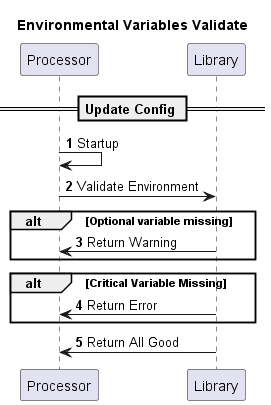
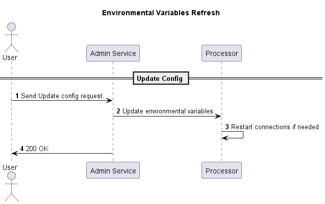

# Environment Variables

## Overview

Rules and Processors currently follow an approach to environmental variables where each application contains it’s own local copy of environment variables that will be loaded one time into a config data class at startup. Application behavior is thus static and any desired changes to config will require a full restart of the application with new environmental variables provided.

## Drawbacks

1. Decentralized Environment Variables
    1. Requires higher maintenance effort for changes
    2. Version control synchronization - Ensuring correctness of variables without variance
    3. Deployment complexity - Build and deploy tools need additional config tweaking
    4. Prone to user error

2. Static Config Behavior
    1. Operation control inflexibility - Cannot fine tune live application or adapt to external changes
    2. Prolonged downtime - Full restart on changes
    3. Debugging difficulty


# Current Environmental Variables (Tazama 2.0 Release)

### General Variables

| TMS    | event-director | rule-executor | typology-processor | TADP |
| -------- | ------- | ------- | ------- | ------- |
| FUNCTION_NAME  | FUNCTION_NAME | FUNCTION_NAME | FUNCTION_NAME | FUNCTION_NAME |
| NODE_ENV | NODE_ENV | NODE_ENV | NODE_ENV | NODE_ENV |
| MAX_CPU | MAX_CPU | | MAX_CPU | MAX_CPU |
| PORT  | REST_PORT | | |
| CACHE_TTL | CACHETTL | CACHE_TTL | CACHE_TTL | |
| QUOTING | | | | |
| | | RULE_NAME | | |
| | | RULE_VERSION | | |
| | | | SUPPRESS_ALERTS | SUPPRESS_ALERTS |
| | | | | NODE_TLS_REJECT_UNAUTHORIZED |

### Nats Variables

| TMS | event-director | rule-executor | typology-processor | TADP |
| -------- | ------- | ------- | ------- | ------- |
| SERVER_URL | SERVER_URL | SERVER_URL | SERVER_URL| SERVER_URL | |
| PRODUCER_STREAM | PRODUCER_STREAM | PRODUCER_STREAM | PRODUCER_STREAM |
| STARTUP_TYPE | STARTUP_TYPE | STARTUP_TYPE | STARTUP_TYPE | STARTUP_TYPE |
| | CONSUMER_STREAM | CONSUMER_STREAM | |
| | STREAM_SUBJECT | STREAM_SUBJECT | |
| | ACK_POLICY | ACK_POLICY | |
| | PRODUCER_STORAGE | PRODUCER_STORAGE | |
| | PRODUCER_RETENTION_POLICY | PRODUCER_RETENTION_POLICY | |
| | | | INTERDICTION_PRODUCER | |

### Redis Variables

| TMS | event-director | rule-executer | typology-processor | TADP |
| -------- | ------- | ------- | ------- | ------- |
| REDIS_DB | REDIS_DB | REDIS_DB | REDIS_DB | REDIS_DB |
| REDIS_AUTH | REDIS_AUTH | REDIS_AUTH | REDIS_AUTH | REDIS_AUTH |
| REDIS_SERVERS | REDIS_SERVERS | REDIS_SERVERS | REDIS_SERVERS | REDIS_SERVERS |
| REDIS_IS_CLUSTER | REDIS_IS_CLUSTER | REDIS_IS_CLUSTER | REDIS_IS_CLUSTER | REDIS_IS_CLUSTER |
| | | | CACHE_ENABLED | |
 
### Database Variables (Arango)

| TMS | event-director | rule-executer | typology-processor | TADP | 
| -------- | ------- | ------- | ------- | ------- |
| PSEUDONYMS_DATABASE | |  | | |
| TRANSACTION_HISTORY_DATABASE | | TRANSACTION_HISTORY_DATABASE | | TRANSACTION_HISTORY_DATABASE |
| TRANSACTION_HISTORY_DATABASE_URL | | TRANSACTION_HISTORY_DATABASE_URL | | TRANSACTION_HISTORY_DATABASE_URL |
| TRANSACTION_HISTORY_DATABASE_USER | | TRANSACTION_HISTORY_DATABASE_USER | | TRANSACTION_HISTORY_DATABASE_USER |
| TRANSACTION_HISTORY_DATABASE_PASSWORD | | TRANSACTION_HISTORY_DATABASE_PASSWORD | | TRANSACTION_HISTORY_DATABASE_PASSWORD |
| TRANSACTION_HISTORY_DATABASE_CERT_PATH | | | | TRANSACTION_HISTORY_DATABASE_CERT_PATH |
| TRANSACTION_HISTORY_PAIN001_COLLECTION | | | | |
| TRANSACTION_HISTORY_PAIN013_COLLECTION | | | | |
| TRANSACTION_HISTORY_PACS008_COLLECTION | | | | |
| TRANSACTION_HISTORY_PACS002_COLLECTION | | | | |
| PSEUDONYMS_DATABASE_URL | DATABASE_URL | PSEUDONYMS_DATABASE_URL | | |
| PSEUDONYMS_DATABASE_USER | DATABASE_USER | PSEUDONYMS_DATABASE_USER | | |
| PSEUDONYMS_DATABASE_PASSWORD | DATABASE_PASSWORD | PSEUDONYMS_DATABASE_PASSWORD  | | |
| PSEUDONYMS_DATABASE_CERT_PATH | DATABASE_CERT_PATH | PSEUDONYMS_DATABASE_CERT_PATH | | | 
| | | TRANSACTION_HISTORY_DATABASE_CERT_PATH | | |
| | DATABASE_NAME | PSEUDONYMS_DATABASE | | |
| | | CONFIG_DATABASE_CERT_PATH | DATABASE_CERT_PATH | CONFIG_DATABASE_CERT_PATH |
| | | CONFIG_DATABASE | DATABASE_NAME | CONFIG_DATABASE |
| | | CONFIG_DATABASE_USER | DATABASE_USER | CONFIG_DATABASE_USER |
| | | CONFIG_DATABASE_URL | DATABASE_URL | CONFIG_DATABASE_URL | 
| | | CONFIG_DATABASE_PASSWORD | DATABASE_PASSWORD | CONFIG_DATABASE_PASSWORD |
| | | | | TRANSACTION_DATABASE_CERT_PATH |
| | | | | TRANSACTION_DATABASE_URL |
| | | | | TRANSACTION_DATABASE_USER |
| | | | | TRANSACTION_DATABASE_PASSWORD |
| | | | | TRANSACTION_DATABASE |

### Elastic Variables

| TMS | event-director | rule-executer | typology-processor
| -------- | ------- | ------- | ------- |
| APM_ACTIVE | APM_ACTIVE | APM_ACTIVE | APM_ACTIVE | APM_ACTIVE |
| APM_SERVICE_NAME | |  | APM_SERVICE_NAME | |
| APM_URL | APM_URL | APM_URL  | APM_URL  | APM_URL | 
| APM_SECRET_TOKEN | APM_SECRET_TOKEN | APM_SECRET_TOKEN | APM_SECRET_TOKEN | APM_SECRET |

### Logging Variables

| TMS | event-director | rule-executer | typology-processor | TADP |
| -------- | ------- | ------- | ------- | ------- |
| LOGSTASH_HOST | LOGSTASH_HOST | LOGSTASH_HOST | LOGSTASH_HOST | LOGSTASH_HOST |
| LOGSTASH_PORT | LOGSTASH_PORT | LOGSTASH_PORT | LOGSTASH_PORT | LOGSTASH_PORT |
| LOGSTASH_LEVEL | LOGSTASH_LEVEL | LOGSTASH_LEVEL | LOGSTASH_LEVEL | LOGSTASH_LEVEL |
| SIDECAR_HOST | SIDECAR_HOST | | SIDECAR_HOST | SIDECAR_HOST |

# Recomendations - Short Term

- Unify env naming conventions accross all processors - maybe use the library to store config classes and validate provided config.

  Pros
    - Will be able to use the same environmental variables throughout the solution.
    - Single verify function to be called, can use optional parameters to determine what to check

  Cons
    - Will requite some way to determine which processors require which config.

- When validating environmental variables, use diffrent levels , ie - Error message when database is missing, but warning if nats env is missing.



## Unified Variable List

### General Variables

| TMS    | event-director | rule-executor | typology-processor | TADP |
| -------- | ------- | ------- | ------- | ------- |
| FUNCTION_NAME  | FUNCTION_NAME | FUNCTION_NAME | FUNCTION_NAME | FUNCTION_NAME |
| NODE_ENV | NODE_ENV | NODE_ENV | NODE_ENV | NODE_ENV |
| MAX_CPU | MAX_CPU | | MAX_CPU | MAX_CPU |
| REST_PORT  | REST_PORT | | |
| CACHE_TTL | CACHETTL | CACHE_TTL | CACHE_TTL | |
| QUOTING | | | | |
| | | RULE_NAME | | |
| | | RULE_VERSION | | |
| | | | SUPPRESS_ALERTS | SUPPRESS_ALERTS |

### Nats Variables

| TMS | event-director | rule-executor | typology-processor | TADP |
| -------- | ------- | ------- | ------- | ------- |
| SERVER_URL | SERVER_URL | SERVER_URL | SERVER_URL| SERVER_URL | |
| PRODUCER_STREAM | PRODUCER_STREAM | PRODUCER_STREAM | PRODUCER_STREAM |
| STARTUP_TYPE | STARTUP_TYPE | STARTUP_TYPE | STARTUP_TYPE | STARTUP_TYPE |
| | CONSUMER_STREAM | CONSUMER_STREAM | |
| | STREAM_SUBJECT | STREAM_SUBJECT | |
| | ACK_POLICY | ACK_POLICY | |
| | PRODUCER_STORAGE | PRODUCER_STORAGE | |
| | PRODUCER_RETENTION_POLICY | PRODUCER_RETENTION_POLICY | |
| | | | INTERDICTION_PRODUCER | |

### Redis Variables

| TMS | event-director | rule-executer | typology-processor | TADP |
| -------- | ------- | ------- | ------- | ------- |
| REDIS_DB | REDIS_DB | REDIS_DB | REDIS_DB | REDIS_DB |
| REDIS_AUTH | REDIS_AUTH | REDIS_AUTH | REDIS_AUTH | REDIS_AUTH |
| REDIS_SERVERS | REDIS_SERVERS | REDIS_SERVERS | REDIS_SERVERS | REDIS_SERVERS |
| REDIS_IS_CLUSTER | REDIS_IS_CLUSTER | REDIS_IS_CLUSTER | REDIS_IS_CLUSTER | REDIS_IS_CLUSTER |
| | | | CACHE_ENABLED | |
 
### Database Variables (Arango)

Naming Convention: {database name}_DATABASE\_{property}

| TMS | event-director | rule-executer | typology-processor | TADP | 
| -------- | ------- | ------- | ------- | ------- |
| TRANSACTION_DATABASE | | TRANSACTION_DATABASE | | TRANSACTION_DATABASE |
| TRANSACTION_DATABASE_URL | | TRANSACTION_DATABASE_URL | | TRANSACTION_DATABASE_URL |
| TRANSACTION_DATABASE_USER | | TRANSACTION_DATABASE_USER | | TRANSACTION_DATABASE_USER |
| TRANSACTION_DATABASE_PASSWORD | | TRANSACTION_DATABASE_PASSWORD | | TRANSACTION_DATABASE_PASSWORD |
| TRANSACTION_DATABASE_CERT_PATH | | TRANSACTION_DATABASE_CERT_PATH | | TRANSACTION_DATABASE_CERT_PATH |
| TRANSACTION_PAIN001_COLLECTION | | | | |
| TRANSACTION_PAIN013_COLLECTION | | | | |
| TRANSACTION_PACS008_COLLECTION | | | | |
| TRANSACTION_PACS002_COLLECTION | | | | |
| PSEUDONYMS_DATABASE_URL |  | PSEUDONYMS_DATABASE_URL | | |
| PSEUDONYMS_DATABASE_USER |  | PSEUDONYMS_DATABASE_USER | | |
| PSEUDONYMS_DATABASE_PASSWORD |  | PSEUDONYMS_DATABASE_PASSWORD  | | |
| PSEUDONYMS_DATABASE_CERT_PATH |  | PSEUDONYMS_DATABASE_CERT_PATH | | | 
| PSEUDONYMS_DATABASE | | PSEUDONYMS_DATABASE | | |
| | CONFIG_DATABASE_CERT_PATH | CONFIG_DATABASE_CERT_PATH | CONFIG_DATABASE_CERT_PATH | CONFIG_DATABASE_CERT_PATH |
| | CONFIG_DATABASE | CONFIG_DATABASE | CONFIG_DATABASE | CONFIG_DATABASE |
| | CONFIG_DATABASE_USER | CONFIG_DATABASE_USER | CONFIG_DATABASE_USER | CONFIG_DATABASE_USER |
| | CONFIG_DATABASE_URL | CONFIG_DATABASE_URL | CONFIG_DATABASE_URL | CONFIG_DATABASE_URL | 
| | CONFIG_DATABASE_PASSWORD | CONFIG_DATABASE_PASSWORD | CONFIG_DATABASE_PASSWORD | CONFIG_DATABASE_PASSWORD |
| | | | | EVALUATION_DATABASE_CERT_PATH |
| | | | | EVALUATION_DATABASE_URL |
| | | | | EVALUATION_DATABASE_USER |
| | | | | EVALUATION_DATABASE_PASSWORD |
| | | | | EVALUATION_DATABASE |

### Elastic Variables

| TMS | event-director | rule-executer | typology-processor
| -------- | ------- | ------- | ------- |
| APM_ACTIVE | APM_ACTIVE | APM_ACTIVE | APM_ACTIVE | APM_ACTIVE |
| APM_SERVICE_NAME | APM_SERVICE_NAME | APM_SERVICE_NAME | APM_SERVICE_NAME | |
| APM_URL | APM_URL | APM_URL  | APM_URL  | APM_URL | 
| APM_SECRET_TOKEN | APM_SECRET_TOKEN | APM_SECRET_TOKEN | APM_SECRET_TOKEN | APM_SECRET |

### Logging Variables

| TMS | event-director | rule-executer | typology-processor | TADP |
| -------- | ------- | ------- | ------- | ------- |
| SIDECAR_HOST | SIDECAR_HOST | SIDECAR_HOST | SIDECAR_HOST | SIDECAR_HOST |

# Recomendations - Long Term



### Requirement concerns

- Nats route for notifying processor of config change. 
 - Admin-Service API which will update processor config via nats message.

- How do you make environmental configuration of all the processors in the platform cleaner and simpler?  
  - Centralized repository (HashiCorp Vault, Embedded Sub Repository)

- How do you change the behavior of all platform processors via an environment variable without restarting all the pods? (Environmental change control)  
  - Example: Updating the Arango certificate

- How do we change the behavior of a (or some) processors via an override to environment variables without restarting the pods? (Operational control)  
  - Example: Turning on debug-level logging in a specific rule processor  
  - Challenge: Updating all the instances behind Kubernetes – *you cannot update config maps or environment variables without restarting a pod*


# Discussion on 17/09/2024 

  We see 3 Approaches to standardize and consolidate config and validation namely constructor based, interface based and functional based. We decided on the Interface based approach. This will - 

  - Allow us to validate the environment variables on start-up, and indicate when one is missing
  - Build a Custom interface based on which config is needed. 

 The config Interfaces will move to the COE-LIB, as well as validation functions being implemented. Mock up down below: 

 ```
// Library code
export interface iCachable {
    CONFIG_1: string;
    CONFIG_2: string;
    CONFIG_3: string;
}

export const validateCacheable = (toCache: iCachable) => {
    if (!process.env.CONFIG_1)
        throw new Error('CONFIG_1 is required');

    if (!process.env.CONFIG_2)
        throw new Error('CONFIG_2 is required');

    if (!process.env.CONFIG_3)
        throw new Error('CONFIG_3 is required');

    toCache.CONFIG_1 = process.env.CONFIG_1.toString();
    toCache.CONFIG_2 = process.env.CONFIG_2.toString();
    toCache.CONFIG_3 = process.env.CONFIG_3.toString();
};

export interface iPseudonymnizable {
    CONFIG_4: string;
    CONFIG_5: string;
    CONFIG_6: string;
}

export const validatePseudonymnizable = (toPseudonymnize: iPseudonymnizable) => {
    if (!process.env.CONFIG_4)
        throw new Error('CONFIG_4 is required');

    if (!process.env.CONFIG_5)
        throw new Error('CONFIG_5 is required');

    if (!process.env.CONFIG_6)
        throw new Error('CONFIG_6 is required');

    toPseudonymnize.CONFIG_4 = process.env.CONFIG_4.toString();
    toPseudonymnize.CONFIG_5 = process.env.CONFIG_5.toString();
    toPseudonymnize.CONFIG_6 = process.env.CONFIG_6.toString();
};

// Processor Code: 
let config: iCachable | iPseudonymnizable = { CONFIG_1: "", CONFIG_2: "", CONFIG_3: "", CONFIG_4: "", CONFIG_5: "", CONFIG_6: "", };

validateCacheable(config as iCachable);
validatePseudonymnizable(config as iPseudonymnizable);
 ```