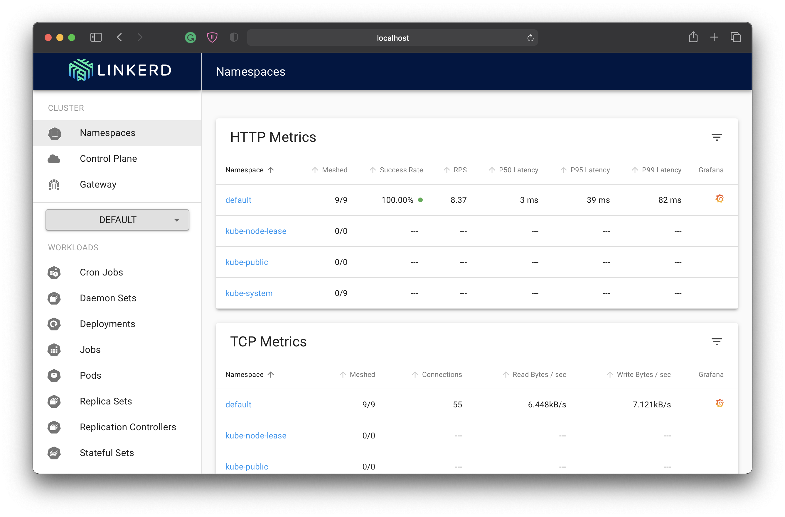
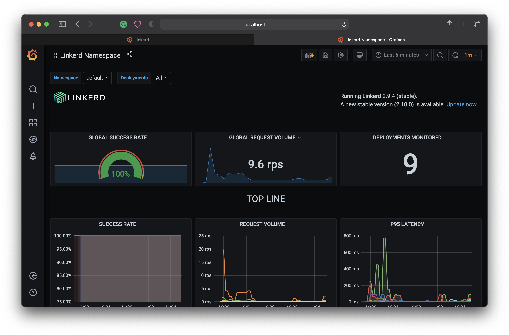
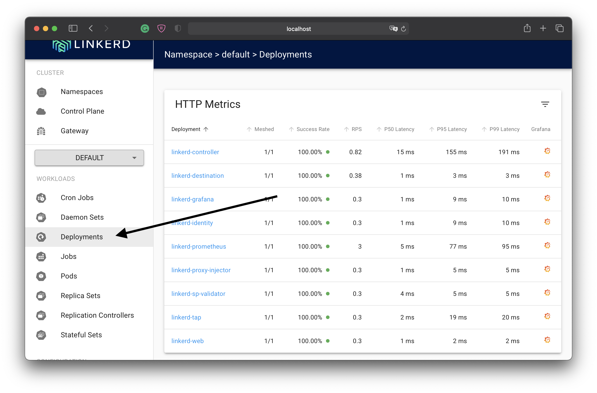

<!-- SPDX-License-Identifier: Apache-2.0 -->

# LinkerD Dashboard

- Installing linkerd CLI
- How to access linkerd dashboard
  - DNS Rebinding Protection
- Dashboard Visuals
- Make sure you’re on the FRM namespace

```bash
kubectl config set-context --current --namespace=frm
```

## Step 1: Install the CLI

To install the CLI manually, run:

```bash
curl -sL run.linkerd.io/install | sh
```

Once installed, verify the CLI is running correctly with:

```bash
linkerd version
```

You should see the CLI version, and also `Server version: unavailable`. This is because you haven’t installed the control plane on your cluster. Don’t worry—we’ll fix that soon enough.

## Step 2: Validate your Kubernetes cluster

```bash
linkerd check --pre
```

If there are any checks that do not pass, make sure to follow the provided links and fix those issues before proceeding.

## Step 3: Install the control plane onto your cluster

Now that you have the CLI running locally and a cluster that is ready to go, it’s time to install the control plane.

The first step is to install the control plane core. To do this, run:

```bash
linkerd install | kubectl apply -f -
```

Now let’s wait for the control plane to finish installing.

Wait for the control plane to be ready (and verify your installation) by running:

```bash
linkerd check
```

Next, we’ll install some *extensions*. We need the **viz** extension, which will install Prometheus, dashboard, and metrics components onto the cluster:

```bash
linkerd viz install | kubectl apply -f -
```

## Step 4: Explore Linkerd

With the control plane and extensions installed and running, you can now view the Linkerd dashboard by running:

```bash
linkerd viz dashboard --linkerd-namespace likerddev
```

* * *

## DNS Rebinding Protection

To prevent [DNS-rebinding](https://en.wikipedia.org/wiki/DNS_rebinding) attacks, the dashboard rejects any request whose `Host` header is not `localhost`, `127.0.0.1` or the service name `web.linkerd-viz.svc`.

Note that this protection also covers the [Grafana dashboard](https://linkerd.io/2.10/reference/architecture/#grafana).

The ingress-nginx config above uses the `nginx.ingress.kubernetes.io/upstream-vhost` annotation to properly set the upstream `Host` header. Traefik on the other hand doesn’t offer that option, so you’ll have to manually set the required `Host` as explained below.

* * *

After **step 4** you will be able to see the dashboard.



Click to orange symbol to see Grafana dashboard.


You can select the deployments to see deployed services.


