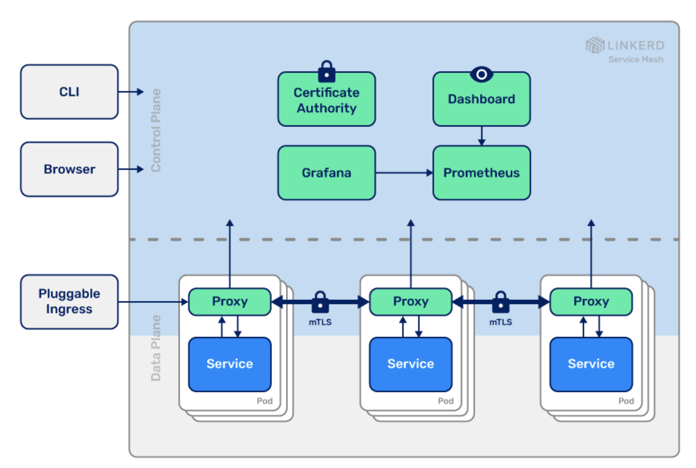
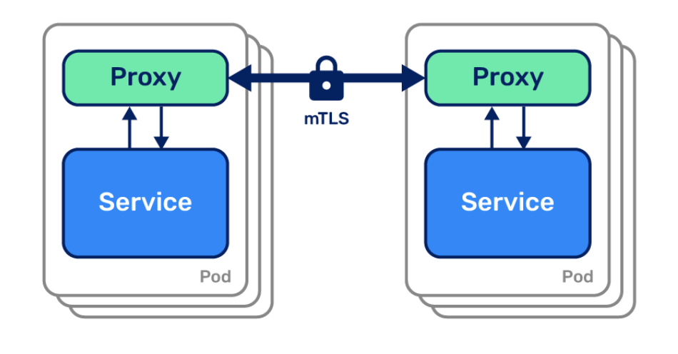
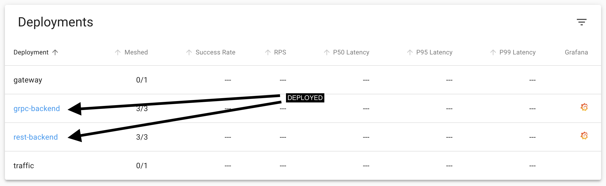
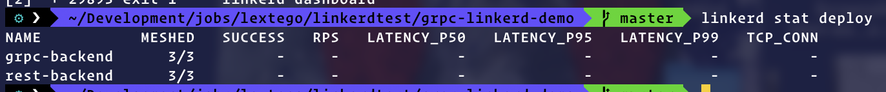
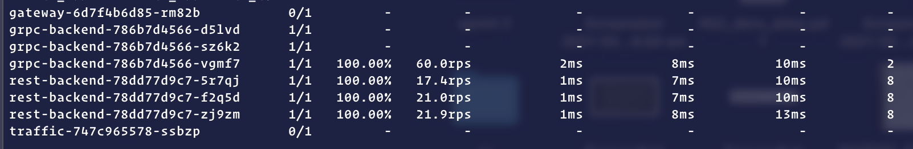
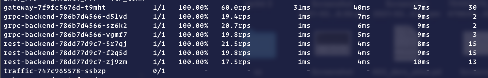

<!-- SPDX-License-Identifier: Apache-2.0 -->

# Load balancing with gRPC

## Stack

- **Kubernetes** runs our application
- **gRPC**, service-to-service communication
- **Linkerd**, metrics and reliability
- **Grafana**, by way of Linkerd
- **Slow Cooker**, for sending traffic - [https://github.com/buoyantio/slow\_cooker](https://github.com/buoyantio/slow_cooker)

## **Methods of load balancing**

1. The application code could manually maintain its own load balancing pool of destinations, and we could configure our gRPC client to [use this load balancing pool](https://godoc.org/google.golang.org/grpc/balancer). This approach gives us the most control, but it can be very complex in environments like Kubernetes where the pool changes over time as Kubernetes reschedules pods. Our application would have to watch the Kubernetes API and keep itself up to date with the pods.
2. Alternatively, in Kubernetes, we could deploy our app as [headless services](https://kubernetes.io/docs/concepts/services-networking/service/#headless-services). In this case, Kubernetes [will create multiple A records](https://kubernetes.io/docs/concepts/services-networking/service/#headless-services) in the DNS entry for the service. If our gRPC client is sufficiently advanced, it can automatically maintain the load balancing pool from those DNS entries. But this approach restricts us to certain gRPC clients, and it's rarely possible to only use headless services.
3. Finally, we can take a third approach: use a lightweight proxy. (Linkerd way)

## Linkerd



Linkerd adds critical security, observability, and reliability features to your Kubernetes stack with no code change required.

Linkerd works by running a sidecar container in your Kubernetes `pods`. That is, you will inject a linkerd proxy container into every `pod` you have running. Every request that your `pods` then send or receive will go through this very lightweight proxy that can gather metrics (like success rate, requests per second, and latency) and enforce policies (like timeouts and retries).

- it works with services written in any language, with any gRPC client, and any deployment model (headless or not)
- auto-detect HTTP/2 and HTTP/1.x an
- d do L7 load balancing, and they pass through all other traffic as pure TCP
- Linkerd uses an *exponentially-weighted moving average* of response latencies to automatically send requests to the fastest pods. If one pod is slowing down, even momentarily, Linkerd will shift traffic away from it. This can reduce end-to-end tail latencies

- **Just works:** Zero configs, out of the box, for any Kubernetes app
- **Ultralight:** Introduce the bare minimum perf and resource cost
- **Simple:** Reduce operational complexity in every possible way
- **Security first**: make security the *default*, not the extra add-on.

**Control plane:** Go. ~200Mb RSS (excluding metrics data). (Repo: [linkerd/linkerd2](https://github.com/linkerd/linkerd2)).

**Data plane:** Rust. <10mb RSS, <1ms p99 (!!!). (Repo: [linkerd/linkerd2-proxy](http://github.com/linkerd/linkerd2-proxy)) 

**Background reading**: [Linkerd v2: How Lessons from Production Adoption Resulted in a Rewrite of the Service Mesh](https://www.infoq.com/articles/linkerd-v2-production-adoption/) (InfoQ)

## Linkerd Setup Instructions

1. Before we can do anything, we need to ensure you have access to a Kubernetes cluster running 1.13 or later, and a functioning `kubectl` command on your local machine.  
    `kubectl version --short`
2. Install the Linkerd CLI using  
    `curl -sL https://run.linkerd.io/install | sh`  
    Next, add `linkerd` to your path with:  
    `export PATH=$PATH:$HOME/.linkerd2/bin`
3. Validate your Kubernetes cluster  
    `linkerd check --pre`
4. Install Linkerd onto the cluster  
    `linkerd install | kubectl apply -f -`
5. Check the linkerd  
    `linkerd check`  
    `kubectl -n linkerd get deploy`
6. Explore Linkerd  
    `linkerd dashboard &`

## gRPC Load Balancing Results using Linkerd

You can find the related demo linkerd app through the link [https://github.com/klingerf/grpc-linkerd-demo](https://github.com/klingerf/grpc-linkerd-demo)



Also, we can execute the commands to see the same result on the terminal

`linkerd stat deploy`



This will show the “golden” metrics for each deployment:

- Success rates

- Request rates
- Latency distribution percentiles

**Without Load Balancing**



We’re going to inject Linkerd into the pods.

```bash
kubectl get deploy -oyaml | linkerd inject - | kubectl apply -f 
```

and Load balancing is ready 👇

**With Load Balancing**



## Related articles

- [https://lextego.atlassian.net/l/c/mtwprNz9](https://lextego.atlassian.net/l/c/mtwprNz9)
- [https://kubernetes.io/blog/2018/11/07/grpc-load-balancing-on-kubernetes-without-tears/](https://kubernetes.io/blog/2018/11/07/grpc-load-balancing-on-kubernetes-without-tears/)
- [https://github.com/klingerf/grpc-linkerd-demo](https://github.com/klingerf/grpc-linkerd-demo)
- [https://medium.com/google-cloud/loadbalancing-grpc-for-kubernetes-cluster-services-3ba9a8d8fc03](https://medium.com/google-cloud/loadbalancing-grpc-for-kubernetes-cluster-services-3ba9a8d8fc03)
- [https://linkerd.io/2/features/load-balancing/](https://linkerd.io/2/features/load-balancing/)
