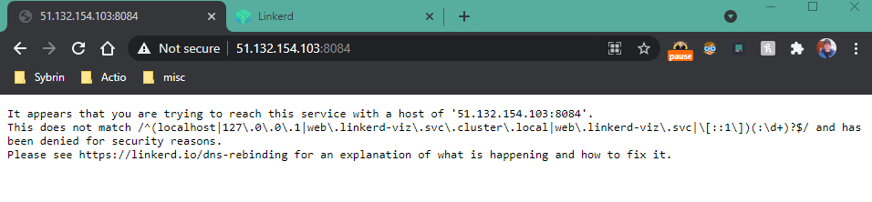
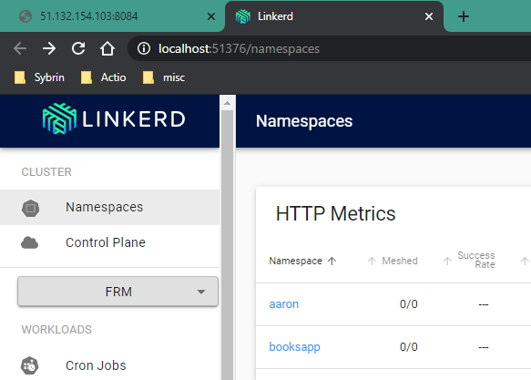
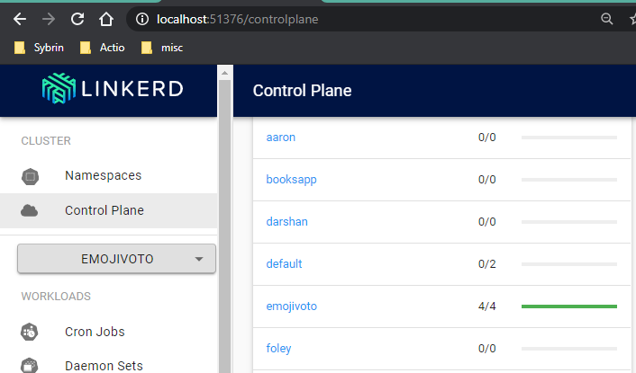
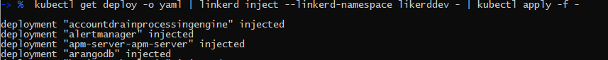
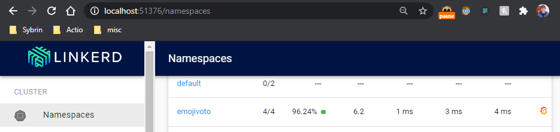

<!-- SPDX-License-Identifier: Apache-2.0 -->

# Meshing my Service using Linkerd

This article will show you how to mesh your services using Linkerd as well as some of the basic usages of Linkerd.

## Accessing Linkerd Web Portal

1. Linkerd will be hosted on [http://51.132.154.103:8084/](http://51.132.154.103:8084/)
    1. However; by default there are security checks that prevent you from accessing the web directly, as can be seen in this screenshot:

    2. Follow the steps in [[this wiki](LinkerD-Dashboard.md)to get Linkerd CLI installed and to load the linkerd dashboard.
        1. If you see the following screen you are ready to mesh a service


##  Applying Mesh to namespace

Hereunder follows the instructions for Meshing your own namespace:

1. Before we start please deploy your service to your own namespace
2. Navigate to the Linkerd Control Plane to check if your namespace is meshed:

3. In order to select your namespace run the following command in your terminal:
```bash
kubectl config set-context --current --namespace=<your namespace>
```
4. Run the linkerd check to ensure all is working
```bash
linkerd check --linkerd-namespace likerddev
```
5. Once you have a namespace selected run the following inject command to inject Service Mesh into a namespace:
```bash
kubectl get deploy -o yaml | linkerd inject --linkerd-namespace linkerddev - | kubectl apply -f -
```
6. The console output should resemble the following:

7. If successful your meshed status will update:

8. Lastly if the service is Mesh-able it will automatically be Meshed when being deployed to your namespace, to check Mesh status of your service go to the Namespaces section and check for populated data (in this example emojivoto is Meshing all 4 of the services it is running):


## Re-meshing (if you have previously followed all the steps)

Export the path to your previously installed linkerd so that bash knows where to find it:

```bash
export PATH=$PATH:/c/Users/jfoley/.linkerd2/bin
```

Then run the following command to make sure everything is working:

```bash
linkerd version
```

Then Mesh everything in your selected kubectl namespace:

```bash
 kubectl get deploy -o yaml | linkerd inject --linkerd-namespace linkerddev - | kubectl apply -f -
```
