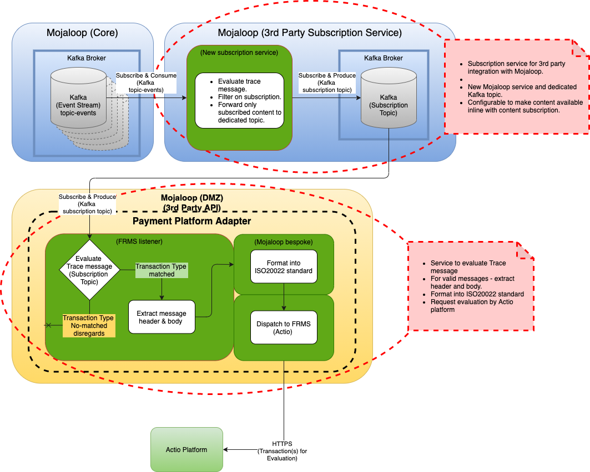

<!-- SPDX-License-Identifier: Apache-2.0 -->

# Retrieving transaction events from Mojaloop

## Background to proposed solution

Mojaloop is an event-driven framework. Relevant documentation for reference [https://docs.mojaloop.io/documentation/mojaloop-technical-overview/event-framework/](https://docs.mojaloop.io/documentation/mojaloop-technical-overview/event-framework/)

The *events-topic* acts as an audit log for all transactional events on the Mojaloop platform. The events are currently retained and thus available on the *events-topic* for a period of 7 days.

The solution design is based on Mojaloop v1.0 as per the published documentation. Since the *events-topic* acts as an audit log for all events within the Mojaloop platform, it is possible to obtain/restore the original transactional messages for any transaction passed through the switch from the *events-topic*, including Quotes and Transfers*.*

Currently events are retained on the *events-topic* for 7 days. By becoming a consumer of the *events-topic*, all information related to a transaction, that was processed through the switch, can be retrieved from this topic.

This is from June 2021 (YouTube release).  
[https://www.youtube.com/watch?v=xVvnl0iozy8](https://www.youtube.com/watch?v=xVvnl0iozy8)

## Requirements:

1. A subscription service should be created on the Mojaloop platform with separate and dedicated topics per subscription.
    1. The Mojaloop Subscription service will filter the content from the *events-topic*
    2. The Mojaloop subscription content will be placed on a dedicated topic for the subscriber(s) to subscribe to and consume
    3. Only relevant content will be made available as per subscription agreement.
2. Tazama PPA needs to subscribe and consume the Kafka (subscription) Topic
3. The PPA should be hosted on Mojaloop environment as 3rd party applications - likely in the Mojaloop DMZ.
4. The PPA, need to have the following capabilities:
    1. Identify and filter the Events by type. {must be no difference in the trace between the subscription topic and the events topic. In testing environments Tazama can then consume the events topic dirctly and filter out the relevant information. In production this will act as an additional filter to ensure only relevant content is passed onto the Tazama system}.
    2. Evaluate and filter Trace message from subscription topic
        1. Initial filtering on - sample JSON extract `"SPAN": { "START_CRITERIA": { "transfer": [ { "prepare": { "service": "ml_transfer_prepare"`
        2. Filter on the messages (methods) to ensure only content that are of interest to the Tazama system is processed (e.g. {POST /quotes}, {PUT /quotes/<ID>}, {POST /transfers}, {PUT /transfers/<ID>})
    3. For match on filter criteria - strip out original quotes/transfers message (Header + Payload(*Body*))
    4. Transform original message to ISO20022 compliant format.
    5. REST (https) to Tazama system for evaluation. (Access and security needs to be applied/repositioned)

