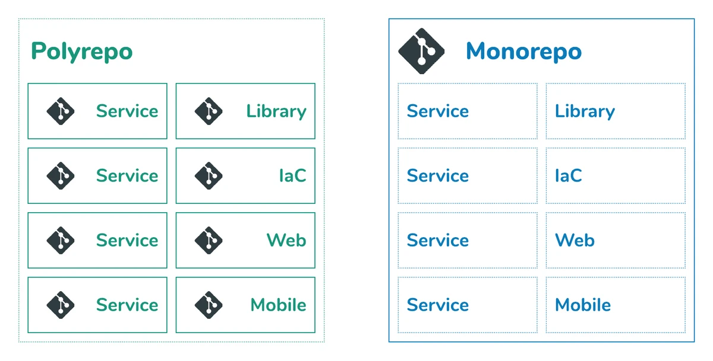

# Monorepo vs Polyrepo CI Comparison

## CI Steps

For a proper understanding it is important to note that each engine will need to follow our 8 step pipeline:

1. License scan
2. Code quality scan
3. Package security scan
4. Build engine
5. Build docker container
6. Container security scan
7. Deploy container
8. Notify whomever kicked off the pipeline

## Monorepo

### Breakdown

For this approach all the engines will be in one repository and therefore in one Circle CI job.

### Advantages

- Speed of Development is higher
- All the code is centralized and easy to catalog
- System wide changes can be done in a single pull request

### Disadvantages

- The single Circle CI config file will get large and difficult to maintain or handover
- For any Pull Request that gets merged the 8 step pipeline will run for all the engines in the repo (this might exponentially slow down deployment times)
- If we choose monorepo and want to build certain engines independently there are scripts, however this will increase the complexity of the CI config
- a Pipeline failure has the capacity to effect the rest of the pipeline for all other repositories

## Polyrepo

### Breakdown

For this approach all the engines will be in their own repository and therefore in one Circle CI job per engine.

### Advantages

- CI config files is simplistic and easy to maintain and handover
- Speed of deployments will be a lot quicker
- A pipeline failure won’t effect other repository pipelines

### Disadvantages

- Developers would have to keep track of many different repo’s
- System wide changes will need to be a pull request per repo

## How is Mojaloop currently doing it?

Looking through all the projects on the github mojaloop group it is clear that mojaloop services each have their own repo and pipeline.
