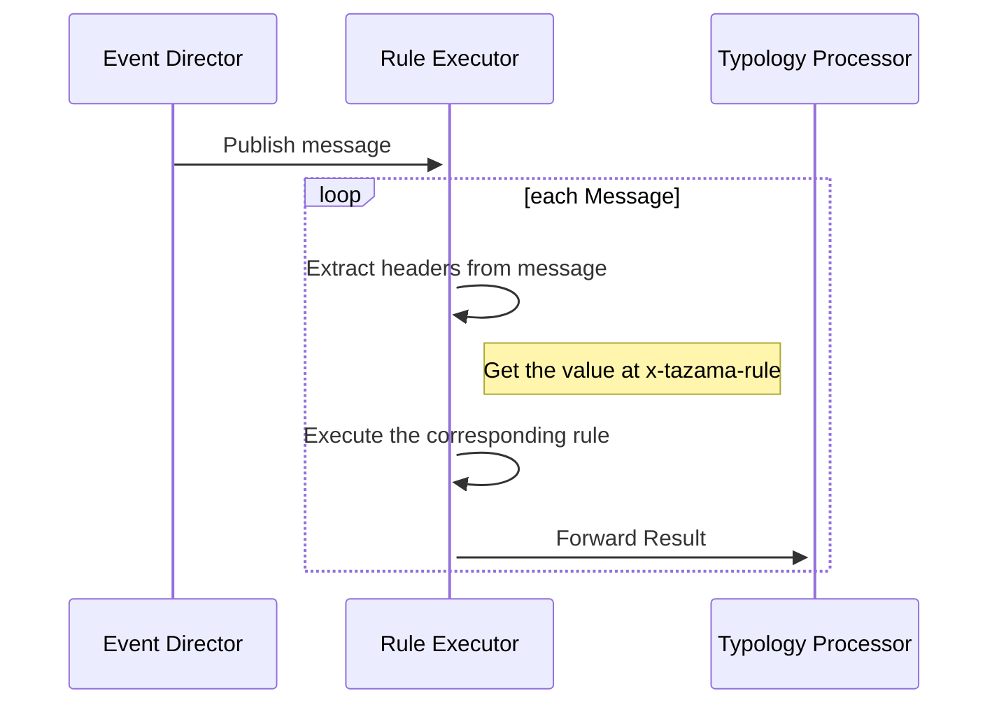
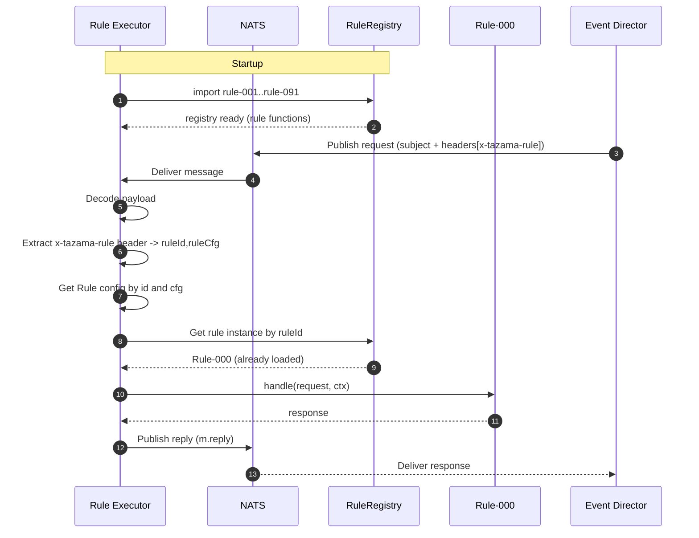

# Leverage NATS headers.

- The event-director will publish its message to a new subject, the generic rule executor (we will say, the subject is `rule-executor` with the addition of attaching a new custom header: `x-tazama-rule` (as an example):
  
```json
{
    "data": {},
    "headers": {
        "x-tazama-rule": "901@1.0.0"
    }
}
```
  
The rule executor will receive each message and check the headers to identify which rule to execute.

When a message is received - the rule's `id` and `cfg` are to be extracted from the headers. This step is what makes the processor dynamic.



## Load all Rules on Startup

Requires all the supported rules to be installed on the processor



----

The rules act as plugins and the processor determines which rule to execute based on the incoming NATS headers.

NATS subjects can also be used to achieve something similar, however, as this approach currently identifies each rule by its `id@cfg`, unless encoded somehow, the special characters `@` as well as `.` are a cause for disqualification.

---

# MRE

## Client

Send two messages with different headers (the rule version)

```js
import { headers } from "nats";

const h = headers();

for (let i = 1; i <= 2; i++) {
    // set a header for each message we are publishing
    h.set("x-tazama-rule", `00${i}@1.0.0`);

    const msg = await natsConnection.publish("requests", jc.encode({ hello: "world" }), { headers: h, timeout: 2000 });
}
// ultimately publishes two rules 001@1.0.0 and 002@1.0.0
```

## Server

This assumes all the rules have been installed at deployment time

Establish a common interface for all rules:

```ts
export interface Rule {
  handle(req: { endToEndId: string }, config: RuleConfig): Promise<number>;
}
```

The request is simplified to just be an object containing the `endToEndId`. The `handle` function will also accept a `RuleConfig` and return a `Promise<number>` (to send to the `determineOutcome`) function.

### Memoize the rules

```ts
import rule001 from "./rules/001.js";
import rule002 from "./rules/002.js";

const rules: Map<string, Rule> = new Map();
rules.set('001', rule001);
rules.set('002', rule002);
```
We can then lookup each rule's functionality from the `loaders` data structure.

```ts
  // you'd ideally make this safer and have error handling around it
  // this expects 'x-tazama-rule' to have string@string
export async function dispatch(
  req: { endToEndId: string },
  ctx: { headers: Record<string, string> }
): Promise<number> {
  const [id, cfg] = ctx.headers["x-tazama-rule"].split('@');

  const rule = rules.get(id);
  if (!rule) {
    // what happens when rule isn't found/installed
  }

  // get the rule's config

  const config = await getRuleConfig(id, cfg);
  return (await rule.handle(req, config));
}
```

Then for the actual rule's functionality:

```ts
import type { Rule } from "./rule.js";

const rule001: Rule = {
  async handle(req: { endToEndId: string }, config: { id: string, cfg: string }) {
    console.log({ rule: `${config.id}`, got: req, headerRule: `${config.id}@${config.cfg}` });
    return 1;
  },
};

export default rule001;

//elsewhere
import type { Rule } from "../rule.js";

const rule002: Rule = {
  async handle(req: { endToEndId: string }, config: { id: string, cfg: string }) {
    console.log({ rule: `${config.id}`, got: req, headerRule: `${config.id}@${config.cfg}` });
    return 2;
  },
};

export default rule002;
```

That's where the actual rule logic will take place.

There may be additional variations that could leverage this approach, such as lazy loading and dynamic imports. These techniques could enable a more “dumb” processor—one that can be deployed and potentially pick up new rules dynamically at runtime.