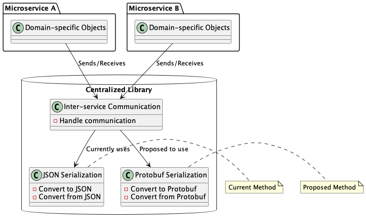
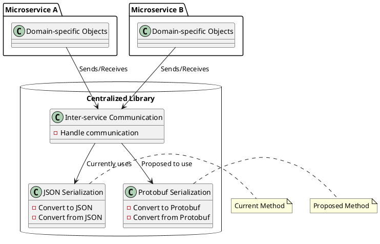
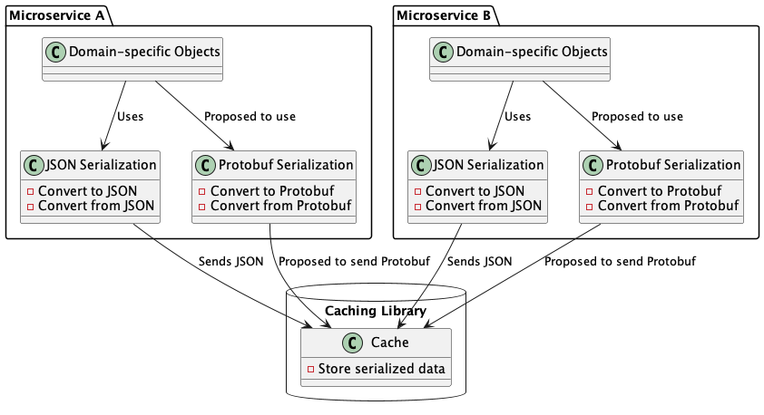
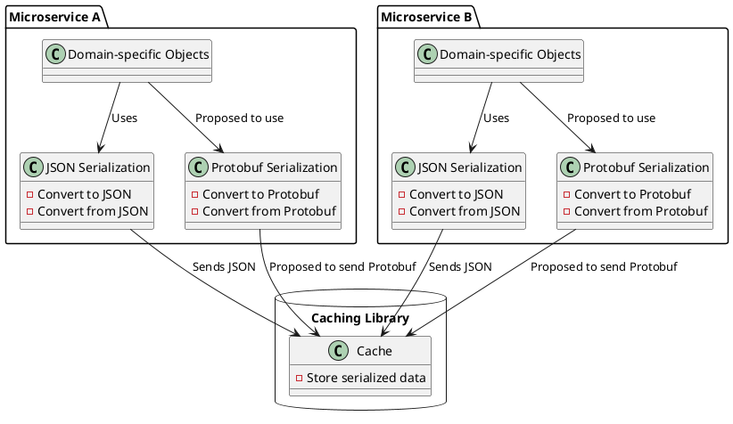
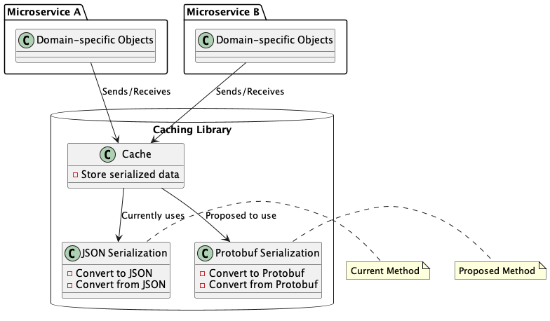
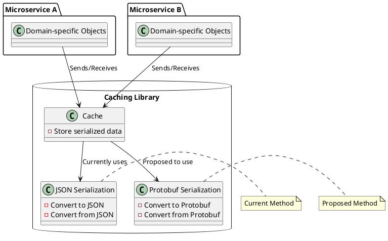

# Protobuf vs Json

- [Protobuf vs Json](#protobuf-vs-json)
  - [Pros](#pros)
  - [Cons](#cons)
  - [Impact Assessment](#impact-assessment)
    - [Inter-service communication](#inter-service-communication)
  - [Define Your Protocol Buffers Schema](#define-your-protocol-buffers-schema)
  - [Generate JavaScript Code](#generate-javascript-code)
  - [Convert to Protocol Buffers](#convert-to-protocol-buffers)
  - [**Store and Retrieve from Redis**](#store-and-retrieve-from-redis)
  - [**Update and Store Back in Redis**](#update-and-store-back-in-redis)

Protocol Buffers (Protobuf) is generally more efficient than JSON in terms of both serialization size and speed, especially when dealing with large or complex data structures. Here are some reasons why Protobuf is more efficient.

## Pros

1. **Smaller Serialized Size**: Protobuf uses a binary format that is more compact than JSON. This results in smaller serialized data, which is beneficial when storing data in Redis or transmitting it over the network. Smaller data size also leads to better memory utilization and faster transmission times.
2. **Faster Serialization and Deserialization**: Protobuf serialization and deserialization are generally faster compared to JSON due to the efficient binary encoding. This is particularly noticeable when dealing with large volumes of data or in applications that require high-speed data processing.
3. **Schema Definition**: Protobuf requires a schema definition in the form of `.proto` files. This schema defines the structure of the data and its types. Because of this, there is no need to include type information within the serialized data, which further reduces the payload size compared to JSON.
4. **Less Overhead**: JSON includes additional metadata (field names, type identifiers) that can add overhead to the serialized data. Protobuf uses numeric field IDs and does not include field names in the serialized data, resulting in less overhead.
5. **Strongly Typed**: Protobuf enforces strict typing of fields, which can prevent unexpected data issues that might occur with JSON, where type coercion can lead to unintended behavior.

## Cons

It's important to note that while Protobuf is more efficient in terms of serialization and deserialization, it does come with some trade-offs:

1. **Human Readability**: JSON is human-readable and easy to debug, making it more suitable for tasks like inspecting data during development or using it in configurations.
2. **Compatibility**: JSON is widely supported across different programming languages and platforms. While Protobuf has implementations for many languages, using JSON might be more straightforward if you need to work with multiple languages.

In applications where performance and efficiency are critical, such as high-throughput data processing or microservices communication, Protobuf can offer significant advantages. However, in scenarios where human readability and ease of use are more important, JSON might be a more suitable choice. It's also worth noting that the exact performance improvement will depend on factors such as the size and complexity of your data, the specific use case, and the efficiency of your implementation.

## Impact Assessment

The impact can be measured by how many places are affected, and how many code changes would be required. There are two main places where serialization happens currently:

### Inter-service communication

Here, we would only need to update the [communication library](https://github.com/frmscoe/frms-coe-startup-lib) as this is currently where the serialization and deserialization happens. So this should be a non-intrusive, quick change.





This will be more impactful. Currently, each micro-service is responsible for serialization and deserialization to and from JSON in the service itself, before it submits it to the library to be cached. So to update to Protobuf, we’d have to make changes in all the micro-services.





move from JSON to Protobuf, we also make the library the party responsible to handle serialization and deserialization.




To use Protocol Buffers in Node.js, you'll need to follow these steps:

## Define Your Protocol Buffers Schema

Create a `.proto` file where you define the structure of your data using Protocol Buffers syntax. This file will contain the definitions of your messages and their fields.

For example, let's say you're dealing with a simple user object:

```
syntax = "proto3";

message User {
  string id = 1;
  string username = 2;
  string email = 3;
}
```

## Generate JavaScript Code

Use the Protocol Buffers compiler (`protoc`) to generate JavaScript code from your `.proto` file. You'll need the `protobufjs` library to work with these generated JavaScript files. Install it using:

```bash
npm install protobufjs
```

Then, use the `protoc` compiler to generate the JavaScript code:

```bash
protoc --js_out=import_style=commonjs,binary:. yourprotofile.proto
```

## Convert to Protocol Buffers

In your Node.js application, you can now use the generated JavaScript classes to create Protocol Buffers objects. You can populate these objects with your data, and then serialize them.

```
const Protobuf = require('protobufjs');
const fs = require('fs');

// Load the generated protocol buffers definition
const root = protobuf.loadSync('yourprotofile.proto');
const User = root.lookupType('User');

// Create a user object and populate it
const userObject = {
  id: '123',
  username: 'john_doe',
  email: 'john@example.com',
};

// Create a Protocol Buffers message
const userMessage = User.create(userObject);

// Serialize the message to binary format
const buffer = User.encode(userMessage).finish();
```

## **Store and Retrieve from Redis**

You can use the `buffer` obtained from serialization and store it as a value in Redis.

```
const redis = require('redis');
const client = redis.createClient();

// Store the Protocol Buffers binary data in Redis
client.set('user:123', buffer, redis.print);

// Retrieve the binary data from Redis
client.get('user:123', (err, resultBuffer) => {
  if (err) throw err;

  // Deserialize the binary data to a Protocol Buffers message
  const decodedUser = User.decode(resultBuffer);

  // Convert the Protocol Buffers message to a JavaScript object
  const userObject = User.toObject(decodedUser);

  console.log(userObject);
});
```

## **Update and Store Back in Redis**

If you want to update the data and store it back in Redis, follow similar steps:

```
// Update the user object
userObject.email = 'updated@example.com';

// Create a Protocol Buffers message with the updated data
const updatedUserMessage = User.create(userObject);

// Serialize the updated message to binary format
const updatedBuffer = User.encode(updatedUserMessage).finish();

// Store the updated binary data in Redis
client.set('user:123', updatedBuffer, redis.print);
```

This approach allows you to work with Protocol Buffers data in Node.js, serialize it, store it in Redis, retrieve it, update it, and store it back efficiently. Remember to handle errors and perform proper error checking in a production application.
