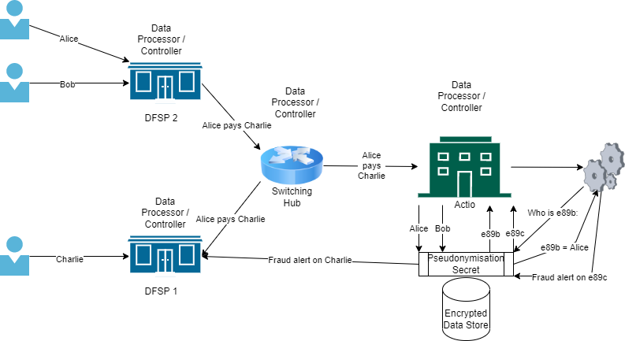

# Operating Scenarios Background

## **SCENARIO 1**: Pseudonymisation for internal use

Data are collected directly from the data subjects and pseudonymised by the data controller, for subsequent internal processing.

*Tazama will not collect data directly from data subjects.*

## **SCENARIO 2**: Processor involved in pseudonymisation

A data processor is also involved in the process by obtaining the identifiers from the data subjects (on behalf of the controller). However, the pseudonymisation is still performed by the controller.

**Figure**: Scenario 2 expressed in a Mojaloop/Tazama context.

*Scenario 2 most closely reflects personal data processing within Tazama. The Tazama system operator functions as both a data controller and data processor, though a source system such as a DFSP or a switching hub (i.e. Mojaloop) will likely also fulfil both data processor and data controller roles. Due to the nature of the financial crime risk management, a DFSP or switching hub must submit unmasked personal data to the Tazama system so that the unmasked personal data can be used for the purpose of financial crime risk management; however the data must then be pseudonymised within the Tazama system to provide the required personal data protection.*

## **SCENARIO 3**: Sending pseudonymised data to a processor

The data controller performs the pseudonymisation but the processor is not involved in the process and only receives the pseudonymised data from the controller.

*The Tazama system operator functions as both a data controller and data processor.*

## **SCENARIO 4**: Processor as a pseudonymised entity

Another possible scenario is the case where the task of pseudonymisation is assigned by the controller to a data processor (e.g. a cloud service provider that manages the pseudonymisation secret and/or arranges the relevant technical facilities).

*For the purpose of financial crime risk management, Tazama must be able to obtain personal data unmasked. When personal data is transmitted onwards in support of investigations or regulatory reporting, the data must also be unmasked, if appropriate.*

## **SCENARIO 5**: Third party as a pseudonymised entity

In this scenario the pseudonymisation is performed by a third party (not a processor) who subsequently forwards the data to the controller. Contrary to the Scenario 4, the controller in this scenario does not have access to the data subjects’ identifiers (as the third party is not under the control of the data controller).

*Tazama will both obtain unmasked personal data from a source system and be responsible for pseudonymising the data prior to storage, retrieval and use.*

## **SCENARIO 6**: Data subject as pseudonymisation entity

In this scenario, every individual generates his/her pseudonym, then forwards their data with this pseudonym onwards.

*Tazama will not receive data directly from the data subject and must in any event receive data unmasked.*
