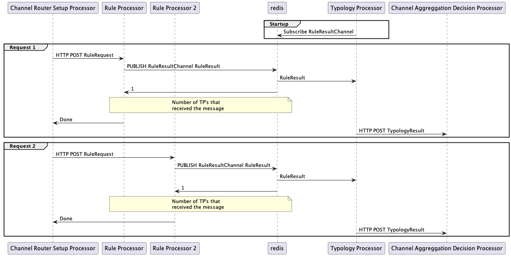
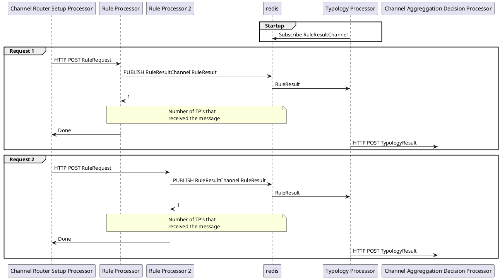
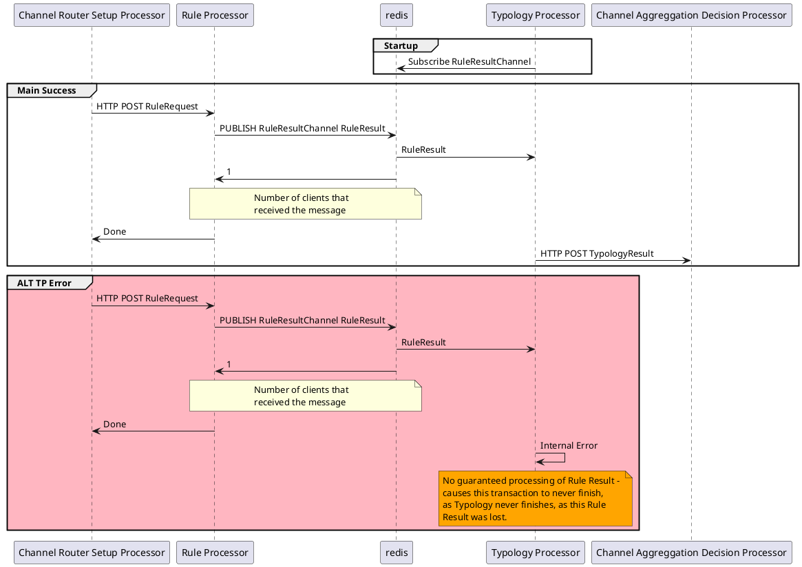
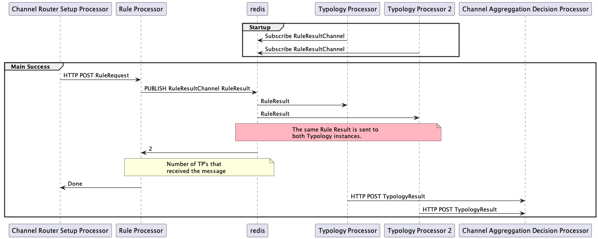
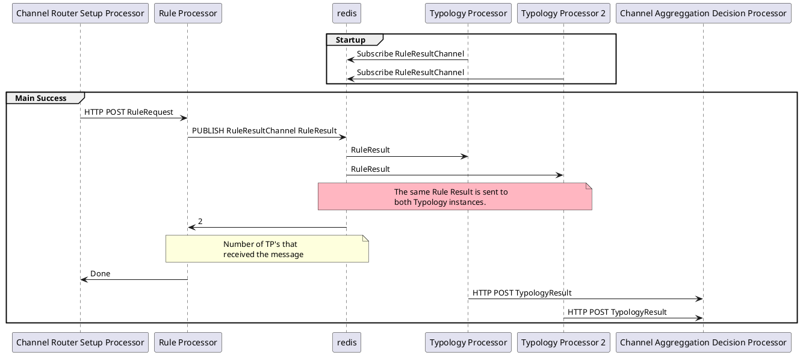
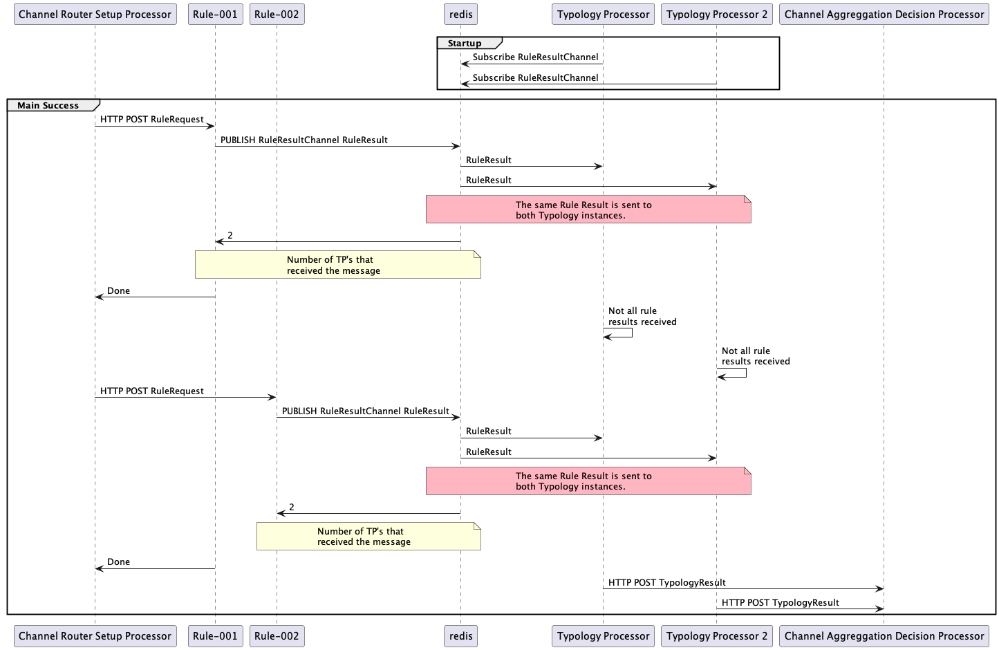
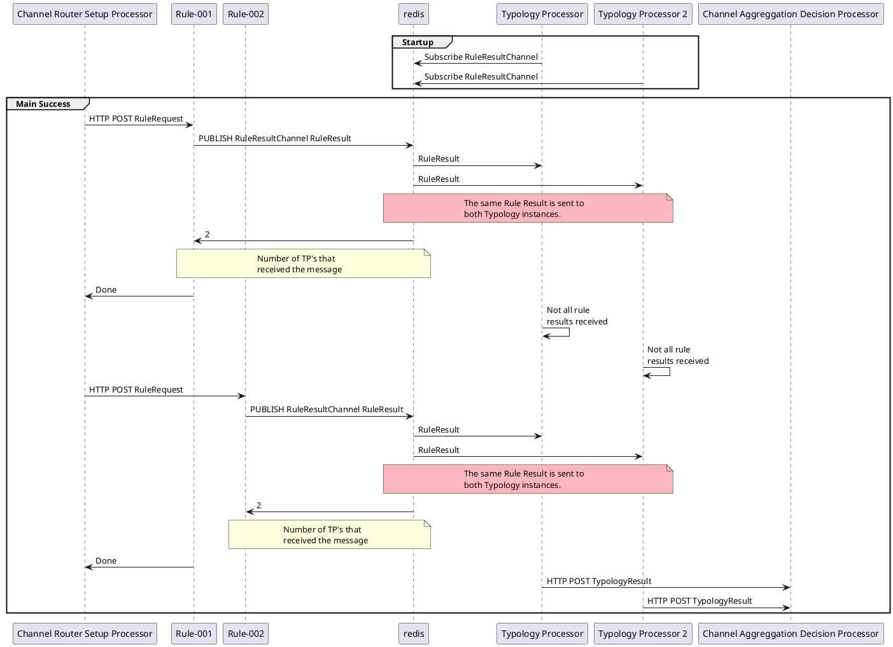

# Redis Pub-Sub

- [Redis Pub-Sub](#redis-pub-sub)
  - [Design](#design)
    - [Producer scaling](#producer-scaling)
  - [Problems](#problems)
    - [Guaranteed delivery](#guaranteed-delivery)
    - [Subscriber scaling](#subscriber-scaling)
    - [Producer and subscriber scaling](#producer-and-subscriber-scaling)

## Design

### Producer scaling

## Problems

### Guaranteed delivery

### Subscriber scaling

### Producer and subscriber scaling

