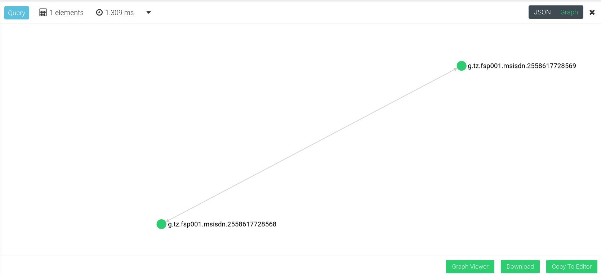
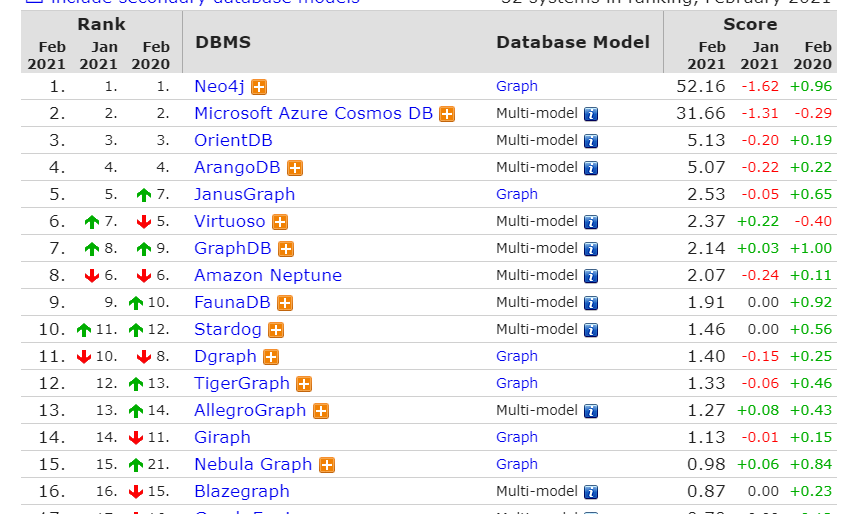

# Selection of Graph Database

|     |     |
| --- | --- |
| **Status** | STARTED |
| **Owner** | [Aarón Reynoza (Unlicensed)](https://frmscoe.atlassian.net/wiki/people/5fa064ac048052006b1f270a?ref=confluence) |
| **Contributors** | [jason darmanovich](https://frmscoe.atlassian.net/wiki/people/557058:6f38c036-1a19-4d32-b61a-80730e844ccf?ref=confluence) |
| **Approved** |     |
| **Due date** |     |
| **Decision** |     |
| **On this page** | - [❓ Problem statement](#problem-statement)<br>- [💡 Research insights](#research-insights)<br>- [📊 Solution hypothesis](#solution-hypothesis)<br>- [🌈 Design options](#design-options)<br>- [ArangoDB setup](#arangodb-setup)<br>- [✅ Follow up](#follow-up)<br>- [💎 Source files](#source-files) |

## ❓Problem statement

* * *

Many rules in the action ecosystem will need to be solved in graphs. Therefore, we need to pick a database for the platform.

## 💡Research insights

* * *

JanusGraph proved to be a difficult database to work with. On 16/02/02, research on how ArangoDB was made to replace JanusGraph.

## 📊 Solution hypothesis

* * *

ArangoDB provides a better solution for Tazama

## 🌈 Design options

|     | **JanusGraph** | **ArangoDB** |
| --- | --- | --- |
| **Overview** | JanusGraph is a scalable graph database optimized for storing and querying graphs containing hundreds of billions of vertices and edges distributed across a multi-machine cluster. | Natively store data for graph, document and search needs.  <br>Utilize feature-rich access with one query language. |
| **Screenshot** | Couldn’t make it that far (Just a terminal running gremlin) |  |
| **Link** | [https://janusgraph.org/](https://janusgraph.org/) | [https://www.arangodb.com/](https://www.arangodb.com/documentation/) |
| **Benefits and risks** |  Apache 2 License<br><br> Fully Open Source<br><br> Not enough documentation<br><br> Gremlin language makes graph queries easy<br><br> Complicated architecture and difficult to deploy<br><br> Not enough information on scalability<br><br> Doesn’t have a UI<br><br> Depends on external configuration to work<br><br> Depends on third party gremlin integrations for NodeJS<br><br> Developers couldn’t insert data |  Apache 2 License<br><br> Enterprise/Cloud paid options<br><br> Huge amounts of documentation, tutorials, courses, and third party information<br><br>  Own language “AQL” providing graph queries.<br><br> Easy to run and deploy<br><br> Elastic and scalable<br><br> Beautiful UI<br><br> Is it’s own application, nothing else<br><br> Support for NodeJS out of the box<br><br> Up and running data in a single day<br><br> Avocado as a logo |
| Cost | ?   | ?   |

# Results

|     |     |     |     |     |     |     |
| --- | --- | --- | --- | --- | --- | --- |
| **JanusGraph** |     |     |     |     |     |     |
| VID | Time (ms) | Results | Query | Time(ms) | Results | Query |
| 6652128 | 20.72 | 0   | g.V(6652128).repeat(out().simplePath()).until(hasId(12432)).path().count(local) | 16.6 | 0   | g.V(6652128).as("a").repeat(out().simplePath()).times(3).where(out().as("a")).path().dedup().by(unfold().order().by(id).dedup().fold()).toList() |
| 5128296 | 9.39 | 0   |     | 8.94 | 0   |     |
| 6713584 | 20.19 | 0   |     | 18.29 | 0   |     |
| 258272 | 5.25 | 0   |     | 4.99 | 0   |     |
| 49280 | 76.25 | 0   |     | 67.91 | 0   |     |
| 46543096 | 4.64 | 0   |     | 4.64 | 0   |     |
| 41537672 | 22.74 | 0   |     | 22.4 | 0   |     |
| 3465320 | 73.31 | 0   |     | 69.25 | 0   |     |
| 43126832 | 40.26 | 0   |     | 38.73 | 0   |     |
| 426088 | 102.31 | 0   |     | 96.31 | 0   |     |
| Average | 37.506 |     |     | 34.806 |     |     |
| Vertex | 18000 | Edges | 1000 000 |     |     |     |
|     |     |     |     |     |     |     |
| **ArangoDB** |     |     |     |     |     |     |
| VID | Time (ms) | Results |     |     |     |     |
| ILPS/CreditUnion2.msisdn.89441058073924337664 | 1.69 | 0   |     |     |     |     |
| ILPS/NeoBank2.msisdn.89441162853683118080 | 1.212 | 0   |     |     |     |     |
| ILPS/NeoBank2.msisdn.89441142843311407104 | 1.367 | 0   |     |     |     |     |
| ILPS/CreditUnion2.msisdn.89440301196438618112 | 1.006 | 0   |     |     |     |     |
| ILPS/BigBank1.msisdn.89441111974372818944 | 0.94 | 0   |     |     |     |     |
| ILPS/NeoBank1.msisdn.352722422912991 | 1.371 | 0   |     |     |     |     |
| ILPS/CreditUnion3.msisdn.89441039673113198592 | 0.821 | 0   |     |     |     |     |
| ILPS/CreditUnion3.msisdn.89441142531508895744 | 1.819 | 0   |     |     |     |     |
| ILPS/BigBank2.msisdn.350358722038773 | 1.453 | 0   |     |     |     |     |
| ILPS/CreditUnion3.msisdn.358751667749655 | 1.406 | 0   |     |     |     |     |
| **Average** | 1.3085 |     |     |     |     |     |
| Supernode | 6000ms - 8000ms |     |     |     |     |     |
| **Notes** |     |     |     |     |     |     |
| 1.  All the tested Vertex doesn't have cycles |     |     |     |     |     |     |
| 1.  ArangoDB is in AQL |     |     |     |     |     |     |
| 1.  JG queries ran from Console |     |     |     |     |     |     |
| 1.  ArangoDB queries ran from |     |     |     |     |     |     |

## ArangoDB setup

ArangoDB can run on different deployments.

You can run a docker file:

`docker run -p 8529:8529 -e ARANGO_ROOT_PASSWORD=123456 arangodb/arangodb:3.7.9`

Or you can proceed to a full local installation (Recommended)

Ubuntu Link: [https://www.arangodb.com/download-major/ubuntu/](https://www.arangodb.com/download-major/ubuntu/)

Other installations resources: [https://www.arangodb.com/download-major/](https://www.arangodb.com/download-major/)

During the creation of this guide, we’ll be using the local version since it allows us to easily use **arangosh**, which is a shell for ArangoDB.

Whichever deployment option you choose, you should be able to access the ArangoDB portal in your localhost: [http://localhost:8529](http://localhost:8529). The portal will ask you for credentials, so use the password you choose for the docker container while running it, or the password you choose while installing manually. Once you’re here, let’s try to create a new user:

If you have a local instance, you should be able to access the shell by typing `arangosh` from you terminal. then type your password and you’re in!

If you’re using a docker container, you should be able to exec into it with something similar to this:

`docker exec -it containerId - arangosh`

Let’s create a user now:

`const users = require('@arangodb/users');`

choose your name and password:

`users.save('aaronreynoza', 'password');`

and while at it, let’s create a database:

`db._createDatabase('testdb')`

and grant access to our new user:

`users.grantDatabase('aaronreynoza', 'testdb', 'rw');`

If you notice, the syntax is pretty similar to JavaScript. That’s everything we’ll do in arangosh so far. Let’s move to the portal again. Login to your new database with your new user.

So far, there’s two examples:

- the PoC historical Data Set
- FCA 1 million transactions Set

Let’s go ahead and run our first program.

### Running the co-located parties engine with PoC Data

This small project was created using the PoC data that was inserted in Redis. However, the data needed to be modified into two JSON files: An ILP collection and a transfers Edge. Edges are events that happen between collections.

The tool used to convert this data can be found [here](https://github.com/mojaloop/fraud_risk_management/tree/arango-example/arango-example).

If yo don’t want to convert the data yourself, you can use the `demo-docs.json` and `demo-transfers.json` files added in the branch. Lets go to our arangodb web portal. Now to collections → Add Collection → Name the new collection “docs” → Save it.

Now click in the database and click in the small upload icon on the top right.


Notice that we can now attach a file. Add the `demo-docs.json` file and click on “Import JSON”.

You should now have 34 new docs. Nice!

Get back to collections, now add a new collection named “transactions” BUT change the type to “EDGE”. **THIS IS REALLY IMPORTANT.** Now follow the same process as before adding the `demo-transactions.json` file.

we can create our graph now.

On the side menu, go to “GRAPHS” and add a new one. call it “transactions”. for “Edge definitions”, choose “transactions”, Choose “docs” for both “fromCollections” and “toCollections”. Click on Create.

You now have your graph ready!

You can test queries by going to the “queries” part on the side menu. let’s try a subset of the co-located parties query:

```sql
FOR v, e, p IN 2..2 OUTBOUND
    "docs/g.tz.fsp001.msisdn.2558617728568"
    GRAPH "transactions"
    FILTER e.\_to == "docs/g.tz.fsp001.msisdn.2558617728568"
    return p
```

Let’s try to understand the query:

We map thru our graph using a For loop. the graph we’re mapping is defined in line 3. the For is de-structured like this:

v = vertices (docs)

e = edges (transactions)

p = path (vertices + transactions)

IN 2..2 = level of graph granularity to operate. We need to change it to 3..3 for the actual rule.

OUTBOUND = direction you want to traverse

"docs/g.tz.fsp001.msisdn.2558617728568" = doc to traverse. this is our “payer”

FILTER e._to == "docs/g.tz.fsp001.msisdn.2558617728568" = find ILPS in layer 3 that send transfers to the original payer.

return p = returns the entire vertices and edges for the condition.

if you run that command, you’ll notice that there’s no output. that’s because there’s no transfers from the second graph tier to the first payer! lets add that transactions. Go to collections, then transactions, and click on the green “+” button. In “_from” type `docs/g.tz.fsp001.msisdn.2558617728569` and in “_to” type `docs/g.tz.fsp001.msisdn.2558617728568`. click on save and now try to run the query again. Now we have the condition for the rule to succeed! This is the result:



Notice that the level of granularity only goes up to 2 levels. This is because we don’t have the data setup for this scenario. More on that in the github `README.md`

Let’s run it in the rule engine now.

download the branch mentioned above and inside the `arangodb-example` folder, run `npm install`. now clone the `template.env` and create your own `env file` with your config.

run `npm start` to run the same query shown above. you can change the ILP by passing it as a variable `npm start yourIlpHere`.

### Running the co-located parties engine with FCA Data

FCA data doesn’t have data (currently know) that matches this rule. You can run the exact same instructions mentioned above.

The files can be found [here](https://lextego-my.sharepoint.com/:f:/p/aaron_reynoza/Etv-lkmB5CdJtQbHyEsHFOYBqQQnKRfysFSjgqc8uIFl1A?e=3yfFwO).

The process should be the same. Just create the collection with the name `ILPS` for the edge collection, name it `transfers`.

remember to change the graph name inside the query in the file `graph-query.js`. On line 19.

### Gremlin for ArangoDB

ArangoDB can run with Grenlim. In order to try this, let’s first download the gremlin console [from here](https://www.apache.org/dyn/closer.lua/tinkerpop/3.4.10/apache-tinkerpop-gremlin-console-3.4.10-bin.zip).

Now let’s decompress the file, open the folder and move to the `/conf` folder. now create a file named `arango.properties` and add the config with your database configuration. Example:

```conf
gremlin.arangodb.conf.graph.name = demo-transactions
gremlin.arangodb.conf.graph.db = Getting-Started
gremlin.arangodb.conf.arangodb.user = root
gremlin.arangodb.conf.arangodb.password = 123456
```

Now let’s start the gremlin console:

`bin/gremlin.sh`

and install the arangodb provider:

`:install org.arangodb arangodb-tinkerpop-provider 2.0.2`

after the action is completed, you should be able to list the extension with:

`:plugin list`

now activate the plugin:

`:plugin use tinkerpop.arangodb`

and connect to our database:

`import org.apache.commons.configuration.PropertiesConfiguration`

change this to your own path:

`config = new org.apache.commons.configuration.PropertiesConfiguration("/some/path/arango.properties")`

then connect the graph:

`g = ArangoDBGraph.open(config)`

This should work, however, this is the current output that we get:

```
gremlin> g = ArangoDBGraph.open(config)
WARN  com.arangodb.tinkerpop.gremlin.structure.ArangoDBGraph  - Empty edges collection(s), the default 'edge' collection will be used.
Not all declared vertex names appear in the graph. Missing \[demo-transactions\_vertex\]
Type ':help' or ':h' for help.
Display stack trace? \[yN\]y
com.arangodb.tinkerpop.gremlin.client.ArangoDBGraphException: Not all declared vertex names appear in the graph. Missing \[demo-transactions\_vertex\]

```

Further investigation needs to be done.

# More Pro’s vs Con’s

[https://stackshare.io/stackups/arangodb-vs-janusgraph](https://stackshare.io/stackups/arangodb-vs-janusgraph)

Best Graph DBMS’s - [https://db-engines.com/en/ranking/graph+dbms](https://db-engines.com/en/ranking/graph+dbms)



## ✅ Follow up

| **Decision** | **Status** | **Next steps** |
| --- | --- | --- |
|     | DECIDED / IN REVIEW / OTHER |     |
|     |     |     |

## 💎 Source files
