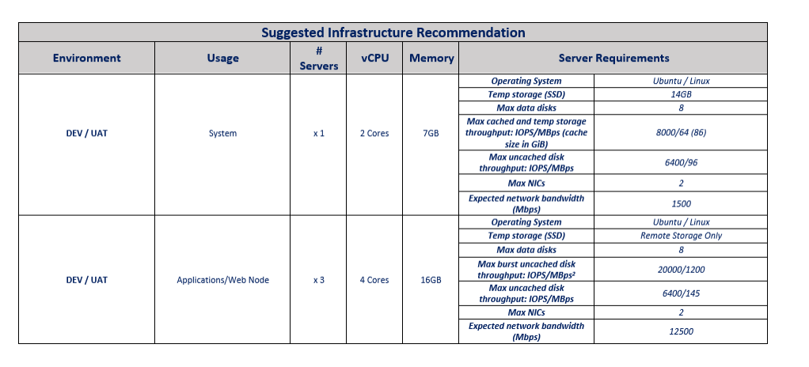
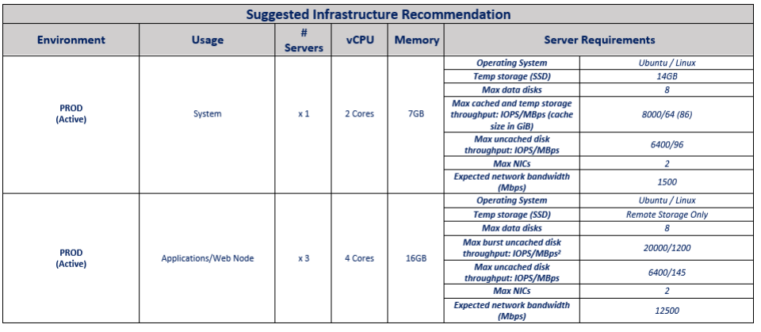

# Infrastructure Spec for Tazama Sandbox

- [Infrastructure Spec for Tazama Sandbox](#infrastructure-spec-for-tazama-sandbox)
  - [General Overview](#general-overview)
  - [Break down of the Azure Infrastructure and costing](#break-down-of-the-azure-infrastructure-and-costing)
    - [Breakdown](#breakdown)
    - [Public IP addresses/ Virtual Network – 9 required](#public-ip-addresses-virtual-network--9-required)
    - [Disks (Storage) – 35 required](#disks-storage--35-required)
    - [Load balancers – 5 required](#load-balancers--5-required)
    - [Virtual Machines – 4 required](#virtual-machines--4-required)
    - [Container Registry – 2 required](#container-registry--2-required)
  - [Suggested Hardware Specifications for Sandbox](#suggested-hardware-specifications-for-sandbox)
  - [Suggested Hardware Specifications for Sandbox](#suggested-hardware-specifications-for-sandbox-1)

## General Overview

Tazama Platform is an open-source real-time transaction monitoring platform that can ingest transaction messages in ISO20022 format and evaluate transactions for fraud and money-laundering behaviour using 35 pre-configured rules that support 31 pre-defined typologies.

To help detect any financial crime we have an extensive list of Typologies. A classic example of a typology is a Phishing Scam - where a susceptible individual is phoned by someone claiming to be legitimately chasing a payment from the individual. For example, a tax collection bureau alleging someone has failed to pay taxes and there is now an urgent demand or risk of prison.

By assessing the transfer to the fraudsters, it is possible to identify more high-risk transactions. Such as an elderly person, sending a large amount of funds to a new payee (or creditor). The three rules being assessed in this example are:

• Age  
• Value of transaction  
• Previous relationship with recipient  

If the Fraudster recipient was the customer being monitored it is likely they will receive the funds, and quickly move it to the next person in their money laundering chain. This would be captured in a Layering Typology which would include age of the account or dormant account suddenly becoming active instead of age of the participant.

## Break down of the Azure Infrastructure and costing

To run the Tazama Platform setup on azure, it will cost an average of R23 000 ($1527,12) / R30 000 ($1912,50) per month depending on the threshold of transactions needed to be processed per second (TPS).

### Breakdown

The following shows the infrastructure being used:

### Public IP addresses/ Virtual Network – 9 required

The IP addresses are used to expose the different applications externally to the cluster **ie: Arangodb , NIFI , Keycloak , ELK , Vault , Redis , Nginx and Jenkins**

**Price: R500 / $30**

### Disks (Storage) – 35 required

A combination of disks for the azure nodes and the persistent volumes for different applications pods of the system **ie: NIFI flow storage , Keycloak postgresssql , arangodb dbserver etc…**

**Price: R 2100 / $120**

### Load balancers – 5 required

A high-performance, ultra low-latency Layer 4 load-balancing service (inbound and outbound) for all UDP and TCP protocols .Not all applications need their own individual load balancers only if they have specific cluster deployments of that application otherwise, they will use the Nginx load balancer to manage the load.

**Price: R1000 / $60**

### Virtual Machines – 4 required

These are the different VMS used within the cluster and vary in prices depending on performance outcomes required/ needed.

**Price: R14 700 / $840**

### Container Registry – 2 required

This is a private registry service for building, storing, and managing container images and related artifacts **Price: R400 / $24**

## Suggested Hardware Specifications for Sandbox

## Suggested Hardware Specifications for Sandbox

