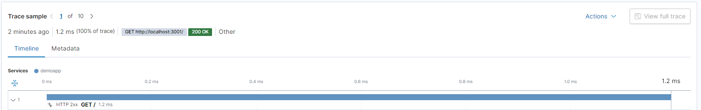
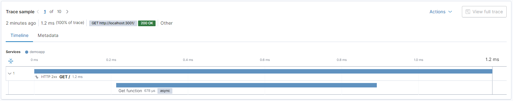

# Adding custom telemetry to APM

In this article we will setup custom spans in our demo NodeJS application so that our method can be displayed in Elasticsearch APM

## Instructions

Step-By-Step Guide:

1. Link your NodeJS application to Elasticsearch APM
2. Ensure that you are receiving your APM statistics (as seen below):

   

3. Add the span to your code as seen in the example below:

   1. Original code block

  ```nano
  app.get("/", (req, res) => {
    res.send("HEY!");
  });
  app.listen(3001, () => console.log("Server running on port 3001"));
  ```

   2. Modified code block (in the example we added a loop to have the reading show some time spent)

```nano
app.get("/", (req, res) => {
  var span = apm.startSpan("Get function");
  // Stat of the code you want to time
  for (let i = 0; i < 10000; i++) {
    const element = 10000\[i\];
  }
  // End of the code you want to time
  if (span) span.end()
  res.send("HEY!");
});
app.listen(3001, () => console.log("Server running on port 3001"));
```

4. Check APM and see the timings of your spans added in (as seen below):



> :warning: Note that these spans work like timers and need to be ended. When they are ended they will include their times with the other APM statistics

## In case of errors

| **Error Code**         | **Reason**        | **Solution**                                                                                                                                                                          |
| ---------------------- | ----------------- | ------------------------------------------------------------------------------------------------------------------------------------------------------------------------------------- |
| APM server returns 503 | Queue is full     | The solution to this was to change the following configuration on the APM server:<br><br>```<br>output.elasticsearch.bulk\_max\_size: 5120<br>output.elasticsearch.worker: 100<br>``` |
| HTTP 503               | Request timed out | Ensure that your host file contains the following item and you are referencing it in your application:<br><br>```<br>51.11.6.161 apm<br>```                                           |
