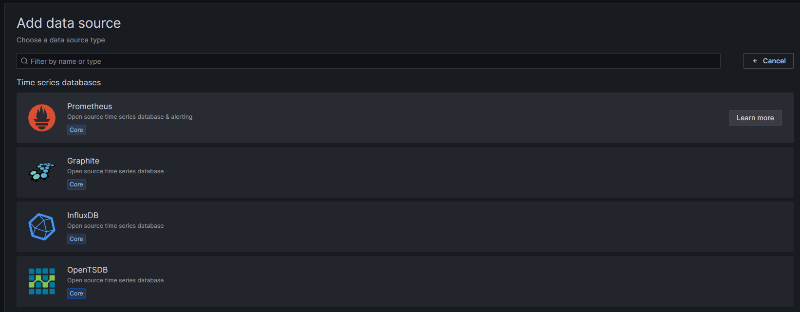
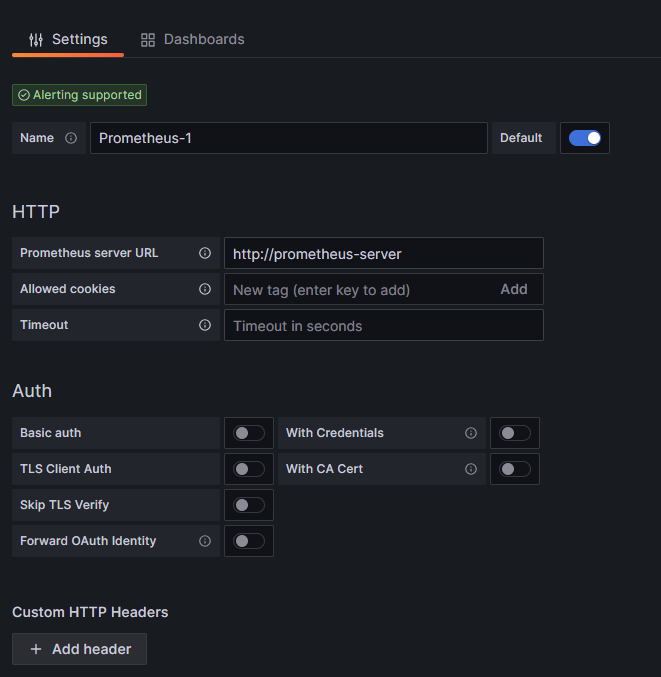
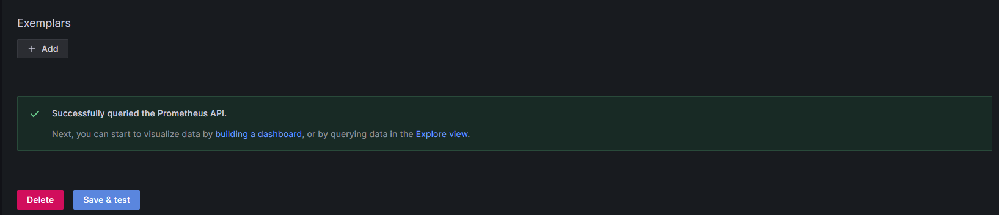
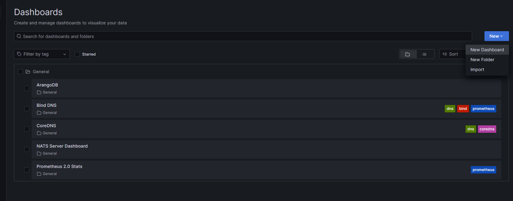
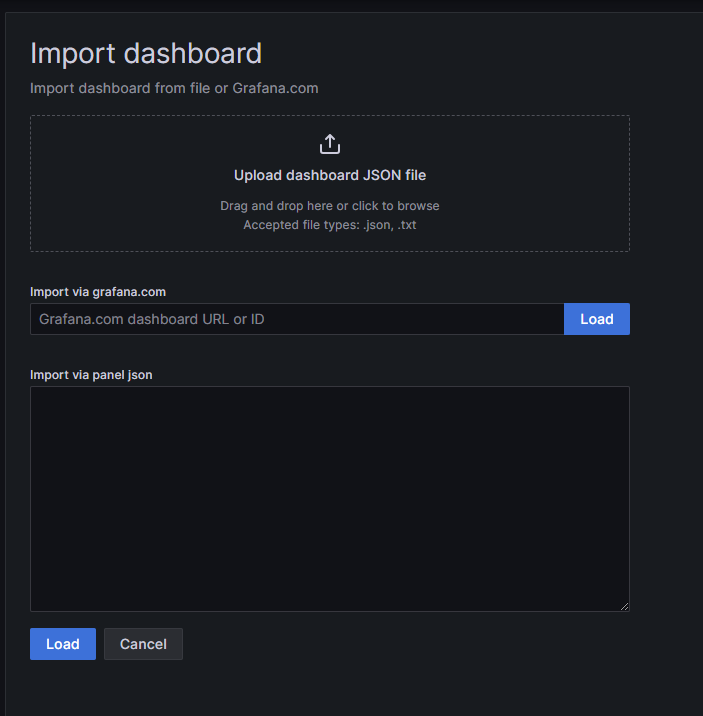

# Environment Monitoring

## Introduction

Scaling the FRMS Solution effectively means we will need to observe bottlenecks to scale effectively. Our monitoring Solution consists of Prometheus ([https://prometheus.io/](https://prometheus.io/) ) for data collection and Grafana ([https://grafana.com/](https://grafana.com/) ) for data visualization.  
  
Our NATS , DNS and Arango metrics are all being scraped by Prometheus.

### Data Source

Before we can import any dashboard we require a datasource. Open the Grafana Dashboard.

1. Navigate to Add Data Source and choose Prometheus:  
    
2. Point towards your prometheus Server:  
    
3. Scroll to the end, Press “Save & Test“ - if all is well, you should see the following message:  
    

### Dashboards

We will mainly be importing dashboard in this example, but you are welcome to create your own.  
  
Navigate to dashboards:  

1. Click import  
    
2. You can import via JSON or Dashboard Code  
    
  
Depending on dashboard, remember to set datasource to our defined Prometheus data source.
