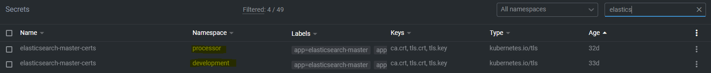
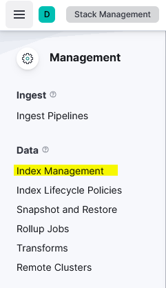
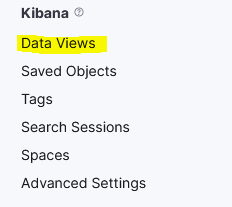
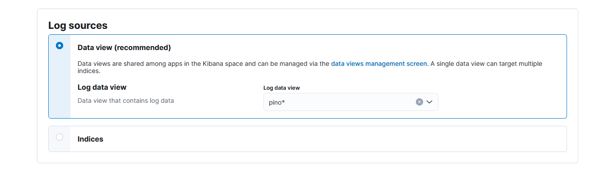
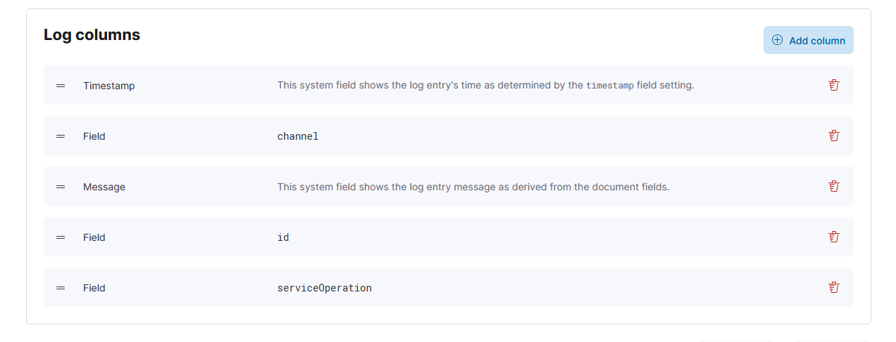
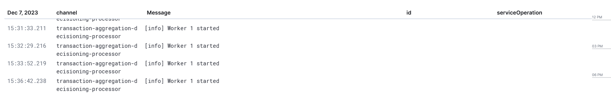

# Logging Data View

- [Logging Data View](#logging-data-view)
  - [Elasticsearch secret](#elasticsearch-secret)
  - [Indices](#indices)
  - [**Final Result**](#final-result)
  - [**Additional Information**](#additional-information)

## Elasticsearch secret

In order to facilitate the logging of applications within the Kubernetes cluster to Logstash via Pino, a critical step involves the duplication of the Elasticsearch master certificates. The provided screenshot indicates that there are two Elasticsearch master certificate secrets, each currently residing in distinct namespaces: one in '**processor**' and the other in '**development**'. To ensure seamless logging capabilities, the certificates in the 'development' namespace must be replicated and their namespace attribute adjusted to 'processor'. This is essential because the applications that require logging do not exist within the 'development' namespace. Without this duplication and reassignment, the applications would be unable to establish a connection to Logstash for logging purposes, as the necessary TLS certificates would not be available in the correct namespace. By making a duplicate with the updated namespace, we enable cross-namespace communication, allowing the applications to transmit their logs effectively.

## Indices

The heart of the configuration, this is, at the bare minimum, what we’ll need to get our setup running. Fortunately, our logging structure creates one for us. By default, it is named `pino`, after the logging framework at the heart of it all. To verify if you have an index, navigate to `Stack Management > Index Management` (Index Management should be under the `Data` heading on your navigation drawer on the left side of the screen).  

On Index Management, you should see your auto created `pino` index. Scroll down on the navigation drawer and find the `Data Views` section:  

In here, we need to create a `Data View` based on our index (`pino`). This data view, being ultimately what we use to display our logs. You need to give the data view a name, while the name is not important, you need to pay attention to the `Index pattern` field. We want to use the `pino` index, but wildcards are also accepted. After saving your changes, you may navigate to `Observability > Logs > Settings`

And select `pino*` for your log data view as above.  
In the section below `Log sources`, you are then able to pick the columns you want to be displayed in your data view.

## **Final Result**

The final objective is to create a user interface like the one shown in the image, which reflects a logstash logging. This interface captures and displays logging information in a structured format, including timestamps, channels, messages, IDs, and operation labels, offering a clear and concise view of the system's activities.

In addition to the current functionalities, the aim is to enhance this interface with greater configurability. This would likely involve the ability to filter logs by various parameters such as date, channel, message content, or specific IDs. The interface could also offer more advanced features like sorting options, real-time updates, customizable alert thresholds for monitoring specific events, and integrations with incident management systems. Tools or controls to manage the verbosity of the logs, defining which level of information should be captured, from general info to debug-level details, may also be part of this expansion. The expanded interface would serve not only as a passive log display but as a robust tool for active system monitoring and incident response.

## **Additional Information**

To read more about the [architecture](../../../frms-platform-developers-documentation/the-tazama-logging-framework/archived-information/logging-framework-architecture.md)
