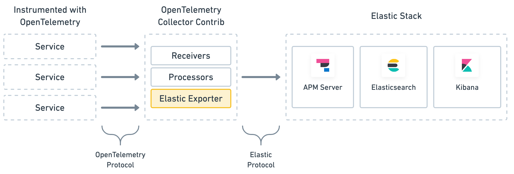

# Minimum requirements for Telemetry

Currently we want to know the places across the application where telemetry is needed to provide insightful information about traffic flow.

### Stack

- APM Server
- Elastic
- Kibana

### **Methods for Telemetry**

There are multiple technologies for telemetry, and one of the most famous is [OpenTelemetry](https://opentelemetry.io/). It’s a project that provides a collection of apis, methods and SDKS to collect distributed traces, metrics, and log data. it’s pretty popular since it’s able to interact with multiple platforms. However, we already have an implementation of Elastic in our project, and adding Open telemetry to it would add an extra layer.

While OpenTelemetry allows us to interact with multiple platform, the Elastic stack already provides an easy implementation for the project, since APM can connect directly to our services and obtain the data we need in order to be able to [visualize](https://lextego.atlassian.net/browse/AM-186) telemetry. In order to deploy APM into our platform, we need to install the [helm chart](https://github.com/elastic/helm-charts/tree/master/apm-server#installing) and make sure it’s correctly configured to interact with our already running ELK stack.

here’s the main reasons to implement APM(Application Performance Management):

- A page takes longer than expected to load, but only sometimes
- You need to identify which parts generate slow queries on your backend

### Implementing APM in NodeJS

the APM library automatically scans for performance metrics and errors and sends them to the server. Implementation is fairly easy, as it just needs to be called before anything else in the service required and it’ll do the rest of the work:

```javascript
const apm = require('elastic-apm-node').start({
  // Override service name from package.json
  // Allowed characters: a-z, A-Z, 0-9, -, \_, and space
  serviceName: 'typology-example',
  // Set custom APM Server URL (default: http://localhost:8200)
  serverUrl: 'elk-k8s-deployment:8200',
  // Use if APM Server requires a token
  secretToken: '',
  // Use if APM Server uses API keys for authentication
  apiKey: '',
})
```

That should be the only configuration needed for data collection to start working, but if extra logging is needed, the library allows us to add custom errors and extra data that we need. like so:

```javascript
const err = new Error('A rule just broke!')

apm.captureError(err)
```

APM will handle metrics and pass the data down to ELK so we can handle it directly on Kibana.

### Nifi

There’s no direct implementation for APM but Nifi is able to send data to Elastic via the [integrated processor](https://nifi.apache.org/docs/nifi-docs/components/org.apache.nifi/nifi-elasticsearch-nar/1.5.0/org.apache.nifi.processors.elasticsearch.PutElasticsearch/). This can later be used in Kibana as the demo for the PoC.

### Rules

As rules will be taken out of typologies, following the new architecture, we’ll need to find out the best approach to implement APM:

- If rules will run inside a service, the service should have APM at the start.

- If rules will be their own service, each rule should have a it’s own APM implementation. this will be better to obtain metrics.

### Typologies

As well as Rules, typologies need implement the APM library at the start of the service. This will allow us to obtain metrics on performance for individual typologies, as long as they’re their own service.

### Looking into the future

Since we’re building the infrastructure on the fly, we cannot be certain of what will come next. However, we need to implement more services, like typologies scoring, Channels services, transaction monitoring, rules registers, etc. Making sure to add the APM library to every new service should be a priority in order to monitor telemetry properly.

# OpenTelemetry

As a second option, we can implement OpenTelemetry in the platform. It’s a set of APIs, SDKs, tooling, and integrations that enable the creation and management of telemetry data. It formed through a merger of the OpenTracing and OpenCensus projects. APM can be integrated as an exporter for OpenTelemetry:



Interacting APM with OpenTelemetry is aseasy as simply declaring them in the yaml configuration:

```yaml
exporters:
    elastic:
      apm\_server\_url: 'https://elasticapm.example.com' 
      secret\_token: 'APM\_SERVER\_SECRET\_TOKEN'
```

The OpenTelemetry collector uses the following three types of components to handle data:

- `receivers`: Configure how data gets to the collector. At least one receiver must be configured.
- `processors`: Defines optional transformations that occur between receiving and exporting data.
- `exporters`: Configures how data is sent to its destination—​in this case, the Elastic Stack.

OpenTelemetry has a more extensive implementation. The advantages are, that it gives us tracing and metrics at a more complex level, **with an option of exporting this data to different platforms.**

here’s an example of what OpenTelemetry can do:

- Deployments that have have high heap usage.
- Disk available to an specific application is at its full capacity.
- Some nodes in your cluster are oversubscribed.
- Kubernetes is not running all the replicas you requested for a given deployment.
- A daemon that the application depends on is failing.
- Some other application is using too much CPU
- You are under a DDoS attack.
- Kafka queues are backed up.
- Stolen CPU is high on adjacent VMs in the cluster.
- Certain processes are over utilizing network bandwidth within the same namespace.
- Cassandra compactions have dropped indicating not enough data being backed up for your services.
- Network bottleneck caused by dropped packets.

This is a simple implementation:

monitoring.js

```javascript
'use strict';
const { LogLevel } = require("@opentelemetry/core");
const { NodeTracerProvider } = require("@opentelemetry/node");
const { SimpleSpanProcessor, ConsoleSpanExporter } = require("@opentelemetry/tracing");
const provider = new NodeTracerProvider({ logLevel: LogLevel.ERROR });
provider.register();
provider.addSpanProcessor(new SimpleSpanProcessor(new ConsoleSpanExporter()));
console.log("tracing initialized");
```

tracing.js

```javascript
'use strict';
const { LogLevel } = require("@opentelemetry/core");
const { NodeTracerProvider } = require("@opentelemetry/node");
const { SimpleSpanProcessor, ConsoleSpanExporter } = require("@opentelemetry/tracing");
const provider = new NodeTracerProvider({ logLevel: LogLevel.ERROR });
provider.register();
provider.addSpanProcessor(new SimpleSpanProcessor(new ConsoleSpanExporter()));
console.log("tracing initialized");
```

app.js

```javascript
"use strict";
const PORT = process.env.PORT || "8080";
const express = require("express");
const app = express();
const { countAllRequests } = require("./monitoring");
app.use(countAllRequests());
app.get("/", (req, res) => { res.send("Hello World"); });
app.listen(parseInt(PORT, 10), () => { console.log(\`Listening for requests on http://localhost:${PORT}\`); });
```

we can then run the app with:

`node -r ./tracing.js app.js`

and get outputs like this:

```javascript
{
  traceId: 'f27805526b1c74293bbc9345cd48ff3b',
  parentId: 'd6bdf2a18df04ef0',
  name: 'middleware - query',
  id: '36335b81de12cc4a',
  kind: 0,
  timestamp: 1603789083744612,
  duration: 365,
  attributes: {
    component: 'express',
    'express.name': 'query',
    'express.type': 'middleware'
  },
  status: { code: 0 },
  events: \[\]
}
{
  name: 'requests',
  description: 'Count all incoming requests',
  unit: '1',
  metricKind: 0,
  valueType: 1
}
{ route: '/' }
value: 1
```

OpenTelemetry also allows us to have a deeper level of metrics, for example, a MySQL plugin. The OpenTelemetry MySQL Instrumentation allows the user to automatically collect trace data and export them to the backend of choice, to give observability to distributed systems when working with the database.

Ex:

```javascript
const { NodeTracerProvider } = require('@opentelemetry/node');
const { registerInstrumentations } = require('@opentelemetry/instrumentation');

const provider = new NodeTracerProvider();
provider.register();

registerInstrumentations({
  instrumentations: \[
    {
      plugins: {
        mysql: {
          enabled: true,
          // You may use a package name or absolute path to the file.
          path: '@opentelemetry/plugin-mysql',
        }
      },
    },
  \],
  tracerProvider: provider,
});
```

and implement it into the application, as previously shown above:

```javascript
const { registerInstrumentations } = require('@opentelemetry/instrumentation');

const provider = new NodeTracerProvider();
provider.register();
registerInstrumentations({
  tracerProvider: provider,
});
```

### TL;DR

OpenTelemetry allows us to add a deeper level of monitoring/tracing into the platform, but it adds an extra layer to the infraestructure as well. It will also need to be implemented alongside APM to visualize data into our visualization tool: Kibana.

However, at the end of the day, both provide different features and the can easily interact with each other if needed.

#### Consolidated telemetry

As of now, APM does not allow to send multiple objects to APM in a single request, so there’s going to be a lot of requests made that creates traffic.

#### How APM handles load

APM Server is an open source application that receives performance data from your APM agents. It’s a [separate component by design](https://www.elastic.co/guide/en/apm/server/7.11/overview.html#why-separate-component), which helps keep the agents light, prevents certain security risks, and improves compatibility across the Elastic Stack.

After the APM Server has validated and processed events from the APM agents, the server transforms the data into Elasticsearch documents and stores them in corresponding [Elasticsearch indices](https://www.elastic.co/guide/en/apm/server/7.11/exploring-es-data.html).

It is basically just a middleware between the application and elastic. more documentation about it [here](https://www.elastic.co/guide/en/apm/get-started/7.11/components.html).

### Useful resources:

recommended to read: [https://sysdig.com/blog/how-to-instrument-code-custom-metrics-vs-apm-vs-opentracing/](https://sysdig.com/blog/how-to-instrument-code-custom-metrics-vs-apm-vs-opentracing/)

[https://www.elastic.co/guide/en/apm/agent/nodejs/current/opentracing.html](https://www.elastic.co/guide/en/apm/agent/nodejs/current/opentracing.html#ot-caveats)

[https://www.elastic.co/guide/en/apm/get-started/current/open-telemetry-elastic.html](https://www.elastic.co/guide/en/apm/get-started/current/open-telemetry-elastic.html)

[https://github.com/open-telemetry/opentelemetry-js-contrib/tree/main/plugins/node/opentelemetry-plugin-mysql](https://github.com/open-telemetry/opentelemetry-js-contrib/tree/main/plugins/node/opentelemetry-plugin-mysql)

### Conclusion:

We have decided to go with APM since it’ll be faster and it gives us enough metrics about individual requests, which is exactly what we want to benchmark the application.

APM installation:

[https://github.com/elastic/helm-charts/tree/master/apm-server#installing](https://github.com/elastic/helm-charts/tree/master/apm-server#installing)

then we install the APM pluggin into Kibana:

[https://www.elastic.co/guide/en/kibana/current/apm-ui.html](https://www.elastic.co/guide/en/kibana/current/apm-ui.html)

NodeJS implementation:

First we need to install the APM server:

`npm install elastic-apm-node --save`

then we can just call APM at the beginning of our application:

```javascript
const apm = require('elastic-apm-node').start({
  // Override service name from package.json
  // Allowed characters: a-z, A-Z, 0-9, -, \_, and space
  serviceName: 'typology-example',
  // Set custom APM Server URL (default: http://localhost:8200)
  serverUrl: 'elk-k8s-deployment:8200',
  // Use if APM Server requires a token
  secretToken: '',
  // Use if APM Server uses API keys for authentication
  apiKey: '',
})
```

This will now allow us to go into Kibana and check different data for bottlenecks, like Services, traces, transactions, errors, metrics, etc:

[https://www.elastic.co/guide/en/kibana/current/apm-getting-started.html](https://www.elastic.co/guide/en/kibana/current/apm-getting-started.html)
